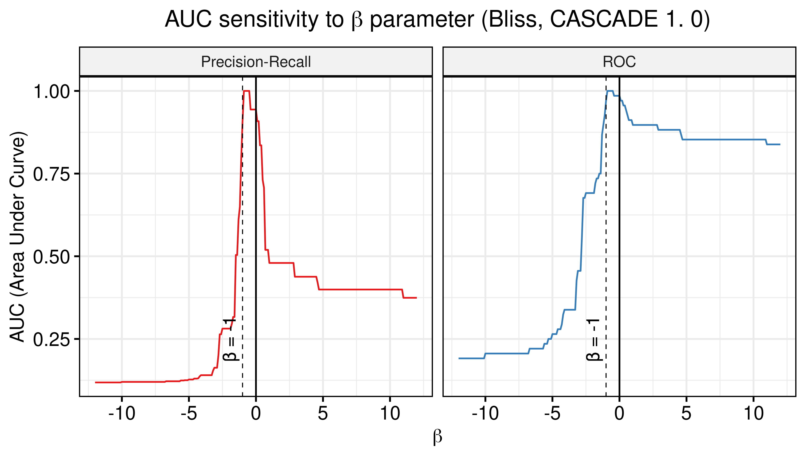
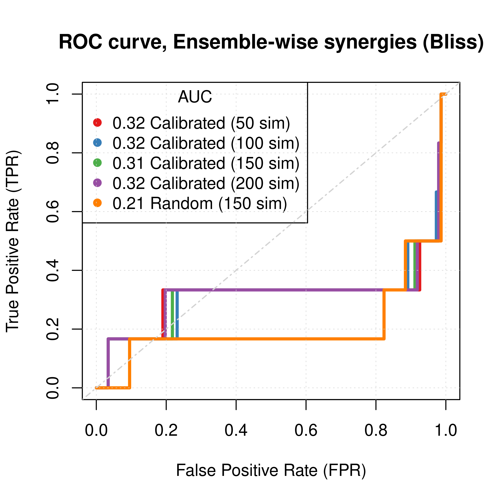
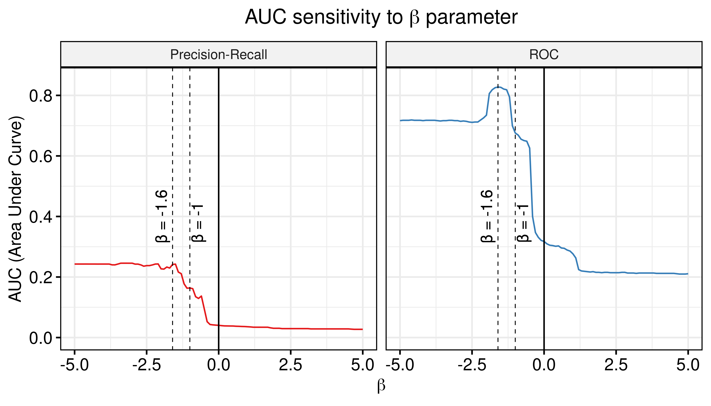
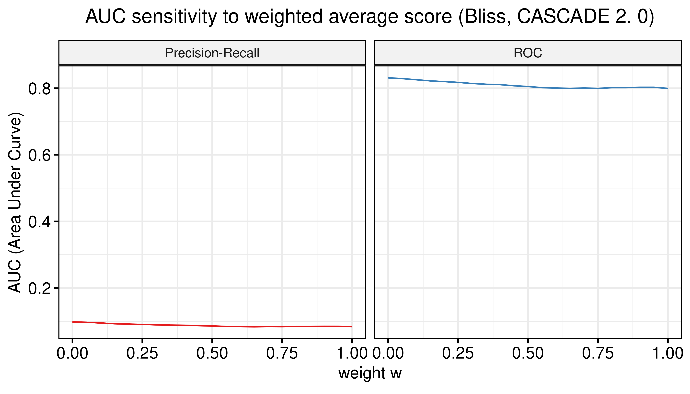
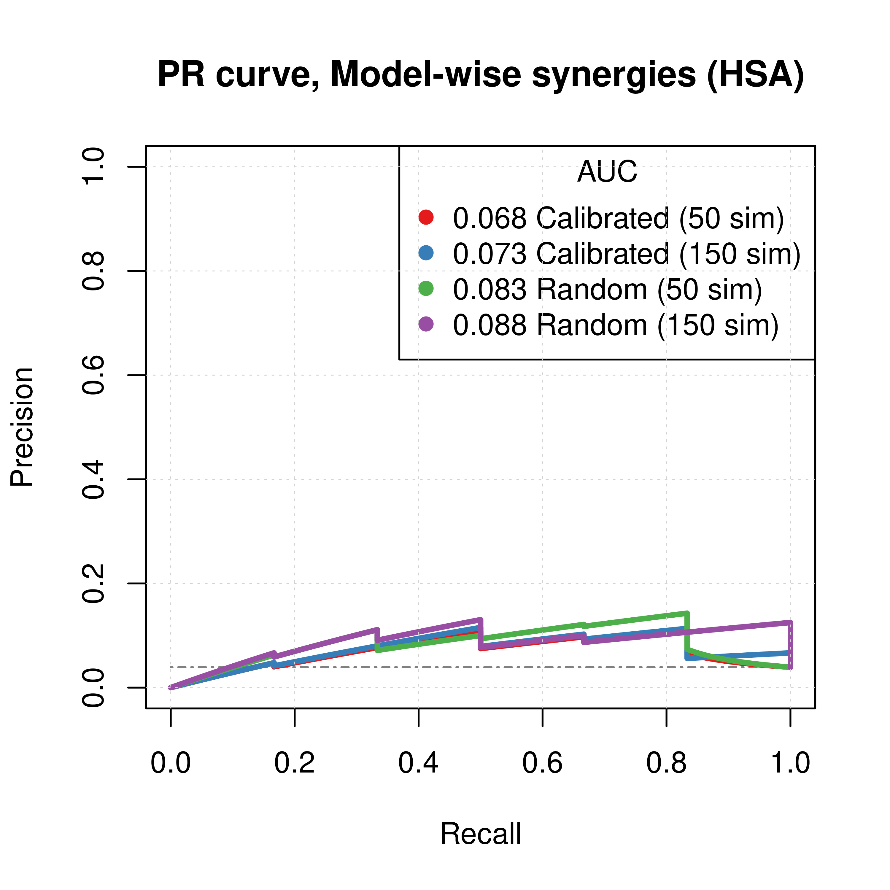
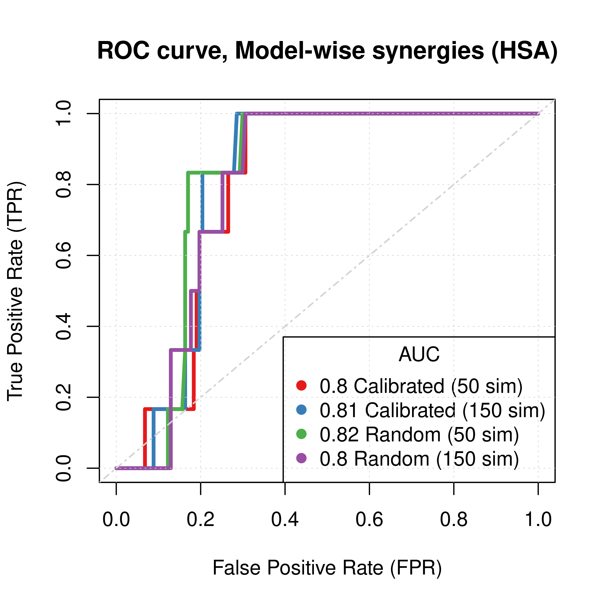
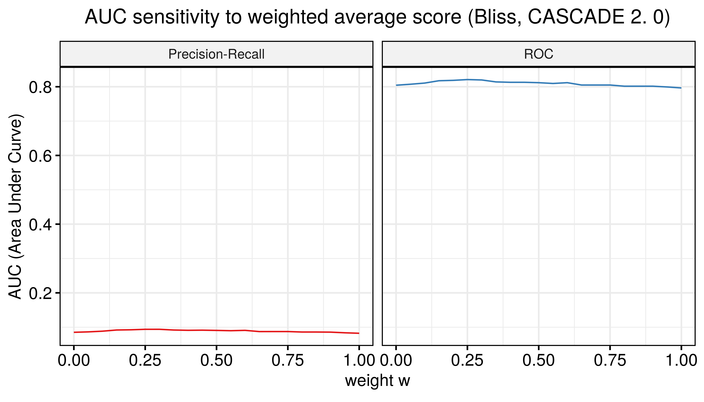

# Intro {-}

This report is the **supplementary material** for the AGS I Paper and has all the simulation results and investigations related to that paper, as well as instructions for reproducing the results.

## Methodology/Input Overview {-}

A list of things that change between the simulations and the presented graphs are:

- The number of `Gitsbe` simulations: more simulations, more models generated.
- The type of mutation that `Gitsbe` models have:
unless otherwise specified, the `Gitsbe` models have only [link operator mutations](https://druglogics.github.io/druglogics-doc/gitsbe-config.html#genetic-algorithm).
[Topology mutations](#cascade-2.0-analysis-topology-mutations) were also tested as well as a combination of [topology and link operator mutations](#cascade-2.0-analysis-topology-and-link-operator-mutations).
- The [training data](https://druglogics.github.io/druglogics-doc/training-data.html) for the `Gitsbe` models: *steady state* (calibrated models) vs *proliferative profile* (random models).
- The type of mathematical model (HSA or Bliss) used in `Drabme` to evaluate the synergies either from the [@Flobak2015] for the CASCADE 1.0 analysis or from the [@Flobak2019] dataset for the CASCADE 2.0 analysis.
More info on the calcualtions that Drabme does [see here](https://druglogics.github.io/druglogics-doc/drabme-description.html#drabme-description).
- The type of output used from `Drabme`: ensemble-wise or model-wise [synergy results](https://druglogics.github.io/druglogics-doc/drabme-install.html#drabme-output).

## Summary {-}

Observing the results across the whole report, we reach the following conclusions:

- To minimize the expected performance variance, executing $150$ `Gitsbe` simulations is a good choice (no need for more, no matter the other input parameters).
- *Ensemble-wise* results do not correlate with *model-wise* results (see correlation results for [CASCADE 1.0](#correlation) and [CASCADE 2.0](#correlation-1)).
This happens because some drug perturbed models do not have stable states and thus cannot be evaluated for synergy. ^[Using minimal trapspaces, where there is almost always an attractor found and the global output of the model can be [calculated](https://druglogics.github.io/druglogics-doc/modeloutputs.html), we observed higher correlation between *ensemble-wise* and *model-wise* results (as expected)]
- *Model-wise* ROC results are always better compared to *ensemble-wise* ROC results for the single predictor models (e.g. the *calibrated* non-normalized model results).
- When using a combined model predictor (see [here](#auc-sensitivity)) to augment/correct the calibrated models results, Drabme's *Bliss* synergy assessement always brings significant performance benefit for the ensemble-wise results.
When using *HSA*, that is not always the case (see [one example](#auc-sensitivity-2) and [another](#auc-sensitivity-5)).
- The *model-wise* results do not bring any performance benefit when used in a combined predictor.
- The value of $\beta = -1$ is a good estimation for the value that maximizes the combined predictor's performance ($calibrated + \beta \times random$) across all of the report's relevant investigations.
- Comparing the different parameterization schemes for the CASCADE 2.0 analysis (using the combined predictors with $\beta = -1$), we observe that **topology mutations outperform link operator mutations**.

# R Libraries {-}

For the ROC curves we used the function `get_roc_stats()` from [@R-usefun] and for the PR curves the `pr.curve()` from [@R-PRROC] (see also [@Grau2015]).

The AUC sensitivity analysis (for a description see [here](#auc-sensitivity)) was inspired by work from [@Pepe2000].

The report template is from the `rtemps` R package [@R-rtemps].

Loading libraries that are used in this report:

```r
library(DT)
library(ggpubr)
library(RColorBrewer)
library(xfun)
library(dplyr)
library(tidyr)
library(tibble)
library(emba)
library(usefun)
library(readr)
library(stringr)
library(latex2exp)
library(corrplot)
library(PRROC)
library(equatiomatic)
library(glmnet)
library(knitr)
library(MAMSE)
```

# CASCADE 1.0 Analysis {-}

:::{.blue-box}
Performance of automatically parameterized models against published data in [@Flobak2015]
:::

## HSA results {-}

:::{.note}
- *HSA* refers to the synergy method used in `Drabme` to assess the synergies from the `gitsbe` models
- We test performance using ROC and PR AUC for both the *ensemble-wise* and *model-wise* synergies from `Drabme`
- **Calibrated** models: fitted to steady state ($50$ simulations)
- **Random** models: fitted to [proliferation profile](https://druglogics.github.io/druglogics-doc/training-data.html#unperturbed-condition---globaloutput-response) ($50$ simulations)
- `Gitsbe` models have mutations on **link operator** only
:::

Load results:

```r
# 'ss' => calibrated models, 'prolif' => proliferative random models
# 'ew' => ensemble-wise, 'mw' => model-wise

## HSA results
ss_hsa_ew_file = paste0("results/link-only/hsa/cascade_1.0_ss_50sim_fixpoints_ensemblewise_synergies.tab")
ss_hsa_mw_file = paste0("results/link-only/hsa/cascade_1.0_ss_50sim_fixpoints_modelwise_synergies.tab")
prolif_hsa_ew_file = paste0("results/link-only/hsa/cascade_1.0_prolif_50sim_fixpoints_ensemblewise_synergies.tab")
prolif_hsa_mw_file = paste0("results/link-only/hsa/cascade_1.0_prolif_50sim_fixpoints_modelwise_synergies.tab")

ss_hsa_ensemblewise_synergies = emba::get_synergy_scores(ss_hsa_ew_file)
ss_hsa_modelwise_synergies = emba::get_synergy_scores(ss_hsa_mw_file, file_type = "modelwise")
prolif_hsa_ensemblewise_synergies = emba::get_synergy_scores(prolif_hsa_ew_file)
prolif_hsa_modelwise_synergies = emba::get_synergy_scores(prolif_hsa_mw_file, file_type = "modelwise")

# calculate probability of synergy in the modelwise results
ss_hsa_modelwise_synergies = ss_hsa_modelwise_synergies %>% 
  mutate(synergy_prob_ss = synergies/(synergies + `non-synergies`))
prolif_hsa_modelwise_synergies = prolif_hsa_modelwise_synergies %>%
  mutate(synergy_prob_prolif = synergies/(synergies + `non-synergies`))

observed_synergies_file = paste0("results/observed_synergies_cascade_1.0")
observed_synergies = get_observed_synergies(observed_synergies_file)
# 1 (positive/observed synergy) or 0 (negative/not observed) for all tested drug combinations
observed = sapply(prolif_hsa_modelwise_synergies$perturbation %in% observed_synergies, as.integer)

# 'ew' => ensemble-wise, 'mw' => model-wise
pred_ew_hsa = bind_cols(ss_hsa_ensemblewise_synergies %>% rename(ss_score = score),
  prolif_hsa_ensemblewise_synergies %>% select(score) %>% rename(prolif_score = score),
  as_tibble_col(observed, column_name = "observed"))

pred_mw_hsa = bind_cols(
  ss_hsa_modelwise_synergies %>% select(perturbation, synergy_prob_ss),
  prolif_hsa_modelwise_synergies %>% select(synergy_prob_prolif),
  as_tibble_col(observed, column_name = "observed"))
```

### ROC curves {-}


```r
res_ss_ew = get_roc_stats(df = pred_ew_hsa, pred_col = "ss_score", label_col = "observed")
res_prolif_ew = get_roc_stats(df = pred_ew_hsa, pred_col = "prolif_score", label_col = "observed")

res_ss_mw = get_roc_stats(df = pred_mw_hsa, pred_col = "synergy_prob_ss", label_col = "observed", direction = ">")
res_prolif_mw = get_roc_stats(df = pred_mw_hsa, pred_col = "synergy_prob_prolif", label_col = "observed", direction = ">")

# Plot ROCs
my_palette = RColorBrewer::brewer.pal(n = 9, name = "Set1")

plot(x = res_ss_ew$roc_stats$FPR, y = res_ss_ew$roc_stats$TPR,
  type = 'l', lwd = 3, col = my_palette[1], main = 'ROC curve, Ensemble-wise synergies (HSA)',
  xlab = 'False Positive Rate (FPR)', ylab = 'True Positive Rate (TPR)')
lines(x = res_prolif_ew$roc_stats$FPR, y = res_prolif_ew$roc_stats$TPR, 
  lwd = 3, col = my_palette[2])
legend('bottomright', title = 'AUC', col = my_palette[1:2], pch = 19,
  legend = c(paste(round(res_ss_ew$AUC, digits = 3), "Calibrated"), 
    paste(round(res_prolif_ew$AUC, digits = 3), "Random")), cex = 1.3)
grid(lwd = 0.5)
abline(a = 0, b = 1, col = 'lightgrey', lty = 'dotdash', lwd = 1.2)

plot(x = res_ss_mw$roc_stats$FPR, y = res_ss_mw$roc_stats$TPR,
  type = 'l', lwd = 3, col = my_palette[1], main = 'ROC curve, Model-wise synergies (HSA)',
  xlab = 'False Positive Rate (FPR)', ylab = 'True Positive Rate (TPR)')
lines(x = res_prolif_mw$roc_stats$FPR, y = res_prolif_mw$roc_stats$TPR, 
  lwd = 3, col = my_palette[2])
legend('bottomright', title = 'AUC', col = my_palette[1:3], pch = 19,
  legend = c(paste(round(res_ss_mw$AUC, digits = 3), "Calibrated"),
    paste(round(res_prolif_mw$AUC, digits = 3), "Random")), cex = 1.3)
grid(lwd = 0.5)
abline(a = 0, b = 1, col = 'lightgrey', lty = 'dotdash', lwd = 1.2)
```

<div class="figure" style="text-align: center">

<p class="caption">(\#fig:roc-hsa-cascade1)ROC curves (CASCADE 1.0, HSA synergy method)</p>
</div>

### PR curves {-}


```r
pr_ss_ew_hsa = pr.curve(scores.class0 = pred_ew_hsa %>% pull(ss_score) %>% (function(x) {-x}), 
  weights.class0 = pred_ew_hsa %>% pull(observed), curve = TRUE, rand.compute = TRUE)
pr_prolif_ew_hsa = pr.curve(scores.class0 = pred_ew_hsa %>% pull(prolif_score) %>% (function(x) {-x}), 
  weights.class0 = pred_ew_hsa %>% pull(observed), curve = TRUE)

pr_ss_mw_hsa = pr.curve(scores.class0 = pred_mw_hsa %>% pull(synergy_prob_ss), 
  weights.class0 = pred_mw_hsa %>% pull(observed), curve = TRUE, rand.compute = TRUE)
pr_prolif_mw_hsa = pr.curve(scores.class0 = pred_mw_hsa %>% pull(synergy_prob_prolif), 
  weights.class0 = pred_mw_hsa %>% pull(observed), curve = TRUE)

plot(pr_ss_ew_hsa, main = 'PR curve, Ensemble-wise synergies (HSA)', 
  auc.main = FALSE, color = my_palette[1], rand.plot = TRUE)
plot(pr_prolif_ew_hsa, add = TRUE, color = my_palette[2])
legend('topright', title = 'AUC', col = my_palette[1:2], pch = 19,
  legend = c(paste(round(pr_ss_ew_hsa$auc.davis.goadrich, digits = 3), "Calibrated"), 
    paste(round(pr_prolif_ew_hsa$auc.davis.goadrich, digits = 3), "Random")))
grid(lwd = 0.5)

plot(pr_ss_mw_hsa, main = 'PR curve, Model-wise synergies (HSA)', 
  auc.main = FALSE, color = my_palette[1], rand.plot = TRUE)
plot(pr_prolif_mw_hsa, add = TRUE, color = my_palette[2])
legend('left', title = 'AUC', col = my_palette[1:3], pch = 19,
  legend = c(paste(round(pr_ss_mw_hsa$auc.davis.goadrich, digits = 3), "Calibrated"),
    paste(round(pr_prolif_mw_hsa$auc.davis.goadrich, digits = 3), "Random")))
grid(lwd = 0.5)
```

<div class="figure" style="text-align: center">

<p class="caption">(\#fig:pr-hsa-cascade1)PR curves (CASCADE 1.0, HSA synergy method)</p>
</div>

:::{.green-box}
Calibrated models perform a lot better than the random ones
:::

### AUC sensitivity {-}

:::{#auc-sensitivity .blue-box}
- Investigate **combining the synergy results of calibrated and proliferative (random) models**
- Quantify the amount of information from the *proliferative* (*random*) models that can be used to augment the calibrated results?
- **Ensemble-wise** scenario: $score = calibrated + \beta \times random$
  - $\beta \rightarrow +\infty$: mostly *proliferative* (random) model predictions
  - $\beta \rightarrow -\infty$: mostly *reverse proliferative* (random) model predictions
  - $\beta \simeq -1$: calibrated models are *normalized* against proliferative (random) model predictions.
- **Model-wise** scenario: $(1-w) \times prob_{cal} + w \times prob_{rand}, w \in[0,1]$
  - $w=0$: only calibrated model predictions
  - $w=1$: only proliferative (random) model predictions
:::


```r
# Ensemble-wise
betas = seq(from = -20, to = 20, by = 0.1)

prolif_roc = sapply(betas, function(beta) {
  pred_ew_hsa = pred_ew_hsa %>% mutate(combined_score = ss_score + beta * prolif_score)
  res = roc.curve(scores.class0 = pred_ew_hsa %>% pull(combined_score) %>% (function(x) {-x}), 
    weights.class0 = pred_ew_hsa %>% pull(observed))
  auc_value = res$auc
})

prolif_pr = sapply(betas, function(beta) {
  pred_ew_hsa = pred_ew_hsa %>% mutate(combined_score = ss_score + beta * prolif_score)
  res = pr.curve(scores.class0 = pred_ew_hsa %>% pull(combined_score) %>% (function(x) {-x}), 
    weights.class0 = pred_ew_hsa %>% pull(observed))
  auc_value = res$auc.davis.goadrich
})

df_ew = as_tibble(cbind(betas, prolif_roc, prolif_pr))
df_ew = df_ew %>% tidyr::pivot_longer(-betas, names_to = "type", values_to = "AUC")

ggline(data = df_ew, x = "betas", y = "AUC", numeric.x.axis = TRUE, color = "type",
  plot_type = "l", xlab = TeX("$\\beta$"), ylab = "AUC (Area Under Curve)", 
  legend = "none", facet.by = "type", palette = my_palette,
  panel.labs = list(type = c("PR: calibrated + β x random", 
    "ROC: calibrated + β x random")),
  title = TeX("AUC sensitivity to $\\beta$ parameter (HSA, CASCADE 1.0)")) + 
  theme(plot.title = element_text(hjust = 0.5)) +
  geom_vline(xintercept = 0) +
  geom_vline(xintercept = -1, color = "red", size = 0.3, linetype = "dashed") + 
  geom_text(aes(x=-2, label="β = -1", y=0.25), colour="black", angle=90) + 
  grids()
```

<div class="figure" style="text-align: center">

<p class="caption">(\#fig:auc-sen-ew-hsa-cascade1)AUC sensitivity (CASCADE 1.0, HSA synergy method, Ensemble-wise results)</p>
</div>


```r
# Model-wise
weights = seq(from = 0, to = 1, by = 0.05)

prolif_roc_mw = sapply(weights, function(w) {
  pred_mw_hsa = pred_mw_hsa %>%
    mutate(weighted_prob = (1 - w) * pred_mw_hsa$synergy_prob_ss + w * pred_mw_hsa$synergy_prob_prolif)
  res = roc.curve(scores.class0 = pred_mw_hsa %>% pull(weighted_prob),
    weights.class0 = pred_mw_hsa %>% pull(observed))
  auc_value = res$auc
})

prolif_pr_mw = sapply(weights, function(w) {
  pred_mw_hsa = pred_mw_hsa %>% 
    mutate(weighted_prob = (1 - w) * pred_mw_hsa$synergy_prob_ss + w * pred_mw_hsa$synergy_prob_prolif)
  res = pr.curve(scores.class0 = pred_mw_hsa %>% pull(weighted_prob), 
    weights.class0 = pred_mw_hsa %>% pull(observed))
  auc_value = res$auc.davis.goadrich
})

df_mw = as_tibble(cbind(weights, prolif_roc_mw, prolif_pr_mw))
df_mw = df_mw %>% tidyr::pivot_longer(-weights, names_to = "type", values_to = "AUC")

ggline(data = df_mw, x = "weights", y = "AUC", numeric.x.axis = TRUE, color = "type",
  plot_type = "l", xlab = TeX("weight $w$"), ylab = "AUC (Area Under Curve)", 
  legend = "none", facet.by = "type", palette = my_palette,
  panel.labs = list(type = c("PR: (1-w) x prob(cal) + w x prob(rand)", 
    "ROC: (1-w) x prob(cal) + w x prob(prolif)")), title.position = "center",
  title = TeX("AUC sensitivity to weighted average score (HSA, CASCADE 1.0)")) + 
  theme(plot.title = element_text(hjust = 0.5)) +
  grids()
```

<div class="figure" style="text-align: center">

<p class="caption">(\#fig:auc-sen-mw-hsa-cascade1)AUC sensitivity (CASCADE 1.0, HSA synergy method, Model-wise results)</p>
</div>

:::{.green-box}
- There are $\beta$ values that can boost the predictive performance of the calibrated models (ensemble-wise) but no $w$ weight in the model-wise case.
- $\beta=-1$ seems to be a common value that maximizes both the ROC-AUC and the PR-AUC.
- The PR-AUC is **more sensitive** than the ROC-AUC, so a better indicator of performance.
:::

## Bliss results {-}

:::{.note}
- *Bliss* refers to the synergy method used in `Drabme` to assess the synergies from the `gitsbe` models
- We test performance using ROC and PR AUC for both the *ensemble-wise* and *model-wise* synergies from `Drabme`
- **Calibrated** models: fitted to steady state ($50$ simulations)
- **Random** models: fitted to [proliferation profile](https://druglogics.github.io/druglogics-doc/training-data.html#unperturbed-condition---globaloutput-response) ($50$ simulations)
- `Gitsbe` models have mutations on **link operator** only
:::

Load results:

```r
# 'ss' => calibrated models, 'prolif' => random models

## Bliss results
ss_bliss_ensemblewise_file = paste0("results/link-only/bliss/cascade_1.0_ss_50sim_fixpoints_ensemblewise_synergies.tab")
ss_bliss_modelwise_file = paste0("results/link-only/bliss/cascade_1.0_ss_50sim_fixpoints_modelwise_synergies.tab")
prolif_bliss_ensemblewise_file = paste0("results/link-only/bliss/cascade_1.0_prolif_50sim_fixpoints_ensemblewise_synergies.tab")
prolif_bliss_modelwise_file = paste0("results/link-only/bliss/cascade_1.0_prolif_50sim_fixpoints_modelwise_synergies.tab")

ss_bliss_ensemblewise_synergies = emba::get_synergy_scores(ss_bliss_ensemblewise_file)
ss_bliss_modelwise_synergies = emba::get_synergy_scores(ss_bliss_modelwise_file, file_type = "modelwise")
prolif_bliss_ensemblewise_synergies = emba::get_synergy_scores(prolif_bliss_ensemblewise_file)
prolif_bliss_modelwise_synergies = emba::get_synergy_scores(prolif_bliss_modelwise_file, file_type = "modelwise")

# calculate probability of synergy in the modelwise results
ss_bliss_modelwise_synergies = ss_bliss_modelwise_synergies %>% 
  mutate(synergy_prob_ss = synergies/(synergies + `non-synergies`))
prolif_bliss_modelwise_synergies = prolif_bliss_modelwise_synergies %>%
  mutate(synergy_prob_prolif = synergies/(synergies + `non-synergies`))

# 'ew' => ensemble-wise, 'mw' => model-wise
pred_ew_bliss = bind_cols(ss_bliss_ensemblewise_synergies %>% rename(ss_score = score), 
  prolif_bliss_ensemblewise_synergies %>% select(score) %>% rename(prolif_score = score),
  as_tibble_col(observed, column_name = "observed"))

pred_mw_bliss = bind_cols(
  ss_bliss_modelwise_synergies %>% select(perturbation, synergy_prob_ss),
  prolif_bliss_modelwise_synergies %>% select(synergy_prob_prolif),
  as_tibble_col(observed, column_name = "observed"))
```

### ROC curves {-}


```r
res_ss_ew = get_roc_stats(df = pred_ew_bliss, pred_col = "ss_score", label_col = "observed")
res_prolif_ew = get_roc_stats(df = pred_ew_bliss, pred_col = "prolif_score", label_col = "observed")

res_ss_mw = get_roc_stats(df = pred_mw_bliss, pred_col = "synergy_prob_ss", label_col = "observed", direction = ">")
res_prolif_mw = get_roc_stats(df = pred_mw_bliss, pred_col = "synergy_prob_prolif", label_col = "observed", direction = ">")

# Plot ROCs
plot(x = res_ss_ew$roc_stats$FPR, y = res_ss_ew$roc_stats$TPR,
  type = 'l', lwd = 3, col = my_palette[1], main = 'ROC curve, Ensemble-wise synergies (Bliss)',
  xlab = 'False Positive Rate (FPR)', ylab = 'True Positive Rate (TPR)')
lines(x = res_prolif_ew$roc_stats$FPR, y = res_prolif_ew$roc_stats$TPR, 
  lwd = 3, col = my_palette[2])
legend('bottomright', title = 'AUC', col = my_palette[1:2], pch = 19,
  legend = c(paste(round(res_ss_ew$AUC, digits = 3), "Calibrated"), 
    paste(round(res_prolif_ew$AUC, digits = 3), "Random")), cex = 1.3)
grid(lwd = 0.5)
abline(a = 0, b = 1, col = 'lightgrey', lty = 'dotdash', lwd = 1.2)

plot(x = res_ss_mw$roc_stats$FPR, y = res_ss_mw$roc_stats$TPR,
  type = 'l', lwd = 3, col = my_palette[1], main = 'ROC curve, Model-wise synergies (Bliss)',
  xlab = 'False Positive Rate (FPR)', ylab = 'True Positive Rate (TPR)')
lines(x = res_prolif_mw$roc_stats$FPR, y = res_prolif_mw$roc_stats$TPR, 
  lwd = 3, col = my_palette[2])
legend('bottomright', title = 'AUC', col = my_palette[1:2], pch = 19,
  legend = c(paste(round(res_ss_mw$AUC, digits = 3), "Calibrated"),
    paste(round(res_prolif_mw$AUC, digits = 3), "Random")), cex = 1.3)
grid(lwd = 0.5)
abline(a = 0, b = 1, col = 'lightgrey', lty = 'dotdash', lwd = 1.2)
```

<div class="figure" style="text-align: center">

<p class="caption">(\#fig:roc-bliss-cascade1)ROC curves (CASCADE 1.0, Bliss synergy method)</p>
</div>

:::{#calibrated-bliss-dt}
The **ROC statistics data** for the calibrated models are as follows:
:::

```r
DT::datatable(data = res_ss_ew$roc_stats, options = 
  list(pageLength = 5, lengthMenu = c(5, 10, 16), searching = FALSE)) %>% 
  formatRound(c(1,6,7,8,9), digits = 3)
```

<div class="figure" style="text-align: center">
<!--html_preserve--><div id="htmlwidget-b20dc2a931752ae4f30d" style="width:100%;height:auto;" class="datatables html-widget"></div>
<script type="application/json" data-for="htmlwidget-b20dc2a931752ae4f30d">{"x":{"filter":"none","data":[["1","2","3","4","5","6","7","8","9","10","11","12","13","14","15","16"],[null,-0.157137145141943,-0.105616605616606,-0.0770900362596395,-0.054329351204351,-0.0522697951943235,-0.0315138201374157,-0.0045278795278797,0,0.0104882652959576,0.0290204127331536,0.0351310595349343,0.0495862667993815,0.0759561426228094,0.204588014981273,0.275824574121058],[0,1,2,3,3,4,4,4,4,4,4,4,4,4,4,4],[4,3,2,1,1,0,0,0,0,0,0,0,0,0,0,0],[17,17,17,17,16,16,15,14,7,6,5,4,3,2,1,0],[0,0,0,0,1,1,2,3,10,11,12,13,14,15,16,17],[0,0,0,0,0.0588235294117647,0.0588235294117647,0.117647058823529,0.176470588235294,0.588235294117647,0.647058823529412,0.705882352941177,0.764705882352941,0.823529411764706,0.882352941176471,0.941176470588235,1],[0,0.25,0.5,0.75,0.75,1,1,1,1,1,1,1,1,1,1,1],[0,0.25,0.5,0.75,0.691176470588235,0.941176470588235,0.882352941176471,0.823529411764706,0.411764705882353,0.352941176470588,0.294117647058823,0.235294117647059,0.176470588235294,0.117647058823529,0.0588235294117647,0],[1,0.5625,0.25,0.0625,0.0659602076124567,0.00346020761245675,0.013840830449827,0.0311418685121107,0.346020761245675,0.418685121107266,0.498269896193772,0.58477508650519,0.678200692041522,0.778546712802768,0.885813148788927,1]],"container":"<table class=\"display\">\n  <thead>\n    <tr>\n      <th> <\/th>\n      <th>threshold<\/th>\n      <th>TP<\/th>\n      <th>FN<\/th>\n      <th>TN<\/th>\n      <th>FP<\/th>\n      <th>FPR<\/th>\n      <th>TPR<\/th>\n      <th>dist_from_chance<\/th>\n      <th>dist_from_0_1<\/th>\n    <\/tr>\n  <\/thead>\n<\/table>","options":{"pageLength":5,"lengthMenu":[5,10,16],"searching":false,"columnDefs":[{"targets":1,"render":"function(data, type, row, meta) { return DTWidget.formatRound(data, 3, 3, \",\", \".\"); }"},{"targets":6,"render":"function(data, type, row, meta) { return DTWidget.formatRound(data, 3, 3, \",\", \".\"); }"},{"targets":7,"render":"function(data, type, row, meta) { return DTWidget.formatRound(data, 3, 3, \",\", \".\"); }"},{"targets":8,"render":"function(data, type, row, meta) { return DTWidget.formatRound(data, 3, 3, \",\", \".\"); }"},{"targets":9,"render":"function(data, type, row, meta) { return DTWidget.formatRound(data, 3, 3, \",\", \".\"); }"},{"className":"dt-right","targets":[1,2,3,4,5,6,7,8,9]},{"orderable":false,"targets":0}],"order":[],"autoWidth":false,"orderClasses":false}},"evals":["options.columnDefs.0.render","options.columnDefs.1.render","options.columnDefs.2.render","options.columnDefs.3.render","options.columnDefs.4.render"],"jsHooks":[]}</script><!--/html_preserve-->
<p class="caption">(\#fig:calibrated-bliss-dt)ROC data for Calibrated Models (CASCADE 1.0, Bliss synergy method)</p>
</div>

### PR curves {-}


```r
pr_ss_ew_bliss = pr.curve(scores.class0 = pred_ew_bliss %>% pull(ss_score) %>% (function(x) {-x}), 
  weights.class0 = pred_ew_bliss %>% pull(observed), curve = TRUE, rand.compute = TRUE)
pr_prolif_ew_bliss = pr.curve(scores.class0 = pred_ew_bliss %>% pull(prolif_score) %>% (function(x) {-x}), 
  weights.class0 = pred_ew_bliss %>% pull(observed), curve = TRUE)

pr_ss_mw_bliss = pr.curve(scores.class0 = pred_mw_bliss %>% pull(synergy_prob_ss), 
  weights.class0 = pred_mw_bliss %>% pull(observed), curve = TRUE, rand.compute = TRUE)
pr_prolif_mw_bliss = pr.curve(scores.class0 = pred_mw_bliss %>% pull(synergy_prob_prolif), 
  weights.class0 = pred_mw_bliss %>% pull(observed), curve = TRUE)

plot(pr_ss_ew_bliss, main = 'PR curve, Ensemble-wise synergies (Bliss)', 
  auc.main = FALSE, color = my_palette[1], rand.plot = TRUE)
plot(pr_prolif_ew_bliss, add = TRUE, color = my_palette[2])
legend(x = 0, y = 0.9, title = 'AUC', col = my_palette[1:2], pch = 19, cex = 1.3,
  legend = c(paste(round(pr_ss_ew_bliss$auc.davis.goadrich, digits = 3), "Calibrated"), 
    paste(round(pr_prolif_ew_bliss$auc.davis.goadrich, digits = 3), "Random")))
grid(lwd = 0.5)

plot(pr_ss_mw_bliss, main = 'PR curve, Model-wise synergies (Bliss)', 
  auc.main = FALSE, color = my_palette[1], rand.plot = TRUE)
plot(pr_prolif_mw_bliss, add = TRUE, color = my_palette[2])
legend(x = 0, y = 0.9, title = 'AUC', col = my_palette[1:3], pch = 19, cex = 1.3,
  legend = c(paste(round(pr_ss_mw_bliss$auc.davis.goadrich, digits = 3), "Calibrated"),
    paste(round(pr_prolif_mw_bliss$auc.davis.goadrich, digits = 3), "Random")))
grid(lwd = 0.5)
```

<div class="figure" style="text-align: center">

<p class="caption">(\#fig:pr-bliss-cascade1)PR curves (CASCADE 1.0, Bliss synergy method)</p>
</div>

:::{.green-box}
- Calibrated models perform a lot better than the random ones
:::

### AUC sensitivity {-}

Investigate same thing as described in [here](#auc-sensitivity).


```r
# Ensemble-wise
betas = seq(from = -20, to = 20, by = 0.1)

prolif_roc = sapply(betas, function(beta) {
  pred_ew_bliss = pred_ew_bliss %>% mutate(combined_score = ss_score + beta * prolif_score)
  res = roc.curve(scores.class0 = pred_ew_bliss %>% pull(combined_score) %>% (function(x) {-x}), 
    weights.class0 = pred_ew_bliss %>% pull(observed))
  auc_value = res$auc
})

prolif_pr = sapply(betas, function(beta) {
  pred_ew_bliss = pred_ew_bliss %>% mutate(combined_score = ss_score + beta * prolif_score)
  res = pr.curve(scores.class0 = pred_ew_bliss %>% pull(combined_score) %>% (function(x) {-x}), 
    weights.class0 = pred_ew_bliss %>% pull(observed))
  auc_value = res$auc.davis.goadrich
})

df_ew = as_tibble(cbind(betas, prolif_roc, prolif_pr))
df_ew = df_ew %>% tidyr::pivot_longer(-betas, names_to = "type", values_to = "AUC")

ggline(data = df_ew, x = "betas", y = "AUC", numeric.x.axis = TRUE, color = "type",
  plot_type = "l", xlab = TeX("$\\beta$"), ylab = "AUC (Area Under Curve)", 
  legend = "none", facet.by = "type", palette = my_palette,
  panel.labs = list(type = c("PR: calibrated + β x random", 
    "ROC: calibrated + β x random")),
  title = TeX("AUC sensitivity to $\\beta$ parameter (Bliss, CASCADE 1.0)")) + 
  theme(plot.title = element_text(hjust = 0.5)) +
  geom_vline(xintercept = 0) +
  geom_vline(xintercept = -1, color = "red", size = 0.3, linetype = "dashed") + 
  geom_text(aes(x=-2, label="β = -1", y=0.25), colour="black", angle=90) + 
  grids()
```

<div class="figure" style="text-align: center">

<p class="caption">(\#fig:auc-sen-ew-bliss-cascade1)AUC sensitivity (CASCADE 1.0, Bliss synergy method, Ensemble-wise results)</p>
</div>


```r
# Model-wise
weights = seq(from = 0, to = 1, by = 0.05)

prolif_roc_mw = sapply(weights, function(w) {
  pred_mw_bliss = pred_mw_bliss %>%
    mutate(weighted_prob = (1 - w) * pred_mw_bliss$synergy_prob_ss + w * pred_mw_bliss$synergy_prob_prolif)
  res = roc.curve(scores.class0 = pred_mw_bliss %>% pull(weighted_prob),
    weights.class0 = pred_mw_bliss %>% pull(observed))
  auc_value = res$auc
})

prolif_pr_mw = sapply(weights, function(w) {
  pred_mw_bliss = pred_mw_bliss %>% 
    mutate(weighted_prob = (1 - w) * pred_mw_bliss$synergy_prob_ss + w * pred_mw_bliss$synergy_prob_prolif)
  res = pr.curve(scores.class0 = pred_mw_bliss %>% pull(weighted_prob), 
    weights.class0 = pred_mw_bliss %>% pull(observed))
  auc_value = res$auc.davis.goadrich
})

df_mw = as_tibble(cbind(weights, prolif_roc_mw, prolif_pr_mw))
df_mw = df_mw %>% tidyr::pivot_longer(-weights, names_to = "type", values_to = "AUC")

ggline(data = df_mw, x = "weights", y = "AUC", numeric.x.axis = TRUE, color = "type",
  plot_type = "l", xlab = TeX("weight $w$"), ylab = "AUC (Area Under Curve)", 
  legend = "none", facet.by = "type", palette = my_palette,
  panel.labs = list(type = c("PR: (1-w) x prob(cal) + w x prob(rand)", 
    "ROC: (1-w) x prob(cal) + w x prob(rand)")), title.position = "center",
  title = TeX("AUC sensitivity to weighted average score (Bliss, CASCADE 1.0)")) + 
  theme(plot.title = element_text(hjust = 0.5)) +
  grids()
```

<div class="figure" style="text-align: center">

<p class="caption">(\#fig:auc-sen-mw-bliss-cascade1)AUC sensitivity (CASCADE 1.0, Bliss synergy method, Model-wise results)</p>
</div>

:::{.green-box}
- There are $\beta$ values that can boost the predictive performance of the calibrated models (ensemble-wise) but no $w$ weight in the model-wise case.
- The PR-AUC is **more sensitive** than the ROC-AUC, so a better indicator of performance.
- $\beta=-1$ seems to be a common value that maximizes both the ROC-AUC and the PR-AUC.
:::

The **ROC statistics data** for the combined predictor $calibrated + \beta \times random, \beta=-1$ are:


```r
beta = -1
pred_ew_bliss = pred_ew_bliss %>% mutate(combined_score = ss_score + beta * prolif_score)
res_comb_pred = get_roc_stats(df = pred_ew_bliss, pred_col = "combined_score", label_col = "observed")

DT::datatable(data = res_comb_pred$roc_stats, options = 
  list(pageLength = 5, lengthMenu = c(5, 10, 16), searching = FALSE)) %>% 
  formatRound(c(1,6,7,8,9), digits = 3)
```

<div class="figure" style="text-align: center">
<!--html_preserve--><div id="htmlwidget-7598595affc4f25ab85b" style="width:100%;height:auto;" class="datatables html-widget"></div>
<script type="application/json" data-for="htmlwidget-7598595affc4f25ab85b">{"x":{"filter":"none","data":[["1","2","3","4","5","6","7","8","9","10","11","12","13","14","15","16","17"],[null,-0.108851105784475,-0.0498706139461288,-0.0331056962400021,-0.0311179029477264,-0.0305011367363769,-0.0253108561746203,-0.0205876674359666,-0.018270677801874,-0.00117158583470633,0,0.0290004454489178,0.0659397475882574,0.0973759446683109,0.175534594175275,0.214223134438229,0.219820126794381],[0,1,2,3,3,3,4,4,4,4,4,4,4,4,4,4,4],[4,3,2,1,1,1,0,0,0,0,0,0,0,0,0,0,0],[17,17,17,17,16,15,15,14,13,12,6,5,4,3,2,1,0],[0,0,0,0,1,2,2,3,4,5,11,12,13,14,15,16,17],[0,0,0,0,0.0588235294117647,0.117647058823529,0.117647058823529,0.176470588235294,0.235294117647059,0.294117647058824,0.647058823529412,0.705882352941177,0.764705882352941,0.823529411764706,0.882352941176471,0.941176470588235,1],[0,0.25,0.5,0.75,0.75,0.75,1,1,1,1,1,1,1,1,1,1,1],[0,0.25,0.5,0.75,0.691176470588235,0.632352941176471,0.882352941176471,0.823529411764706,0.764705882352941,0.705882352941176,0.352941176470588,0.294117647058823,0.235294117647059,0.176470588235294,0.117647058823529,0.0588235294117647,0],[1,0.5625,0.25,0.0625,0.0659602076124567,0.076340830449827,0.013840830449827,0.0311418685121107,0.055363321799308,0.0865051903114187,0.418685121107266,0.498269896193772,0.58477508650519,0.678200692041522,0.778546712802768,0.885813148788927,1]],"container":"<table class=\"display\">\n  <thead>\n    <tr>\n      <th> <\/th>\n      <th>threshold<\/th>\n      <th>TP<\/th>\n      <th>FN<\/th>\n      <th>TN<\/th>\n      <th>FP<\/th>\n      <th>FPR<\/th>\n      <th>TPR<\/th>\n      <th>dist_from_chance<\/th>\n      <th>dist_from_0_1<\/th>\n    <\/tr>\n  <\/thead>\n<\/table>","options":{"pageLength":5,"lengthMenu":[5,10,16],"searching":false,"columnDefs":[{"targets":1,"render":"function(data, type, row, meta) { return DTWidget.formatRound(data, 3, 3, \",\", \".\"); }"},{"targets":6,"render":"function(data, type, row, meta) { return DTWidget.formatRound(data, 3, 3, \",\", \".\"); }"},{"targets":7,"render":"function(data, type, row, meta) { return DTWidget.formatRound(data, 3, 3, \",\", \".\"); }"},{"targets":8,"render":"function(data, type, row, meta) { return DTWidget.formatRound(data, 3, 3, \",\", \".\"); }"},{"targets":9,"render":"function(data, type, row, meta) { return DTWidget.formatRound(data, 3, 3, \",\", \".\"); }"},{"className":"dt-right","targets":[1,2,3,4,5,6,7,8,9]},{"orderable":false,"targets":0}],"order":[],"autoWidth":false,"orderClasses":false}},"evals":["options.columnDefs.0.render","options.columnDefs.1.render","options.columnDefs.2.render","options.columnDefs.3.render","options.columnDefs.4.render"],"jsHooks":[]}</script><!--/html_preserve-->
<p class="caption">(\#fig:combined-pred-bliss-dt)ROC data for Combined Predictor (CASCADE 1.0, Bliss synergy method)</p>
</div>

## Best ROC and PRC {-}

:::{.note}
In the next plot, **calibrated** stands for the combined predictor results, i.e. $calibrated + \beta \times random, \beta=-1$.
:::


```r
plot(x = res_comb_pred$roc_stats$FPR, y = res_comb_pred$roc_stats$TPR,
  type = 'l', lwd = 3, col = my_palette[1], main = 'ROC curve, Ensemble-wise synergies (Bliss)',
  xlab = 'False Positive Rate (FPR)', ylab = 'True Positive Rate (TPR)')
lines(x = res_prolif_ew$roc_stats$FPR, y = res_prolif_ew$roc_stats$TPR, 
  lwd = 3, col = my_palette[2])
legend('bottomright', title = 'AUC', col = my_palette[1:2], pch = 19,
  legend = c(paste(round(res_comb_pred$AUC, digits = 3), "Calibrated"), 
    paste(round(res_prolif_ew$AUC, digits = 3), "Random")), cex = 1.3)
grid(lwd = 0.5)
abline(a = 0, b = 1, col = 'lightgrey', lty = 'dotdash', lwd = 1.2)

res_comb_pred_pr = pr.curve(scores.class0 = pred_ew_bliss %>% pull(combined_score) %>% (function(x) {-x}), 
  weights.class0 = pred_ew_bliss %>% pull(observed), curve = TRUE, rand.compute = TRUE)
plot(res_comb_pred_pr, main = 'PR curve, Ensemble-wise synergies (Bliss)', 
  auc.main = FALSE, color = my_palette[1], rand.plot = TRUE)
plot(pr_prolif_ew_bliss, add = TRUE, color = my_palette[2])
legend(x = 0, y = 0.9, title = 'AUC', col = my_palette[1:2], pch = 19, cex = 1.3,
  legend = c(paste(round(res_comb_pred_pr$auc.davis.goadrich, digits = 3), "Calibrated"),
    paste(round(pr_prolif_ew_bliss$auc.davis.goadrich, digits = 3), "Random")))
grid(lwd = 0.5)
```

<div class="figure" style="text-align: center">

<p class="caption">(\#fig:best-roc-pr-cascade1)ROC and PR curves for Random and Best Combined Predictor (CASCADE 1.0, Bliss synergy method)</p>
</div>

## Correlation {-}

We test for correlation between all the synergy predictor results shown in the previous curves.
This means *ensemble-wise* vs *model-wise*, *random proliferative* models vs *calibrated* models and *HSA* vs *Bliss* synergy assessment.
*P-values* are represented at 3 significant levels: $0.05, 0.01, 0.001$ (\*, \*\*, \*\*\*) and the correlation coefficient is calculated using Kendall's *tau* statistic.


```r
synergy_scores = bind_cols(
  pred_ew_hsa %>% select(ss_score, prolif_score) %>% rename(cal_ew_hsa = ss_score, random_ew_hsa = prolif_score),
  pred_ew_bliss %>% select(ss_score, prolif_score) %>% rename(cal_ew_bliss = ss_score, random_ew_bliss = prolif_score),
  pred_mw_hsa %>% select(synergy_prob_ss, synergy_prob_prolif) %>% 
    rename(cal_mw_hsa = synergy_prob_ss, random_mw_hsa = synergy_prob_prolif),
  pred_mw_bliss %>% select(synergy_prob_ss, synergy_prob_prolif) %>% 
    rename(cal_mw_bliss = synergy_prob_ss, random_mw_bliss = synergy_prob_prolif)
  )

M = cor(synergy_scores, method = "kendall")
res = cor.mtest(synergy_scores, method = "kendall")
corrplot(corr = M, type = "upper", p.mat = res$p, sig.level = c(.001, .01, .05), 
  pch.cex = 1, pch.col = "white", insig = "label_sig", tl.col = "black", tl.srt = 45)
```

<div class="figure" style="text-align: center">

<p class="caption">(\#fig:cor-plot-cascade1)Correlation Plot for CASCADE 1.0 Results</p>
</div>

:::{.green-box}
- **Model-wise** don't correlate a lot with **ensemble-wise** results (*topright* part of the correlation plot).
- **HSA and Bliss results correlate**, higher for the model-wise (*bottomright*) than the ensemble-wise results (*topleft*).
- **Calibrated** results also show some correlation with the **random** results
:::

## Fitness Evolution {-}

We did a test run of `Gitsbe` with $1000$ simulations, fitting to steady state (generating thus **calibrated models**).
The only difference between the following results and the ones above is the total number of simulations specified in the configuration and that the option `bootstrap_mutations_factor` was set to $1$ (to avoid reaching good fitness models in the earlier generations).

Firstly, we show the fitness evolution of the first $20$ simulations.
Each data point is the average fitness in that generation out of $20$ models.
Note that some simulations end because the target fitness is reached by some of the models ($0.99$).


```r
read_summary_file = function(file_name) {
  lines = readr::read_lines(file = file_name, skip = 5, skip_empty_rows = TRUE)
  
  data_list = list()
  index = 1
  
  gen_fit_list = list()
  gen_index = 1
  for (line_index in 1:length(lines)) {
    line = lines[line_index]
    if (stringr::str_detect(string = line, pattern = "Simulation")) {
      data_list[[index]] = bind_cols(gen_fit_list)
      index = index + 1
      
      gen_fit_list = list()
      gen_index = 1
    } else { # read fitness values
      gen_fit_list[[gen_index]] = as_tibble_col(as.numeric(unlist(strsplit(line, split = '\t'))))
      gen_index = gen_index + 1
    }
  }
  
  # add the last simulation's values
  data_list[[index]] = bind_cols(gen_fit_list)
  
  return(data_list)
}

fitness_summary_file = "results/link-only/hsa/cascade_1.0_ss_1000sim_fixpoints_hsa_summary.txt"

# rows = simulations, columns = generations
# value in (sim,gen) cell = average fitness of models in that particular (sim,gen) combination
fit_res = read_summary_file(file_name = fitness_summary_file)

first_sim_data = colMeans(fit_res[[1]])
plot(1:length(first_sim_data), y = first_sim_data, ylim = c(0,1), 
  xlim = c(0,20), type = 'l', lwd = 1.5, 
  main = 'Fitness Evolution across Generations', xlab = 'Generations',
  ylab = 'Average Fitness', col = usefun:::colors.100[1])
index = 2
for (fit_data in fit_res) {
  if (index > 20) break
  #if (ncol(fit_data) != 20) next
  mean_fit_per_gen = colMeans(fit_data)
  lines(x = 1:length(mean_fit_per_gen), y = mean_fit_per_gen, lwd = 1.5,
    col = usefun:::colors.100[index])
  index = index + 1
}
grid(lwd = 0.5)
```

<div class="figure" style="text-align: center">

<p class="caption">(\#fig:fit-evolution)Fitness Evolution (10 simulations, CASCADE 1.0)</p>
</div>

Next, we plot the **average fitness + standard deviation** per generation across all $1000$ simulations:


```r
avg_fit = do.call(dplyr::bind_rows, sapply(fit_res, colMeans))
colnames(avg_fit) = 1:ncol(avg_fit)

avg_fit_long = avg_fit %>% pivot_longer(cols = everything()) %>% mutate(name = as.integer(name))

ggline(data = avg_fit_long, x = "name", y = "value", color = my_palette[2],
  add = "mean_sd", add.params = list(color = "black"), ylim = c(0, 1),
  main = "Fitness Evolution across Generations", 
  xlab = "Generations", ylab = "Fitness") + 
  theme(plot.title = element_text(hjust = 0.5)) + grids()
```

<div class="figure" style="text-align: center">

<p class="caption">(\#fig:fit-evolution-2)Fitness Evolution (1000 simulations, CASCADE 1.0)</p>
</div>

```r
# DIY way:
# df = avg_fit_long %>% group_by(name) %>%
#   summarise(median = median(value, na.rm = TRUE),
#     mean = mean(value, na.rm = TRUE),
#     sd = sd(value, na.rm = TRUE))
# 
# ggplot(data = df, aes(x=name, y=mean)) +
#   ggtitle("Fitness Evolution across Generations") +
#   xlab("Generations") + ylab("Fitness") +
#   geom_errorbar(aes(ymin=mean-sd, ymax=mean+sd), width=.2) +
#   geom_line(color='steelblue') +
#   geom_point(color='steelblue') +
#   theme_pubr() + theme(plot.title = element_text(hjust = 0.5)) +
#   grids()
```

:::{.green-box}
- The average fitness stabilizes after $\approx 10-15$ generations but also the standard deviation: new models are still being created through the crossover genetic algorithm phase to explore various model parameterization while keeping the fitness score relatively high.
- The *S*-shaped (sigmoid) curve is in agreement with Holland's schema theorem [@holland1992adaptation].
:::

# CASCADE 2.0 Analysis (Link Operator Mutations) {-}

:::{.blue-box}
Performance of automatically parameterized models against SINTEF dataset [@Flobak2019]
:::

## HSA results {-}

:::{.note}
- *HSA* refers to the synergy method used in `Drabme` to assess the synergies from the `gitsbe` models
- We test performance using ROC and PR AUC for both the *ensemble-wise* and *model-wise* synergies from `Drabme`
- **Calibrated** models: fitted to steady state ($50,100,150,200$ simulations)
- **Proliferative** models: fitted to [proliferation profile](https://druglogics.github.io/druglogics-doc/training-data.html#unperturbed-condition---globaloutput-response) ($150$ simulations)
- **Random** models: produced via `abmlog` (see [here](#random-model-results) and used in `Drabme` with `synergy_method: hsa`
- `Gitsbe` models have mutations on **link operator** only
:::

Load results:


```r
# 'ss' => calibrated models, 'random' => random models, 'prolif' => proliferative models
# 'ew' => ensemble-wise, 'mw' => model-wise

## HSA results
ss_hsa_ensemblewise_50sim_file = paste0("results/link-only/hsa/cascade_2.0_ss_50sim_fixpoints_ensemblewise_synergies.tab")
ss_hsa_modelwise_50sim_file = paste0("results/link-only/hsa/cascade_2.0_ss_50sim_fixpoints_modelwise_synergies.tab")
ss_hsa_ensemblewise_100sim_file = paste0("results/link-only/hsa/cascade_2.0_ss_100sim_fixpoints_ensemblewise_synergies.tab")
ss_hsa_modelwise_100sim_file = paste0("results/link-only/hsa/cascade_2.0_ss_100sim_fixpoints_modelwise_synergies.tab")
ss_hsa_ensemblewise_150sim_file = paste0("results/link-only/hsa/cascade_2.0_ss_150sim_fixpoints_ensemblewise_synergies.tab")
ss_hsa_modelwise_150sim_file = paste0("results/link-only/hsa/cascade_2.0_ss_150sim_fixpoints_modelwise_synergies.tab")
ss_hsa_ensemblewise_200sim_file = paste0("results/link-only/hsa/cascade_2.0_ss_200sim_fixpoints_ensemblewise_synergies.tab")
ss_hsa_modelwise_200sim_file = paste0("results/link-only/hsa/cascade_2.0_ss_200sim_fixpoints_modelwise_synergies.tab")
prolif_hsa_ensemblewise_file = paste0("results/link-only/hsa/cascade_2.0_prolif_150sim_fixpoints_hsa_ensemblewise_synergies.tab")
prolif_hsa_modelwise_file = paste0("results/link-only/hsa/cascade_2.0_prolif_150sim_fixpoints_hsa_modelwise_synergies.tab")
random_hsa_ensemblewise_file = paste0("results/link-only/hsa/cascade_2.0_random_ensemblewise_synergies.tab")
random_hsa_modelwise_file = paste0("results/link-only/hsa/cascade_2.0_random_modelwise_synergies.tab")

ss_hsa_ensemblewise_synergies_50sim = emba::get_synergy_scores(ss_hsa_ensemblewise_50sim_file)
ss_hsa_modelwise_synergies_50sim = emba::get_synergy_scores(ss_hsa_modelwise_50sim_file, file_type = "modelwise")
ss_hsa_ensemblewise_synergies_100sim = emba::get_synergy_scores(ss_hsa_ensemblewise_100sim_file)
ss_hsa_modelwise_synergies_100sim = emba::get_synergy_scores(ss_hsa_modelwise_100sim_file, file_type = "modelwise")
ss_hsa_ensemblewise_synergies_150sim = emba::get_synergy_scores(ss_hsa_ensemblewise_150sim_file)
ss_hsa_modelwise_synergies_150sim = emba::get_synergy_scores(ss_hsa_modelwise_150sim_file, file_type = "modelwise")
ss_hsa_ensemblewise_synergies_200sim = emba::get_synergy_scores(ss_hsa_ensemblewise_200sim_file)
ss_hsa_modelwise_synergies_200sim = emba::get_synergy_scores(ss_hsa_modelwise_200sim_file, file_type = "modelwise")
prolif_hsa_ensemblewise_synergies_150sim = emba::get_synergy_scores(prolif_hsa_ensemblewise_file)
prolif_hsa_modelwise_synergies_150sim = emba::get_synergy_scores(prolif_hsa_modelwise_file, file_type = "modelwise")
random_hsa_ensemblewise_synergies = emba::get_synergy_scores(random_hsa_ensemblewise_file)
random_hsa_modelwise_synergies = emba::get_synergy_scores(random_hsa_modelwise_file, file_type = "modelwise")

# calculate probability of synergy in the modelwise results
ss_hsa_modelwise_synergies_50sim = ss_hsa_modelwise_synergies_50sim %>% 
  mutate(synergy_prob_ss = synergies/(synergies + `non-synergies`))
ss_hsa_modelwise_synergies_100sim = ss_hsa_modelwise_synergies_100sim %>% 
  mutate(synergy_prob_ss = synergies/(synergies + `non-synergies`))
ss_hsa_modelwise_synergies_150sim = ss_hsa_modelwise_synergies_150sim %>% 
  mutate(synergy_prob_ss = synergies/(synergies + `non-synergies`))
ss_hsa_modelwise_synergies_200sim = ss_hsa_modelwise_synergies_200sim %>% 
  mutate(synergy_prob_ss = synergies/(synergies + `non-synergies`))
prolif_hsa_modelwise_synergies_150sim = prolif_hsa_modelwise_synergies_150sim %>%
  mutate(synergy_prob_prolif = synergies/(synergies + `non-synergies`))
random_hsa_modelwise_synergies = random_hsa_modelwise_synergies %>%
  mutate(synergy_prob_random = synergies/(synergies + `non-synergies`))

observed_synergies_file = paste0("results/observed_synergies_cascade_2.0")
observed_synergies = get_observed_synergies(observed_synergies_file)
# 1 (positive/observed synergy) or 0 (negative/not observed) for all tested drug combinations
observed = sapply(random_hsa_modelwise_synergies$perturbation %in% observed_synergies, as.integer)

# 'ew' => ensemble-wise, 'mw' => model-wise
pred_ew_hsa = bind_cols(
  ss_hsa_ensemblewise_synergies_50sim %>% select(score) %>% rename(ss_score_50sim = score),
  ss_hsa_ensemblewise_synergies_100sim %>% select(score) %>% rename(ss_score_100sim = score),
  ss_hsa_ensemblewise_synergies_150sim %>% select(score) %>% rename(ss_score_150sim = score),
  ss_hsa_ensemblewise_synergies_200sim %>% select(score) %>% rename(ss_score_200sim = score),
  prolif_hsa_ensemblewise_synergies_150sim %>% select(score) %>% rename(prolif_score_150sim = score),
  random_hsa_ensemblewise_synergies %>% select(score) %>% rename(random_score = score), 
  as_tibble_col(observed, column_name = "observed"))

pred_mw_hsa = bind_cols(
  ss_hsa_modelwise_synergies_50sim %>% select(perturbation, synergy_prob_ss) %>% rename(synergy_prob_ss_50sim = synergy_prob_ss),
  ss_hsa_modelwise_synergies_100sim %>% select(synergy_prob_ss) %>% rename(synergy_prob_ss_100sim = synergy_prob_ss),
  ss_hsa_modelwise_synergies_150sim %>% select(synergy_prob_ss) %>% rename(synergy_prob_ss_150sim = synergy_prob_ss),
  ss_hsa_modelwise_synergies_200sim %>% select(synergy_prob_ss) %>% rename(synergy_prob_ss_200sim = synergy_prob_ss),
  prolif_hsa_modelwise_synergies_150sim %>% select(synergy_prob_prolif) %>% rename(synergy_prob_prolif_150sim = synergy_prob_prolif),
  random_hsa_modelwise_synergies %>% select(synergy_prob_random),
  as_tibble_col(observed, column_name = "observed"))
```

### ROC curves {-}


```r
res_ss_ew_50sim = get_roc_stats(df = pred_ew_hsa, pred_col = "ss_score_50sim", label_col = "observed")
res_ss_ew_100sim = get_roc_stats(df = pred_ew_hsa, pred_col = "ss_score_100sim", label_col = "observed")
res_ss_ew_150sim = get_roc_stats(df = pred_ew_hsa, pred_col = "ss_score_150sim", label_col = "observed")
res_ss_ew_200sim = get_roc_stats(df = pred_ew_hsa, pred_col = "ss_score_200sim", label_col = "observed")
res_prolif_ew_150sim = get_roc_stats(df = pred_ew_hsa, pred_col = "prolif_score_150sim", label_col = "observed")
res_random_ew = get_roc_stats(df = pred_ew_hsa, pred_col = "random_score", label_col = "observed")

res_ss_mw_50sim = get_roc_stats(df = pred_mw_hsa, pred_col = "synergy_prob_ss_50sim", label_col = "observed", direction = ">")
res_ss_mw_100sim = get_roc_stats(df = pred_mw_hsa, pred_col = "synergy_prob_ss_100sim", label_col = "observed", direction = ">")
res_ss_mw_150sim = get_roc_stats(df = pred_mw_hsa, pred_col = "synergy_prob_ss_150sim", label_col = "observed", direction = ">")
res_ss_mw_200sim = get_roc_stats(df = pred_mw_hsa, pred_col = "synergy_prob_ss_200sim", label_col = "observed", direction = ">")
res_prolif_mw_150sim = get_roc_stats(df = pred_mw_hsa, pred_col = "synergy_prob_prolif_150sim", label_col = "observed", direction = ">")
res_random_mw = get_roc_stats(df = pred_mw_hsa, pred_col = "synergy_prob_random", label_col = "observed", direction = ">")

# Plot ROCs
plot(x = res_ss_ew_50sim$roc_stats$FPR, y = res_ss_ew_50sim$roc_stats$TPR,
  type = 'l', lwd = 3, col = my_palette[1], main = 'ROC curve, Ensemble-wise synergies (HSA)',
  xlab = 'False Positive Rate (FPR)', ylab = 'True Positive Rate (TPR)')
lines(x = res_ss_ew_100sim$roc_stats$FPR, y = res_ss_ew_100sim$roc_stats$TPR, 
  lwd = 3, col = my_palette[2])
lines(x = res_ss_ew_150sim$roc_stats$FPR, y = res_ss_ew_150sim$roc_stats$TPR, 
  lwd = 3, col = my_palette[3])
lines(x = res_ss_ew_200sim$roc_stats$FPR, y = res_ss_ew_200sim$roc_stats$TPR, 
  lwd = 3, col = my_palette[4])
lines(x = res_prolif_ew_150sim$roc_stats$FPR, y = res_prolif_ew_150sim$roc_stats$TPR, 
  lwd = 3, col = my_palette[5])
lines(x = res_random_ew$roc_stats$FPR, y = res_random_ew$roc_stats$TPR, 
  lwd = 3, col = my_palette[6])
legend('bottomright', title = 'AUC', col = my_palette[1:6], pch = 19,
  legend = c(paste(round(res_ss_ew_50sim$AUC, digits = 3), "Calibrated (50 sim)"),
    paste(round(res_ss_ew_100sim$AUC, digits = 3), "Calibrated (100 sim)"),
    paste(round(res_ss_ew_150sim$AUC, digits = 3), "Calibrated (150 sim)"),
    paste(round(res_ss_ew_200sim$AUC, digits = 3), "Calibrated (200 sim)"),
    paste(round(res_prolif_ew_150sim$AUC, digits = 3), "Proliferative (150 sim)"),
    paste(round(res_random_ew$AUC, digits = 3), "Random")), cex = 0.9)
grid(lwd = 0.5)
abline(a = 0, b = 1, col = 'lightgrey', lty = 'dotdash', lwd = 1.2)

plot(x = res_ss_mw_50sim$roc_stats$FPR, y = res_ss_mw_50sim$roc_stats$TPR,
  type = 'l', lwd = 3, col = my_palette[1], main = 'ROC curve, Model-wise synergies (HSA)',
  xlab = 'False Positive Rate (FPR)', ylab = 'True Positive Rate (TPR)')
lines(x = res_ss_mw_100sim$roc_stats$FPR, y = res_ss_mw_100sim$roc_stats$TPR, 
  lwd = 3, col = my_palette[2])
lines(x = res_ss_mw_150sim$roc_stats$FPR, y = res_ss_mw_150sim$roc_stats$TPR, 
  lwd = 3, col = my_palette[3])
lines(x = res_ss_mw_200sim$roc_stats$FPR, y = res_ss_mw_200sim$roc_stats$TPR, 
  lwd = 3, col = my_palette[4])
lines(x = res_prolif_mw_150sim$roc_stats$FPR, y = res_prolif_mw_150sim$roc_stats$TPR, 
  lwd = 3, col = my_palette[5])
lines(x = res_random_mw$roc_stats$FPR, y = res_random_mw$roc_stats$TPR, 
  lwd = 3, col = my_palette[6])
legend('bottomright', title = 'AUC', col = my_palette[1:6], pch = 19,
  legend = c(paste(round(res_ss_mw_50sim$AUC, digits = 3), "Calibrated (50 sim)"),
    paste(round(res_ss_mw_100sim$AUC, digits = 3), "Calibrated (100 sim)"),
    paste(round(res_ss_mw_150sim$AUC, digits = 3), "Calibrated (150 sim)"),
    paste(round(res_ss_mw_200sim$AUC, digits = 3), "Calibrated (200 sim)"),
    paste(round(res_prolif_mw_150sim$AUC, digits = 3), "Proliferative (150 sim)"),
    paste(round(res_random_mw$AUC, digits = 3), "Random")), cex = 0.9)
grid(lwd = 0.5)
abline(a = 0, b = 1, col = 'lightgrey', lty = 'dotdash', lwd = 1.2)
```

<div class="figure" style="text-align: center">

<p class="caption">(\#fig:roc-hsa-cascade2)ROC curves (CASCADE 2.0, HSA synergy method)</p>
</div>

### PR curves {-}


```r
pr_ss_ew_hsa_50sim = pr.curve(scores.class0 = pred_ew_hsa %>% pull(ss_score_50sim) %>% (function(x) {-x}), 
  weights.class0 = pred_ew_hsa %>% pull(observed), curve = TRUE, rand.compute = TRUE)
pr_ss_ew_hsa_100sim = pr.curve(scores.class0 = pred_ew_hsa %>% pull(ss_score_100sim) %>% (function(x) {-x}), 
  weights.class0 = pred_ew_hsa %>% pull(observed), curve = TRUE)
pr_ss_ew_hsa_150sim = pr.curve(scores.class0 = pred_ew_hsa %>% pull(ss_score_150sim) %>% (function(x) {-x}), 
  weights.class0 = pred_ew_hsa %>% pull(observed), curve = TRUE)
pr_ss_ew_hsa_200sim = pr.curve(scores.class0 = pred_ew_hsa %>% pull(ss_score_200sim) %>% (function(x) {-x}), 
  weights.class0 = pred_ew_hsa %>% pull(observed), curve = TRUE)
pr_prolif_ew_hsa_150sim = pr.curve(scores.class0 = pred_ew_hsa %>% pull(prolif_score_150sim) %>% (function(x) {-x}), 
  weights.class0 = pred_ew_hsa %>% pull(observed), curve = TRUE)
pr_random_ew_hsa = pr.curve(scores.class0 = pred_ew_hsa %>% pull(random_score) %>% (function(x) {-x}), 
  weights.class0 = pred_ew_hsa %>% pull(observed), curve = TRUE)

pr_ss_mw_hsa_50sim = pr.curve(scores.class0 = pred_mw_hsa %>% pull(synergy_prob_ss_50sim), 
  weights.class0 = pred_mw_hsa %>% pull(observed), curve = TRUE, rand.compute = TRUE)
pr_ss_mw_hsa_100sim = pr.curve(scores.class0 = pred_mw_hsa %>% pull(synergy_prob_ss_100sim), 
  weights.class0 = pred_mw_hsa %>% pull(observed), curve = TRUE)
pr_ss_mw_hsa_150sim = pr.curve(scores.class0 = pred_mw_hsa %>% pull(synergy_prob_ss_150sim), 
  weights.class0 = pred_mw_hsa %>% pull(observed), curve = TRUE)
pr_ss_mw_hsa_200sim = pr.curve(scores.class0 = pred_mw_hsa %>% pull(synergy_prob_ss_200sim), 
  weights.class0 = pred_mw_hsa %>% pull(observed), curve = TRUE)
pr_prolif_mw_hsa_150sim = pr.curve(scores.class0 = pred_mw_hsa %>% pull(synergy_prob_prolif_150sim), 
  weights.class0 = pred_mw_hsa %>% pull(observed), curve = TRUE)
pr_random_mw_hsa = pr.curve(scores.class0 = pred_mw_hsa %>% pull(synergy_prob_random), 
  weights.class0 = pred_mw_hsa %>% pull(observed), curve = TRUE)

plot(pr_ss_ew_hsa_50sim, main = 'PR curve, Ensemble-wise synergies (HSA)', 
  auc.main = FALSE, color = my_palette[1], rand.plot = TRUE)
plot(pr_ss_ew_hsa_100sim, add = TRUE, color = my_palette[2])
plot(pr_ss_ew_hsa_150sim, add = TRUE, color = my_palette[3])
plot(pr_ss_ew_hsa_200sim, add = TRUE, color = my_palette[4])
plot(pr_prolif_ew_hsa_150sim, add = TRUE, color = my_palette[5])
plot(pr_random_ew_hsa, add = TRUE, color = my_palette[6])
legend('topright', title = 'AUC', col = my_palette[1:6], pch = 19,
  legend = c(paste(round(pr_ss_ew_hsa_50sim$auc.davis.goadrich, digits = 3), "Calibrated (50 sim)"),
    paste(round(pr_ss_ew_hsa_100sim$auc.davis.goadrich, digits = 3), "Calibrated (100 sim)"),
    paste(round(pr_ss_ew_hsa_150sim$auc.davis.goadrich, digits = 3), "Calibrated (150 sim)"),
    paste(round(pr_ss_ew_hsa_200sim$auc.davis.goadrich, digits = 3), "Calibrated (200 sim)"),
    paste(round(pr_prolif_ew_hsa_150sim$auc.davis.goadrich, digits = 3), "Proliferative (150 sim)"),
    paste(round(pr_random_ew_hsa$auc.davis.goadrich, digits = 3), "Random")))
grid(lwd = 0.5)

plot(pr_ss_mw_hsa_50sim, main = 'PR curve, Model-wise synergies (HSA)',
  auc.main = FALSE, color = my_palette[1], rand.plot = TRUE)
plot(pr_ss_mw_hsa_100sim, add = TRUE, color = my_palette[2])
plot(pr_ss_mw_hsa_150sim, add = TRUE, color = my_palette[3])
plot(pr_ss_mw_hsa_200sim, add = TRUE, color = my_palette[4])
plot(pr_prolif_mw_hsa_150sim, add = TRUE, color = my_palette[5])
plot(pr_random_mw_hsa, add = TRUE, color = my_palette[6])
legend('topright', title = 'AUC', col = my_palette[1:6], pch = 19,
  legend = c(paste(round(pr_ss_mw_hsa_50sim$auc.davis.goadrich, digits = 3), "Calibrated (50 sim)"),
    paste(round(pr_ss_mw_hsa_100sim$auc.davis.goadrich, digits = 3), "Calibrated (100 sim)"),
    paste(round(pr_ss_mw_hsa_150sim$auc.davis.goadrich, digits = 3), "Calibrated (150 sim)"),
    paste(round(pr_ss_mw_hsa_200sim$auc.davis.goadrich, digits = 3), "Calibrated (200 sim)"),
    paste(round(pr_prolif_mw_hsa_150sim$auc.davis.goadrich, digits = 3), "Proliferative (200 sim)"),
    paste(round(pr_random_mw_hsa$auc.davis.goadrich, digits = 3), "Random")))
grid(lwd = 0.5)
```

<div class="figure" style="text-align: center">

<p class="caption">(\#fig:pr-hsa-cascade2)PR curves (CASCADE 2.0, HSA synergy method)</p>
</div>

:::{.green-box}
- To minimize the resulting performance variance, $150$ seems to be a good number of `Gitsbe` simulations to run for the CASCADE 2.0 network.
- The PR curves show that the **performance of each individual predictor is poor** compared to the baseline.
Someone looking at the ROC curves only might reach a different conclusion.
- *Proliferative* and *random* models perform almost equally well to *calibrated* models.
- The *model-wise* approach produces slightly better ROC results than the *ensemble-wise* approach
:::

### AUC sensitivity {-}

Investigate same thing as described in [here](#auc-sensitivity).
This is very crucial since the PR performance is poor for the individual predictors, but a combined predictor might be able to counter this.
We will combine the synergy scores from the *random* and *proliferative* simulations with the results from the *calibrated* Gitsbe simulations (number of simulations: $150$).


```r
# Ensemble-wise
betas = seq(from = -7.5, to = 7.5, by = 0.1)

random_roc = sapply(betas, function(beta) {
  pred_ew_hsa = pred_ew_hsa %>% mutate(combined_score = ss_score_150sim + beta * random_score)
  res = roc.curve(scores.class0 = pred_ew_hsa %>% pull(combined_score) %>% (function(x) {-x}), 
    weights.class0 = pred_ew_hsa %>% pull(observed))
  auc_value = res$auc
})

prolif_roc = sapply(betas, function(beta) {
  pred_ew_hsa = pred_ew_hsa %>% mutate(combined_score = ss_score_150sim + beta * prolif_score_150sim)
  res = roc.curve(scores.class0 = pred_ew_hsa %>% pull(combined_score) %>% (function(x) {-x}), 
    weights.class0 = pred_ew_hsa %>% pull(observed))
  auc_value = res$auc
})

random_pr = sapply(betas, function(beta) {
  pred_ew_hsa = pred_ew_hsa %>% mutate(combined_score = ss_score_150sim + beta * random_score)
  res = pr.curve(scores.class0 = pred_ew_hsa %>% pull(combined_score) %>% (function(x) {-x}), 
    weights.class0 = pred_ew_hsa %>% pull(observed))
  auc_value = res$auc.davis.goadrich
})

prolif_pr = sapply(betas, function(beta) {
  pred_ew_hsa = pred_ew_hsa %>% mutate(combined_score = ss_score_150sim + beta * prolif_score_150sim)
  res = pr.curve(scores.class0 = pred_ew_hsa %>% pull(combined_score) %>% (function(x) {-x}), 
    weights.class0 = pred_ew_hsa %>% pull(observed))
  auc_value = res$auc.davis.goadrich
})

df_ew = as_tibble(cbind(betas, random_roc, prolif_roc, random_pr, prolif_pr))
df_ew = df_ew %>% tidyr::pivot_longer(-betas, names_to = "type", values_to = "AUC")

ggline(data = df_ew, x = "betas", y = "AUC", numeric.x.axis = TRUE, color = "type",
  plot_type = "l", xlab = TeX("$\\beta$"), ylab = "AUC (Area Under Curve)", 
  legend = "none", facet.by = "type", palette = my_palette,
  panel.labs = list(type = c("PR: calibrated + β x proliferative", 
    "ROC: calibrated + β x proliferative", "PR: calibrated + β x random", 
    "ROC: calibrated + β x random")),
  title = TeX("AUC sensitivity to $\\beta$ parameter (HSA, CASCADE 2.0)")) + 
  theme(plot.title = element_text(hjust = 0.5)) +
  geom_vline(xintercept = 0) +
  geom_vline(xintercept = -1, color = "red", size = 0.3, linetype = "dashed") + 
  geom_text(aes(x=-1.5, label="β = -1", y=0.25), colour="black", angle=90) +
  grids()
```

<div class="figure" style="text-align: center">

<p class="caption">(\#fig:auc-sen-ew-hsa-cascade2)AUC sensitivity (CASCADE 2.0, HSA synergy method, Ensemble-wise results)</p>
</div>


```r
# Model-wise
weights = seq(from = 0, to = 1, by = 0.05)

random_roc_mw = sapply(weights, function(w) {
  pred_mw_hsa = pred_mw_hsa %>%
    mutate(weighted_prob = (1 - w) * pred_mw_hsa$synergy_prob_ss_150sim + w * pred_mw_hsa$synergy_prob_random)
  res = roc.curve(scores.class0 = pred_mw_hsa %>% pull(weighted_prob),
    weights.class0 = pred_mw_hsa %>% pull(observed))
  auc_value = res$auc
})

prolif_roc_mw = sapply(weights, function(w) {
  pred_mw_hsa = pred_mw_hsa %>%
    mutate(weighted_prob = (1 - w) * pred_mw_hsa$synergy_prob_ss_150sim + w * pred_mw_hsa$synergy_prob_prolif_150sim)
  res = roc.curve(scores.class0 = pred_mw_hsa %>% pull(weighted_prob),
    weights.class0 = pred_mw_hsa %>% pull(observed))
  auc_value = res$auc
})

random_pr_mw = sapply(weights, function(w) {
  pred_mw_hsa = pred_mw_hsa %>% 
    mutate(weighted_prob = (1 - w) * pred_mw_hsa$synergy_prob_ss_150sim + w * pred_mw_hsa$synergy_prob_random)
  res = pr.curve(scores.class0 = pred_mw_hsa %>% pull(weighted_prob), 
    weights.class0 = pred_mw_hsa %>% pull(observed))
  auc_value = res$auc.davis.goadrich
})

prolif_pr_mw = sapply(weights, function(w) {
  pred_mw_hsa = pred_mw_hsa %>% 
    mutate(weighted_prob = (1 - w) * pred_mw_hsa$synergy_prob_ss_150sim + w * pred_mw_hsa$synergy_prob_prolif_150sim)
  res = pr.curve(scores.class0 = pred_mw_hsa %>% pull(weighted_prob), 
    weights.class0 = pred_mw_hsa %>% pull(observed))
  auc_value = res$auc.davis.goadrich
})

df_mw = as_tibble(cbind(weights, random_roc_mw, prolif_roc_mw, random_pr_mw, prolif_pr_mw))
df_mw = df_mw %>% tidyr::pivot_longer(-weights, names_to = "type", values_to = "AUC")

ggline(data = df_mw, x = "weights", y = "AUC", numeric.x.axis = TRUE, color = "type",
  plot_type = "l", xlab = TeX("weight $w$"), ylab = "AUC (Area Under Curve)", 
  legend = "none", facet.by = "type", palette = my_palette,
  panel.labs = list(type = c("PR: (1-w) x prob(ss) + w x prob(prolif)", 
    "ROC: (1-w) x prob(ss) + w x prob(prolif)", "PR: (1-w) x prob(ss) + w x prob(random)", 
    "ROC: (1-w) x prob(ss) + w x prob(random)")), title.position = "center",
  title = TeX("AUC sensitivity to weighted average score (HSA, CASCADE 2.0)")) + 
  theme(plot.title = element_text(hjust = 0.5)) +
  grids()
```

<div class="figure" style="text-align: center">

<p class="caption">(\#fig:auc-sen-mw-hsa-cascade2)AUC sensitivity (CASCADE 2.0, HSA synergy method, Model-wise results)</p>
</div>

:::{.green-box}
- No added benefit when using the *model-wise* approach.
- Neither the random nor the proliferative models bring any significant change to the prediction performance of the calibrated models (ensemble-wise). 
- Only the proliferative models seem to add a small contribution to the calibrated models performance (top-right panel => ROC-AUC increases, PR-AUC is insignificantly changed nonetheless).
- The $\beta_{best}$ that maximizes the ROC and PR AUC for the **combination of proliferative and calibrated models** and is equal to $\beta_{best}=-0.3$.
For $\beta=-1$ we do not observe performance improvement in this case.
:::

### Logistic Regression Analysis {-}

We tried fitting a model using logistic regression as a different approach to combine/augment the results from calibrated simulations with the proliferative ones (for the HSA-assessed ensemble-wise results where there was a minimal benefit).


```r
model = glm(formula = observed ~ ss_score_150sim + prolif_score_150sim - 1, data = pred_ew_hsa, family = binomial())
model_tidy = broom::tidy(model)
coef1 = model_tidy %>% filter(term == "ss_score_150sim") %>% pull(estimate)
coef2 = model_tidy %>% filter(term == "prolif_score_150sim") %>% pull(estimate)
pred_ew_hsa = pred_ew_hsa %>% mutate(glm = coef1 * ss_score_150sim + coef2 * prolif_score_150sim)
res_roc = get_roc_stats(df = pred_ew_hsa, pred_col = "glm", label_col = "observed")
res_pr = pr.curve(scores.class0 = pred_ew_hsa %>% pull(glm) %>% (function(x) {-x}), weights.class0 = pred_ew_hsa %>% pull(observed))
```

The model with the coefficients is as follows (note that adding an intercept makes ROC AUC result considerably worse):

```r
extract_eq(model, use_coefs = TRUE)
```

$$
\log\left[ \frac { P( \text{observed} = \text{1} ) }{ 1 - P( \text{observed} = \text{1} ) } \right] = -10.63(\text{ss\_score\_150sim}) + 42.92(\text{prolif\_score\_150sim}) + \epsilon
$$

:::{.orange-box}
The ROC AUC produced with a logistic regression model is lower than the calibrated models (with $150$ Gitsbe simulations): **0.5782313** (PR-AUC is also lower: **0.0527052**).
:::

### Regularized Logistic Regression Analysis {-}

Because the coefficient values found from the above approach are large, we try a regularized logistic regression approach using the `glmnet` R package [@R-glmnet].
We cross validate the $\lambda$ parameter and try with different $\alpha \in [0,1]$ ($\alpha=0$ means Ridge regression, $\alpha=1$ means LASSO, in between means Elastic net) while either minimizing the missclassification error (`type.measure="class"`) or maximizing the ROC-AUC (`type.measure = "auc"`).
For each respective $\alpha$ we choose the $\lambda_{min}$ as the one the minimizes the average CV error.
The intercept was again excluded as it resulted in worse AUC performance.


```r
x = pred_ew_hsa %>% select(ss_score_150sim, prolif_score_150sim) %>% as.matrix()
y = pred_ew_hsa %>% pull(observed)

data_list = list()
index = 1
for (i in 0:10) { # from Ridge to LASSO
  a = i/10
  for (measure in c("auc", "class")) {
    set.seed(42) # for reproducibility
    cvfit = cv.glmnet(x, y, family = "binomial", type.measure = measure, intercept = FALSE, alpha = a)
    coef_mat = coef(cvfit, s = "lambda.min")
    pred_ew_hsa = pred_ew_hsa %>% mutate(glm_reg = coef_mat[1] + coef_mat[2] * ss_score_150sim + coef_mat[3] * random_score)
    res_roc = get_roc_stats(df = pred_ew_hsa, pred_col = "glm_reg", label_col = "observed")
    pr_roc = pr.curve(scores.class0 = pred_ew_hsa %>% pull(glm_reg) %>% (function(x) {-x}), 
      weights.class0 = pred_ew_hsa %>% pull(observed))
    data_list[[index]] = as_tibble_row(list(alpha = a, measure = measure, ROC_AUC = res_roc$AUC, PR_AUC = pr_roc$auc.davis.goadrich))
    index = index + 1
  }
}

data = bind_rows(data_list)

# List the best two results
data %>% arrange(desc(ROC_AUC)) %>% slice(1:4) %>% kable()
```


 alpha  measure      ROC_AUC      PR_AUC
------  --------  ----------  ----------
   0.0  auc        0.6916100   0.0643565
   0.0  class      0.6916100   0.0643565
   0.3  auc        0.6768707   0.0655809
   0.5  auc        0.6746032   0.0645385

:::{.orange-box}
The best ROC AUC produced with a regularized logistic regression model is also lower than the one using calibrated models alone (with $150$ Gitsbe simulations).

Note that we get warnings when using `glmnet` because of the small number of observations for the positive class (observed synergies).
Resulting coefficients vary, but tend to be either all too small or **larger on the proliferative model predictor**.
:::

### MAMSE ROC Analysis {-}

Using the `MAMSE` R package [@R-MAMSE] we try another method to combine the predictor values from the calibrated and proliferative models.
The resulting ROC curve gets a little bit distored and AUC is not statistically better from the reference sample population (i.e. the calibrated `Gitsbe` models with $150$ simulations):


```r
# healthy => non-synergy, diseased => synergy
healthy = list()
healthy[[1]] = pred_ew_hsa %>% filter(observed == 0) %>% pull(ss_score_150sim)
healthy[[2]] = pred_ew_hsa %>% filter(observed == 0) %>% pull(prolif_score_150sim)

diseased = list()
diseased[[1]] = pred_ew_hsa %>% filter(observed == 1) %>% pull(ss_score_150sim)
diseased[[2]] = pred_ew_hsa %>% filter(observed == 1) %>% pull(prolif_score_150sim)

plot(roc(healthy = healthy, diseased = diseased, smalldiseased=TRUE, AUC=TRUE,
  wh=NULL, wd=NULL, FPR=NULL, method="np"))
```

<div class="figure" style="text-align: center">

<p class="caption">(\#fig:MAMSE-test)Combined Ensemble-wise Classifier using MAMSE ROC (CASCADE 2.0, HSA)</p>
</div>

## Bliss results {-}

:::{.note}
- *Bliss* refers to the synergy method used in `Drabme` to assess the synergies from the `gitsbe` models
- We test performance using ROC and PR AUC for both the *ensemble-wise* and *model-wise* synergies from `Drabme`
- **Calibrated** models: fitted to steady state ($50,100,150,200$ simulations)
- **Proliferative** models: fitted to [proliferation profile](https://druglogics.github.io/druglogics-doc/training-data.html#unperturbed-condition---globaloutput-response) ($150$ simulations)
- **Random** models: produced via `abmlog` (see [here](#random-model-results) and used in `Drabme` with `synergy_method: bliss`
- `Gitsbe` models have mutations on **link operator** only
:::

Load results:

```r
# 'ss' => calibrated models, 'random' => random models

## Bliss results
ss_bliss_ensemblewise_50sim_file = paste0("results/link-only/bliss/cascade_2.0_ss_50sim_fixpoints_ensemblewise_synergies.tab")
ss_bliss_modelwise_50sim_file = paste0("results/link-only/bliss/cascade_2.0_ss_50sim_fixpoints_modelwise_synergies.tab")
ss_bliss_ensemblewise_100sim_file = paste0("results/link-only/bliss/cascade_2.0_ss_100sim_fixpoints_ensemblewise_synergies.tab")
ss_bliss_modelwise_100sim_file = paste0("results/link-only/bliss/cascade_2.0_ss_100sim_fixpoints_modelwise_synergies.tab")
ss_bliss_ensemblewise_150sim_file = paste0("results/link-only/bliss/cascade_2.0_ss_150sim_fixpoints_ensemblewise_synergies.tab")
ss_bliss_modelwise_150sim_file = paste0("results/link-only/bliss/cascade_2.0_ss_150sim_fixpoints_modelwise_synergies.tab")
ss_bliss_ensemblewise_200sim_file = paste0("results/link-only/bliss/cascade_2.0_ss_200sim_fixpoints_ensemblewise_synergies.tab")
ss_bliss_modelwise_200sim_file = paste0("results/link-only/bliss/cascade_2.0_ss_200sim_fixpoints_modelwise_synergies.tab")
prolif_bliss_ensemblewise_150sim_file = paste0("results/link-only/bliss/cascade_2.0_prolif_150sim_fixpoints_bliss_ensemblewise_synergies.tab")
prolif_bliss_modelwise_150sim_file = paste0("results/link-only/bliss/cascade_2.0_prolif_150sim_fixpoints_bliss_modelwise_synergies.tab")
random_bliss_ensemblewise_file = paste0("results/link-only/bliss/cascade_2.0_random_bliss_ensemblewise_synergies.tab")
random_bliss_modelwise_file = paste0("results/link-only/bliss/cascade_2.0_random_bliss_modelwise_synergies.tab")

ss_bliss_ensemblewise_synergies_50sim = emba::get_synergy_scores(ss_bliss_ensemblewise_50sim_file)
ss_bliss_modelwise_synergies_50sim = emba::get_synergy_scores(ss_bliss_modelwise_50sim_file, file_type = "modelwise")
ss_bliss_ensemblewise_synergies_100sim = emba::get_synergy_scores(ss_bliss_ensemblewise_100sim_file)
ss_bliss_modelwise_synergies_100sim = emba::get_synergy_scores(ss_bliss_modelwise_100sim_file, file_type = "modelwise")
ss_bliss_ensemblewise_synergies_150sim = emba::get_synergy_scores(ss_bliss_ensemblewise_150sim_file)
ss_bliss_modelwise_synergies_150sim = emba::get_synergy_scores(ss_bliss_modelwise_150sim_file, file_type = "modelwise")
ss_bliss_ensemblewise_synergies_200sim = emba::get_synergy_scores(ss_bliss_ensemblewise_200sim_file)
ss_bliss_modelwise_synergies_200sim = emba::get_synergy_scores(ss_bliss_modelwise_200sim_file, file_type = "modelwise")
prolif_bliss_ensemblewise_synergies_150sim = emba::get_synergy_scores(prolif_bliss_ensemblewise_150sim_file)
prolif_bliss_modelwise_synergies_150sim = emba::get_synergy_scores(prolif_bliss_modelwise_150sim_file, file_type = "modelwise")
random_bliss_ensemblewise_synergies = emba::get_synergy_scores(random_bliss_ensemblewise_file)
random_bliss_modelwise_synergies = emba::get_synergy_scores(random_bliss_modelwise_file, file_type = "modelwise")

# calculate probability of synergy in the modelwise results
ss_bliss_modelwise_synergies_50sim = ss_bliss_modelwise_synergies_50sim %>% 
  mutate(synergy_prob_ss = synergies/(synergies + `non-synergies`))
ss_bliss_modelwise_synergies_100sim = ss_bliss_modelwise_synergies_100sim %>% 
  mutate(synergy_prob_ss = synergies/(synergies + `non-synergies`))
ss_bliss_modelwise_synergies_150sim = ss_bliss_modelwise_synergies_150sim %>% 
  mutate(synergy_prob_ss = synergies/(synergies + `non-synergies`))
ss_bliss_modelwise_synergies_200sim = ss_bliss_modelwise_synergies_200sim %>% 
  mutate(synergy_prob_ss = synergies/(synergies + `non-synergies`))
prolif_bliss_modelwise_synergies_150sim = prolif_bliss_modelwise_synergies_150sim %>%
  mutate(synergy_prob_prolif = synergies/(synergies + `non-synergies`))
random_bliss_modelwise_synergies = random_bliss_modelwise_synergies %>%
  mutate(synergy_prob_random = synergies/(synergies + `non-synergies`))

# tidy data
pred_ew_bliss = bind_cols(
  ss_bliss_ensemblewise_synergies_50sim %>% select(perturbation, score) %>% rename(ss_score_50sim = score),
  ss_bliss_ensemblewise_synergies_100sim %>% select(score) %>% rename(ss_score_100sim = score),
  ss_bliss_ensemblewise_synergies_150sim %>% select(score) %>% rename(ss_score_150sim = score),
  ss_bliss_ensemblewise_synergies_200sim %>% select(score) %>% rename(ss_score_200sim = score),
  prolif_bliss_ensemblewise_synergies_150sim %>% select(score) %>% rename(prolif_score_150sim = score),
  random_bliss_ensemblewise_synergies %>% select(score) %>% rename(random_score = score), 
  as_tibble_col(observed, column_name = "observed"))

pred_mw_bliss = bind_cols(
  ss_bliss_modelwise_synergies_50sim %>% select(perturbation, synergy_prob_ss) %>% rename(synergy_prob_ss_50sim = synergy_prob_ss),
  ss_bliss_modelwise_synergies_100sim %>% select(synergy_prob_ss) %>% rename(synergy_prob_ss_100sim = synergy_prob_ss),
  ss_bliss_modelwise_synergies_150sim %>% select(synergy_prob_ss) %>% rename(synergy_prob_ss_150sim = synergy_prob_ss),
  ss_bliss_modelwise_synergies_200sim %>% select(synergy_prob_ss) %>% rename(synergy_prob_ss_200sim = synergy_prob_ss),
  prolif_bliss_modelwise_synergies_150sim %>% select(synergy_prob_prolif) %>% rename(synergy_prob_prolif_150sim = synergy_prob_prolif),
  random_bliss_modelwise_synergies %>% select(synergy_prob_random),
  as_tibble_col(observed, column_name = "observed"))
```

### ROC curves {-}


```r
# 'ew' => ensemble-wise, 'mw' => model-wise
res_ss_ew_50sim = get_roc_stats(df = pred_ew_bliss, pred_col = "ss_score_50sim", label_col = "observed")
res_ss_ew_100sim = get_roc_stats(df = pred_ew_bliss, pred_col = "ss_score_100sim", label_col = "observed")
res_ss_ew_150sim = get_roc_stats(df = pred_ew_bliss, pred_col = "ss_score_150sim", label_col = "observed")
res_ss_ew_200sim = get_roc_stats(df = pred_ew_bliss, pred_col = "ss_score_200sim", label_col = "observed")
res_prolif_ew_150sim = get_roc_stats(df = pred_ew_bliss, pred_col = "prolif_score_150sim", label_col = "observed")
res_random_ew = get_roc_stats(df = pred_ew_bliss, pred_col = "random_score", label_col = "observed")

res_ss_mw_50sim = get_roc_stats(df = pred_mw_bliss, pred_col = "synergy_prob_ss_50sim", label_col = "observed", direction = ">")
res_ss_mw_100sim = get_roc_stats(df = pred_mw_bliss, pred_col = "synergy_prob_ss_100sim", label_col = "observed", direction = ">")
res_ss_mw_150sim = get_roc_stats(df = pred_mw_bliss, pred_col = "synergy_prob_ss_150sim", label_col = "observed", direction = ">")
res_ss_mw_200sim = get_roc_stats(df = pred_mw_bliss, pred_col = "synergy_prob_ss_200sim", label_col = "observed", direction = ">")
res_prolif_mw_150sim = get_roc_stats(df = pred_mw_bliss, pred_col = "synergy_prob_prolif_150sim", label_col = "observed", direction = ">")
res_random_mw = get_roc_stats(df = pred_mw_bliss, pred_col = "synergy_prob_random", label_col = "observed", direction = ">")

# Plot ROCs
plot(x = res_ss_ew_50sim$roc_stats$FPR, y = res_ss_ew_50sim$roc_stats$TPR,
  type = 'l', lwd = 3, col = my_palette[1], main = 'ROC curve, Ensemble-wise synergies (Bliss)',
  xlab = 'False Positive Rate (FPR)', ylab = 'True Positive Rate (TPR)')
lines(x = res_ss_ew_100sim$roc_stats$FPR, y = res_ss_ew_100sim$roc_stats$TPR,
  lwd = 3, col = my_palette[2])
lines(x = res_ss_ew_150sim$roc_stats$FPR, y = res_ss_ew_150sim$roc_stats$TPR,
  lwd = 3, col = my_palette[3])
lines(x = res_ss_ew_200sim$roc_stats$FPR, y = res_ss_ew_200sim$roc_stats$TPR,
  lwd = 3, col = my_palette[4])
lines(x = res_prolif_ew_150sim$roc_stats$FPR, y = res_prolif_ew_150sim$roc_stats$TPR,
  lwd = 3, col = my_palette[5])
lines(x = res_random_ew$roc_stats$FPR, y = res_random_ew$roc_stats$TPR, 
  lwd = 3, col = my_palette[6])
legend('topleft', title = 'AUC', col = my_palette[1:6], pch = 19,
  legend = c(paste(round(res_ss_ew_50sim$AUC, digits = 2), "Calibrated (50 sim)"),
    paste(round(res_ss_ew_100sim$AUC, digits = 2), "Calibrated (100 sim)"),
    paste(round(res_ss_ew_150sim$AUC, digits = 2), "Calibrated (150 sim)"),
    paste(round(res_ss_ew_200sim$AUC, digits = 2), "Calibrated (200 sim)"),
    paste(round(res_prolif_ew_150sim$AUC, digits = 2), "Proliferative (150 sim)"),
    paste(round(res_random_ew$AUC, digits = 2), "Random")), cex = 0.8)
grid(lwd = 0.5)
abline(a = 0, b = 1, col = 'lightgrey', lty = 'dotdash', lwd = 1.2)

plot(x = res_ss_mw_50sim$roc_stats$FPR, y = res_ss_mw_50sim$roc_stats$TPR,
  type = 'l', lwd = 3, col = my_palette[1], main = 'ROC curve, Model-wise synergies (Bliss)',
  xlab = 'False Positive Rate (FPR)', ylab = 'True Positive Rate (TPR)')
lines(x = res_ss_mw_100sim$roc_stats$FPR, y = res_ss_mw_100sim$roc_stats$TPR,
  lwd = 3, col = my_palette[2])
lines(x = res_ss_mw_150sim$roc_stats$FPR, y = res_ss_mw_150sim$roc_stats$TPR,
  lwd = 3, col = my_palette[3])
lines(x = res_ss_mw_200sim$roc_stats$FPR, y = res_ss_mw_200sim$roc_stats$TPR,
  lwd = 3, col = my_palette[4])
lines(x = res_prolif_mw_150sim$roc_stats$FPR, y = res_prolif_mw_150sim$roc_stats$TPR,
  lwd = 3, col = my_palette[5])
lines(x = res_random_mw$roc_stats$FPR, y = res_random_mw$roc_stats$TPR, 
  lwd = 3, col = my_palette[6])
legend('bottomright', title = 'AUC', col = my_palette[1:6], pch = 19, cex = 0.9,
  legend = c(paste(round(res_ss_mw_50sim$AUC, digits = 2), "Calibrated (50 sim)"),
    paste(round(res_ss_mw_100sim$AUC, digits = 2), "Calibrated (100 sim)"),
    paste(round(res_ss_mw_150sim$AUC, digits = 2), "Calibrated (150 sim)"),
    paste(round(res_ss_mw_200sim$AUC, digits = 2), "Calibrated (200 sim)"),
    paste(round(res_prolif_mw_150sim$AUC, digits = 2), "Proliferative (150 sim)"),
    paste(round(res_random_mw$AUC, digits = 2), "Random")))
grid(lwd = 0.5)
abline(a = 0, b = 1, col = 'lightgrey', lty = 'dotdash', lwd = 1.2)
```

<div class="figure" style="text-align: center">

<p class="caption">(\#fig:roc-bliss-cascade2)ROC curves (CASCADE 2.0, Bliss synergy method)</p>
</div>

### PR curves {-}


```r
pr_ss_ew_bliss_50sim = pr.curve(scores.class0 = pred_ew_bliss %>% pull(ss_score_50sim) %>% (function(x) {-x}), 
  weights.class0 = pred_ew_bliss %>% pull(observed), curve = TRUE, rand.compute = TRUE)
pr_ss_ew_bliss_100sim = pr.curve(scores.class0 = pred_ew_bliss %>% pull(ss_score_100sim) %>% (function(x) {-x}), 
  weights.class0 = pred_ew_bliss %>% pull(observed), curve = TRUE)
pr_ss_ew_bliss_150sim = pr.curve(scores.class0 = pred_ew_bliss %>% pull(ss_score_150sim) %>% (function(x) {-x}), 
  weights.class0 = pred_ew_bliss %>% pull(observed), curve = TRUE)
pr_ss_ew_bliss_200sim = pr.curve(scores.class0 = pred_ew_bliss %>% pull(ss_score_200sim) %>% (function(x) {-x}), 
  weights.class0 = pred_ew_bliss %>% pull(observed), curve = TRUE)
pr_prolif_ew_bliss_150sim = pr.curve(scores.class0 = pred_ew_bliss %>% pull(prolif_score_150sim) %>% (function(x) {-x}), 
  weights.class0 = pred_ew_bliss %>% pull(observed), curve = TRUE)
pr_random_ew_bliss = pr.curve(scores.class0 = pred_ew_bliss %>% pull(random_score) %>% (function(x) {-x}), 
  weights.class0 = pred_ew_bliss %>% pull(observed), curve = TRUE)

pr_ss_mw_bliss_50sim = pr.curve(scores.class0 = pred_mw_bliss %>% pull(synergy_prob_ss_50sim), 
  weights.class0 = pred_mw_bliss %>% pull(observed), curve = TRUE, rand.compute = TRUE)
pr_ss_mw_bliss_100sim = pr.curve(scores.class0 = pred_mw_bliss %>% pull(synergy_prob_ss_100sim), 
  weights.class0 = pred_mw_bliss %>% pull(observed), curve = TRUE)
pr_ss_mw_bliss_150sim = pr.curve(scores.class0 = pred_mw_bliss %>% pull(synergy_prob_ss_150sim), 
  weights.class0 = pred_mw_bliss %>% pull(observed), curve = TRUE)
pr_ss_mw_bliss_200sim = pr.curve(scores.class0 = pred_mw_bliss %>% pull(synergy_prob_ss_200sim), 
  weights.class0 = pred_mw_bliss %>% pull(observed), curve = TRUE)
pr_prolif_mw_bliss_150sim = pr.curve(scores.class0 = pred_mw_bliss %>% pull(synergy_prob_prolif_150sim), 
  weights.class0 = pred_mw_bliss %>% pull(observed), curve = TRUE)
pr_random_mw_bliss = pr.curve(scores.class0 = pred_mw_bliss %>% pull(synergy_prob_random), 
  weights.class0 = pred_mw_bliss %>% pull(observed), curve = TRUE)

plot(pr_ss_ew_bliss_50sim, main = 'PR curve, Ensemble-wise synergies (Bliss)',
  auc.main = FALSE, color = my_palette[1], rand.plot = TRUE)
plot(pr_ss_ew_bliss_100sim, add = TRUE, color = my_palette[2])
plot(pr_ss_ew_bliss_150sim, add = TRUE, color = my_palette[3])
plot(pr_ss_ew_bliss_200sim, add = TRUE, color = my_palette[4])
plot(pr_prolif_ew_bliss_150sim, add = TRUE, color = my_palette[5])
plot(pr_random_ew_bliss, add = TRUE, color = my_palette[6])
legend('topright', title = 'AUC', col = my_palette[1:6], pch = 19,
  legend = c(paste(round(pr_ss_ew_bliss_50sim$auc.davis.goadrich, digits = 3), "Calibrated (50 sim)"),
    paste(round(pr_ss_ew_bliss_100sim$auc.davis.goadrich, digits = 3), "Calibrated (100 sim)"),
    paste(round(pr_ss_ew_bliss_150sim$auc.davis.goadrich, digits = 3), "Calibrated (150 sim)"),
    paste(round(pr_ss_ew_bliss_200sim$auc.davis.goadrich, digits = 3), "Calibrated (200 sim)"),
    paste(round(pr_prolif_ew_bliss_150sim$auc.davis.goadrich, digits = 3), "Proliferative (150 sim)"),
    paste(round(pr_random_ew_bliss$auc.davis.goadrich, digits = 3), "Random")))
grid(lwd = 0.5)

plot(pr_ss_mw_bliss_50sim, main = 'PR curve, Model-wise synergies (Bliss)', 
  auc.main = FALSE, color = my_palette[1], rand.plot = TRUE)
plot(pr_ss_mw_bliss_100sim, add = TRUE, color = my_palette[2])
plot(pr_ss_mw_bliss_150sim, add = TRUE, color = my_palette[3])
plot(pr_ss_mw_bliss_200sim, add = TRUE, color = my_palette[4])
plot(pr_prolif_mw_bliss_150sim, add = TRUE, color = my_palette[5])
plot(pr_random_mw_bliss, add = TRUE, color = my_palette[6])
legend('topright', title = 'AUC', col = my_palette[1:6], pch = 19,
  legend = c(paste(round(pr_ss_mw_bliss_50sim$auc.davis.goadrich, digits = 3), "Calibrated (50 sim)"),
    paste(round(pr_ss_mw_bliss_100sim$auc.davis.goadrich, digits = 3), "Calibrated (100 sim)"),
    paste(round(pr_ss_mw_bliss_150sim$auc.davis.goadrich, digits = 3), "Calibrated (150 sim)"),
    paste(round(pr_ss_mw_bliss_200sim$auc.davis.goadrich, digits = 3), "Calibrated (200 sim)"),
    paste(round(pr_prolif_mw_bliss_150sim$auc.davis.goadrich, digits = 3), "Proliferative (150 sim)"),
    paste(round(pr_random_mw_bliss$auc.davis.goadrich, digits = 3), "Random")))
grid(lwd = 0.5)
```

<div class="figure" style="text-align: center">

<p class="caption">(\#fig:pr-bliss-cascade2)PR curves (CASCADE 2.0, Bliss synergy method)</p>
</div>

:::{.green-box}
- To minimize the resulting performance variance, $150$ seems to be a good number of `Gitsbe` simulations to run for the CASCADE 2.0 network.
- Individual predictor **model-wise** results (when looking at the ROC curves) show good performance.
- Individual predictor **ensemble-wise** results show that *proliferative* and *calibrated* models have poor performance whereas *random* models perform like proper random models ($AUC\sim0.5$))
- The PR curves show that the **performance of all individual predictors is poor** compared to the baseline.
:::

### AUC sensitivity {-}

Investigate same thing as described in [here](#auc-sensitivity).
This is very crucial since the PR performance is poor for the individual predictors and the ensemble-wise predictors were really bad in terms of AUC-ROC, but a combined predictor might be able to counter this.
We will combine the synergy scores from the *random* and *proliferative* simulations with the results from the *calibrated* Gitsbe simulations (number of simulations: $150$).


```r
# Ensemble-wise
betas = seq(from = -10, to = 10, by = 0.1)

random_roc = sapply(betas, function(beta) {
  pred_ew_bliss = pred_ew_bliss %>% mutate(combined_score = ss_score_50sim + beta * random_score)
  res = roc.curve(scores.class0 = pred_ew_bliss %>% pull(combined_score) %>% (function(x) {-x}), 
    weights.class0 = pred_ew_bliss %>% pull(observed))
  auc_value = res$auc
})

prolif_roc = sapply(betas, function(beta) {
  pred_ew_bliss = pred_ew_bliss %>% mutate(combined_score = ss_score_50sim + beta * prolif_score_150sim)
  res = roc.curve(scores.class0 = pred_ew_bliss %>% pull(combined_score) %>% (function(x) {-x}), 
    weights.class0 = pred_ew_bliss %>% pull(observed))
  auc_value = res$auc
})

random_pr = sapply(betas, function(beta) {
  pred_ew_bliss = pred_ew_bliss %>% mutate(combined_score = ss_score_50sim + beta * random_score)
  res = pr.curve(scores.class0 = pred_ew_bliss %>% pull(combined_score) %>% (function(x) {-x}), 
    weights.class0 = pred_ew_bliss %>% pull(observed))
  auc_value = res$auc.davis.goadrich
})

prolif_pr = sapply(betas, function(beta) {
  pred_ew_bliss = pred_ew_bliss %>% mutate(combined_score = ss_score_50sim + beta * prolif_score_150sim)
  res = pr.curve(scores.class0 = pred_ew_bliss %>% pull(combined_score) %>% (function(x) {-x}), 
    weights.class0 = pred_ew_bliss %>% pull(observed))
  auc_value = res$auc.davis.goadrich
})

df_ew = as_tibble(cbind(betas, random_roc, prolif_roc, random_pr, prolif_pr))
df_ew = df_ew %>% tidyr::pivot_longer(-betas, names_to = "type", values_to = "AUC")

ggline(data = df_ew, x = "betas", y = "AUC", numeric.x.axis = TRUE, color = "type",
  plot_type = "l", xlab = TeX("$\\beta$"), ylab = "AUC (Area Under Curve)", 
  legend = "none", facet.by = "type", palette = my_palette,
  panel.labs = list(type = c("PR: calibrated + β x proliferative", 
    "ROC: calibrated + β x proliferative", "PR: calibrated + β x random", 
    "ROC: calibrated + β x random")),
  title = TeX("AUC sensitivity to $\\beta$ parameter (Bliss, CASCADE 2.0)")) + 
  theme(plot.title = element_text(hjust = 0.5)) +
  geom_vline(xintercept = 0) +
  geom_vline(xintercept = -1.6, color = "red", size = 0.3, linetype = "dashed") + 
  geom_text(aes(x=-4, label="β = -1.6", y=0.15), colour="black") + 
  grids()
```

<div class="figure" style="text-align: center">

<p class="caption">(\#fig:auc-sen-ew-bliss-cascade2)AUC sensitivity (CASCADE 2.0, Bliss synergy method, Ensemble-wise results)</p>
</div>


```r
# Model-wise
weights = seq(from = 0, to = 1, by = 0.05)

random_roc_mw = sapply(weights, function(w) {
  pred_mw_bliss = pred_mw_bliss %>%
    mutate(weighted_prob = (1 - w) * pred_mw_bliss$synergy_prob_ss_150sim + w * pred_mw_bliss$synergy_prob_random)
  res = roc.curve(scores.class0 = pred_mw_bliss %>% pull(weighted_prob),
    weights.class0 = pred_mw_bliss %>% pull(observed))
  auc_value = res$auc
})

prolif_roc_mw = sapply(weights, function(w) {
  pred_mw_bliss = pred_mw_bliss %>%
    mutate(weighted_prob = (1 - w) * pred_mw_bliss$synergy_prob_ss_150sim + w * pred_mw_bliss$synergy_prob_prolif_150sim)
  res = roc.curve(scores.class0 = pred_mw_bliss %>% pull(weighted_prob),
    weights.class0 = pred_mw_bliss %>% pull(observed))
  auc_value = res$auc
})

random_pr_mw = sapply(weights, function(w) {
  pred_mw_bliss = pred_mw_bliss %>% 
    mutate(weighted_prob = (1 - w) * pred_mw_bliss$synergy_prob_ss_150sim + w * pred_mw_bliss$synergy_prob_random)
  res = pr.curve(scores.class0 = pred_mw_bliss %>% pull(weighted_prob), 
    weights.class0 = pred_mw_bliss %>% pull(observed))
  auc_value = res$auc.davis.goadrich
})

prolif_pr_mw = sapply(weights, function(w) {
  pred_mw_bliss = pred_mw_bliss %>% 
    mutate(weighted_prob = (1 - w) * pred_mw_bliss$synergy_prob_ss_150sim + w * pred_mw_bliss$synergy_prob_prolif_150sim)
  res = pr.curve(scores.class0 = pred_mw_bliss %>% pull(weighted_prob), 
    weights.class0 = pred_mw_bliss %>% pull(observed))
  auc_value = res$auc.davis.goadrich
})

df_mw = as_tibble(cbind(weights, random_roc_mw, prolif_roc_mw, random_pr_mw, prolif_pr_mw))
df_mw = df_mw %>% tidyr::pivot_longer(-weights, names_to = "type", values_to = "AUC")

ggline(data = df_mw, x = "weights", y = "AUC", numeric.x.axis = TRUE, color = "type",
  plot_type = "l", xlab = TeX("weight $w$"), ylab = "AUC (Area Under Curve)", 
  legend = "none", facet.by = "type", palette = my_palette,
  panel.labs = list(type = c("PR: (1-w) x prob(ss) + w x prob(prolif)", 
    "ROC: (1-w) x prob(ss) + w x prob(prolif)", "PR: (1-w) x prob(ss) + w x prob(random)", 
    "ROC: (1-w) x prob(ss) + w x prob(random)")), title.position = "center",
  title = TeX("AUC sensitivity to weighted average score (Bliss, CASCADE 2.0)")) + 
  theme(plot.title = element_text(hjust = 0.5)) +
  grids()
```

<div class="figure" style="text-align: center">

<p class="caption">(\#fig:auc-sen-mw-bliss-cascade2)AUC sensitivity (CASCADE 2.0, Bliss synergy method, Model-wise results)</p>
</div>

:::{.green-box}
- No added benefit when using the *model-wise* approach.
- The random models do not augment the prediction performance of the calibrated models at all.
- The proliferative models can be used to normalize against the predictions of the calibrated models and thus bring significant contribution to the calibrated models performance (both ROC-AUC and PR-AUC are increased).
- The $\beta_{best}$ that maximizes the ROC and PR AUC for the **combination of proliferative and calibrated models** and is equal to $\beta_{best}=-1.6$.
For $\beta=-1$ we still see **significant performance improvement**.
:::

## Best ROC and PRC {-}

For the **Bliss ensemble-wise results** we demonstrated above that a value of $\beta_{best}=-1.6$ can result in significant performance gain of the combined predictor ($calibrated + \beta \times proliferative$).
So, the best ROC and PR curves we can get with our simulations when using models with link operator mutations are (we also include the single predictor curves and the combined predictor for $\beta=-1$ which is the [fold-change normalization](#beta-as-norm)):


```r
best_beta1 = -1.6
best_beta2 = -1
pred_ew_bliss = pred_ew_bliss %>% 
  mutate(best_score1 = ss_score_150sim + best_beta1 * prolif_score_150sim,
         best_score2 = ss_score_150sim + best_beta2 * prolif_score_150sim)
roc_best_res1 = get_roc_stats(df = pred_ew_bliss, pred_col = "best_score1", label_col = "observed")
roc_best_res2 = get_roc_stats(df = pred_ew_bliss, pred_col = "best_score2", label_col = "observed")
pr_best_res1 = pr.curve(scores.class0 = pred_ew_bliss %>% pull(best_score1) %>% (function(x) {-x}), 
    weights.class0 = pred_ew_bliss %>% pull(observed), curve = TRUE, rand.compute = TRUE)
pr_best_res2 = pr.curve(scores.class0 = pred_ew_bliss %>% pull(best_score2) %>% (function(x) {-x}), 
    weights.class0 = pred_ew_bliss %>% pull(observed), curve = TRUE)

# Plot best ROCs
plot(x = roc_best_res1$roc_stats$FPR, y = roc_best_res1$roc_stats$TPR,
  type = 'l', lwd = 3, col = my_palette[1], 
  main = ('ROC curves: Combined vs Single Predictors (Bliss)'),
  xlab = 'False Positive Rate (FPR)', ylab = 'True Positive Rate (TPR)')
lines(x = roc_best_res2$roc_stats$FPR, y = roc_best_res2$roc_stats$TPR,
  lwd = 2, col = my_palette[2])
lines(x = res_ss_ew_150sim$roc_stats$FPR, y = res_ss_ew_150sim$roc_stats$TPR,
  lwd = 3, col = my_palette[3])
lines(x = res_prolif_ew_150sim$roc_stats$FPR, y = res_prolif_ew_150sim$roc_stats$TPR,
  lwd = 2, col = my_palette[4])
legend('bottomright', title = 'AUC', col = my_palette[1:4], pch = 19, cex = 0.65,
  legend = c(paste(round(roc_best_res1$AUC, digits = 2), 'Calibrated + β * Proliferative (β = -1.6)'),
             paste(round(roc_best_res2$AUC, digits = 2), 'Fold-Change Normalization'),
             paste(round(res_ss_ew_150sim$AUC, digits = 2), 'Calibrated (150 sim)'),
             paste(round(res_prolif_ew_150sim$AUC, digits = 2), 'Proliferative (150 sim)')))
grid(lwd = 0.5)
abline(a = 0, b = 1, col = 'lightgrey', lty = 'dotdash', lwd = 1.2)

# Plot best PRCs
plot(pr_best_res1, main = 'PR curves: Combined vs Single Predictors (Bliss)',
  auc.main = FALSE, color = my_palette[1], rand.plot = TRUE)
plot(pr_best_res2, add = TRUE, color = my_palette[2], lwd = 2)
plot(pr_ss_ew_bliss_150sim, add = TRUE, color = my_palette[3], lwd = 1.5)
plot(pr_prolif_ew_bliss_150sim, add = TRUE, color = my_palette[4], lwd = 1.5)
legend('topright', title = 'AUC', col = my_palette[1:4], pch = 19,
  legend = c(paste(round(pr_best_res1$auc.davis.goadrich, digits = 2), 'Calibrated + β * Proliferative (β = -1.6)'),
    paste(round(pr_best_res2$auc.davis.goadrich, digits = 2), 'Fold-Change Normalization'),
    paste(round(pr_ss_ew_bliss_150sim$auc.davis.goadrich, digits = 2), 'Calibrated (150 sim)'), 
    paste(round(pr_prolif_ew_bliss_150sim$auc.davis.goadrich, digits = 2), 'Proliferative (150 sim)')))
grid(lwd = 0.5)
```

<div class="figure" style="text-align: center">

<p class="caption">(\#fig:best-beta-cascade2-link)ROC and PR curves for single and best combined predictor (CASCADE 2.0, Link Operator Mutations)</p>
</div>

The **ROC ensemble-wise statistics data** for the combined predictor ($\beta_{best}=-1.6$) are as follows:

```r
DT::datatable(data = roc_best_res1$roc_stats, options = 
  list(pageLength = 5, lengthMenu = c(5, 20, 40), searching = FALSE)) %>% 
  formatRound(c(1,6,7,8,9), digits = 3)
```

<div class="figure" style="text-align: center">
<!--html_preserve--><div id="htmlwidget-f888dc62471906a988fd" style="width:100%;height:auto;" class="datatables html-widget"></div>
<script type="application/json" data-for="htmlwidget-f888dc62471906a988fd">{"x":{"filter":"none","data":[["1","2","3","4","5","6","7","8","9","10","11","12","13","14","15","16","17","18","19","20","21","22","23","24","25","26","27","28","29","30","31","32","33","34","35","36","37","38","39","40","41","42","43","44","45","46","47","48","49","50","51","52","53","54","55","56","57","58","59","60","61","62","63","64","65","66","67","68","69","70","71","72","73","74","75","76","77","78","79","80","81","82","83","84","85","86","87","88","89","90","91","92","93","94","95","96","97","98","99","100","101","102","103","104","105","106","107","108","109","110","111","112","113","114","115","116","117","118","119","120","121","122","123","124","125","126","127","128","129","130","131","132","133","134","135","136","137","138","139","140","141","142","143"],[null,-0.133403995491167,-0.120689045993601,-0.0739957289831027,-0.0690111932025076,-0.0519083556350855,-0.0421399442487546,-0.0214766814404288,-0.0202656782781292,-0.0186294727350858,-0.0118248005229118,-0.0102999049940738,-0.00917702245565431,-0.00868252922720534,-0.00820151622272587,-0.00699576719576733,-0.00677906249313502,-0.00674717364722066,-0.00654714646212151,-0.0064590758807839,-0.00632118732963369,-0.00621989626527737,-0.00610518102372051,-0.0060784125640861,-0.00531160515495774,-0.00487540769934354,-0.00466289456637512,-0.00368409638579037,-0.00363975234233378,-0.0035660127641669,-0.00258872597085154,-0.00245037661925169,-0.00235131961711605,-0.00218307666528912,-0.00201213050315865,-0.00194156630153362,-0.0018005199273726,-0.00173033010672619,-0.00158563984124602,-0.00128411751485653,-0.000698101392104068,-0.000641041636013262,-0.000571389510315878,-0.000569394199392038,-0.000518832281685744,-0.000308837198041934,-0.000308627025362585,-0.000308020671131404,-0.00029826001260842,-0.000297631186111591,-0.000280619221531931,-0.000280108952469194,-0.000277837384152458,-0.000256727308539162,-0.000244704126283013,-0.000240797826323069,-0.000239096677294803,-0.000230278362026448,-0.000226301476301538,-0.000225432098765399,-0.000225270849080328,-0.000225234117944862,-0.000223456790123411,-0.000220732599063389,-0.000216588966589026,-0.00021537515291028,-0.000211290582361112,-0.000210683698178294,-0.000209470544369861,-0.00020211640211647,-0.000201796365654161,-0.000190394128439064,-0.000188395061728475,-0.000176140085663956,-0.000173348519362282,-0.000151515151514881,-8.45742209926838e-05,-8.16312743561424e-05,-6.23790413306624e-05,-5.22373251841124e-05,-5.01518640039001e-05,-4.8446440647121e-05,-4.64993327814914e-05,-3.82716049386112e-05,-9.47804094719729e-06,1.11360402274439e-05,2.0892619670909e-05,7.12983621287576e-05,7.25054235256369e-05,0.000138453539784721,0.000212579120762646,0.00029413563302052,0.000384387333113123,0.00044481047038607,0.000465905080682782,0.000719990707171925,0.000796109407998946,0.00103355445033579,0.00127505899661389,0.0012798614315072,0.00128331528233576,0.00129071353562809,0.0017192886744539,0.00175550916009799,0.00176369161480578,0.00177936213031671,0.0019258573613063,0.00195528192824073,0.00195727327879984,0.00284479080051703,0.00285581465878975,0.00303338460717892,0.00342977127999728,0.00346822631408552,0.00361985084387013,0.00374053051651244,0.00383279037184765,0.00396031820475393,0.00409771907113206,0.00455590409397981,0.00663753305400052,0.00706314201744751,0.00763727394385707,0.00798209432009012,0.00899701325578965,0.0090183891798209,0.0140042720137196,0.0141132547674186,0.0162390389189631,0.0165666744151093,0.016877788464689,0.0174851698373661,0.0209551759913038,0.0242368153107698,0.0295578659680418,0.0338462205922934,0.0366767873406173,0.0482137626671916,0.0549891123744886,0.0713087141434756,0.0869773462392702,0.111539054435079,0.164098603980836],[0,0,0,1,2,2,2,3,3,3,3,4,4,4,4,4,4,5,5,5,5,5,5,5,5,5,5,5,5,5,5,5,5,5,5,5,5,5,5,5,5,5,5,5,5,5,5,5,5,5,5,5,5,5,5,5,5,5,5,5,5,5,5,5,5,5,5,5,5,5,5,5,5,5,5,5,5,5,5,5,5,5,5,5,5,5,5,5,5,5,5,5,5,5,5,5,5,5,5,5,5,5,5,6,6,6,6,6,6,6,6,6,6,6,6,6,6,6,6,6,6,6,6,6,6,6,6,6,6,6,6,6,6,6,6,6,6,6,6,6,6,6,6],[6,6,6,5,4,4,4,3,3,3,3,2,2,2,2,2,2,1,1,1,1,1,1,1,1,1,1,1,1,1,1,1,1,1,1,1,1,1,1,1,1,1,1,1,1,1,1,1,1,1,1,1,1,1,1,1,1,1,1,1,1,1,1,1,1,1,1,1,1,1,1,1,1,1,1,1,1,1,1,1,1,1,1,1,1,1,1,1,1,1,1,1,1,1,1,1,1,1,1,1,1,1,1,0,0,0,0,0,0,0,0,0,0,0,0,0,0,0,0,0,0,0,0,0,0,0,0,0,0,0,0,0,0,0,0,0,0,0,0,0,0,0,0],[147,146,145,145,145,144,143,143,142,141,140,140,139,138,137,136,135,135,134,133,132,131,130,129,128,127,126,125,124,123,122,121,120,119,118,117,116,115,114,113,112,111,110,109,108,107,106,105,104,103,102,101,100,99,98,97,95,94,93,92,90,88,86,85,84,83,82,80,78,76,74,72,70,69,68,67,66,65,64,63,61,60,59,58,57,56,55,54,53,52,51,50,49,48,47,46,45,44,43,42,41,40,39,39,38,37,36,35,34,33,32,31,30,29,28,27,26,25,24,23,22,21,20,19,18,17,16,15,14,13,12,11,10,9,8,7,6,5,4,3,2,1,0],[0,1,2,2,2,3,4,4,5,6,7,7,8,9,10,11,12,12,13,14,15,16,17,18,19,20,21,22,23,24,25,26,27,28,29,30,31,32,33,34,35,36,37,38,39,40,41,42,43,44,45,46,47,48,49,50,52,53,54,55,57,59,61,62,63,64,65,67,69,71,73,75,77,78,79,80,81,82,83,84,86,87,88,89,90,91,92,93,94,95,96,97,98,99,100,101,102,103,104,105,106,107,108,108,109,110,111,112,113,114,115,116,117,118,119,120,121,122,123,124,125,126,127,128,129,130,131,132,133,134,135,136,137,138,139,140,141,142,143,144,145,146,147],[0,0.00680272108843537,0.0136054421768707,0.0136054421768707,0.0136054421768707,0.0204081632653061,0.0272108843537415,0.0272108843537415,0.0340136054421769,0.0408163265306122,0.0476190476190476,0.0476190476190476,0.054421768707483,0.0612244897959184,0.0680272108843537,0.0748299319727891,0.0816326530612245,0.0816326530612245,0.0884353741496599,0.0952380952380952,0.102040816326531,0.108843537414966,0.115646258503401,0.122448979591837,0.129251700680272,0.136054421768707,0.142857142857143,0.149659863945578,0.156462585034014,0.163265306122449,0.170068027210884,0.17687074829932,0.183673469387755,0.19047619047619,0.197278911564626,0.204081632653061,0.210884353741497,0.217687074829932,0.224489795918367,0.231292517006803,0.238095238095238,0.244897959183673,0.251700680272109,0.258503401360544,0.26530612244898,0.272108843537415,0.27891156462585,0.285714285714286,0.292517006802721,0.299319727891156,0.306122448979592,0.312925170068027,0.319727891156463,0.326530612244898,0.333333333333333,0.340136054421769,0.353741496598639,0.360544217687075,0.36734693877551,0.374149659863946,0.387755102040816,0.401360544217687,0.414965986394558,0.421768707482993,0.428571428571429,0.435374149659864,0.442176870748299,0.45578231292517,0.469387755102041,0.482993197278912,0.496598639455782,0.510204081632653,0.523809523809524,0.530612244897959,0.537414965986395,0.54421768707483,0.551020408163265,0.557823129251701,0.564625850340136,0.571428571428571,0.585034013605442,0.591836734693878,0.598639455782313,0.605442176870748,0.612244897959184,0.619047619047619,0.625850340136054,0.63265306122449,0.639455782312925,0.646258503401361,0.653061224489796,0.659863945578231,0.666666666666667,0.673469387755102,0.680272108843537,0.687074829931973,0.693877551020408,0.700680272108844,0.707482993197279,0.714285714285714,0.72108843537415,0.727891156462585,0.73469387755102,0.73469387755102,0.741496598639456,0.748299319727891,0.755102040816326,0.761904761904762,0.768707482993197,0.775510204081633,0.782312925170068,0.789115646258503,0.795918367346939,0.802721088435374,0.80952380952381,0.816326530612245,0.82312925170068,0.829931972789116,0.836734693877551,0.843537414965986,0.850340136054422,0.857142857142857,0.863945578231292,0.870748299319728,0.877551020408163,0.884353741496599,0.891156462585034,0.897959183673469,0.904761904761905,0.91156462585034,0.918367346938776,0.925170068027211,0.931972789115646,0.938775510204082,0.945578231292517,0.952380952380952,0.959183673469388,0.965986394557823,0.972789115646258,0.979591836734694,0.986394557823129,0.993197278911565,1],[0,0,0,0.166666666666667,0.333333333333333,0.333333333333333,0.333333333333333,0.5,0.5,0.5,0.5,0.666666666666667,0.666666666666667,0.666666666666667,0.666666666666667,0.666666666666667,0.666666666666667,0.833333333333333,0.833333333333333,0.833333333333333,0.833333333333333,0.833333333333333,0.833333333333333,0.833333333333333,0.833333333333333,0.833333333333333,0.833333333333333,0.833333333333333,0.833333333333333,0.833333333333333,0.833333333333333,0.833333333333333,0.833333333333333,0.833333333333333,0.833333333333333,0.833333333333333,0.833333333333333,0.833333333333333,0.833333333333333,0.833333333333333,0.833333333333333,0.833333333333333,0.833333333333333,0.833333333333333,0.833333333333333,0.833333333333333,0.833333333333333,0.833333333333333,0.833333333333333,0.833333333333333,0.833333333333333,0.833333333333333,0.833333333333333,0.833333333333333,0.833333333333333,0.833333333333333,0.833333333333333,0.833333333333333,0.833333333333333,0.833333333333333,0.833333333333333,0.833333333333333,0.833333333333333,0.833333333333333,0.833333333333333,0.833333333333333,0.833333333333333,0.833333333333333,0.833333333333333,0.833333333333333,0.833333333333333,0.833333333333333,0.833333333333333,0.833333333333333,0.833333333333333,0.833333333333333,0.833333333333333,0.833333333333333,0.833333333333333,0.833333333333333,0.833333333333333,0.833333333333333,0.833333333333333,0.833333333333333,0.833333333333333,0.833333333333333,0.833333333333333,0.833333333333333,0.833333333333333,0.833333333333333,0.833333333333333,0.833333333333333,0.833333333333333,0.833333333333333,0.833333333333333,0.833333333333333,0.833333333333333,0.833333333333333,0.833333333333333,0.833333333333333,0.833333333333333,0.833333333333333,0.833333333333333,1,1,1,1,1,1,1,1,1,1,1,1,1,1,1,1,1,1,1,1,1,1,1,1,1,1,1,1,1,1,1,1,1,1,1,1,1,1,1,1],[0,-0.00680272108843537,-0.0136054421768707,0.153061224489796,0.319727891156463,0.312925170068027,0.306122448979592,0.472789115646259,0.465986394557823,0.459183673469388,0.452380952380952,0.619047619047619,0.612244897959184,0.605442176870748,0.598639455782313,0.591836734693878,0.585034013605442,0.751700680272109,0.744897959183674,0.738095238095238,0.731292517006803,0.724489795918367,0.717687074829932,0.710884353741497,0.704081632653061,0.697278911564626,0.69047619047619,0.683673469387755,0.67687074829932,0.670068027210884,0.663265306122449,0.656462585034014,0.649659863945578,0.642857142857143,0.636054421768708,0.629251700680272,0.622448979591837,0.615646258503401,0.608843537414966,0.602040816326531,0.595238095238095,0.58843537414966,0.581632653061225,0.574829931972789,0.568027210884354,0.561224489795918,0.554421768707483,0.547619047619048,0.540816326530612,0.534013605442177,0.527210884353742,0.520408163265306,0.513605442176871,0.506802721088435,0.5,0.493197278911565,0.479591836734694,0.472789115646259,0.465986394557823,0.459183673469388,0.445578231292517,0.431972789115646,0.418367346938776,0.41156462585034,0.404761904761905,0.397959183673469,0.391156462585034,0.377551020408163,0.363945578231293,0.350340136054422,0.336734693877551,0.32312925170068,0.30952380952381,0.302721088435374,0.295918367346939,0.289115646258503,0.282312925170068,0.275510204081633,0.268707482993197,0.261904761904762,0.248299319727891,0.241496598639456,0.23469387755102,0.227891156462585,0.22108843537415,0.214285714285714,0.207482993197279,0.200680272108844,0.193877551020408,0.187074829931973,0.180272108843538,0.173469387755102,0.166666666666667,0.159863945578231,0.153061224489796,0.146258503401361,0.139455782312925,0.13265306122449,0.125850340136054,0.119047619047619,0.112244897959184,0.105442176870748,0.0986394557823129,0.26530612244898,0.258503401360544,0.251700680272109,0.244897959183674,0.238095238095238,0.231292517006803,0.224489795918367,0.217687074829932,0.210884353741497,0.204081632653061,0.197278911564626,0.19047619047619,0.183673469387755,0.17687074829932,0.170068027210884,0.163265306122449,0.156462585034014,0.149659863945578,0.142857142857143,0.136054421768708,0.129251700680272,0.122448979591837,0.115646258503401,0.108843537414966,0.102040816326531,0.0952380952380952,0.0884353741496599,0.0816326530612245,0.0748299319727891,0.0680272108843537,0.0612244897959183,0.0544217687074829,0.0476190476190477,0.0408163265306123,0.0340136054421769,0.0272108843537415,0.0204081632653061,0.0136054421768708,0.00680272108843538,0],[1,1.00004627701421,1.00018510805683,0.694629552501273,0.444629552501273,0.444860937572308,0.445184876671757,0.250740432227313,0.251156925355176,0.251665972511454,0.252267573696145,0.113378684807256,0.114072840020362,0.114859549261882,0.115738812531815,0.116710629830163,0.117775001156925,0.034441667823592,0.0355985931787681,0.0368480725623583,0.0381901059743625,0.0396246934147809,0.0411518348836133,0.0427715303808598,0.0444837799065204,0.0462885834605951,0.0481859410430839,0.0501758526539868,0.0522583182933037,0.0544333379610347,0.0567009116571799,0.0590610393817391,0.0615137211347124,0.0640589569160998,0.0666967467259012,0.0694270905641168,0.0722499884307464,0.0751654403257902,0.078173446249248,0.0812740062011199,0.0844671201814059,0.087752788190106,0.0911310102272201,0.0946017862927484,0.0981651163866907,0.101821000509047,0.105569438659818,0.109410430839002,0.113343977046601,0.117370077282614,0.121488731547041,0.125699939839882,0.130003702161137,0.134400018510806,0.138888888888889,0.143470313295386,0.152910824193623,0.157769910685363,0.162721551205516,0.167765745754084,0.178131796936462,0.188868064232496,0.199974547642186,0.205666620389652,0.211451247165533,0.217328427969827,0.223298162802536,0.235515294553195,0.248102642417511,0.261060206395483,0.274387986487112,0.288085982692397,0.302154195011338,0.30932713221343,0.316592623443935,0.323950668702855,0.331401267990189,0.338944421305937,0.346580128650099,0.354308390022676,0.37004257485307,0.378048498310889,0.386146975797122,0.394338007311768,0.402621592854829,0.410997732426304,0.419466426026193,0.428027673654496,0.436681475311213,0.445427830996344,0.454266740709889,0.463198204451849,0.472222222222222,0.48133879402101,0.490547919848211,0.499849599703827,0.509243833587857,0.518730621500301,0.528309963441159,0.537981859410431,0.547746309408117,0.557603313434217,0.567552871488732,0.539775093710954,0.549817205793882,0.559951871905225,0.570179092044981,0.580498866213152,0.590911194409737,0.601416076634736,0.612013512888148,0.622703503169975,0.633486047480217,0.644361145818872,0.655328798185941,0.666389004581424,0.677541765005322,0.688787079457633,0.700124947938359,0.711555370447499,0.723078346985052,0.73469387755102,0.746401962145402,0.758202600768198,0.770095793419408,0.782081540099033,0.794159840807071,0.806330695543524,0.81859410430839,0.830950067101671,0.843398583923365,0.855939654773474,0.868573279651997,0.881299458558934,0.894118191494285,0.90702947845805,0.920033319450229,0.933129714470822,0.94631866351983,0.959600166597251,0.972974223703087,0.986440834837336,1]],"container":"<table class=\"display\">\n  <thead>\n    <tr>\n      <th> <\/th>\n      <th>threshold<\/th>\n      <th>TP<\/th>\n      <th>FN<\/th>\n      <th>TN<\/th>\n      <th>FP<\/th>\n      <th>FPR<\/th>\n      <th>TPR<\/th>\n      <th>dist_from_chance<\/th>\n      <th>dist_from_0_1<\/th>\n    <\/tr>\n  <\/thead>\n<\/table>","options":{"pageLength":5,"lengthMenu":[5,20,40],"searching":false,"columnDefs":[{"targets":1,"render":"function(data, type, row, meta) { return DTWidget.formatRound(data, 3, 3, \",\", \".\"); }"},{"targets":6,"render":"function(data, type, row, meta) { return DTWidget.formatRound(data, 3, 3, \",\", \".\"); }"},{"targets":7,"render":"function(data, type, row, meta) { return DTWidget.formatRound(data, 3, 3, \",\", \".\"); }"},{"targets":8,"render":"function(data, type, row, meta) { return DTWidget.formatRound(data, 3, 3, \",\", \".\"); }"},{"targets":9,"render":"function(data, type, row, meta) { return DTWidget.formatRound(data, 3, 3, \",\", \".\"); }"},{"className":"dt-right","targets":[1,2,3,4,5,6,7,8,9]},{"orderable":false,"targets":0}],"order":[],"autoWidth":false,"orderClasses":false}},"evals":["options.columnDefs.0.render","options.columnDefs.1.render","options.columnDefs.2.render","options.columnDefs.3.render","options.columnDefs.4.render"],"jsHooks":[]}</script><!--/html_preserve-->
<p class="caption">(\#fig:comb-pred-best-link-dt)ROC data for Best Combined Predictor (CASCADE 2.0, Link Operator Mutations, Bliss synergy method)</p>
</div>

## Correlation {-}

We test for correlation between some of the results shown in the ROC curves.
The results tested are the *ensemble-wise* vs *model-wise*, *random* models vs *calibrated (ss)* models and *HSA* vs *Bliss* synergy assessment (the calibrated and proliferative models are from the $150$ simulation results).
*P-values* are represented at 3 significant levels: $0.05, 0.01, 0.001$ (\*, \*\*, \*\*\*) and the correlation coefficient is calculated using Kendall's *tau* statistic.


```r
synergy_scores = bind_cols(
  pred_ew_hsa %>% select(ss_score_150sim, prolif_score_150sim, random_score) %>% rename(ss_ew_hsa = ss_score_150sim, prolif_ew_hsa = prolif_score_150sim, random_ew_hsa = random_score),
  pred_ew_bliss %>% select(ss_score_150sim, prolif_score_150sim, random_score) %>% rename(ss_ew_bliss = ss_score_150sim, prolif_ew_bliss = prolif_score_150sim, random_ew_bliss = random_score),
  pred_mw_hsa %>% select(synergy_prob_ss_150sim, synergy_prob_prolif_150sim, synergy_prob_random) %>% 
    rename(ss_mw_hsa = synergy_prob_ss_150sim, prolif_mw_hsa = synergy_prob_prolif_150sim, random_mw_hsa = synergy_prob_random),
  pred_mw_bliss %>% select(synergy_prob_ss_150sim, synergy_prob_prolif_150sim, synergy_prob_random) %>% 
    rename(ss_mw_bliss = synergy_prob_ss_150sim, prolif_mw_bliss = synergy_prob_prolif_150sim, random_mw_bliss = synergy_prob_random)
  )

M = cor(synergy_scores, method = "kendall")
res = cor.mtest(synergy_scores, method = "kendall")
corrplot(corr = M, type = "upper", p.mat = res$p, sig.level = c(.001, .01, .05), 
  pch.cex = 1, pch.col = "white", insig = "label_sig", tl.col = "black", tl.srt = 45)
```

<div class="figure" style="text-align: center">

<p class="caption">(\#fig:cor-plot-cascade2)Correlation Plot for CASCADE 2.0 Results</p>
</div>

:::{.green-box}
- **Bliss ensemble-wise** results don't correlate at all with the **model-wise** results (*topright* part of the correlation plot).
The **HSA ensemble-wise** results do so (at some degree).
- Between the **ensemble-wise** results there is no strong correlation (*topleft*) while between the **model-wise** (*bottomright*) there is strong correlation.
- **Ensemble-wise calibrated** results seem to correlate more with the **proliferative** than with the **random results** (*topleft*).
:::

## Fitness Evolution {-}

Results are from the run with $200$ Gitsbe simulations, fitting to steady state (**calibrated models**).


```r
fitness_summary_file = paste0("results/link-only/hsa/cascade_2.0_ss_200sim_fixpoints_hsa_summary.txt")
fit_res = read_summary_file(file_name = fitness_summary_file)

# rows = simulations, columns = generations
# value in (sim,gen) cell = average fitness of models in that particular (sim,gen) combination
avg_fit_link = do.call(dplyr::bind_rows, sapply(fit_res, colMeans))
colnames(avg_fit_link) = 1:ncol(avg_fit_link)

avg_fit_long_link = avg_fit_link %>% pivot_longer(cols = everything()) %>% mutate(name = as.integer(name))

ggline(data = avg_fit_long_link, x = "name", y = "value", color = my_palette[2],
  add = "mean_sd", add.params = list(color = "black"), 
  main = "Fitness Evolution across Generations", 
  xlab = "Generations", ylab = "Fitness") + 
  theme(plot.title = element_text(hjust = 0.5)) + grids()
```

<div class="figure" style="text-align: center">

<p class="caption">(\#fig:fit-evolution-3)Fitness Evolution (150 simulations, link operator mutations, CASCADE 2.0)</p>
</div>


# CASCADE 2.0 Analysis (Topology Mutations) {-}

Load the results:

```r
# 'ss' => calibrated models, 'rand' => proliferative models (so not random but kind of!)
# 'ew' => ensemble-wise, 'mw' => modelwise

## HSA results ss
topo_ss_hsa_ew_50sim_file = paste0("results/topology-only/cascade_2.0_ss_50sim_fixpoints_hsa_ensemblewise_synergies.tab")
topo_ss_hsa_mw_50sim_file = paste0("results/topology-only/cascade_2.0_ss_50sim_fixpoints_hsa_modelwise_synergies.tab")
topo_ss_hsa_ew_150sim_file = paste0("results/topology-only/cascade_2.0_ss_150sim_fixpoints_hsa_ensemblewise_synergies.tab")
topo_ss_hsa_mw_150sim_file = paste0("results/topology-only/cascade_2.0_ss_150sim_fixpoints_hsa_modelwise_synergies.tab")

topo_ss_hsa_ew_synergies_50sim = emba::get_synergy_scores(topo_ss_hsa_ew_50sim_file)
topo_ss_hsa_mw_synergies_50sim = emba::get_synergy_scores(topo_ss_hsa_mw_50sim_file, file_type = "modelwise")
topo_ss_hsa_ew_synergies_150sim = emba::get_synergy_scores(topo_ss_hsa_ew_150sim_file)
topo_ss_hsa_mw_synergies_150sim = emba::get_synergy_scores(topo_ss_hsa_mw_150sim_file, file_type = "modelwise")

## HSA results rand
topo_prolif_hsa_ew_50sim_file = paste0("results/topology-only/cascade_2.0_prolif_50sim_fixpoints_hsa_ensemblewise_synergies.tab")
topo_prolif_hsa_mw_50sim_file = paste0("results/topology-only/cascade_2.0_prolif_50sim_fixpoints_hsa_modelwise_synergies.tab")
topo_prolif_hsa_ew_150sim_file = paste0("results/topology-only/cascade_2.0_prolif_150sim_fixpoints_hsa_ensemblewise_synergies.tab")
topo_prolif_hsa_mw_150sim_file = paste0("results/topology-only/cascade_2.0_prolif_150sim_fixpoints_hsa_modelwise_synergies.tab")

topo_prolif_hsa_ew_synergies_50sim = emba::get_synergy_scores(topo_prolif_hsa_ew_50sim_file)
topo_prolif_hsa_mw_synergies_50sim = emba::get_synergy_scores(topo_prolif_hsa_mw_50sim_file, file_type = "modelwise")
topo_prolif_hsa_ew_synergies_150sim = emba::get_synergy_scores(topo_prolif_hsa_ew_150sim_file)
topo_prolif_hsa_mw_synergies_150sim = emba::get_synergy_scores(topo_prolif_hsa_mw_150sim_file, file_type = "modelwise")

## Bliss results ss
topo_ss_bliss_ew_50sim_file = paste0("results/topology-only/cascade_2.0_ss_50sim_fixpoints_bliss_ensemblewise_synergies.tab")
topo_ss_bliss_mw_50sim_file = paste0("results/topology-only/cascade_2.0_ss_50sim_fixpoints_bliss_modelwise_synergies.tab")
topo_ss_bliss_ew_150sim_file = paste0("results/topology-only/cascade_2.0_ss_150sim_fixpoints_bliss_ensemblewise_synergies.tab")
topo_ss_bliss_mw_150sim_file = paste0("results/topology-only/cascade_2.0_ss_150sim_fixpoints_bliss_modelwise_synergies.tab")

topo_ss_bliss_ew_synergies_50sim = emba::get_synergy_scores(topo_ss_bliss_ew_50sim_file)
topo_ss_bliss_mw_synergies_50sim = emba::get_synergy_scores(topo_ss_bliss_mw_50sim_file, file_type = "modelwise")
topo_ss_bliss_ew_synergies_150sim = emba::get_synergy_scores(topo_ss_bliss_ew_150sim_file)
topo_ss_bliss_mw_synergies_150sim = emba::get_synergy_scores(topo_ss_bliss_mw_150sim_file, file_type = "modelwise")

## Bliss results rand
topo_prolif_bliss_ew_50sim_file = paste0("results/topology-only/cascade_2.0_prolif_50sim_fixpoints_bliss_ensemblewise_synergies.tab")
topo_prolif_bliss_mw_50sim_file = paste0("results/topology-only/cascade_2.0_prolif_50sim_fixpoints_bliss_modelwise_synergies.tab")
topo_prolif_bliss_ew_150sim_file = paste0("results/topology-only/cascade_2.0_prolif_150sim_fixpoints_bliss_ensemblewise_synergies.tab")
topo_prolif_bliss_mw_150sim_file = paste0("results/topology-only/cascade_2.0_prolif_150sim_fixpoints_bliss_modelwise_synergies.tab")

topo_prolif_bliss_ew_synergies_50sim = emba::get_synergy_scores(topo_prolif_bliss_ew_50sim_file)
topo_prolif_bliss_mw_synergies_50sim = emba::get_synergy_scores(topo_prolif_bliss_mw_50sim_file, file_type = "modelwise")
topo_prolif_bliss_ew_synergies_150sim = emba::get_synergy_scores(topo_prolif_bliss_ew_150sim_file)
topo_prolif_bliss_mw_synergies_150sim = emba::get_synergy_scores(topo_prolif_bliss_mw_150sim_file, file_type = "modelwise")

# calculate probability of synergy in the modelwise results
topo_ss_hsa_mw_synergies_50sim = topo_ss_hsa_mw_synergies_50sim %>% 
  mutate(synergy_prob_ss = synergies/(synergies + `non-synergies`))
topo_ss_hsa_mw_synergies_150sim = topo_ss_hsa_mw_synergies_150sim %>%
  mutate(synergy_prob_ss = synergies/(synergies + `non-synergies`))
topo_prolif_hsa_mw_synergies_50sim = topo_prolif_hsa_mw_synergies_50sim %>%
  mutate(synergy_prob_ss = synergies/(synergies + `non-synergies`))
topo_prolif_hsa_mw_synergies_150sim = topo_prolif_hsa_mw_synergies_150sim %>%
  mutate(synergy_prob_ss = synergies/(synergies + `non-synergies`))
topo_ss_bliss_mw_synergies_50sim = topo_ss_bliss_mw_synergies_50sim %>%
  mutate(synergy_prob_ss = synergies/(synergies + `non-synergies`))
topo_ss_bliss_mw_synergies_150sim = topo_ss_bliss_mw_synergies_150sim %>%
  mutate(synergy_prob_ss = synergies/(synergies + `non-synergies`))
topo_prolif_bliss_mw_synergies_50sim = topo_prolif_bliss_mw_synergies_50sim %>%
  mutate(synergy_prob_ss = synergies/(synergies + `non-synergies`))
topo_prolif_bliss_mw_synergies_150sim = topo_prolif_bliss_mw_synergies_150sim %>%
  mutate(synergy_prob_ss = synergies/(synergies + `non-synergies`))

# Tidy the data
pred_topo_ew_hsa = bind_cols(
  topo_ss_hsa_ew_synergies_50sim %>% rename(ss_score_50sim = score),
  topo_ss_hsa_ew_synergies_150sim %>% select(score) %>% rename(ss_score_150sim = score),
  topo_prolif_hsa_ew_synergies_50sim %>% select(score) %>% rename(prolif_score_50sim = score),
  topo_prolif_hsa_ew_synergies_150sim %>% select(score) %>% rename(prolif_score_150sim = score),
  as_tibble_col(observed, column_name = "observed"))

pred_topo_mw_hsa = bind_cols(
  topo_ss_hsa_mw_synergies_50sim %>% select(perturbation, synergy_prob_ss) %>% rename(synergy_prob_ss_50sim = synergy_prob_ss),
  topo_ss_hsa_mw_synergies_150sim %>% select(synergy_prob_ss) %>% rename(synergy_prob_ss_150sim = synergy_prob_ss),
  topo_prolif_hsa_mw_synergies_50sim %>% select(synergy_prob_ss) %>% rename(synergy_prob_prolif_50sim = synergy_prob_ss),
  topo_prolif_hsa_mw_synergies_150sim %>% select(synergy_prob_ss) %>% rename(synergy_prob_prolif_150sim = synergy_prob_ss),
  as_tibble_col(observed, column_name = "observed"))

pred_topo_ew_bliss = bind_cols(
  topo_ss_bliss_ew_synergies_50sim %>% rename(ss_score_50sim = score),
  topo_ss_bliss_ew_synergies_150sim %>% select(score) %>% rename(ss_score_150sim = score),
  topo_prolif_bliss_ew_synergies_50sim %>% select(score) %>% rename(prolif_score_50sim = score),
  topo_prolif_bliss_ew_synergies_150sim %>% select(score) %>% rename(prolif_score_150sim = score),
  as_tibble_col(observed, column_name = "observed"))

pred_topo_mw_bliss = bind_cols(
  topo_ss_bliss_mw_synergies_50sim %>% select(perturbation, synergy_prob_ss) %>% rename(synergy_prob_ss_50sim = synergy_prob_ss),
  topo_ss_bliss_mw_synergies_150sim %>% select(synergy_prob_ss) %>% rename(synergy_prob_ss_150sim = synergy_prob_ss),
  topo_prolif_bliss_mw_synergies_50sim %>% select(synergy_prob_ss) %>% rename(synergy_prob_prolif_50sim = synergy_prob_ss),
  topo_prolif_bliss_mw_synergies_150sim %>% select(synergy_prob_ss) %>% rename(synergy_prob_prolif_150sim = synergy_prob_ss),
  as_tibble_col(observed, column_name = "observed"))
```

## HSA Results {-}

:::{.note}
- *HSA* refers to the synergy method used in `Drabme` to assess the synergies from the `gitsbe` models
- We test performance using ROC and PR AUC for both the *ensemble-wise* and *model-wise* synergies from `Drabme`
- **Calibrated** models: fitted to steady state ($50,150$ simulations)
- **Proliferative** models: fitted to [proliferation profile](https://druglogics.github.io/druglogics-doc/training-data.html#unperturbed-condition---globaloutput-response) ($50,150$ simulations)
- `Gitsbe` models have **only topology mutations** ($50$ mutations as a bootstrap value, $10$ after models with stable states are found)
:::

### ROC curves {-}


```r
topo_res_ss_ew_50sim = get_roc_stats(df = pred_topo_ew_hsa, pred_col = "ss_score_50sim", label_col = "observed")
topo_res_ss_ew_150sim = get_roc_stats(df = pred_topo_ew_hsa, pred_col = "ss_score_150sim", label_col = "observed")
topo_res_prolif_ew_50sim = get_roc_stats(df = pred_topo_ew_hsa, pred_col = "prolif_score_50sim", label_col = "observed")
topo_res_prolif_ew_150sim = get_roc_stats(df = pred_topo_ew_hsa, pred_col = "prolif_score_150sim", label_col = "observed")

topo_res_ss_mw_50sim = get_roc_stats(df = pred_topo_mw_hsa, pred_col = "synergy_prob_ss_50sim", label_col = "observed", direction = ">")
topo_res_ss_mw_150sim = get_roc_stats(df = pred_topo_mw_hsa, pred_col = "synergy_prob_ss_150sim", label_col = "observed", direction = ">")
topo_res_prolif_mw_50sim = get_roc_stats(df = pred_topo_mw_hsa, pred_col = "synergy_prob_prolif_50sim", label_col = "observed", direction = ">")
topo_res_prolif_mw_150sim = get_roc_stats(df = pred_topo_mw_hsa, pred_col = "synergy_prob_prolif_150sim", label_col = "observed", direction = ">")

# Plot ROCs
plot(x = topo_res_ss_ew_50sim$roc_stats$FPR, y = topo_res_ss_ew_50sim$roc_stats$TPR,
  type = 'l', lwd = 3, col = my_palette[1], main = 'ROC curve, Ensemble-wise synergies (HSA)',
  xlab = 'False Positive Rate (FPR)', ylab = 'True Positive Rate (TPR)')
lines(x = topo_res_ss_ew_150sim$roc_stats$FPR, y = topo_res_ss_ew_150sim$roc_stats$TPR,
  lwd = 3, col = my_palette[2])
lines(x = topo_res_prolif_ew_50sim$roc_stats$FPR, y = topo_res_prolif_ew_50sim$roc_stats$TPR,
  lwd = 3, col = my_palette[3])
lines(x = topo_res_prolif_ew_150sim$roc_stats$FPR, y = topo_res_prolif_ew_150sim$roc_stats$TPR,
  lwd = 3, col = my_palette[4])
legend('bottomright', title = 'AUC', col = my_palette[1:4], pch = 19,
  legend = c(paste(round(topo_res_ss_ew_50sim$AUC, digits = 2), "Calibrated (50 sim)"),
    paste(round(topo_res_ss_ew_150sim$AUC, digits = 2), "Calibrated (150 sim)"),
    paste(round(topo_res_prolif_ew_50sim$AUC, digits = 2), "Proliferative (50 sim)"),
    paste(round(topo_res_prolif_ew_150sim$AUC, digits = 2), "Proliferative (150 sim)")))
grid(lwd = 0.5)
abline(a = 0, b = 1, col = 'lightgrey', lty = 'dotdash', lwd = 1.2)

plot(x = topo_res_ss_mw_50sim$roc_stats$FPR, y = topo_res_ss_mw_50sim$roc_stats$TPR,
  type = 'l', lwd = 3, col = my_palette[1], main = 'ROC curve, Model-wise synergies (HSA)',
  xlab = 'False Positive Rate (FPR)', ylab = 'True Positive Rate (TPR)')
lines(x = topo_res_ss_mw_150sim$roc_stats$FPR, y = topo_res_ss_mw_150sim$roc_stats$TPR,
  lwd = 3, col = my_palette[2])
lines(x = topo_res_prolif_mw_50sim$roc_stats$FPR, y = topo_res_prolif_mw_50sim$roc_stats$TPR,
  lwd = 3, col = my_palette[3])
lines(x = topo_res_prolif_mw_150sim$roc_stats$FPR, y = topo_res_prolif_mw_150sim$roc_stats$TPR,
  lwd = 3, col = my_palette[4])
legend('bottomright', title = 'AUC', col = my_palette[1:4], pch = 19,
  legend = c(paste(round(topo_res_ss_mw_50sim$AUC, digits = 2), "Calibrated (50 sim)"),
    paste(round(topo_res_ss_mw_150sim$AUC, digits = 2), "Calibrated (150 sim)"),
    paste(round(topo_res_prolif_mw_50sim$AUC, digits = 2), "Proliferative (50 sim)"),
    paste(round(topo_res_prolif_mw_150sim$AUC, digits = 2), "Proliferative (150 sim)")))
grid(lwd = 0.5)
abline(a = 0, b = 1, col = 'lightgrey', lty = 'dotdash', lwd = 1.2)
```

<div class="figure" style="text-align: center">

<p class="caption">(\#fig:roc-hsa-cascade2-topo)ROC curves (CASCADE 2.0, Topology Mutations, HSA synergy method)</p>
</div>

### PR curves {-}


```r
pr_topo_res_ss_ew_50sim = pr.curve(scores.class0 = pred_topo_ew_hsa %>% pull(ss_score_50sim) %>% (function(x) {-x}), 
  weights.class0 = pred_topo_ew_hsa %>% pull(observed), curve = TRUE, rand.compute = TRUE)
pr_topo_res_ss_ew_150sim = pr.curve(scores.class0 = pred_topo_ew_hsa %>% pull(ss_score_150sim) %>% (function(x) {-x}), 
  weights.class0 = pred_topo_ew_hsa %>% pull(observed), curve = TRUE)
pr_topo_res_prolif_ew_50sim = pr.curve(scores.class0 = pred_topo_ew_hsa %>% pull(prolif_score_50sim) %>% (function(x) {-x}), 
  weights.class0 = pred_topo_ew_hsa %>% pull(observed), curve = TRUE)
pr_topo_res_prolif_ew_150sim = pr.curve(scores.class0 = pred_topo_ew_hsa %>% pull(prolif_score_150sim) %>% (function(x) {-x}), 
  weights.class0 = pred_topo_ew_hsa %>% pull(observed), curve = TRUE)

pr_topo_res_ss_mw_50sim = pr.curve(scores.class0 = pred_topo_mw_hsa %>% pull(synergy_prob_ss_50sim),
  weights.class0 = pred_topo_mw_hsa %>% pull(observed), curve = TRUE, rand.compute = TRUE)
pr_topo_res_ss_mw_150sim = pr.curve(scores.class0 = pred_topo_mw_hsa %>% pull(synergy_prob_ss_150sim),
  weights.class0 = pred_topo_mw_hsa %>% pull(observed), curve = TRUE)
pr_topo_res_prolif_mw_50sim = pr.curve(scores.class0 = pred_topo_mw_hsa %>% pull(synergy_prob_prolif_50sim),
  weights.class0 = pred_topo_mw_hsa %>% pull(observed), curve = TRUE)
pr_topo_res_prolif_mw_150sim = pr.curve(scores.class0 = pred_topo_mw_hsa %>% pull(synergy_prob_prolif_150sim),
  weights.class0 = pred_topo_mw_hsa %>% pull(observed), curve = TRUE)

plot(pr_topo_res_ss_ew_50sim, main = 'PR curve, Ensemble-wise synergies (HSA)',
  auc.main = FALSE, color = my_palette[1], rand.plot = TRUE)
plot(pr_topo_res_ss_ew_150sim, add = TRUE, color = my_palette[2])
plot(pr_topo_res_prolif_ew_50sim, add = TRUE, color = my_palette[3])
plot(pr_topo_res_prolif_ew_150sim, add = TRUE, color = my_palette[4])
legend('topright', title = 'AUC', col = my_palette[1:4], pch = 19,
  legend = c(paste(round(pr_topo_res_ss_ew_50sim$auc.davis.goadrich, digits = 3), "Calibrated (50 sim)"),
    paste(round(pr_topo_res_ss_ew_150sim$auc.davis.goadrich, digits = 3), "Calibrated (150 sim)"),
    paste(round(pr_topo_res_prolif_ew_50sim$auc.davis.goadrich, digits = 3), "Proliferative (50 sim)"),
    paste(round(pr_topo_res_prolif_ew_150sim$auc.davis.goadrich, digits = 3), "Proliferative (150 sim)")))
grid(lwd = 0.5)

plot(pr_topo_res_ss_mw_50sim, main = 'PR curve, Model-wise synergies (HSA)',
  auc.main = FALSE, color = my_palette[1], rand.plot = TRUE)
plot(pr_topo_res_ss_mw_150sim, add = TRUE, color = my_palette[2])
plot(pr_topo_res_prolif_mw_50sim, add = TRUE, color = my_palette[3])
plot(pr_topo_res_prolif_mw_150sim, add = TRUE, color = my_palette[4])
legend('topright', title = 'AUC', col = my_palette[1:4], pch = 19,
  legend = c(paste(round(pr_topo_res_ss_mw_50sim$auc.davis.goadrich, digits = 3), "Calibrated (50 sim)"),
    paste(round(pr_topo_res_ss_mw_150sim$auc.davis.goadrich, digits = 3), "Calibrated (150 sim)"),
    paste(round(pr_topo_res_prolif_mw_50sim$auc.davis.goadrich, digits = 3), "Proliferative (50 sim)"),
    paste(round(pr_topo_res_prolif_mw_150sim$auc.davis.goadrich, digits = 3), "Proliferative (150 sim)")))
grid(lwd = 0.5)
```

<div class="figure" style="text-align: center">

<p class="caption">(\#fig:pr-hsa-cascade2-topo)PR curves (CASCADE 2.0, Topology Mutations, HSA synergy method)</p>
</div>

:::{.green-box}
- The PR curves show that the **performance of each individual predictor is poor** compared to the baseline.
Someone looking at the ROC curves only might reach a different conclusion.
- *Proliferative* models perform slightly better than the *calibrated* ones.
- The *model-wise* approach produces slightly better ROC results than the *ensemble-wise* approach
:::

### AUC sensitivity {-}

Investigate same thing as described in [here](#auc-sensitivity).
This is very crucial since the PR performance is poor for the individual predictors, but a combined predictor might be able to counter this.
We will combine the synergy scores from the *proliferative* simulations with the results from the *calibrated* Gitsbe simulations (number of simulations: $150$).


```r
# Ensemble-wise
betas = seq(from = -10, to = 10, by = 0.1)

prolif_roc_topo = sapply(betas, function(beta) {
  pred_topo_ew_hsa = pred_topo_ew_hsa %>% mutate(combined_score = ss_score_150sim + beta * prolif_score_150sim)
  res = roc.curve(scores.class0 = pred_topo_ew_hsa %>% pull(combined_score) %>% (function(x) {-x}), 
    weights.class0 = pred_topo_ew_hsa %>% pull(observed))
  auc_value = res$auc
})

prolif_pr_topo = sapply(betas, function(beta) {
  pred_topo_ew_hsa = pred_topo_ew_hsa %>% mutate(combined_score = ss_score_150sim + beta * prolif_score_150sim)
  res = pr.curve(scores.class0 = pred_topo_ew_hsa %>% pull(combined_score) %>% (function(x) {-x}), 
    weights.class0 = pred_topo_ew_hsa %>% pull(observed))
  auc_value = res$auc.davis.goadrich
})

df_ew = as_tibble(cbind(betas, prolif_roc_topo, prolif_pr_topo))
df_ew = df_ew %>% tidyr::pivot_longer(-betas, names_to = "type", values_to = "AUC")

ggline(data = df_ew, x = "betas", y = "AUC", numeric.x.axis = TRUE, color = "type",
  plot_type = "l", xlab = TeX("$\\beta$"), ylab = "AUC (Area Under Curve)", 
  legend = "none", facet.by = "type", palette = my_palette,
  panel.labs = list(type = c("PR: calibrated + β x proliferative", 
   "ROC: calibrated + β x proliferative")),
  title = TeX("AUC sensitivity to $\\beta$ parameter (HSA, CASCADE 2.0)")) + 
  theme(plot.title = element_text(hjust = 0.5)) +
  geom_vline(xintercept = 0) +
  geom_vline(xintercept = -1, color = "red", size = 0.3, linetype = "dashed") + 
  geom_text(aes(x=-1.8, label="β = -1", y=0.14), colour="black", angle=90) +
  grids()
```

<div class="figure" style="text-align: center">

<p class="caption">(\#fig:auc-sen-ew-hsa-cascade2-topo)AUC sensitivity (CASCADE 2.0, Topology Mutations, HSA synergy method, Ensemble-wise results)</p>
</div>


```r
# Model-wise
weights = seq(from = 0, to = 1, by = 0.05)

prolif_roc_mw = sapply(weights, function(w) {
  pred_topo_mw_hsa = pred_topo_mw_hsa %>%
    mutate(weighted_prob = (1 - w) * pred_topo_mw_hsa$synergy_prob_ss_150sim + w * pred_topo_mw_hsa$synergy_prob_prolif_150sim)
  res = roc.curve(scores.class0 = pred_topo_mw_hsa %>% pull(weighted_prob),
    weights.class0 = pred_topo_mw_hsa %>% pull(observed))
  auc_value = res$auc
})

prolif_pr_mw = sapply(weights, function(w) {
  pred_topo_mw_hsa = pred_topo_mw_hsa %>% 
    mutate(weighted_prob = (1 - w) * pred_topo_mw_hsa$synergy_prob_ss_150sim + w * pred_topo_mw_hsa$synergy_prob_prolif_150sim)
  res = pr.curve(scores.class0 = pred_topo_mw_hsa %>% pull(weighted_prob), 
    weights.class0 = pred_topo_mw_hsa %>% pull(observed))
  auc_value = res$auc.davis.goadrich
})

df_mw = as_tibble(cbind(weights, prolif_roc_mw, prolif_pr_mw))
df_mw = df_mw %>% tidyr::pivot_longer(-weights, names_to = "type", values_to = "AUC")

ggline(data = df_mw, x = "weights", y = "AUC", numeric.x.axis = TRUE, color = "type",
  plot_type = "l", xlab = TeX("weight $w$"), ylab = "AUC (Area Under Curve)", 
  legend = "none", facet.by = "type", palette = my_palette,
  panel.labs = list(type = c("PR: (1-w) x prob(ss) + w x prob(prolif)", 
    "ROC: (1-w) x prob(ss) + w x prob(prolif)")), title.position = "center",
  title = TeX("AUC sensitivity to weighted average score (HSA, CASCADE 2.0)")) + 
  theme(plot.title = element_text(hjust = 0.5)) +
  grids()
```

<div class="figure" style="text-align: center">

<p class="caption">(\#fig:auc-sen-mw-hsa-cascade2-topo)AUC sensitivity (CASCADE 2.0, Topology Mutations, HSA synergy method, Model-wise results)</p>
</div>

:::{.green-box}
- No added benefit when using the *model-wise* approach.
- The proliferative models do not bring any significant change to the prediction performance of the calibrated models.
:::

## Bliss Results {-}

:::{.note}
- *Bliss* refers to the synergy method used in `Drabme` to assess the synergies from the `gitsbe` models
- We test performance using ROC and PR AUC for both the *ensemble-wise* and *model-wise* synergies from `Drabme`
- **Calibrated** models: fitted to steady state ($50,150$ simulations)
- **Proliferative** models: fitted to [proliferation profile](https://druglogics.github.io/druglogics-doc/training-data.html#unperturbed-condition---globaloutput-response) ($50,150$ simulations)
- `Gitsbe` models have **only topology mutations** ($50$ mutations as a bootstrap value, $10$ after models with stable states are found)
:::

### ROC curves {-}


```r
topo_res_ss_ew_50sim = get_roc_stats(df = pred_topo_ew_bliss, pred_col = "ss_score_50sim", label_col = "observed")
topo_res_ss_ew_150sim = get_roc_stats(df = pred_topo_ew_bliss, pred_col = "ss_score_150sim", label_col = "observed")
topo_res_prolif_ew_50sim = get_roc_stats(df = pred_topo_ew_bliss, pred_col = "prolif_score_50sim", label_col = "observed")
topo_res_prolif_ew_150sim = get_roc_stats(df = pred_topo_ew_bliss, pred_col = "prolif_score_150sim", label_col = "observed")

topo_res_ss_mw_50sim = get_roc_stats(df = pred_topo_mw_bliss, pred_col = "synergy_prob_ss_50sim", label_col = "observed", direction = ">")
topo_res_ss_mw_150sim = get_roc_stats(df = pred_topo_mw_bliss, pred_col = "synergy_prob_ss_150sim", label_col = "observed", direction = ">")
topo_res_prolif_mw_50sim = get_roc_stats(df = pred_topo_mw_bliss, pred_col = "synergy_prob_prolif_50sim", label_col = "observed", direction = ">")
topo_res_prolif_mw_150sim = get_roc_stats(df = pred_topo_mw_bliss, pred_col = "synergy_prob_prolif_150sim", label_col = "observed", direction = ">")

# Plot ROCs
plot(x = topo_res_ss_ew_50sim$roc_stats$FPR, y = topo_res_ss_ew_50sim$roc_stats$TPR,
  type = 'l', lwd = 3, col = my_palette[1], main = 'ROC curve, Ensemble-wise synergies (Bliss)',
  xlab = 'False Positive Rate (FPR)', ylab = 'True Positive Rate (TPR)')
lines(x = topo_res_ss_ew_150sim$roc_stats$FPR, y = topo_res_ss_ew_150sim$roc_stats$TPR,
  lwd = 3, col = my_palette[2])
lines(x = topo_res_prolif_ew_50sim$roc_stats$FPR, y = topo_res_prolif_ew_50sim$roc_stats$TPR,
  lwd = 3, col = my_palette[3])
lines(x = topo_res_prolif_ew_150sim$roc_stats$FPR, y = topo_res_prolif_ew_150sim$roc_stats$TPR,
  lwd = 3, col = my_palette[4])
legend('bottomright', title = 'AUC', col = my_palette[1:4], pch = 19,
  legend = c(paste(round(topo_res_ss_ew_50sim$AUC, digits = 2), "Calibrated (50 sim)"),
    paste(round(topo_res_ss_ew_150sim$AUC, digits = 2), "Calibrated (150 sim)"),
    paste(round(topo_res_prolif_ew_50sim$AUC, digits = 2), "Proliferative (50 sim)"),
    paste(round(topo_res_prolif_ew_150sim$AUC, digits = 2), "Proliferative (150 sim)")))
grid(lwd = 0.5)
abline(a = 0, b = 1, col = 'lightgrey', lty = 'dotdash', lwd = 1.2)

plot(x = topo_res_ss_mw_50sim$roc_stats$FPR, y = topo_res_ss_mw_50sim$roc_stats$TPR,
  type = 'l', lwd = 3, col = my_palette[1], main = 'ROC curve, Model-wise synergies (Bliss)',
  xlab = 'False Positive Rate (FPR)', ylab = 'True Positive Rate (TPR)')
lines(x = topo_res_ss_mw_150sim$roc_stats$FPR, y = topo_res_ss_mw_150sim$roc_stats$TPR,
  lwd = 3, col = my_palette[2])
lines(x = topo_res_prolif_mw_50sim$roc_stats$FPR, y = topo_res_prolif_mw_50sim$roc_stats$TPR,
  lwd = 3, col = my_palette[3])
lines(x = topo_res_prolif_mw_150sim$roc_stats$FPR, y = topo_res_prolif_mw_150sim$roc_stats$TPR,
  lwd = 3, col = my_palette[4])
legend('bottomright', title = 'AUC', col = my_palette[1:4], pch = 19,
  legend = c(paste(round(topo_res_ss_mw_50sim$AUC, digits = 2), "Calibrated (50 sim)"),
    paste(round(topo_res_ss_mw_150sim$AUC, digits = 2), "Calibrated (150 sim)"),
    paste(round(topo_res_prolif_mw_50sim$AUC, digits = 2), "Proliferative (50 sim)"),
    paste(round(topo_res_prolif_mw_150sim$AUC, digits = 2), "Proliferative (150 sim)")))
grid(lwd = 0.5)
abline(a = 0, b = 1, col = 'lightgrey', lty = 'dotdash', lwd = 1.2)
```

<div class="figure" style="text-align: center">

<p class="caption">(\#fig:roc-bliss-cascade2-topo)ROC curves (CASCADE 2.0, Topology Mutations, Bliss synergy method)</p>
</div>

### PR curves {-}


```r
pr_topo_res_ss_ew_50sim = pr.curve(scores.class0 = pred_topo_ew_bliss %>% pull(ss_score_50sim) %>% (function(x) {-x}), 
  weights.class0 = pred_topo_ew_bliss %>% pull(observed), curve = TRUE, rand.compute = TRUE)
pr_topo_res_ss_ew_150sim = pr.curve(scores.class0 = pred_topo_ew_bliss %>% pull(ss_score_150sim) %>% (function(x) {-x}), 
  weights.class0 = pred_topo_ew_bliss %>% pull(observed), curve = TRUE)
pr_topo_res_prolif_ew_50sim = pr.curve(scores.class0 = pred_topo_ew_bliss %>% pull(prolif_score_50sim) %>% (function(x) {-x}), 
  weights.class0 = pred_topo_ew_bliss %>% pull(observed), curve = TRUE)
pr_topo_res_prolif_ew_150sim = pr.curve(scores.class0 = pred_topo_ew_bliss %>% pull(prolif_score_150sim) %>% (function(x) {-x}), 
  weights.class0 = pred_topo_ew_bliss %>% pull(observed), curve = TRUE)

pr_topo_res_ss_mw_50sim = pr.curve(scores.class0 = pred_topo_mw_bliss %>% pull(synergy_prob_ss_50sim),
  weights.class0 = pred_topo_mw_bliss %>% pull(observed), curve = TRUE, rand.compute = TRUE)
pr_topo_res_ss_mw_150sim = pr.curve(scores.class0 = pred_topo_mw_bliss %>% pull(synergy_prob_ss_150sim),
  weights.class0 = pred_topo_mw_bliss %>% pull(observed), curve = TRUE)
pr_topo_res_prolif_mw_50sim = pr.curve(scores.class0 = pred_topo_mw_bliss %>% pull(synergy_prob_prolif_50sim),
  weights.class0 = pred_topo_mw_bliss %>% pull(observed), curve = TRUE)
pr_topo_res_prolif_mw_150sim = pr.curve(scores.class0 = pred_topo_mw_bliss %>% pull(synergy_prob_prolif_150sim),
  weights.class0 = pred_topo_mw_bliss %>% pull(observed), curve = TRUE)

plot(pr_topo_res_ss_ew_50sim, main = 'PR curve, Ensemble-wise synergies (Bliss)',
  auc.main = FALSE, color = my_palette[1], rand.plot = TRUE)
plot(pr_topo_res_ss_ew_150sim, add = TRUE, color = my_palette[2])
plot(pr_topo_res_prolif_ew_50sim, add = TRUE, color = my_palette[3])
plot(pr_topo_res_prolif_ew_150sim, add = TRUE, color = my_palette[4])
legend('topright', title = 'AUC', col = my_palette[1:4], pch = 19,
  legend = c(paste(round(pr_topo_res_ss_ew_50sim$auc.davis.goadrich, digits = 3), "Calibrated (50 sim)"),
    paste(round(pr_topo_res_ss_ew_150sim$auc.davis.goadrich, digits = 3), "Calibrated (150 sim)"),
    paste(round(pr_topo_res_prolif_ew_50sim$auc.davis.goadrich, digits = 3), "Proliferative (50 sim)"),
    paste(round(pr_topo_res_prolif_ew_150sim$auc.davis.goadrich, digits = 3), "Proliferative (150 sim)")))
grid(lwd = 0.5)

plot(pr_topo_res_ss_mw_50sim, main = 'PR curve, Model-wise synergies (Bliss)',
  auc.main = FALSE, color = my_palette[1], rand.plot = TRUE)
plot(pr_topo_res_ss_mw_150sim, add = TRUE, color = my_palette[2])
plot(pr_topo_res_prolif_mw_50sim, add = TRUE, color = my_palette[3])
plot(pr_topo_res_prolif_mw_150sim, add = TRUE, color = my_palette[4])
legend('topright', title = 'AUC', col = my_palette[1:4], pch = 19,
  legend = c(paste(round(pr_topo_res_ss_mw_50sim$auc.davis.goadrich, digits = 3), "Calibrated (50 sim)"),
    paste(round(pr_topo_res_ss_mw_150sim$auc.davis.goadrich, digits = 3), "Calibrated (150 sim)"),
    paste(round(pr_topo_res_prolif_mw_50sim$auc.davis.goadrich, digits = 3), "Proliferative (50 sim)"),
    paste(round(pr_topo_res_prolif_mw_150sim$auc.davis.goadrich, digits = 3), "Proliferative (150 sim)")))
grid(lwd = 0.5)
```

<div class="figure" style="text-align: center">

<p class="caption">(\#fig:pr-bliss-cascade2-topo)PR curves (CASCADE 2.0, Topology Mutations, Bliss synergy method)</p>
</div>

:::{.green-box}
- The PR curves show that the **performance of all individual predictors is poor** compared to the baseline.
- *Proliferative* models perform slightly better than the *calibrated* ones.
- The *model-wise* approach produces slightly better ROC and PR results than the *ensemble-wise* approach
:::

### AUC sensitivity {-}

Investigate same thing as described in [here](#auc-sensitivity).
This is very crucial since the PR performance is poor for the individual predictors, but a combined predictor might be able to counter this.
We will combine the synergy scores from the *proliferative* simulations with the results from the *calibrated* Gitsbe simulations (number of simulations: $150$).


```r
# Ensemble-wise
betas = seq(from = -10, to = 10, by = 0.1)

prolif_roc = sapply(betas, function(beta) {
  pred_topo_ew_bliss = pred_topo_ew_bliss %>% mutate(combined_score = ss_score_150sim + beta * prolif_score_150sim)
  res = roc.curve(scores.class0 = pred_topo_ew_bliss %>% pull(combined_score) %>% (function(x) {-x}), 
    weights.class0 = pred_topo_ew_bliss %>% pull(observed))
  auc_value = res$auc
})

prolif_pr = sapply(betas, function(beta) {
  pred_topo_ew_bliss = pred_topo_ew_bliss %>% mutate(combined_score = ss_score_150sim + beta * prolif_score_150sim)
  res = pr.curve(scores.class0 = pred_topo_ew_bliss %>% pull(combined_score) %>% (function(x) {-x}), 
    weights.class0 = pred_topo_ew_bliss %>% pull(observed))
  auc_value = res$auc.davis.goadrich
})

df_ew = as_tibble(cbind(betas, prolif_roc, prolif_pr))
df_ew = df_ew %>% tidyr::pivot_longer(-betas, names_to = "type", values_to = "AUC")

ggline(data = df_ew, x = "betas", y = "AUC", numeric.x.axis = TRUE, color = "type",
  plot_type = "l", xlab = TeX("$\\beta$"), ylab = "AUC (Area Under Curve)", 
  legend = "none", facet.by = "type", palette = my_palette,
  panel.labs = list(type = c("PR: calibrated + β x proliferative", 
    "ROC: calibrated + β x proliferative")),
  title = TeX("AUC sensitivity to $\\beta$ parameter (Bliss, CASCADE 2.0)")) + 
  theme(plot.title = element_text(hjust = 0.5)) +
  geom_vline(xintercept = 0) +
  geom_vline(xintercept = -1, color = "red", size = 0.3, linetype = "dashed") + 
  geom_text(aes(x=-2, label="β = -1", y=0.15), colour="black", angle = 90) + 
  grids()
```

<div class="figure" style="text-align: center">

<p class="caption">(\#fig:auc-sen-ew-bliss-cascade2-topo)AUC sensitivity (CASCADE 2.0, Topology Mutations, Bliss synergy method, Ensemble-wise results)</p>
</div>


```r
# Model-wise
weights = seq(from = 0, to = 1, by = 0.05)

prolif_roc_mw = sapply(weights, function(w) {
  pred_topo_mw_bliss = pred_topo_mw_bliss %>%
    mutate(weighted_prob = (1 - w) * pred_topo_mw_bliss$synergy_prob_ss_150sim + w * pred_topo_mw_bliss$synergy_prob_prolif_150sim)
  res = roc.curve(scores.class0 = pred_topo_mw_bliss %>% pull(weighted_prob),
    weights.class0 = pred_topo_mw_bliss %>% pull(observed))
  auc_value = res$auc
})

prolif_pr_mw = sapply(weights, function(w) {
  pred_topo_mw_bliss = pred_topo_mw_bliss %>% 
    mutate(weighted_prob = (1 - w) * pred_topo_mw_bliss$synergy_prob_ss_150sim + w * pred_topo_mw_bliss$synergy_prob_prolif_150sim)
  res = pr.curve(scores.class0 = pred_topo_mw_bliss %>% pull(weighted_prob), 
    weights.class0 = pred_topo_mw_bliss %>% pull(observed))
  auc_value = res$auc.davis.goadrich
})

df_mw = as_tibble(cbind(weights, prolif_roc_mw, prolif_pr_mw))
df_mw = df_mw %>% tidyr::pivot_longer(-weights, names_to = "type", values_to = "AUC")

ggline(data = df_mw, x = "weights", y = "AUC", numeric.x.axis = TRUE, color = "type",
  plot_type = "l", xlab = TeX("weight $w$"), ylab = "AUC (Area Under Curve)", 
  legend = "none", facet.by = "type", palette = my_palette,
  panel.labs = list(type = c("PR: (1-w) x prob(ss) + w x prob(prolif)", 
    "ROC: (1-w) x prob(ss) + w x prob(prolif)")), title.position = "center",
  title = TeX("AUC sensitivity to weighted average score (Bliss, CASCADE 2.0)")) + 
  theme(plot.title = element_text(hjust = 0.5)) +
  grids()
```

<div class="figure" style="text-align: center">

<p class="caption">(\#fig:auc-sen-mw-bliss-cascade2-topo)AUC sensitivity (CASCADE 2.0, Topology Mutations, Bliss synergy method, Model-wise results)</p>
</div>

:::{.green-box}
- No added benefit when using the *model-wise* approach.
- The proliferative models can be used to normalize against the predictions of the calibrated models and thus bring significant contribution to the calibrated models performance (both ROC-AUC and PR-AUC are increased).
- The $\beta_{best}$ values of the **combined calibrated and proliferative model predictor** that maximize the ROC-AUC and PR-AUC respectively are $\beta_{best}^{\text{ROC-AUC}}=-0.8$ and $\beta_{best}^{\text{PR-AUC}}=-1$.
:::

## Best ROC and PRC {-}

For the **Bliss ensemble-wise results** we demonstrated above that a value of $\beta_{best}=-1$ can result in significant performance gain of the combined predictor ($calibrated + \beta \times proliferative$).
So, the best ROC and PR curves we can get with our simulations when using models with topology mutations are:


```r
best_beta = -1
pred_topo_ew_bliss = pred_topo_ew_bliss %>% mutate(best_score = ss_score_150sim + best_beta * prolif_score_150sim)

roc_best_res = get_roc_stats(df = pred_topo_ew_bliss, pred_col = "best_score", label_col = "observed")
pr_best_res = pr.curve(scores.class0 = pred_topo_ew_bliss %>% pull(best_score) %>% (function(x) {-x}), 
    weights.class0 = pred_topo_ew_bliss %>% pull(observed), curve = TRUE, rand.compute = TRUE)

# Plot best ROC
plot(x = roc_best_res$roc_stats$FPR, y = roc_best_res$roc_stats$TPR,
  type = 'l', lwd = 3, col = my_palette[1], main = TeX('ROC curve (Ensemble-wise), $calibrated + \\beta \\times proliferative$'),
  xlab = 'False Positive Rate (FPR)', ylab = 'True Positive Rate (TPR)')
legend('bottomright', title = TeX('AUC ($\\beta$ = -1)'), col = my_palette[1], pch = 19,
  legend = paste(round(roc_best_res$AUC, digits = 2), 'Bliss (150 sim)'))
grid(lwd = 0.5)
abline(a = 0, b = 1, col = 'lightgrey', lty = 'dotdash', lwd = 1.2)

# Plot best PRC
plot(pr_best_res, main = TeX('PR curve (Ensemble-wise), $calibrated + \\beta \\times proliferative$'),
  auc.main = FALSE, color = my_palette[2], rand.plot = TRUE)
legend('topright', title = TeX('AUC ($\\beta$ = -1)'), col = my_palette[2], pch = 19,
  legend = paste(round(pr_best_res$auc.davis.goadrich, digits = 3), 'Bliss (150 sim)'))
grid(lwd = 0.5)
```

<div class="figure" style="text-align: center">

<p class="caption">(\#fig:best-beta-cascade2-topo)ROC and PR curve for best beta (CASCADE 2.0, Topology Mutations)</p>
</div>

# CASCADE 2.0 Analysis (Topology and Link Operator Mutations) {-}


```r
# 'ss' => calibrated models, 'rand' => proliferative models (so not random but kind of!)
# 'ew' => ensemble-wise, 'mw' => modelwise

## HSA results ss
topolink_ss_hsa_ew_50sim_file = paste0("results/topo-and-link/cascade_2.0_ss_50sim_fixpoints_hsa_ensemblewise_synergies.tab")
topolink_ss_hsa_mw_50sim_file = paste0("results/topo-and-link/cascade_2.0_ss_50sim_fixpoints_hsa_modelwise_synergies.tab")
topolink_ss_hsa_ew_150sim_file = paste0("results/topo-and-link/cascade_2.0_ss_150sim_fixpoints_hsa_ensemblewise_synergies.tab")
topolink_ss_hsa_mw_150sim_file = paste0("results/topo-and-link/cascade_2.0_ss_150sim_fixpoints_hsa_modelwise_synergies.tab")

topolink_ss_hsa_ew_synergies_50sim = emba::get_synergy_scores(topolink_ss_hsa_ew_50sim_file)
topolink_ss_hsa_mw_synergies_50sim = emba::get_synergy_scores(topolink_ss_hsa_mw_50sim_file, file_type = "modelwise")
topolink_ss_hsa_ew_synergies_150sim = emba::get_synergy_scores(topolink_ss_hsa_ew_150sim_file)
topolink_ss_hsa_mw_synergies_150sim = emba::get_synergy_scores(topolink_ss_hsa_mw_150sim_file, file_type = "modelwise")

## HSA results rand
topolink_prolif_hsa_ew_50sim_file = paste0("results/topo-and-link/cascade_2.0_prolif_50sim_fixpoints_hsa_ensemblewise_synergies.tab")
topolink_prolif_hsa_mw_50sim_file = paste0("results/topo-and-link/cascade_2.0_prolif_50sim_fixpoints_hsa_modelwise_synergies.tab")
topolink_prolif_hsa_ew_150sim_file = paste0("results/topo-and-link/cascade_2.0_prolif_150sim_fixpoints_hsa_ensemblewise_synergies.tab")
topolink_prolif_hsa_mw_150sim_file = paste0("results/topo-and-link/cascade_2.0_prolif_150sim_fixpoints_hsa_modelwise_synergies.tab")

topolink_prolif_hsa_ew_synergies_50sim = emba::get_synergy_scores(topolink_prolif_hsa_ew_50sim_file)
topolink_prolif_hsa_mw_synergies_50sim = emba::get_synergy_scores(topolink_prolif_hsa_mw_50sim_file, file_type = "modelwise")
topolink_prolif_hsa_ew_synergies_150sim = emba::get_synergy_scores(topolink_prolif_hsa_ew_150sim_file)
topolink_prolif_hsa_mw_synergies_150sim = emba::get_synergy_scores(topolink_prolif_hsa_mw_150sim_file, file_type = "modelwise")

## Bliss results ss
topolink_ss_bliss_ew_50sim_file = paste0("results/topo-and-link/cascade_2.0_ss_50sim_fixpoints_bliss_ensemblewise_synergies.tab")
topolink_ss_bliss_mw_50sim_file = paste0("results/topo-and-link/cascade_2.0_ss_50sim_fixpoints_bliss_modelwise_synergies.tab")
topolink_ss_bliss_ew_150sim_file = paste0("results/topo-and-link/cascade_2.0_ss_150sim_fixpoints_bliss_ensemblewise_synergies.tab")
topolink_ss_bliss_mw_150sim_file = paste0("results/topo-and-link/cascade_2.0_ss_150sim_fixpoints_bliss_modelwise_synergies.tab")

topolink_ss_bliss_ew_synergies_50sim = emba::get_synergy_scores(topolink_ss_bliss_ew_50sim_file)
topolink_ss_bliss_mw_synergies_50sim = emba::get_synergy_scores(topolink_ss_bliss_mw_50sim_file, file_type = "modelwise")
topolink_ss_bliss_ew_synergies_150sim = emba::get_synergy_scores(topolink_ss_bliss_ew_150sim_file)
topolink_ss_bliss_mw_synergies_150sim = emba::get_synergy_scores(topolink_ss_bliss_mw_150sim_file, file_type = "modelwise")

## Bliss results rand
topolink_prolif_bliss_ew_50sim_file = paste0("results/topo-and-link/cascade_2.0_prolif_50sim_fixpoints_bliss_ensemblewise_synergies.tab")
topolink_prolif_bliss_mw_50sim_file = paste0("results/topo-and-link/cascade_2.0_prolif_50sim_fixpoints_bliss_modelwise_synergies.tab")
topolink_prolif_bliss_ew_150sim_file = paste0("results/topo-and-link/cascade_2.0_prolif_150sim_fixpoints_bliss_ensemblewise_synergies.tab")
topolink_prolif_bliss_mw_150sim_file = paste0("results/topo-and-link/cascade_2.0_prolif_150sim_fixpoints_bliss_modelwise_synergies.tab")

topolink_prolif_bliss_ew_synergies_50sim = emba::get_synergy_scores(topolink_prolif_bliss_ew_50sim_file)
topolink_prolif_bliss_mw_synergies_50sim = emba::get_synergy_scores(topolink_prolif_bliss_mw_50sim_file, file_type = "modelwise")
topolink_prolif_bliss_ew_synergies_150sim = emba::get_synergy_scores(topolink_prolif_bliss_ew_150sim_file)
topolink_prolif_bliss_mw_synergies_150sim = emba::get_synergy_scores(topolink_prolif_bliss_mw_150sim_file, file_type = "modelwise")

# calculate probability of synergy in the modelwise results
topolink_ss_hsa_mw_synergies_50sim = topolink_ss_hsa_mw_synergies_50sim %>% 
  mutate(synergy_prob_ss = synergies/(synergies + `non-synergies`))
topolink_ss_hsa_mw_synergies_150sim = topolink_ss_hsa_mw_synergies_150sim %>%
  mutate(synergy_prob_ss = synergies/(synergies + `non-synergies`))
topolink_prolif_hsa_mw_synergies_50sim = topolink_prolif_hsa_mw_synergies_50sim %>%
  mutate(synergy_prob_ss = synergies/(synergies + `non-synergies`))
topolink_prolif_hsa_mw_synergies_150sim = topolink_prolif_hsa_mw_synergies_150sim %>%
  mutate(synergy_prob_ss = synergies/(synergies + `non-synergies`))
topolink_ss_bliss_mw_synergies_50sim = topolink_ss_bliss_mw_synergies_50sim %>%
  mutate(synergy_prob_ss = synergies/(synergies + `non-synergies`))
topolink_ss_bliss_mw_synergies_150sim = topolink_ss_bliss_mw_synergies_150sim %>%
  mutate(synergy_prob_ss = synergies/(synergies + `non-synergies`))
topolink_prolif_bliss_mw_synergies_50sim = topolink_prolif_bliss_mw_synergies_50sim %>%
  mutate(synergy_prob_ss = synergies/(synergies + `non-synergies`))
topolink_prolif_bliss_mw_synergies_150sim = topolink_prolif_bliss_mw_synergies_150sim %>%
  mutate(synergy_prob_ss = synergies/(synergies + `non-synergies`))

# Tidy the data
pred_topolink_ew_hsa = bind_cols(
  topolink_ss_hsa_ew_synergies_50sim %>% rename(ss_score_50sim = score),
  topolink_ss_hsa_ew_synergies_150sim %>% select(score) %>% rename(ss_score_150sim = score),
  topolink_prolif_hsa_ew_synergies_50sim %>% select(score) %>% rename(prolif_score_50sim = score),
  topolink_prolif_hsa_ew_synergies_150sim %>% select(score) %>% rename(prolif_score_150sim = score),
  as_tibble_col(observed, column_name = "observed"))

pred_topolink_mw_hsa = bind_cols(
  topolink_ss_hsa_mw_synergies_50sim %>% select(perturbation, synergy_prob_ss) %>% rename(synergy_prob_ss_50sim = synergy_prob_ss),
  topolink_ss_hsa_mw_synergies_150sim %>% select(synergy_prob_ss) %>% rename(synergy_prob_ss_150sim = synergy_prob_ss),
  topolink_prolif_hsa_mw_synergies_50sim %>% select(synergy_prob_ss) %>% rename(synergy_prob_prolif_50sim = synergy_prob_ss),
  topolink_prolif_hsa_mw_synergies_150sim %>% select(synergy_prob_ss) %>% rename(synergy_prob_prolif_150sim = synergy_prob_ss),
  as_tibble_col(observed, column_name = "observed"))

pred_topolink_ew_bliss = bind_cols(
  topolink_ss_bliss_ew_synergies_50sim %>% rename(ss_score_50sim = score),
  topolink_ss_bliss_ew_synergies_150sim %>% select(score) %>% rename(ss_score_150sim = score),
  topolink_prolif_bliss_ew_synergies_50sim %>% select(score) %>% rename(prolif_score_50sim = score),
  topolink_prolif_bliss_ew_synergies_150sim %>% select(score) %>% rename(prolif_score_150sim = score),
  as_tibble_col(observed, column_name = "observed"))

pred_topolink_mw_bliss = bind_cols(
  topolink_ss_bliss_mw_synergies_50sim %>% select(perturbation, synergy_prob_ss) %>% rename(synergy_prob_ss_50sim = synergy_prob_ss),
  topolink_ss_bliss_mw_synergies_150sim %>% select(synergy_prob_ss) %>% rename(synergy_prob_ss_150sim = synergy_prob_ss),
  topolink_prolif_bliss_mw_synergies_50sim %>% select(synergy_prob_ss) %>% rename(synergy_prob_prolif_50sim = synergy_prob_ss),
  topolink_prolif_bliss_mw_synergies_150sim %>% select(synergy_prob_ss) %>% rename(synergy_prob_prolif_150sim = synergy_prob_ss),
  as_tibble_col(observed, column_name = "observed"))
```

## HSA Results {-}

:::{.note}
- *HSA* refers to the synergy method used in `Drabme` to assess the synergies from the `gitsbe` models
- We test performance using ROC and PR AUC for both the *ensemble-wise* and *model-wise* synergies from `Drabme`
- **Calibrated** models: fitted to steady state ($50,150$ simulations)
- **Proliferative** models: fitted to [proliferation profile](https://druglogics.github.io/druglogics-doc/training-data.html#unperturbed-condition---globaloutput-response) ($50,150$ simulations)
- `Gitsbe` models have **both balance and topology mutations** ($3000,50$ mutations as a bootstrap value, $3$ and $10$ respectively after models with stable states are found)
:::

### ROC curves {-}


```r
topolink_res_ss_ew_50sim = get_roc_stats(df = pred_topolink_ew_hsa, pred_col = "ss_score_50sim", label_col = "observed")
topolink_res_ss_ew_150sim = get_roc_stats(df = pred_topolink_ew_hsa, pred_col = "ss_score_150sim", label_col = "observed")
topolink_res_prolif_ew_50sim = get_roc_stats(df = pred_topolink_ew_hsa, pred_col = "prolif_score_50sim", label_col = "observed")
topolink_res_prolif_ew_150sim = get_roc_stats(df = pred_topolink_ew_hsa, pred_col = "prolif_score_150sim", label_col = "observed")

topolink_res_ss_mw_50sim = get_roc_stats(df = pred_topolink_mw_hsa, pred_col = "synergy_prob_ss_50sim", label_col = "observed", direction = ">")
topolink_res_ss_mw_150sim = get_roc_stats(df = pred_topolink_mw_hsa, pred_col = "synergy_prob_ss_150sim", label_col = "observed", direction = ">")
topolink_res_prolif_mw_50sim = get_roc_stats(df = pred_topolink_mw_hsa, pred_col = "synergy_prob_prolif_50sim", label_col = "observed", direction = ">")
topolink_res_prolif_mw_150sim = get_roc_stats(df = pred_topolink_mw_hsa, pred_col = "synergy_prob_prolif_150sim", label_col = "observed", direction = ">")

# Plot ROCs
plot(x = topolink_res_ss_ew_50sim$roc_stats$FPR, y = topolink_res_ss_ew_50sim$roc_stats$TPR,
  type = 'l', lwd = 3, col = my_palette[1], main = 'ROC curve, Ensemble-wise synergies (HSA)',
  xlab = 'False Positive Rate (FPR)', ylab = 'True Positive Rate (TPR)')
lines(x = topolink_res_ss_ew_150sim$roc_stats$FPR, y = topolink_res_ss_ew_150sim$roc_stats$TPR,
  lwd = 3, col = my_palette[2])
lines(x = topolink_res_prolif_ew_50sim$roc_stats$FPR, y = topolink_res_prolif_ew_50sim$roc_stats$TPR,
  lwd = 3, col = my_palette[3])
lines(x = topolink_res_prolif_ew_150sim$roc_stats$FPR, y = topolink_res_prolif_ew_150sim$roc_stats$TPR,
  lwd = 3, col = my_palette[4])
legend('bottomright', title = 'AUC', col = my_palette[1:4], pch = 19,
  legend = c(paste(round(topolink_res_ss_ew_50sim$AUC, digits = 2), "Calibrated (50 sim)"),
    paste(round(topolink_res_ss_ew_150sim$AUC, digits = 2), "Calibrated (150 sim)"),
    paste(round(topolink_res_prolif_ew_50sim$AUC, digits = 2), "Proliferative (50 sim)"),
    paste(round(topolink_res_prolif_ew_150sim$AUC, digits = 2), "Proliferative (150 sim)")))
grid(lwd = 0.5)
abline(a = 0, b = 1, col = 'lightgrey', lty = 'dotdash', lwd = 1.2)

plot(x = topolink_res_ss_mw_50sim$roc_stats$FPR, y = topolink_res_ss_mw_50sim$roc_stats$TPR,
  type = 'l', lwd = 3, col = my_palette[1], main = 'ROC curve, Model-wise synergies (HSA)',
  xlab = 'False Positive Rate (FPR)', ylab = 'True Positive Rate (TPR)')
lines(x = topolink_res_ss_mw_150sim$roc_stats$FPR, y = topolink_res_ss_mw_150sim$roc_stats$TPR,
  lwd = 3, col = my_palette[2])
lines(x = topolink_res_prolif_mw_50sim$roc_stats$FPR, y = topolink_res_prolif_mw_50sim$roc_stats$TPR,
  lwd = 3, col = my_palette[3])
lines(x = topolink_res_prolif_mw_150sim$roc_stats$FPR, y = topolink_res_prolif_mw_150sim$roc_stats$TPR,
  lwd = 3, col = my_palette[4])
legend('bottomright', title = 'AUC', col = my_palette[1:4], pch = 19,
  legend = c(paste(round(topolink_res_ss_mw_50sim$AUC, digits = 2), "Calibrated (50 sim)"),
    paste(round(topolink_res_ss_mw_150sim$AUC, digits = 2), "Calibrated (150 sim)"),
    paste(round(topolink_res_prolif_mw_50sim$AUC, digits = 2), "Proliferative (50 sim)"),
    paste(round(topolink_res_prolif_mw_150sim$AUC, digits = 2), "Proliferative (150 sim)")))
grid(lwd = 0.5)
abline(a = 0, b = 1, col = 'lightgrey', lty = 'dotdash', lwd = 1.2)
```

<div class="figure" style="text-align: center">

<p class="caption">(\#fig:roc-hsa-cascade2-topo-and-link)ROC curves (CASCADE 2.0, Link Operator and Topology Mutations, HSA synergy method)</p>
</div>

### PR curves {-}


```r
pr_topolink_res_ss_ew_50sim = pr.curve(scores.class0 = pred_topolink_ew_hsa %>% pull(ss_score_50sim) %>% (function(x) {-x}), 
  weights.class0 = pred_topolink_ew_hsa %>% pull(observed), curve = TRUE, rand.compute = TRUE)
pr_topolink_res_ss_ew_150sim = pr.curve(scores.class0 = pred_topolink_ew_hsa %>% pull(ss_score_150sim) %>% (function(x) {-x}), 
  weights.class0 = pred_topolink_ew_hsa %>% pull(observed), curve = TRUE)
pr_topolink_res_prolif_ew_50sim = pr.curve(scores.class0 = pred_topolink_ew_hsa %>% pull(prolif_score_50sim) %>% (function(x) {-x}), 
  weights.class0 = pred_topolink_ew_hsa %>% pull(observed), curve = TRUE)
pr_topolink_res_prolif_ew_150sim = pr.curve(scores.class0 = pred_topolink_ew_hsa %>% pull(prolif_score_150sim) %>% (function(x) {-x}), 
  weights.class0 = pred_topolink_ew_hsa %>% pull(observed), curve = TRUE)

pr_topolink_res_ss_mw_50sim = pr.curve(scores.class0 = pred_topolink_mw_hsa %>% pull(synergy_prob_ss_50sim),
  weights.class0 = pred_topolink_mw_hsa %>% pull(observed), curve = TRUE, rand.compute = TRUE)
pr_topolink_res_ss_mw_150sim = pr.curve(scores.class0 = pred_topolink_mw_hsa %>% pull(synergy_prob_ss_150sim),
  weights.class0 = pred_topolink_mw_hsa %>% pull(observed), curve = TRUE)
pr_topolink_res_prolif_mw_50sim = pr.curve(scores.class0 = pred_topolink_mw_hsa %>% pull(synergy_prob_prolif_50sim),
  weights.class0 = pred_topolink_mw_hsa %>% pull(observed), curve = TRUE)
pr_topolink_res_prolif_mw_150sim = pr.curve(scores.class0 = pred_topolink_mw_hsa %>% pull(synergy_prob_prolif_150sim),
  weights.class0 = pred_topolink_mw_hsa %>% pull(observed), curve = TRUE)

plot(pr_topolink_res_ss_ew_50sim, main = 'PR curve, Ensemble-wise synergies (HSA)',
  auc.main = FALSE, color = my_palette[1], rand.plot = TRUE)
plot(pr_topolink_res_ss_ew_150sim, add = TRUE, color = my_palette[2])
plot(pr_topolink_res_prolif_ew_50sim, add = TRUE, color = my_palette[3])
plot(pr_topolink_res_prolif_ew_150sim, add = TRUE, color = my_palette[4])
legend('topright', title = 'AUC', col = my_palette[1:4], pch = 19,
  legend = c(paste(round(pr_topolink_res_ss_ew_50sim$auc.davis.goadrich, digits = 3), "Calibrated (50 sim)"),
    paste(round(pr_topolink_res_ss_ew_150sim$auc.davis.goadrich, digits = 3), "Calibrated (150 sim)"),
    paste(round(pr_topolink_res_prolif_ew_50sim$auc.davis.goadrich, digits = 3), "Proliferative (50 sim)"),
    paste(round(pr_topolink_res_prolif_ew_150sim$auc.davis.goadrich, digits = 3), "Proliferative (150 sim)")))
grid(lwd = 0.5)

plot(pr_topolink_res_ss_mw_50sim, main = 'PR curve, Model-wise synergies (HSA)',
  auc.main = FALSE, color = my_palette[1], rand.plot = TRUE)
plot(pr_topolink_res_ss_mw_150sim, add = TRUE, color = my_palette[2])
plot(pr_topolink_res_prolif_mw_50sim, add = TRUE, color = my_palette[3])
plot(pr_topolink_res_prolif_mw_150sim, add = TRUE, color = my_palette[4])
legend('topright', title = 'AUC', col = my_palette[1:4], pch = 19,
  legend = c(paste(round(pr_topolink_res_ss_mw_50sim$auc.davis.goadrich, digits = 3), "Calibrated (50 sim)"),
    paste(round(pr_topolink_res_ss_mw_150sim$auc.davis.goadrich, digits = 3), "Calibrated (150 sim)"),
    paste(round(pr_topolink_res_prolif_mw_50sim$auc.davis.goadrich, digits = 3), "Proliferative (50 sim)"),
    paste(round(pr_topolink_res_prolif_mw_150sim$auc.davis.goadrich, digits = 3), "Proliferative (150 sim)")))
grid(lwd = 0.5)
```

<div class="figure" style="text-align: center">

<p class="caption">(\#fig:pr-hsa-cascade2-topo-and-link)PR curves (CASCADE 2.0, Link Operator and Topology Mutations, HSA synergy method)</p>
</div>

:::{.green-box}
- The PR curves show that the **performance of each individual predictor is poor** compared to the baseline.
Someone looking at the ROC curves only might reach a different conclusion.
- The *model-wise* approach produces slightly better ROC results than the *ensemble-wise* approach
:::

### AUC sensitivity {-}

Investigate same thing as described in [here](#auc-sensitivity).
This is very crucial since the PR performance is poor for the individual predictors, but a combined predictor might be able to counter this.
We will combine the synergy scores from the *proliferative* simulations with the results from the *calibrated* Gitsbe simulations (number of simulations: $150$).


```r
# Ensemble-wise
betas = seq(from = -10, to = 10, by = 0.1)

prolif_roc_topo = sapply(betas, function(beta) {
  pred_topolink_ew_hsa = pred_topolink_ew_hsa %>% mutate(combined_score = ss_score_150sim + beta * prolif_score_150sim)
  res = roc.curve(scores.class0 = pred_topolink_ew_hsa %>% pull(combined_score) %>% (function(x) {-x}), 
    weights.class0 = pred_topolink_ew_hsa %>% pull(observed))
  auc_value = res$auc
})

prolif_pr_topo = sapply(betas, function(beta) {
  pred_topolink_ew_hsa = pred_topolink_ew_hsa %>% mutate(combined_score = ss_score_150sim + beta * prolif_score_150sim)
  res = pr.curve(scores.class0 = pred_topolink_ew_hsa %>% pull(combined_score) %>% (function(x) {-x}), 
    weights.class0 = pred_topolink_ew_hsa %>% pull(observed))
  auc_value = res$auc.davis.goadrich
})

df_ew = as_tibble(cbind(betas, prolif_roc_topo, prolif_pr_topo))
df_ew = df_ew %>% tidyr::pivot_longer(-betas, names_to = "type", values_to = "AUC")

ggline(data = df_ew, x = "betas", y = "AUC", numeric.x.axis = TRUE, color = "type",
  plot_type = "l", xlab = TeX("$\\beta$"), ylab = "AUC (Area Under Curve)", 
  legend = "none", facet.by = "type", palette = my_palette,
  panel.labs = list(type = c("PR: calibrated + β x proliferative", 
   "ROC: calibrated + β x proliferative")),
  title = TeX("AUC sensitivity to $\\beta$ parameter (HSA, CASCADE 2.0)")) + 
  theme(plot.title = element_text(hjust = 0.5)) +
  geom_vline(xintercept = 0) +
  geom_vline(xintercept = -1, color = "red", size = 0.3, linetype = "dashed") + 
  geom_text(aes(x=-1.8, label="β = -1", y=0.3), colour="black", angle=90) +
  grids()
```

<div class="figure" style="text-align: center">

<p class="caption">(\#fig:auc-sen-ew-hsa-cascade2-topo-and-link)AUC sensitivity (CASCADE 2.0, Link Operator and Topology Mutations, HSA synergy method, Ensemble-wise results)</p>
</div>


```r
# Model-wise
weights = seq(from = 0, to = 1, by = 0.05)

prolif_roc_mw = sapply(weights, function(w) {
  pred_topolink_mw_hsa = pred_topolink_mw_hsa %>%
    mutate(weighted_prob = (1 - w) * pred_topolink_mw_hsa$synergy_prob_ss_150sim + w * pred_topolink_mw_hsa$synergy_prob_prolif_150sim)
  res = roc.curve(scores.class0 = pred_topolink_mw_hsa %>% pull(weighted_prob),
    weights.class0 = pred_topolink_mw_hsa %>% pull(observed))
  auc_value = res$auc
})

prolif_pr_mw = sapply(weights, function(w) {
  pred_topolink_mw_hsa = pred_topolink_mw_hsa %>% 
    mutate(weighted_prob = (1 - w) * pred_topolink_mw_hsa$synergy_prob_ss_150sim + w * pred_topolink_mw_hsa$synergy_prob_prolif_150sim)
  res = pr.curve(scores.class0 = pred_topolink_mw_hsa %>% pull(weighted_prob), 
    weights.class0 = pred_topolink_mw_hsa %>% pull(observed))
  auc_value = res$auc.davis.goadrich
})

df_mw = as_tibble(cbind(weights, prolif_roc_mw, prolif_pr_mw))
df_mw = df_mw %>% tidyr::pivot_longer(-weights, names_to = "type", values_to = "AUC")

ggline(data = df_mw, x = "weights", y = "AUC", numeric.x.axis = TRUE, color = "type",
  plot_type = "l", xlab = TeX("weight $w$"), ylab = "AUC (Area Under Curve)", 
  legend = "none", facet.by = "type", palette = my_palette,
  panel.labs = list(type = c("PR: (1-w) x prob(ss) + w x prob(prolif)", 
    "ROC: (1-w) x prob(ss) + w x prob(prolif)")), title.position = "center",
  title = TeX("AUC sensitivity to weighted average score (HSA, CASCADE 2.0)")) + 
  theme(plot.title = element_text(hjust = 0.5)) +
  grids()
```

<div class="figure" style="text-align: center">

<p class="caption">(\#fig:auc-sen-mw-hsa-cascade2-topo-and-link)AUC sensitivity (CASCADE 2.0, Link Operator and Topology Mutations, HSA synergy method, Model-wise results)</p>
</div>

:::{.green-box}
- No added benefit when using the *model-wise* approach.
- The proliferative models can be used to normalize against the predictions of the calibrated models and thus bring significant contribution to the calibrated models performance (PR-AUC shows much more sensitivity in that regard - it increases substantially more than the ROC-AUC).
- The $\beta_{best}$ value of the **combined calibrated and proliferative model predictor** that maximizes both the ROC-AUC and PR-AUC is $\beta_{best}=-1$.
:::

## Bliss Results {-}

:::{.note}
- *Bliss* refers to the synergy method used in `Drabme` to assess the synergies from the `gitsbe` models
- We test performance using ROC and PR AUC for both the *ensemble-wise* and *model-wise* synergies from `Drabme`
- **Calibrated** models: fitted to steady state ($50,150$ simulations)
- **Proliferative** models: fitted to [proliferation profile](https://druglogics.github.io/druglogics-doc/training-data.html#unperturbed-condition---globaloutput-response) ($50,150$ simulations)
- `Gitsbe` models have  **both balance and topology mutations** ($3000,50$ mutations as a bootstrap value, $3$ and $10$ respectively after models with stable states are found)
:::

### ROC curves {-}


```r
topolink_res_ss_ew_50sim = get_roc_stats(df = pred_topolink_ew_bliss, pred_col = "ss_score_50sim", label_col = "observed")
topolink_res_ss_ew_150sim = get_roc_stats(df = pred_topolink_ew_bliss, pred_col = "ss_score_150sim", label_col = "observed")
topolink_res_prolif_ew_50sim = get_roc_stats(df = pred_topolink_ew_bliss, pred_col = "prolif_score_50sim", label_col = "observed")
topolink_res_prolif_ew_150sim = get_roc_stats(df = pred_topolink_ew_bliss, pred_col = "prolif_score_150sim", label_col = "observed")

topolink_res_ss_mw_50sim = get_roc_stats(df = pred_topolink_mw_bliss, pred_col = "synergy_prob_ss_50sim", label_col = "observed", direction = ">")
topolink_res_ss_mw_150sim = get_roc_stats(df = pred_topolink_mw_bliss, pred_col = "synergy_prob_ss_150sim", label_col = "observed", direction = ">")
topolink_res_prolif_mw_50sim = get_roc_stats(df = pred_topolink_mw_bliss, pred_col = "synergy_prob_prolif_50sim", label_col = "observed", direction = ">")
topolink_res_prolif_mw_150sim = get_roc_stats(df = pred_topolink_mw_bliss, pred_col = "synergy_prob_prolif_150sim", label_col = "observed", direction = ">")

# Plot ROCs
plot(x = topolink_res_ss_ew_50sim$roc_stats$FPR, y = topolink_res_ss_ew_50sim$roc_stats$TPR,
  type = 'l', lwd = 3, col = my_palette[1], main = 'ROC curve, Ensemble-wise synergies (Bliss)',
  xlab = 'False Positive Rate (FPR)', ylab = 'True Positive Rate (TPR)')
lines(x = topolink_res_ss_ew_150sim$roc_stats$FPR, y = topolink_res_ss_ew_150sim$roc_stats$TPR,
  lwd = 3, col = my_palette[2])
lines(x = topolink_res_prolif_ew_50sim$roc_stats$FPR, y = topolink_res_prolif_ew_50sim$roc_stats$TPR,
  lwd = 3, col = my_palette[3])
lines(x = topolink_res_prolif_ew_150sim$roc_stats$FPR, y = topolink_res_prolif_ew_150sim$roc_stats$TPR,
  lwd = 3, col = my_palette[4])
legend('bottomright', title = 'AUC', col = my_palette[1:4], pch = 19,
  legend = c(paste(round(topolink_res_ss_ew_50sim$AUC, digits = 2), "Calibrated (50 sim)"),
    paste(round(topolink_res_ss_ew_150sim$AUC, digits = 2), "Calibrated (150 sim)"),
    paste(round(topolink_res_prolif_ew_50sim$AUC, digits = 2), "Proliferative (50 sim)"),
    paste(round(topolink_res_prolif_ew_150sim$AUC, digits = 2), "Proliferative (150 sim)")))
grid(lwd = 0.5)
abline(a = 0, b = 1, col = 'lightgrey', lty = 'dotdash', lwd = 1.2)

plot(x = topolink_res_ss_mw_50sim$roc_stats$FPR, y = topolink_res_ss_mw_50sim$roc_stats$TPR,
  type = 'l', lwd = 3, col = my_palette[1], main = 'ROC curve, Model-wise synergies (Bliss)',
  xlab = 'False Positive Rate (FPR)', ylab = 'True Positive Rate (TPR)')
lines(x = topolink_res_ss_mw_150sim$roc_stats$FPR, y = topolink_res_ss_mw_150sim$roc_stats$TPR,
  lwd = 3, col = my_palette[2])
lines(x = topolink_res_prolif_mw_50sim$roc_stats$FPR, y = topolink_res_prolif_mw_50sim$roc_stats$TPR,
  lwd = 3, col = my_palette[3])
lines(x = topolink_res_prolif_mw_150sim$roc_stats$FPR, y = topolink_res_prolif_mw_150sim$roc_stats$TPR,
  lwd = 3, col = my_palette[4])
legend('bottomright', title = 'AUC', col = my_palette[1:4], pch = 19,
  legend = c(paste(round(topolink_res_ss_mw_50sim$AUC, digits = 2), "Calibrated (50 sim)"),
    paste(round(topolink_res_ss_mw_150sim$AUC, digits = 2), "Calibrated (150 sim)"),
    paste(round(topolink_res_prolif_mw_50sim$AUC, digits = 2), "Proliferative (50 sim)"),
    paste(round(topolink_res_prolif_mw_150sim$AUC, digits = 2), "Proliferative (150 sim)")))
grid(lwd = 0.5)
abline(a = 0, b = 1, col = 'lightgrey', lty = 'dotdash', lwd = 1.2)
```

<div class="figure" style="text-align: center">

<p class="caption">(\#fig:roc-bliss-cascade2-topo-and-link)ROC curves (CASCADE 2.0, Link Operator and Topology Mutations, Bliss synergy method)</p>
</div>

### PR curves {-}


```r
pr_topolink_res_ss_ew_50sim = pr.curve(scores.class0 = pred_topolink_ew_bliss %>% pull(ss_score_50sim) %>% (function(x) {-x}), 
  weights.class0 = pred_topolink_ew_bliss %>% pull(observed), curve = TRUE, rand.compute = TRUE)
pr_topolink_res_ss_ew_150sim = pr.curve(scores.class0 = pred_topolink_ew_bliss %>% pull(ss_score_150sim) %>% (function(x) {-x}), 
  weights.class0 = pred_topolink_ew_bliss %>% pull(observed), curve = TRUE)
pr_topolink_res_prolif_ew_50sim = pr.curve(scores.class0 = pred_topolink_ew_bliss %>% pull(prolif_score_50sim) %>% (function(x) {-x}), 
  weights.class0 = pred_topolink_ew_bliss %>% pull(observed), curve = TRUE)
pr_topolink_res_prolif_ew_150sim = pr.curve(scores.class0 = pred_topolink_ew_bliss %>% pull(prolif_score_150sim) %>% (function(x) {-x}), 
  weights.class0 = pred_topolink_ew_bliss %>% pull(observed), curve = TRUE)

pr_topolink_res_ss_mw_50sim = pr.curve(scores.class0 = pred_topolink_mw_bliss %>% pull(synergy_prob_ss_50sim),
  weights.class0 = pred_topolink_mw_bliss %>% pull(observed), curve = TRUE, rand.compute = TRUE)
pr_topolink_res_ss_mw_150sim = pr.curve(scores.class0 = pred_topolink_mw_bliss %>% pull(synergy_prob_ss_150sim),
  weights.class0 = pred_topolink_mw_bliss %>% pull(observed), curve = TRUE)
pr_topolink_res_prolif_mw_50sim = pr.curve(scores.class0 = pred_topolink_mw_bliss %>% pull(synergy_prob_prolif_50sim),
  weights.class0 = pred_topolink_mw_bliss %>% pull(observed), curve = TRUE)
pr_topolink_res_prolif_mw_150sim = pr.curve(scores.class0 = pred_topolink_mw_bliss %>% pull(synergy_prob_prolif_150sim),
  weights.class0 = pred_topolink_mw_bliss %>% pull(observed), curve = TRUE)

plot(pr_topolink_res_ss_ew_50sim, main = 'PR curve, Ensemble-wise synergies (Bliss)',
  auc.main = FALSE, color = my_palette[1], rand.plot = TRUE)
plot(pr_topolink_res_ss_ew_150sim, add = TRUE, color = my_palette[2])
plot(pr_topolink_res_prolif_ew_50sim, add = TRUE, color = my_palette[3])
plot(pr_topolink_res_prolif_ew_150sim, add = TRUE, color = my_palette[4])
legend('topright', title = 'AUC', col = my_palette[1:4], pch = 19,
  legend = c(paste(round(pr_topolink_res_ss_ew_50sim$auc.davis.goadrich, digits = 3), "Calibrated (50 sim)"),
    paste(round(pr_topolink_res_ss_ew_150sim$auc.davis.goadrich, digits = 3), "Calibrated (150 sim)"),
    paste(round(pr_topolink_res_prolif_ew_50sim$auc.davis.goadrich, digits = 3), "Proliferative (50 sim)"),
    paste(round(pr_topolink_res_prolif_ew_150sim$auc.davis.goadrich, digits = 3), "Proliferative (150 sim)")))
grid(lwd = 0.5)

plot(pr_topolink_res_ss_mw_50sim, main = 'PR curve, Model-wise synergies (Bliss)',
  auc.main = FALSE, color = my_palette[1], rand.plot = TRUE)
plot(pr_topolink_res_ss_mw_150sim, add = TRUE, color = my_palette[2])
plot(pr_topolink_res_prolif_mw_50sim, add = TRUE, color = my_palette[3])
plot(pr_topolink_res_prolif_mw_150sim, add = TRUE, color = my_palette[4])
legend('topright', title = 'AUC', col = my_palette[1:4], pch = 19,
  legend = c(paste(round(pr_topolink_res_ss_mw_50sim$auc.davis.goadrich, digits = 3), "Calibrated (50 sim)"),
    paste(round(pr_topolink_res_ss_mw_150sim$auc.davis.goadrich, digits = 3), "Calibrated (150 sim)"),
    paste(round(pr_topolink_res_prolif_mw_50sim$auc.davis.goadrich, digits = 3), "Proliferative (50 sim)"),
    paste(round(pr_topolink_res_prolif_mw_150sim$auc.davis.goadrich, digits = 3), "Proliferative (150 sim)")))
grid(lwd = 0.5)
```

<div class="figure" style="text-align: center">

<p class="caption">(\#fig:pr-bliss-cascade2-topo-and-link)PR curves (CASCADE 2.0, Link Operator and Topology Mutations, Bliss synergy method)</p>
</div>

:::{.green-box}
- The PR curves show that the **performance of each individual predictor is poor** compared to the baseline.
- The *model-wise* approach produces better ROC and PR results than the *ensemble-wise* approach (performance in terms of AUC value is almost *doubled*)
:::

### AUC sensitivity {-}

Investigate same thing as described in [here](#auc-sensitivity).
This is very crucial since the PR performance is poor for the individual predictors, but a combined predictor might be able to counter this.
We will combine the synergy scores from the *proliferative* simulations with the results from the *calibrated* Gitsbe simulations (number of simulations: $150$).


```r
# Ensemble-wise
betas = seq(from = -10, to = 10, by = 0.1)

prolif_roc = sapply(betas, function(beta) {
  pred_topolink_ew_bliss = pred_topolink_ew_bliss %>% mutate(combined_score = ss_score_150sim + beta * prolif_score_150sim)
  res = roc.curve(scores.class0 = pred_topolink_ew_bliss %>% pull(combined_score) %>% (function(x) {-x}), 
    weights.class0 = pred_topolink_ew_bliss %>% pull(observed))
  auc_value = res$auc
})

prolif_pr = sapply(betas, function(beta) {
  pred_topolink_ew_bliss = pred_topolink_ew_bliss %>% mutate(combined_score = ss_score_150sim + beta * prolif_score_150sim)
  res = pr.curve(scores.class0 = pred_topolink_ew_bliss %>% pull(combined_score) %>% (function(x) {-x}), 
    weights.class0 = pred_topolink_ew_bliss %>% pull(observed))
  auc_value = res$auc.davis.goadrich
})

df_ew = as_tibble(cbind(betas, prolif_roc, prolif_pr))
df_ew = df_ew %>% tidyr::pivot_longer(-betas, names_to = "type", values_to = "AUC")

ggline(data = df_ew, x = "betas", y = "AUC", numeric.x.axis = TRUE, color = "type",
  plot_type = "l", xlab = TeX("$\\beta$"), ylab = "AUC (Area Under Curve)", 
  legend = "none", facet.by = "type", palette = my_palette,
  panel.labs = list(type = c("PR: calibrated + β x proliferative", 
    "ROC: calibrated + β x proliferative")),
  title = TeX("AUC sensitivity to $\\beta$ parameter (Bliss, CASCADE 2.0)")) + 
  theme(plot.title = element_text(hjust = 0.5)) +
  geom_vline(xintercept = 0) +
  geom_vline(xintercept = -1, color = "red", size = 0.3, linetype = "dashed") + 
  geom_text(aes(x=-2, label="β = -1", y=0.15), colour="black", angle = 90) + 
  grids()
```

<div class="figure" style="text-align: center">

<p class="caption">(\#fig:auc-sen-ew-bliss-cascade2-topo-and-link)AUC sensitivity (CASCADE 2.0, Link Operator and Topology Mutations, Bliss synergy method, Ensemble-wise results)</p>
</div>


```r
# Model-wise
weights = seq(from = 0, to = 1, by = 0.05)

prolif_roc_mw = sapply(weights, function(w) {
  pred_topolink_mw_bliss = pred_topolink_mw_bliss %>%
    mutate(weighted_prob = (1 - w) * pred_topolink_mw_bliss$synergy_prob_ss_150sim + w * pred_topolink_mw_bliss$synergy_prob_prolif_150sim)
  res = roc.curve(scores.class0 = pred_topolink_mw_bliss %>% pull(weighted_prob),
    weights.class0 = pred_topolink_mw_bliss %>% pull(observed))
  auc_value = res$auc
})

prolif_pr_mw = sapply(weights, function(w) {
  pred_topolink_mw_bliss = pred_topolink_mw_bliss %>% 
    mutate(weighted_prob = (1 - w) * pred_topolink_mw_bliss$synergy_prob_ss_150sim + w * pred_topolink_mw_bliss$synergy_prob_prolif_150sim)
  res = pr.curve(scores.class0 = pred_topolink_mw_bliss %>% pull(weighted_prob), 
    weights.class0 = pred_topolink_mw_bliss %>% pull(observed))
  auc_value = res$auc.davis.goadrich
})

df_mw = as_tibble(cbind(weights, prolif_roc_mw, prolif_pr_mw))
df_mw = df_mw %>% tidyr::pivot_longer(-weights, names_to = "type", values_to = "AUC")

ggline(data = df_mw, x = "weights", y = "AUC", numeric.x.axis = TRUE, color = "type",
  plot_type = "l", xlab = TeX("weight $w$"), ylab = "AUC (Area Under Curve)", 
  legend = "none", facet.by = "type", palette = my_palette,
  panel.labs = list(type = c("PR: (1-w) x prob(ss) + w x prob(prolif)", 
    "ROC: (1-w) x prob(ss) + w x prob(prolif)")), title.position = "center",
  title = TeX("AUC sensitivity to weighted average score (Bliss, CASCADE 2.0)")) + 
  theme(plot.title = element_text(hjust = 0.5)) +
  grids()
```

<div class="figure" style="text-align: center">

<p class="caption">(\#fig:auc-sen-mw-bliss-cascade2-topo-and-link)AUC sensitivity (CASCADE 2.0, Link Operator and Topology Mutations, Bliss synergy method, Model-wise results)</p>
</div>

:::{.green-box}
- No added benefit when using the *model-wise* approach.
- The proliferative models can be used to normalize against the predictions of the calibrated models and thus bring significant contribution to the calibrated models performance (both ROC-AUC and PR-AUC are increased).
- The $\beta_{best}$ values of the **combined calibrated and proliferative model predictor** that maximize the ROC-AUC and PR-AUC respectively are $\beta_{best}^{\text{ROC-AUC}}=-1.1$ and $\beta_{best}^{\text{PR-AUC}}=-1.3$.
For $\beta=-1$ we still see **significant performance improvement**.
:::

## Best ROC and PRC {-}

For both the Bliss and HSA ensemble-wise results we demonstrated above that a value of $\beta_{best}=-1$ can result in significant performance gain of the combined predictor ($calibrated + \beta \times proliferative$).
So, the best ROC and PR curves we can get with our simulations when using models with both link operator (balance) and topology mutations are:


```r
best_beta = -1
pred_topolink_ew_hsa = pred_topolink_ew_hsa %>% mutate(best_score = ss_score_150sim + best_beta * prolif_score_150sim)
pred_topolink_ew_bliss = pred_topolink_ew_bliss %>% mutate(best_score = ss_score_150sim + best_beta * prolif_score_150sim)

roc_best_res_hsa = get_roc_stats(df = pred_topolink_ew_hsa, pred_col = "best_score", label_col = "observed")
roc_best_res_bliss = get_roc_stats(df = pred_topolink_ew_bliss, pred_col = "best_score", label_col = "observed")

pr_best_res_hsa = pr.curve(scores.class0 = pred_topolink_ew_hsa %>% pull(best_score) %>% (function(x) {-x}), 
    weights.class0 = pred_topolink_ew_hsa %>% pull(observed), curve = TRUE, rand.compute = TRUE)
pr_best_res_bliss = pr.curve(scores.class0 = pred_topolink_ew_bliss %>% pull(best_score) %>% (function(x) {-x}), 
    weights.class0 = pred_topolink_ew_bliss %>% pull(observed), curve = TRUE)

# Plot best ROCs
plot(x = roc_best_res_hsa$roc_stats$FPR, y = roc_best_res_hsa$roc_stats$TPR,
  type = 'l', lwd = 3, col = my_palette[1], main = TeX('ROC curve (Ensemble-wise), $calibrated + \\beta \\times proliferative$'),
  xlab = 'False Positive Rate (FPR)', ylab = 'True Positive Rate (TPR)')
lines(x = roc_best_res_bliss$roc_stats$FPR, y = roc_best_res_bliss$roc_stats$TPR,
  lwd = 3, col = my_palette[2])
legend('bottomright', title = TeX('AUC ($\\beta$ = -1)'), 
  col = c(my_palette[1:2]), pch = 19,
  legend = c(paste(round(roc_best_res_hsa$AUC, digits = 2), 'HSA (150 sim)'),
    paste(round(roc_best_res_bliss$AUC, digits = 2), 'Bliss (150 sim)')))
grid(lwd = 0.5)
abline(a = 0, b = 1, col = 'lightgrey', lty = 'dotdash', lwd = 1.2)

# Plot best PRCs
plot(pr_best_res_hsa, main = TeX('PR curve (Ensemble-wise), $calibrated + \\beta \\times proliferative$'),
  auc.main = FALSE, color = my_palette[1], rand.plot = TRUE)
plot(pr_best_res_bliss, add = TRUE, color = my_palette[2])
legend('topright', title = TeX('AUC ($\\beta$ = -1)'), col = c(my_palette[1:2]), pch = 19,
  legend = c(paste(round(pr_best_res_hsa$auc.davis.goadrich, digits = 2), 'HSA (150 sim)'),
    paste(round(pr_best_res_bliss$auc.davis.goadrich, digits = 2), 'Bliss (150 sim)')))
grid(lwd = 0.5)
```

<div class="figure" style="text-align: center">

<p class="caption">(\#fig:best-beta-cascade2-topo-and-link)ROC and PR curve for best beta (CASCADE 2.0, Link Operator and Topology Mutations)</p>
</div>

# Parameterization Performance Comparison {-}

In this section we will compare the best combined predictors ($calibrated + \beta \times proliferative$) across all 3 model parameterizations/mutations we tested in this report for CASCADE 2.0: **link operator mutations, topology mutations and both**.
We use the normalization parameter $\beta=-1$ for all combined predictors, as it was observed throughout the report that it maximizes the performance of all Bliss-assessed, ensemble-wise combined synergy predictors.

:::{#beta-as-norm .note}
Why call $\beta$ a *normalization* parameter?

What matters for the calculation of the ROC and PR points is the *ranking* of the synergy scores.
Thus if we bring the predictor's synergy scores to the exponential space, a value of $-1$ for $\beta$ translates to a simple *fold-change normalization* technique:

$calibrated + \beta \times proliferative \overset{\beta = -1}{=} calibrated - proliferative \xrightarrow[\text{same ranking}]{e(x) \text{ monotonous}}$
$exp(calibrated - proliferative)=exp(calibrated)/exp(proliferative)$. 
:::


```r
# Link operator mutations results (`best_score2` has the results for β = -1, `best_score1` for β = -1.6)
roc_link_res = get_roc_stats(df = pred_ew_bliss, pred_col = "best_score2", label_col = "observed")
pr_link_res = pr.curve(scores.class0 = pred_ew_bliss %>% pull(best_score2) %>% (function(x) {-x}), 
    weights.class0 = pred_ew_bliss %>% pull(observed), curve = TRUE, rand.compute = TRUE)

# Topology mutations results
roc_topo_res = get_roc_stats(df = pred_topo_ew_bliss, pred_col = "best_score", label_col = "observed")
pr_topo_res = pr.curve(scores.class0 = pred_topo_ew_bliss %>% pull(best_score) %>% (function(x) {-x}), 
    weights.class0 = pred_topo_ew_bliss %>% pull(observed), curve = TRUE)

# Both Link Operator and Topology mutations results
roc_topolink_res = get_roc_stats(df = pred_topolink_ew_bliss, pred_col = "best_score", label_col = "observed")
pr_topolink_res = pr.curve(scores.class0 = pred_topolink_ew_bliss %>% pull(best_score) %>% (function(x) {-x}), 
    weights.class0 = pred_topolink_ew_bliss %>% pull(observed), curve = TRUE)

# Plot best ROCs
plot(x = roc_link_res$roc_stats$FPR, y = roc_link_res$roc_stats$TPR,
  type = 'l', lwd = 3, col = my_palette[1], main = TeX('ROC curves (Ensemble-wise), $calibrated + \\beta \\times proliferative$'),
  xlab = 'False Positive Rate (FPR)', ylab = 'True Positive Rate (TPR)')
lines(x = roc_topo_res$roc_stats$FPR, y = roc_topo_res$roc_stats$TPR,
  lwd = 2, col = my_palette[2])
lines(x = roc_topolink_res$roc_stats$FPR, y = roc_topolink_res$roc_stats$TPR,
  lwd = 2.3, col = my_palette[3])
legend('bottomright', title = TeX('AUC ($\\beta$ = -1)'), 
  col = c(my_palette[1:3]), pch = 19,
  legend = c(paste(round(roc_link_res$AUC, digits = 2), 'Link Operator Mutations'),
    paste(round(roc_topo_res$AUC, digits = 2), 'Topology Mutations'), 
    paste(round(roc_topolink_res$AUC, digits = 2), 'Both Mutations')))
grid(lwd = 0.5)
abline(a = 0, b = 1, col = 'lightgrey', lty = 'dotdash', lwd = 1.2)

# Plot best PRCs
plot(pr_link_res, main = TeX('PR curves (Ensemble-wise), $calibrated + \\beta \\times proliferative$'),
  auc.main = FALSE, color = my_palette[1], rand.plot = TRUE, lwd = 3)
plot(pr_topo_res, add = TRUE, color = my_palette[2], lwd = 2)
plot(pr_topolink_res, add = TRUE, color = my_palette[3], lwd = 2.3)
legend('topright', title = TeX('AUC ($\\beta$ = -1)'), col = c(my_palette[1:3]), pch = 19,
  legend = c(paste(round(pr_link_res$auc.davis.goadrich, digits = 2), 'Link Operator Mutations'),
    paste(round(pr_topo_res$auc.davis.goadrich, digits = 2), 'Topology Mutations'),
    paste(round(pr_topolink_res$auc.davis.goadrich, digits = 2), '  Both Mutations')))
grid(lwd = 0.5)
```

<div class="figure" style="text-align: center">

<p class="caption">(\#fig:param-comp)Comparing ROC and PR curves for combined predictors across 3 parameterization schemes (CASCADE 2.0, Bliss synergy method, Ensemble-wise results)</p>
</div>

:::{.green-box}
We observe that if we had used the results for the **link operator only** combined predictor with $\beta_{best}=-1.6$ as was demonstrated [here](#best-roc-and-prc), we would have an AUC-ROC of $0.85$ and AUC-PR of $0.27$, which are pretty close to the results we see above for $\beta=-1$, using both link and topology mutations.

Overall, this suggests that parameterizing our boolean models using **topology mutations** can increase the performance of our proposed synergy prediction approach much more than using either link operator (balance) mutations alone or combined with topology parameterization.

Note that the difference in terms of ROC AUC is not significant compared to the difference of PR AUC scores and since the dataset we test our models on is fairly imbalanced, we base our conclusion on the information from the PR plots [@Saito2015].
:::

# Reproduce simulation results {-}

## Get output files {-}

- Use the `druglogics-synergy` module, version `1.2.0`: `git checkout v1.2.0`
- Run the script `run_druglogics_synergy.sh` in the above repo.

You can of course change several other parameters in the input files or the script itself (e.g. number of simulations to run, for a complete list of configuration options, see [here](https://druglogics.github.io/druglogics-doc/gitsbe-config.html)).
To get the results for the topology mutations for CASCADE 2.0 you need to change the `ags_cascade_2.0/config` file option `topology_mutations: 10` (it is $0$ by default - no topology mutations, only link-operator/balance mutations).
If you wish to get the results from both mutations, set both `balance_mutations` and `topology_mutations` options to a non-zero value ($3$ and $10$ were used in the simulations).

Each `druglogics-synergy` execution results in an output directory and the files of interest (which are used to produce the ROC and PR curves in this report among other figures) are the `modelwise_synergies.tab` and the `ensemble_synergies.tab` respectively.
For the fitness evolution figures we used the `summary.txt` file of the corresponding simulations.

## Repo results structure {-}

We have gathered all the necessary output files from the above simulations to the directory [`results`](https://github.com/bblodfon/ags-paper-1/tree/master/results) for ease of use in our report. 
The `results` directory has 3 sub-directories: 

1. [`link-only`](https://github.com/bblodfon/ags-paper-1/tree/master/results/link-only): results from the link-operator mutated models only (used in the sections [Cascade 1.0 Analysis] and [CASCADE 2.0 Analysis (Link Operator Mutations)])
2. [`topology-only`](https://github.com/bblodfon/ags-paper-1/tree/master/results/topology-only): results from the topology-mutated models only (used in the section [CASCADE 2.0 Analysis (Topology Mutations)])
3. [`topo-and-link`](https://github.com/bblodfon/ags-paper-1/tree/master/results/topo-and-link): results where both mutations applied to the generated boolean models (used in section [CASCADE 2.0 Analysis (Topology and Link Operator Mutations)])

:::{.note}
Because the simulation results using **only link operator mutations** were substantially more (both CASCADE 1.0 and CASCADE 2.0 networks were tested and for various number of simulations) than the others using topology or both kind of mutations, we splitted the [link-only-mutations results](https://github.com/bblodfon/ags-paper-1/tree/master/results/link-only) to 2 directories (`hsa` and `bliss`) having the results from the different synergy assessment methods (check Drabme's `synergy_method` [configuration option](#https://druglogics.github.io/druglogics-doc/drabme-config.html)).
:::

## Random model results {-}

Use the `druglogics-synergy` module, version `1.2.0`: `git checkout v1.2.0` and the [abmlog](https://github.com/druglogics/abmlog) module, version `1.5.0`: `git checkout v1.5.0`.

The CASCADE 1.0 and 2.0 `.sif` network files can be found at the directories `ags_cascade_1.0` and `ags_cascade_2.0` on the
`druglogics-synergy` repository.
Copy these two network files inside the `test` dir of the `abmlog` repository root.

Run the `abmlog` for the CASCADE 2.0 topology:
```
java -cp target/abmlog-1.5.0-jar-with-dependencies.jar eu.druglogics.abmlog.RandomBooleanModelGenerator --file=test/cascade_2_0.sif --num=3000
```

Next, prune the resulting models to only the ones that have 1 stable state (should be $1292$) using the simple bash script [process_models.sh](https://github.com/bblodfon/ags-paper-1/blob/master/scripts/process_models.sh) inside the generated `models` directory from `abmlog`.

```
cd pathTo/druglogics-synergy/ags_cascade_2.0
```

- Move the `abmlog`-generated `models` dir inside the `ags_cascade_2.0` dir
- Use `attractor_tool`: `biolqm_stable_states` in the `config` file
- Use `synergy_method: hsa` or `synergy_method: bliss` in the `config` file (run twice below command, changing the `project` to `cascade_2.0_random_bliss`)

Run Drabme via `druglogics-synergy`:

```
cd ags_cascade_2.0/
java -cp ../target/synergy-1.2.0-jar-with-dependencies.jar eu.druglogics.drabme.Launcher --project=cascade_2.0_random_hsa --modelsDir=models --drugs=drugpanel --perturbations=perturbations --config=config --modeloutputs=modeloutputs
```

The above procedure is the same for CASCADE 1.0. Changes:

- The number of models after pruning to those that have only 1 stable state should be $950$
- The `abmlog`-generated `models` directory should be put inside the `ags_cascade_1.0` of `druglogics-synergy`
- The network file is now for the CASCADE 1.0 (`network.sif` inside the `ags_cascade_1.0`)
- The Drabme command should be run with `--project=cascade_1.0_random_hsa` and `--project=cascade_1.0_random_bliss` respectively

# R session info {-}


```r
xfun::session_info()
```

```
R version 3.6.3 (2020-02-29)
Platform: x86_64-pc-linux-gnu (64-bit)
Running under: Ubuntu 18.04.4 LTS

Locale:
  LC_CTYPE=en_US.UTF-8       LC_NUMERIC=C              
  LC_TIME=en_US.UTF-8        LC_COLLATE=en_US.UTF-8    
  LC_MONETARY=en_US.UTF-8    LC_MESSAGES=en_US.UTF-8   
  LC_PAPER=en_US.UTF-8       LC_NAME=C                 
  LC_ADDRESS=C               LC_TELEPHONE=C            
  LC_MEASUREMENT=en_US.UTF-8 LC_IDENTIFICATION=C       

Package version:
  abind_1.4-5             assertthat_0.2.1        backports_1.1.8        
  base64enc_0.1.3         BH_1.72.0.3             bibtex_0.4.2.2         
  bookdown_0.20           boot_1.3.25             broom_0.5.6            
  callr_3.4.3             car_3.0-8               carData_3.0-4          
  cellranger_1.1.0        Ckmeans.1d.dp_4.3.2     cli_2.0.2              
  clipr_0.7.0             codetools_0.2-16        colorspace_1.4-1       
  compiler_3.6.3          corrplot_0.84           cowplot_1.0.0          
  crayon_1.3.4            crosstalk_1.1.0.1       curl_4.3               
  data.table_1.12.8       desc_1.2.0              digest_0.6.25          
  dplyr_1.0.0             DT_0.14                 ellipsis_0.3.1         
  emba_0.1.5              equatiomatic_0.0.0.9000 evaluate_0.14          
  fansi_0.4.1             farver_2.0.3            forcats_0.5.0          
  foreach_1.5.0           foreign_0.8-75          gbRd_0.4-11            
  generics_0.0.2          ggplot2_3.3.2           ggpubr_0.4.0           
  ggrepel_0.8.2           ggsci_2.9               ggsignif_0.6.0         
  glmnet_4.0-2            glue_1.4.1              graphics_3.6.3         
  grDevices_3.6.3         grid_3.6.3              gridExtra_2.3          
  gtable_0.3.0            haven_2.3.1             highr_0.8              
  hms_0.5.3               htmltools_0.5.0         htmlwidgets_1.5.1      
  igraph_1.2.5            isoband_0.2.2           iterators_1.0.12       
  jsonlite_1.7.0          knitr_1.29              labeling_0.3           
  later_1.1.0.1           latex2exp_0.4.0         lattice_0.20-41        
  lazyeval_0.2.2          lifecycle_0.2.0         lme4_1.1.23            
  magrittr_1.5            MAMSE_0.2-1             maptools_1.0.1         
  markdown_1.1            MASS_7.3.51.6           Matrix_1.2-18          
  MatrixModels_0.4.1      methods_3.6.3           mgcv_1.8.31            
  mime_0.9                minqa_1.2.4             munsell_0.5.0          
  nlme_3.1-148            nloptr_1.2.2.1          nnet_7.3.14            
  openxlsx_4.1.5          parallel_3.6.3          pbkrtest_0.4.8.6       
  pillar_1.4.4            pkgbuild_1.0.8          pkgconfig_2.0.3        
  pkgload_1.1.0           plyr_1.8.6              polynom_1.4.0          
  praise_1.0.0            prettyunits_1.1.1       processx_3.4.2         
  progress_1.2.2          promises_1.1.1          PRROC_1.3.1            
  ps_1.3.3                purrr_0.3.4             quantreg_5.55          
  R6_2.4.1                RColorBrewer_1.1-2      Rcpp_1.0.4.6           
  RcppEigen_0.3.3.7.0     Rdpack_1.0.0            readr_1.3.1            
  readxl_1.3.1            rematch_1.0.1           reshape2_1.4.4         
  rio_0.5.16              rje_1.10.16             rlang_0.4.6            
  rmarkdown_2.3           rprojroot_1.3.2         rstatix_0.6.0          
  rstudioapi_0.11         scales_1.1.1            shape_1.4.4            
  sp_1.4.2                SparseM_1.78            splines_3.6.3          
  statmod_1.4.34          stats_3.6.3             stringi_1.4.6          
  stringr_1.4.0           survival_3.2-3          testthat_2.3.2         
  tibble_3.0.1            tidyr_1.1.0             tidyselect_1.1.0       
  tinytex_0.24            tools_3.6.3             usefun_0.4.7           
  utf8_1.1.4              utils_3.6.3             vctrs_0.3.1            
  viridisLite_0.3.0       visNetwork_2.0.9        withr_2.2.0            
  xfun_0.15               yaml_2.2.1              zip_2.0.4              
```

# References {-}
