# Intro {-}

This report is the **supplementary material** for the AGS paper and has all the simulation results and investigations related to that paper, as well as instructions for reproducing the results.

## Methodology/Input Overview {-}

A list of things that change between the simulations and the presented figures are:

- The number of `Gitsbe` simulations: more simulations, more models generated.
- The type of mutation that `Gitsbe` models have:
unless otherwise specified, the `Gitsbe` models have only [link operator mutations](https://druglogics.github.io/druglogics-doc/gitsbe-config.html#genetic-algorithm).
[Topology mutations](#cascade-2.0-analysis-topology-mutations) were also tested as well as a combination of [topology and link operator mutations](#cascade-2.0-analysis-topology-and-link-operator-mutations).
- The [training data](https://druglogics.github.io/druglogics-doc/training-data.html) for the `Gitsbe` models: *steady state* (calibrated models) vs *proliferative profile* (random models).
- The type of mathematical model (HSA or Bliss) used in `Drabme` to evaluate the synergies either from the [@Flobak2015] for the CASCADE 1.0 analysis or from the [@Flobak2019] dataset for the CASCADE 2.0 analysis.
More info on the calculations that Drabme does [see here](https://druglogics.github.io/druglogics-doc/drabme-description.html#drabme-description).
- The type of output used from `Drabme`: ensemble-wise or model-wise [synergy results](https://druglogics.github.io/druglogics-doc/drabme-install.html#drabme-output).

## Summary {-}

Observing the results across the whole report, we reach the following conclusions:

:::{.green-box}
- To minimize the expected performance variance, executing $150$ `Gitsbe` simulations (~$500$ best-fitted models) is a good choice (no need for more, no matter the other input parameters).
- *Ensemble-wise* results do not correlate with *model-wise* results (see correlation results for [CASCADE 1.0](#correlation) and [CASCADE 2.0](#correlation-1)).
This happens because some drug perturbed models do not have stable states and thus cannot be evaluated for synergy. ^[Using minimal trapspaces, where there is almost always an attractor found and the global output of the model can be [calculated](https://druglogics.github.io/druglogics-doc/modeloutputs.html), we observed higher correlation between *ensemble-wise* and *model-wise* results (as expected)]
- *Model-wise* ROC results are always better compared to *ensemble-wise* ROC results for the single predictor models (e.g. the *calibrated* non-normalized model results).
- When using a combined model predictor (see [here](#auc-sensitivity)) to augment/correct the calibrated models results, Drabme's *Bliss* synergy assessment always brings significant performance benefit for the ensemble-wise results.
When using *HSA*, that is not always the case (see [one example](#auc-sensitivity-2) and [another](#auc-sensitivity-5)).
- The *model-wise* results do not bring any performance benefit when used in a combined predictor.
- The value of $\beta = -1$ is a good estimation for the value that maximizes the combined predictor's performance ($calibrated + \beta \times random$) across all of the report's relevant investigations.
- Comparing the different parameterization schemes for the CASCADE 2.0 analysis (using the combined predictors with $\beta = -1$), we observe that **topology mutations outperform link operator mutations**.
- There is **correlation** between fitness to the AGS steady state and normalized ensemble prediction performance.
This is observed for the link operator mutated CASCADE 2.0 models [here](#fit-vs-ens-perf-lo) and a little bit more for the [topology mutated ones](#fit-vs-ens-perf-topo).
Same trend was shown for the CASCADE 1.0 link-operator mutated models [analysis](#fit-vs-ens-perf-cascade1).
- Any type of scrambling in the curated CASCADE topology reduces ensemble model prediction performance.
See results for CASCADE 1.0 [here](#scrambled-topo-inv-cascade1) and CASCADE 2.0 [here](#scrambled-topo-inv-cascade2).
- Expression of `ERK` is a biomarker that distinguishes the higher performance AGS models (see results of the investigation [here](#erk-perf-inv)).
:::

# R Libraries {-}

For the ROC curves we used the function `get_roc_stats()` from the `usefun` R package [@R-usefun] and for the PR curves the `pr.curve()` from the `PRROC` package [@Grau2015].
Several functions from the `emba` R package [@Zobolas2020] are also used to load the simulation results.

The AUC sensitivity analysis (for a description see [here](#auc-sensitivity)) was inspired by work from [@Pepe2000].

The heatmaps are generated with the `ComplexHeatmap` R package [@Gu2016].

The report template is from the `rtemps` R package [@R-rtemps].

Loading libraries that are used in this report:

```{.r .fold-show}
library(DT)
library(ggpubr)
library(RColorBrewer)
library(xfun)
library(dplyr)
library(tidyr)
library(tibble)
library(emba)
library(usefun)
library(readr)
library(stringr)
library(latex2exp)
library(corrplot)
library(PRROC)
library(equatiomatic)
library(glmnet)
library(knitr)
library(MAMSE)
library(circlize)
library(ComplexHeatmap)
library(rstatix)
library(survival)
library(survminer)
```

# CASCADE 1.0 Analysis {-}

:::{.blue-box}
Performance of automatically parameterized models against published data in [@Flobak2015]
:::

## HSA results {-}

:::{.note}
- *HSA* refers to the synergy method used in `Drabme` to assess the synergies from the `gitsbe` models
- We test performance using ROC and PR AUC for both the *ensemble-wise* and *model-wise* synergies from `Drabme`
- **Calibrated** models: fitted to steady state ($50$ simulations)
- **Random** models: fitted to [proliferation profile](https://druglogics.github.io/druglogics-doc/training-data.html#unperturbed-condition---globaloutput-response) ($50$ simulations)
- `Gitsbe` models have mutations on **link operator** only
:::

Load results:

```r
# 'ss' => calibrated models, 'prolif' => proliferative random models
# 'ew' => ensemble-wise, 'mw' => model-wise

## HSA results
ss_hsa_ew_file = paste0("results/link-only/cascade_1.0_ss_50sim_fixpoints_hsa_ensemblewise_synergies.tab")
ss_hsa_mw_file = paste0("results/link-only/cascade_1.0_ss_50sim_fixpoints_hsa_modelwise_synergies.tab")
prolif_hsa_ew_file = paste0("results/link-only/cascade_1.0_rand_50sim_fixpoints_hsa_ensemblewise_synergies.tab")
prolif_hsa_mw_file = paste0("results/link-only/cascade_1.0_rand_50sim_fixpoints_hsa_modelwise_synergies.tab")

ss_hsa_ensemblewise_synergies = emba::get_synergy_scores(ss_hsa_ew_file)
ss_hsa_modelwise_synergies = emba::get_synergy_scores(ss_hsa_mw_file, file_type = "modelwise")
prolif_hsa_ensemblewise_synergies = emba::get_synergy_scores(prolif_hsa_ew_file)
prolif_hsa_modelwise_synergies = emba::get_synergy_scores(prolif_hsa_mw_file, file_type = "modelwise")

# calculate probability of synergy in the modelwise results
ss_hsa_modelwise_synergies = ss_hsa_modelwise_synergies %>% 
  mutate(synergy_prob_ss = synergies/(synergies + `non-synergies`))
prolif_hsa_modelwise_synergies = prolif_hsa_modelwise_synergies %>%
  mutate(synergy_prob_prolif = synergies/(synergies + `non-synergies`))

observed_synergies_file = 'data/observed_synergies_cascade_1.0'
observed_synergies = emba::get_observed_synergies(observed_synergies_file)
# 1 (positive/observed synergy) or 0 (negative/not observed) for all tested drug combinations
observed = sapply(prolif_hsa_modelwise_synergies$perturbation %in% observed_synergies, as.integer)

# 'ew' => ensemble-wise, 'mw' => model-wise
pred_ew_hsa = bind_cols(ss_hsa_ensemblewise_synergies %>% rename(ss_score = score),
  prolif_hsa_ensemblewise_synergies %>% select(score) %>% rename(prolif_score = score),
  as_tibble_col(observed, column_name = "observed"))

pred_mw_hsa = bind_cols(
  ss_hsa_modelwise_synergies %>% select(perturbation, synergy_prob_ss),
  prolif_hsa_modelwise_synergies %>% select(synergy_prob_prolif),
  as_tibble_col(observed, column_name = "observed"))
```

### ROC curves {-}


```r
res_ss_ew = get_roc_stats(df = pred_ew_hsa, pred_col = "ss_score", label_col = "observed")
res_prolif_ew = get_roc_stats(df = pred_ew_hsa, pred_col = "prolif_score", label_col = "observed")

res_ss_mw = get_roc_stats(df = pred_mw_hsa, pred_col = "synergy_prob_ss", label_col = "observed", direction = ">")
res_prolif_mw = get_roc_stats(df = pred_mw_hsa, pred_col = "synergy_prob_prolif", label_col = "observed", direction = ">")

# Plot ROCs
my_palette = RColorBrewer::brewer.pal(n = 9, name = "Set1")

plot(x = res_ss_ew$roc_stats$FPR, y = res_ss_ew$roc_stats$TPR,
  type = 'l', lwd = 3, col = my_palette[1], main = 'ROC curve, Ensemble-wise synergies (HSA)',
  xlab = 'False Positive Rate (FPR)', ylab = 'True Positive Rate (TPR)')
lines(x = res_prolif_ew$roc_stats$FPR, y = res_prolif_ew$roc_stats$TPR, 
  lwd = 3, col = my_palette[2])
legend('bottomright', title = 'AUC', col = my_palette[1:2], pch = 19,
  legend = c(paste(round(res_ss_ew$AUC, digits = 2), "Calibrated"), 
    paste(round(res_prolif_ew$AUC, digits = 2), "Random")), cex = 1.3)
grid(lwd = 0.5)
abline(a = 0, b = 1, col = 'lightgrey', lty = 'dotdash', lwd = 1.2)

plot(x = res_ss_mw$roc_stats$FPR, y = res_ss_mw$roc_stats$TPR,
  type = 'l', lwd = 3, col = my_palette[1], main = 'ROC curve, Model-wise synergies (HSA)',
  xlab = 'False Positive Rate (FPR)', ylab = 'True Positive Rate (TPR)')
lines(x = res_prolif_mw$roc_stats$FPR, y = res_prolif_mw$roc_stats$TPR, 
  lwd = 3, col = my_palette[2])
legend('bottomright', title = 'AUC', col = my_palette[1:3], pch = 19,
  legend = c(paste(round(res_ss_mw$AUC, digits = 2), "Calibrated"),
    paste(round(res_prolif_mw$AUC, digits = 2), "Random")), cex = 1.3)
grid(lwd = 0.5)
abline(a = 0, b = 1, col = 'lightgrey', lty = 'dotdash', lwd = 1.2)
```

<div class="figure" style="text-align: center">

<p class="caption">(\#fig:roc-hsa-cascade1)ROC curves (CASCADE 1.0, HSA synergy method)</p>
</div>

### PR curves {-}


```r
pr_ss_ew_hsa = pr.curve(scores.class0 = pred_ew_hsa %>% pull(ss_score) %>% (function(x) {-x}), 
  weights.class0 = pred_ew_hsa %>% pull(observed), curve = TRUE, rand.compute = TRUE)
pr_prolif_ew_hsa = pr.curve(scores.class0 = pred_ew_hsa %>% pull(prolif_score) %>% (function(x) {-x}), 
  weights.class0 = pred_ew_hsa %>% pull(observed), curve = TRUE)

pr_ss_mw_hsa = pr.curve(scores.class0 = pred_mw_hsa %>% pull(synergy_prob_ss), 
  weights.class0 = pred_mw_hsa %>% pull(observed), curve = TRUE, rand.compute = TRUE)
pr_prolif_mw_hsa = pr.curve(scores.class0 = pred_mw_hsa %>% pull(synergy_prob_prolif), 
  weights.class0 = pred_mw_hsa %>% pull(observed), curve = TRUE)

plot(pr_ss_ew_hsa, main = 'PR curve, Ensemble-wise synergies (HSA)', 
  auc.main = FALSE, color = my_palette[1], rand.plot = TRUE)
plot(pr_prolif_ew_hsa, add = TRUE, color = my_palette[2])
legend('topright', title = 'AUC', col = my_palette[1:2], pch = 19,
  legend = c(paste(round(pr_ss_ew_hsa$auc.davis.goadrich, digits = 2), "Calibrated"), 
    paste(round(pr_prolif_ew_hsa$auc.davis.goadrich, digits = 2), "Random")))
grid(lwd = 0.5)

plot(pr_ss_mw_hsa, main = 'PR curve, Model-wise synergies (HSA)', 
  auc.main = FALSE, color = my_palette[1], rand.plot = TRUE)
plot(pr_prolif_mw_hsa, add = TRUE, color = my_palette[2])
legend('left', title = 'AUC', col = my_palette[1:3], pch = 19,
  legend = c(paste(round(pr_ss_mw_hsa$auc.davis.goadrich, digits = 2), "Calibrated"),
    paste(round(pr_prolif_mw_hsa$auc.davis.goadrich, digits = 2), "Random")))
grid(lwd = 0.5)
```

<div class="figure" style="text-align: center">
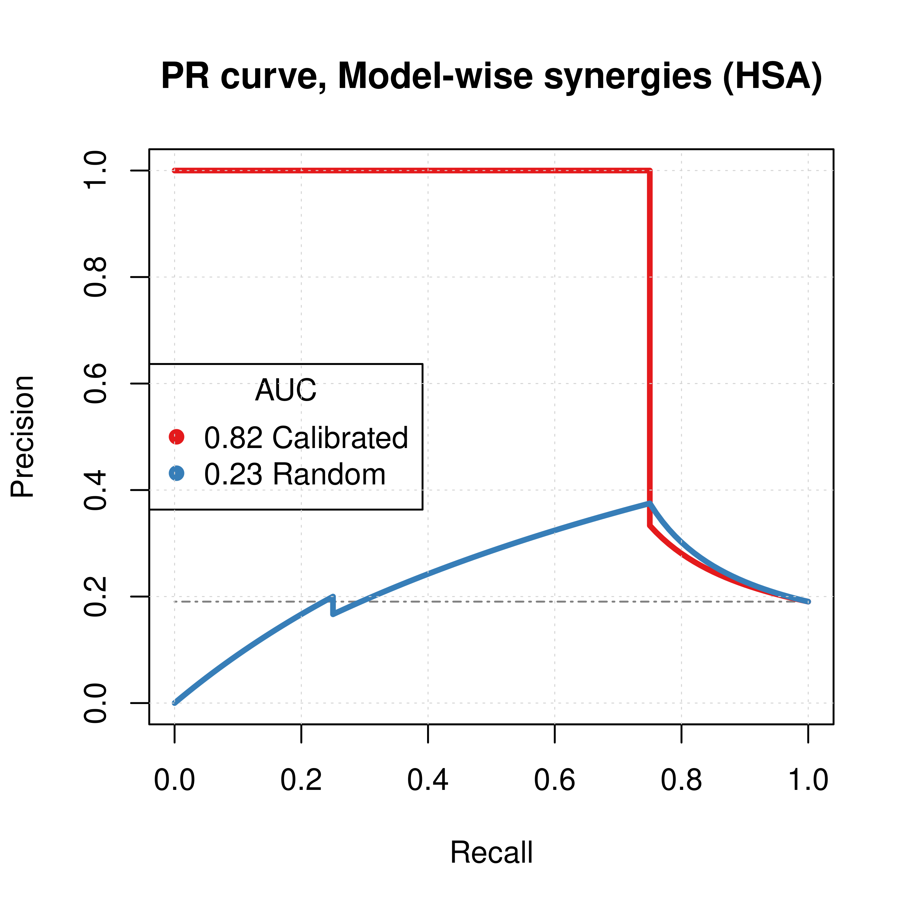
<p class="caption">(\#fig:pr-hsa-cascade1)PR curves (CASCADE 1.0, HSA synergy method)</p>
</div>

:::{.green-box}
Calibrated models perform a lot better than the random ones
:::

### AUC sensitivity {-}

:::{#auc-sensitivity .blue-box}
- Investigate **combining the synergy results of calibrated and proliferative (random) models**
- Quantify the amount of information from the *proliferative* (*random*) models that can be used to augment the calibrated results?
- **Ensemble-wise** scenario: $score = calibrated + \beta \times random$
  - $\beta \rightarrow +\infty$: mostly *proliferative* (random) model predictions
  - $\beta \rightarrow -\infty$: mostly *reverse proliferative* (random) model predictions
  - $\beta \simeq -1$: calibrated models are *normalized* against proliferative (random) model predictions.
- **Model-wise** scenario: $(1-w) \times prob_{cal} + w \times prob_{rand}, w \in[0,1]$
  - $w=0$: only calibrated model predictions
  - $w=1$: only proliferative (random) model predictions
:::


```r
# Ensemble-wise
betas = seq(from = -12, to = 12, by = 0.1)

prolif_roc = sapply(betas, function(beta) {
  pred_ew_hsa = pred_ew_hsa %>% mutate(combined_score = ss_score + beta * prolif_score)
  res = roc.curve(scores.class0 = pred_ew_hsa %>% pull(combined_score) %>% (function(x) {-x}), 
    weights.class0 = pred_ew_hsa %>% pull(observed))
  auc_value = res$auc
})

prolif_pr = sapply(betas, function(beta) {
  pred_ew_hsa = pred_ew_hsa %>% mutate(combined_score = ss_score + beta * prolif_score)
  res = pr.curve(scores.class0 = pred_ew_hsa %>% pull(combined_score) %>% (function(x) {-x}), 
    weights.class0 = pred_ew_hsa %>% pull(observed))
  auc_value = res$auc.davis.goadrich
})

df_ew = as_tibble(cbind(betas, prolif_roc, prolif_pr))
df_ew = df_ew %>% tidyr::pivot_longer(-betas, names_to = "type", values_to = "AUC")

ggline(data = df_ew, x = "betas", y = "AUC", numeric.x.axis = TRUE, color = "type",
  plot_type = "l", xlab = TeX("$\\beta$"), ylab = "AUC (Area Under Curve)", 
  legend = "none", facet.by = "type", palette = my_palette,
  panel.labs = list(type = c("Precision-Recall", "ROC")),
  title = TeX("AUC sensitivity to $\\beta$ parameter (HSA, CASCADE 1.0)")) + 
  theme(plot.title = element_text(hjust = 0.5)) +
  geom_vline(xintercept = 0) +
  geom_vline(xintercept = -1, color = "black", size = 0.3, linetype = "dashed") + 
  geom_text(aes(x=-2, label="β = -1", y=0.25), colour="black", angle=90) + 
  grids()
```

<div class="figure" style="text-align: center">

<p class="caption">(\#fig:auc-sen-ew-hsa-cascade1)AUC sensitivity (CASCADE 1.0, HSA synergy method, Ensemble-wise results)</p>
</div>


```r
# Model-wise
weights = seq(from = 0, to = 1, by = 0.05)

prolif_roc_mw = sapply(weights, function(w) {
  pred_mw_hsa = pred_mw_hsa %>%
    mutate(weighted_prob = (1 - w) * pred_mw_hsa$synergy_prob_ss + w * pred_mw_hsa$synergy_prob_prolif)
  res = roc.curve(scores.class0 = pred_mw_hsa %>% pull(weighted_prob),
    weights.class0 = pred_mw_hsa %>% pull(observed))
  auc_value = res$auc
})

prolif_pr_mw = sapply(weights, function(w) {
  pred_mw_hsa = pred_mw_hsa %>% 
    mutate(weighted_prob = (1 - w) * pred_mw_hsa$synergy_prob_ss + w * pred_mw_hsa$synergy_prob_prolif)
  res = pr.curve(scores.class0 = pred_mw_hsa %>% pull(weighted_prob), 
    weights.class0 = pred_mw_hsa %>% pull(observed))
  auc_value = res$auc.davis.goadrich
})

df_mw = as_tibble(cbind(weights, prolif_roc_mw, prolif_pr_mw))
df_mw = df_mw %>% tidyr::pivot_longer(-weights, names_to = "type", values_to = "AUC")

ggline(data = df_mw, x = "weights", y = "AUC", numeric.x.axis = TRUE, color = "type",
  plot_type = "l", xlab = TeX("weight $w$"), ylab = "AUC (Area Under Curve)", 
  legend = "none", facet.by = "type", palette = my_palette,
  panel.labs = list(type = c("Precision-Recall", "ROC")), title.position = "center",
  title = TeX("AUC sensitivity to weighted average score (HSA, CASCADE 1.0)")) + 
  theme(plot.title = element_text(hjust = 0.5)) +
  grids()
```

<div class="figure" style="text-align: center">

<p class="caption">(\#fig:auc-sen-mw-hsa-cascade1)AUC sensitivity (CASCADE 1.0, HSA synergy method, Model-wise results)</p>
</div>

:::{.green-box}
- There are $\beta$ values that can boost the predictive performance of the calibrated models (ensemble-wise) but no $w$ weight in the model-wise case.
- $\beta=-1$ seems to be a common value that maximizes both the ROC-AUC and the PR-AUC.
- The PR-AUC is **more sensitive** than the ROC-AUC, so a better indicator of performance.
:::

## Bliss results {-}

:::{.note}
- *Bliss* refers to the synergy method used in `Drabme` to assess the synergies from the `gitsbe` models
- We test performance using ROC and PR AUC for both the *ensemble-wise* and *model-wise* synergies from `Drabme`
- **Calibrated** models: fitted to steady state ($50$ simulations)
- **Random** models: fitted to [proliferation profile](https://druglogics.github.io/druglogics-doc/training-data.html#unperturbed-condition---globaloutput-response) ($50$ simulations)
- `Gitsbe` models have mutations on **link operator** only
:::

Load results:

```r
# 'ss' => calibrated models, 'prolif' => random models

## Bliss results
ss_bliss_ensemblewise_file = paste0("results/link-only/cascade_1.0_ss_50sim_fixpoints_bliss_ensemblewise_synergies.tab")
ss_bliss_modelwise_file = paste0("results/link-only/cascade_1.0_ss_50sim_fixpoints_bliss_modelwise_synergies.tab")
prolif_bliss_ensemblewise_file = paste0("results/link-only/cascade_1.0_rand_50sim_fixpoints_bliss_ensemblewise_synergies.tab")
prolif_bliss_modelwise_file = paste0("results/link-only/cascade_1.0_rand_50sim_fixpoints_bliss_modelwise_synergies.tab")

ss_bliss_ensemblewise_synergies = emba::get_synergy_scores(ss_bliss_ensemblewise_file)
ss_bliss_modelwise_synergies = emba::get_synergy_scores(ss_bliss_modelwise_file, file_type = "modelwise")
prolif_bliss_ensemblewise_synergies = emba::get_synergy_scores(prolif_bliss_ensemblewise_file)
prolif_bliss_modelwise_synergies = emba::get_synergy_scores(prolif_bliss_modelwise_file, file_type = "modelwise")

# calculate probability of synergy in the modelwise results
ss_bliss_modelwise_synergies = ss_bliss_modelwise_synergies %>% 
  mutate(synergy_prob_ss = synergies/(synergies + `non-synergies`))
prolif_bliss_modelwise_synergies = prolif_bliss_modelwise_synergies %>%
  mutate(synergy_prob_prolif = synergies/(synergies + `non-synergies`))

# 'ew' => ensemble-wise, 'mw' => model-wise
pred_ew_bliss = bind_cols(ss_bliss_ensemblewise_synergies %>% rename(ss_score = score), 
  prolif_bliss_ensemblewise_synergies %>% select(score) %>% rename(prolif_score = score),
  as_tibble_col(observed, column_name = "observed"))

pred_mw_bliss = bind_cols(
  ss_bliss_modelwise_synergies %>% select(perturbation, synergy_prob_ss),
  prolif_bliss_modelwise_synergies %>% select(synergy_prob_prolif),
  as_tibble_col(observed, column_name = "observed"))
```

### ROC curves {-}


```r
res_ss_ew = get_roc_stats(df = pred_ew_bliss, pred_col = "ss_score", label_col = "observed")
res_prolif_ew = get_roc_stats(df = pred_ew_bliss, pred_col = "prolif_score", label_col = "observed")

res_ss_mw = get_roc_stats(df = pred_mw_bliss, pred_col = "synergy_prob_ss", label_col = "observed", direction = ">")
res_prolif_mw = get_roc_stats(df = pred_mw_bliss, pred_col = "synergy_prob_prolif", label_col = "observed", direction = ">")

# Plot ROCs
plot(x = res_ss_ew$roc_stats$FPR, y = res_ss_ew$roc_stats$TPR,
  type = 'l', lwd = 3, col = my_palette[1], main = 'ROC curve, Ensemble-wise synergies (Bliss)',
  xlab = 'False Positive Rate (FPR)', ylab = 'True Positive Rate (TPR)')
lines(x = res_prolif_ew$roc_stats$FPR, y = res_prolif_ew$roc_stats$TPR, 
  lwd = 3, col = my_palette[2])
legend('bottomright', title = 'AUC', col = my_palette[1:2], pch = 19,
  legend = c(paste(round(res_ss_ew$AUC, digits = 2), "Calibrated"), 
    paste(round(res_prolif_ew$AUC, digits = 2), "Random")), cex = 1.3)
grid(lwd = 0.5)
abline(a = 0, b = 1, col = 'lightgrey', lty = 'dotdash', lwd = 1.2)

plot(x = res_ss_mw$roc_stats$FPR, y = res_ss_mw$roc_stats$TPR,
  type = 'l', lwd = 3, col = my_palette[1], main = 'ROC curve, Model-wise synergies (Bliss)',
  xlab = 'False Positive Rate (FPR)', ylab = 'True Positive Rate (TPR)')
lines(x = res_prolif_mw$roc_stats$FPR, y = res_prolif_mw$roc_stats$TPR, 
  lwd = 3, col = my_palette[2])
legend('bottomright', title = 'AUC', col = my_palette[1:2], pch = 19,
  legend = c(paste(round(res_ss_mw$AUC, digits = 2), "Calibrated"),
    paste(round(res_prolif_mw$AUC, digits = 2), "Random")), cex = 1.3)
grid(lwd = 0.5)
abline(a = 0, b = 1, col = 'lightgrey', lty = 'dotdash', lwd = 1.2)
```

<div class="figure" style="text-align: center">
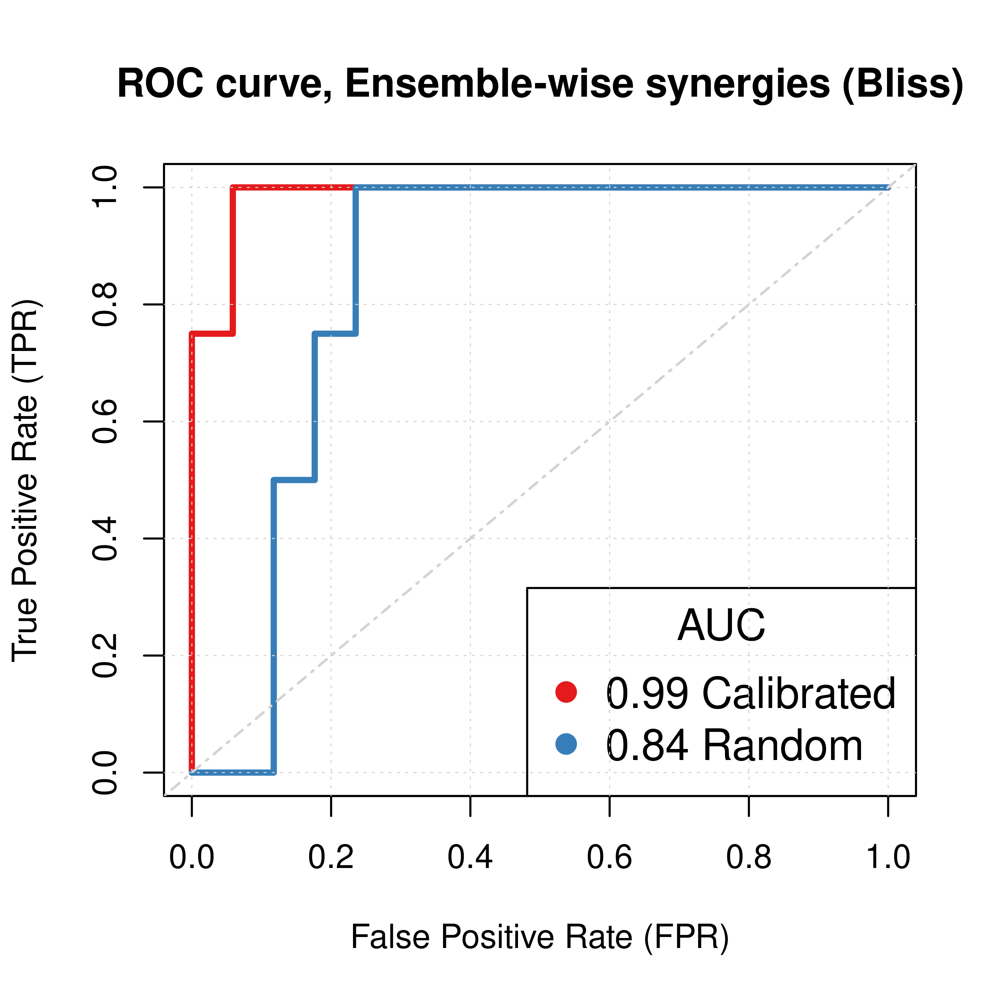
<p class="caption">(\#fig:roc-bliss-cascade1)ROC curves (CASCADE 1.0, Bliss synergy method)</p>
</div>

:::{#calibrated-bliss-dt}
The **ROC statistics data** for the calibrated models are as follows:
:::

```r
DT::datatable(data = res_ss_ew$roc_stats, options = 
  list(pageLength = 5, lengthMenu = c(5, 10, 16), searching = FALSE)) %>% 
  formatRound(c(1,6,7,8,9), digits = 3)
```

<div class="figure" style="text-align: center">
<!--html_preserve--><div id="htmlwidget-b20dc2a931752ae4f30d" style="width:100%;height:auto;" class="datatables html-widget"></div>
<script type="application/json" data-for="htmlwidget-b20dc2a931752ae4f30d">{"x":{"filter":"none","data":[["1","2","3","4","5","6","7","8","9","10","11","12","13","14","15","16"],[null,-0.157137145141943,-0.105616605616606,-0.0770900362596395,-0.054329351204351,-0.0522697951943235,-0.0315138201374157,-0.0045278795278797,0,0.0104882652959576,0.0290204127331536,0.0351310595349343,0.0495862667993815,0.0759561426228094,0.204588014981273,0.275824574121058],[0,1,2,3,3,4,4,4,4,4,4,4,4,4,4,4],[4,3,2,1,1,0,0,0,0,0,0,0,0,0,0,0],[17,17,17,17,16,16,15,14,7,6,5,4,3,2,1,0],[0,0,0,0,1,1,2,3,10,11,12,13,14,15,16,17],[0,0,0,0,0.0588235294117647,0.0588235294117647,0.117647058823529,0.176470588235294,0.588235294117647,0.647058823529412,0.705882352941177,0.764705882352941,0.823529411764706,0.882352941176471,0.941176470588235,1],[0,0.25,0.5,0.75,0.75,1,1,1,1,1,1,1,1,1,1,1],[0,0.25,0.5,0.75,0.691176470588235,0.941176470588235,0.882352941176471,0.823529411764706,0.411764705882353,0.352941176470588,0.294117647058823,0.235294117647059,0.176470588235294,0.117647058823529,0.0588235294117647,0],[1,0.5625,0.25,0.0625,0.0659602076124567,0.00346020761245675,0.013840830449827,0.0311418685121107,0.346020761245675,0.418685121107266,0.498269896193772,0.58477508650519,0.678200692041522,0.778546712802768,0.885813148788927,1]],"container":"<table class=\"display\">\n  <thead>\n    <tr>\n      <th> <\/th>\n      <th>threshold<\/th>\n      <th>TP<\/th>\n      <th>FN<\/th>\n      <th>TN<\/th>\n      <th>FP<\/th>\n      <th>FPR<\/th>\n      <th>TPR<\/th>\n      <th>dist_from_chance<\/th>\n      <th>dist_from_0_1<\/th>\n    <\/tr>\n  <\/thead>\n<\/table>","options":{"pageLength":5,"lengthMenu":[5,10,16],"searching":false,"columnDefs":[{"targets":1,"render":"function(data, type, row, meta) {\n    return type !== 'display' ? data : DTWidget.formatRound(data, 3, 3, \",\", \".\");\n  }"},{"targets":6,"render":"function(data, type, row, meta) {\n    return type !== 'display' ? data : DTWidget.formatRound(data, 3, 3, \",\", \".\");\n  }"},{"targets":7,"render":"function(data, type, row, meta) {\n    return type !== 'display' ? data : DTWidget.formatRound(data, 3, 3, \",\", \".\");\n  }"},{"targets":8,"render":"function(data, type, row, meta) {\n    return type !== 'display' ? data : DTWidget.formatRound(data, 3, 3, \",\", \".\");\n  }"},{"targets":9,"render":"function(data, type, row, meta) {\n    return type !== 'display' ? data : DTWidget.formatRound(data, 3, 3, \",\", \".\");\n  }"},{"className":"dt-right","targets":[1,2,3,4,5,6,7,8,9]},{"orderable":false,"targets":0}],"order":[],"autoWidth":false,"orderClasses":false}},"evals":["options.columnDefs.0.render","options.columnDefs.1.render","options.columnDefs.2.render","options.columnDefs.3.render","options.columnDefs.4.render"],"jsHooks":[]}</script><!--/html_preserve-->
<p class="caption">(\#fig:calibrated-bliss-dt)ROC data for Calibrated Models (CASCADE 1.0, Bliss synergy method)</p>
</div>

```r
# investigate the average threshold as a synergy classification index
# thres = res_ss_ew$roc_stats %>% pull(threshold)
# thres = thres[is.finite(thres)] # remove Inf's
# res_ss_ew$roc_stats %>% 
#   filter(threshold < mean(thres)) %>% 
#   slice(n()) %>% kable()
```

### PR curves {-}


```r
pr_ss_ew_bliss = pr.curve(scores.class0 = pred_ew_bliss %>% pull(ss_score) %>% (function(x) {-x}), 
  weights.class0 = pred_ew_bliss %>% pull(observed), curve = TRUE, rand.compute = TRUE)
pr_prolif_ew_bliss = pr.curve(scores.class0 = pred_ew_bliss %>% pull(prolif_score) %>% (function(x) {-x}), 
  weights.class0 = pred_ew_bliss %>% pull(observed), curve = TRUE)

pr_ss_mw_bliss = pr.curve(scores.class0 = pred_mw_bliss %>% pull(synergy_prob_ss), 
  weights.class0 = pred_mw_bliss %>% pull(observed), curve = TRUE, rand.compute = TRUE)
pr_prolif_mw_bliss = pr.curve(scores.class0 = pred_mw_bliss %>% pull(synergy_prob_prolif), 
  weights.class0 = pred_mw_bliss %>% pull(observed), curve = TRUE)

plot(pr_ss_ew_bliss, main = 'PR curve, Ensemble-wise synergies (Bliss)', 
  auc.main = FALSE, color = my_palette[1], rand.plot = TRUE)
plot(pr_prolif_ew_bliss, add = TRUE, color = my_palette[2])
legend(x = 0, y = 0.9, title = 'AUC', col = my_palette[1:2], pch = 19, cex = 1.3,
  legend = c(paste(round(pr_ss_ew_bliss$auc.davis.goadrich, digits = 2), "Calibrated"), 
    paste(round(pr_prolif_ew_bliss$auc.davis.goadrich, digits = 2), "Random")))
grid(lwd = 0.5)

plot(pr_ss_mw_bliss, main = 'PR curve, Model-wise synergies (Bliss)', 
  auc.main = FALSE, color = my_palette[1], rand.plot = TRUE)
plot(pr_prolif_mw_bliss, add = TRUE, color = my_palette[2])
legend(x = 0, y = 0.9, title = 'AUC', col = my_palette[1:3], pch = 19, cex = 1.3,
  legend = c(paste(round(pr_ss_mw_bliss$auc.davis.goadrich, digits = 2), "Calibrated"),
    paste(round(pr_prolif_mw_bliss$auc.davis.goadrich, digits = 2), "Random")))
grid(lwd = 0.5)
```

<div class="figure" style="text-align: center">

<p class="caption">(\#fig:pr-bliss-cascade1)PR curves (CASCADE 1.0, Bliss synergy method)</p>
</div>

:::{.green-box}
Calibrated models perform a lot better than the random ones
:::

### AUC sensitivity {-}

Investigate same thing as described in [here](#auc-sensitivity).


```r
# Ensemble-wise
betas = seq(from = -12, to = 12, by = 0.1)

prolif_roc = sapply(betas, function(beta) {
  pred_ew_bliss = pred_ew_bliss %>% mutate(combined_score = ss_score + beta * prolif_score)
  res = roc.curve(scores.class0 = pred_ew_bliss %>% pull(combined_score) %>% (function(x) {-x}), 
    weights.class0 = pred_ew_bliss %>% pull(observed))
  auc_value = res$auc
})

prolif_pr = sapply(betas, function(beta) {
  pred_ew_bliss = pred_ew_bliss %>% mutate(combined_score = ss_score + beta * prolif_score)
  res = pr.curve(scores.class0 = pred_ew_bliss %>% pull(combined_score) %>% (function(x) {-x}), 
    weights.class0 = pred_ew_bliss %>% pull(observed))
  auc_value = res$auc.davis.goadrich
})

df_ew = as_tibble(cbind(betas, prolif_roc, prolif_pr))
df_ew = df_ew %>% tidyr::pivot_longer(-betas, names_to = "type", values_to = "AUC")

ggline(data = df_ew, x = "betas", y = "AUC", numeric.x.axis = TRUE, color = "type",
  plot_type = "l", xlab = TeX("$\\beta$"), ylab = "AUC (Area Under Curve)", 
  legend = "none", facet.by = "type", palette = my_palette,
  panel.labs = list(type = c("Precision-Recall", "ROC")),
  title = TeX("AUC sensitivity to $\\beta$ parameter (Bliss, CASCADE 1.0)")) + 
  theme(plot.title = element_text(hjust = 0.5)) +
  geom_vline(xintercept = 0) +
  geom_vline(xintercept = -1, color = "black", size = 0.3, linetype = "dashed") + 
  geom_text(aes(x=-2, label="β = -1", y=0.25), colour="black", angle=90) + 
  grids()
```

<div class="figure" style="text-align: center">

<p class="caption">(\#fig:auc-sen-ew-bliss-cascade1)AUC sensitivity (CASCADE 1.0, Bliss synergy method, Ensemble-wise results)</p>
</div>


```r
# Model-wise
weights = seq(from = 0, to = 1, by = 0.05)

prolif_roc_mw = sapply(weights, function(w) {
  pred_mw_bliss = pred_mw_bliss %>%
    mutate(weighted_prob = (1 - w) * pred_mw_bliss$synergy_prob_ss + w * pred_mw_bliss$synergy_prob_prolif)
  res = roc.curve(scores.class0 = pred_mw_bliss %>% pull(weighted_prob),
    weights.class0 = pred_mw_bliss %>% pull(observed))
  auc_value = res$auc
})

prolif_pr_mw = sapply(weights, function(w) {
  pred_mw_bliss = pred_mw_bliss %>% 
    mutate(weighted_prob = (1 - w) * pred_mw_bliss$synergy_prob_ss + w * pred_mw_bliss$synergy_prob_prolif)
  res = pr.curve(scores.class0 = pred_mw_bliss %>% pull(weighted_prob), 
    weights.class0 = pred_mw_bliss %>% pull(observed))
  auc_value = res$auc.davis.goadrich
})

df_mw = as_tibble(cbind(weights, prolif_roc_mw, prolif_pr_mw))
df_mw = df_mw %>% tidyr::pivot_longer(-weights, names_to = "type", values_to = "AUC")

ggline(data = df_mw, x = "weights", y = "AUC", numeric.x.axis = TRUE, color = "type",
  plot_type = "l", xlab = TeX("weight $w$"), ylab = "AUC (Area Under Curve)", 
  legend = "none", facet.by = "type", palette = my_palette,
  panel.labs = list(type = c("Precision-Recall", "ROC")), title.position = "center",
  title = TeX("AUC sensitivity to weighted average score (Bliss, CASCADE 1.0)")) + 
  theme(plot.title = element_text(hjust = 0.5)) +
  grids()
```

<div class="figure" style="text-align: center">

<p class="caption">(\#fig:auc-sen-mw-bliss-cascade1)AUC sensitivity (CASCADE 1.0, Bliss synergy method, Model-wise results)</p>
</div>

:::{.green-box}
- There are $\beta$ values that can boost the predictive performance of the calibrated models (ensemble-wise) but no $w$ weight in the model-wise case.
- The PR-AUC is **more sensitive** than the ROC-AUC, so a better indicator of performance.
- A value very close to $\beta=-1$ seems to be the one maximizes both the ROC-AUC and the PR-AUC.
:::

## Best ROC and PRC {-}

:::{#combined-pred-bliss-dt}
The **ROC ensemble-wise statistics data** for the combined predictor $calibrated + \beta \times random, \beta=-1$ are:
:::

```r
beta = -1
pred_ew_bliss = pred_ew_bliss %>% mutate(combined_score = ss_score + beta * prolif_score)
res_comb_pred = usefun::get_roc_stats(df = pred_ew_bliss, pred_col = "combined_score", label_col = "observed")

DT::datatable(data = res_comb_pred$roc_stats, options = 
  list(pageLength = 5, lengthMenu = c(5, 10, 16), searching = FALSE)) %>% 
  DT::formatRound(c(1,6,7,8,9), digits = 3)
```

<div class="figure" style="text-align: center">
<!--html_preserve--><div id="htmlwidget-7598595affc4f25ab85b" style="width:100%;height:auto;" class="datatables html-widget"></div>
<script type="application/json" data-for="htmlwidget-7598595affc4f25ab85b">{"x":{"filter":"none","data":[["1","2","3","4","5","6","7","8","9","10","11","12","13","14","15","16","17"],[null,-0.108851105784475,-0.0498706139461288,-0.0331056962400021,-0.0311179029477264,-0.0305011367363769,-0.0253108561746203,-0.0205876674359666,-0.018270677801874,-0.00117158583470633,0,0.0290004454489178,0.0659397475882574,0.0973759446683109,0.175534594175275,0.214223134438229,0.219820126794381],[0,1,2,3,3,3,4,4,4,4,4,4,4,4,4,4,4],[4,3,2,1,1,1,0,0,0,0,0,0,0,0,0,0,0],[17,17,17,17,16,15,15,14,13,12,6,5,4,3,2,1,0],[0,0,0,0,1,2,2,3,4,5,11,12,13,14,15,16,17],[0,0,0,0,0.0588235294117647,0.117647058823529,0.117647058823529,0.176470588235294,0.235294117647059,0.294117647058824,0.647058823529412,0.705882352941177,0.764705882352941,0.823529411764706,0.882352941176471,0.941176470588235,1],[0,0.25,0.5,0.75,0.75,0.75,1,1,1,1,1,1,1,1,1,1,1],[0,0.25,0.5,0.75,0.691176470588235,0.632352941176471,0.882352941176471,0.823529411764706,0.764705882352941,0.705882352941176,0.352941176470588,0.294117647058823,0.235294117647059,0.176470588235294,0.117647058823529,0.0588235294117647,0],[1,0.5625,0.25,0.0625,0.0659602076124567,0.076340830449827,0.013840830449827,0.0311418685121107,0.055363321799308,0.0865051903114187,0.418685121107266,0.498269896193772,0.58477508650519,0.678200692041522,0.778546712802768,0.885813148788927,1]],"container":"<table class=\"display\">\n  <thead>\n    <tr>\n      <th> <\/th>\n      <th>threshold<\/th>\n      <th>TP<\/th>\n      <th>FN<\/th>\n      <th>TN<\/th>\n      <th>FP<\/th>\n      <th>FPR<\/th>\n      <th>TPR<\/th>\n      <th>dist_from_chance<\/th>\n      <th>dist_from_0_1<\/th>\n    <\/tr>\n  <\/thead>\n<\/table>","options":{"pageLength":5,"lengthMenu":[5,10,16],"searching":false,"columnDefs":[{"targets":1,"render":"function(data, type, row, meta) {\n    return type !== 'display' ? data : DTWidget.formatRound(data, 3, 3, \",\", \".\");\n  }"},{"targets":6,"render":"function(data, type, row, meta) {\n    return type !== 'display' ? data : DTWidget.formatRound(data, 3, 3, \",\", \".\");\n  }"},{"targets":7,"render":"function(data, type, row, meta) {\n    return type !== 'display' ? data : DTWidget.formatRound(data, 3, 3, \",\", \".\");\n  }"},{"targets":8,"render":"function(data, type, row, meta) {\n    return type !== 'display' ? data : DTWidget.formatRound(data, 3, 3, \",\", \".\");\n  }"},{"targets":9,"render":"function(data, type, row, meta) {\n    return type !== 'display' ? data : DTWidget.formatRound(data, 3, 3, \",\", \".\");\n  }"},{"className":"dt-right","targets":[1,2,3,4,5,6,7,8,9]},{"orderable":false,"targets":0}],"order":[],"autoWidth":false,"orderClasses":false}},"evals":["options.columnDefs.0.render","options.columnDefs.1.render","options.columnDefs.2.render","options.columnDefs.3.render","options.columnDefs.4.render"],"jsHooks":[]}</script><!--/html_preserve-->
<p class="caption">(\#fig:combined-pred-bliss-dt)ROC data for Combined Predictor (CASCADE 1.0, Bliss synergy method)</p>
</div>

```r
# All observed synergies are in top 6
# pred_ew_bliss %>% arrange(combined_score)
```

:::{.note}
Only for the next 2 Figures, **Calibrated** stands for the combined predictor results, i.e. $calibrated + \beta \times random, \beta=-1$.
:::


```r
plot(x = res_comb_pred$roc_stats$FPR, y = res_comb_pred$roc_stats$TPR,
  type = 'l', lwd = 3, col = my_palette[1], main = 'ROC curve, Ensemble-wise synergies (Bliss)',
  xlab = 'False Positive Rate (FPR)', ylab = 'True Positive Rate (TPR)')
lines(x = res_prolif_ew$roc_stats$FPR, y = res_prolif_ew$roc_stats$TPR, 
  lwd = 3, col = my_palette[2])
legend('bottomright', title = 'AUC', col = my_palette[1:2], pch = 19,
  legend = c(paste(round(res_comb_pred$AUC, digits = 2), "Calibrated"), 
    paste(round(res_prolif_ew$AUC, digits = 2), "Random")), cex = 1.3)
grid(lwd = 0.5)
abline(a = 0, b = 1, col = 'lightgrey', lty = 'dotdash', lwd = 1.2)

res_comb_pred_pr = pr.curve(scores.class0 = pred_ew_bliss %>% pull(combined_score) %>% (function(x) {-x}), 
  weights.class0 = pred_ew_bliss %>% pull(observed), curve = TRUE, rand.compute = TRUE)
plot(res_comb_pred_pr, main = 'PR curve, Ensemble-wise synergies (Bliss)', 
  auc.main = FALSE, color = my_palette[1], rand.plot = TRUE)
plot(pr_prolif_ew_bliss, add = TRUE, color = my_palette[2])
legend(x = 0, y = 0.9, title = 'AUC', col = my_palette[1:2], pch = 19, cex = 1.3,
  legend = c(paste(round(res_comb_pred_pr$auc.davis.goadrich, digits = 2), "Calibrated"),
    paste(round(pr_prolif_ew_bliss$auc.davis.goadrich, digits = 2), "Random")))
grid(lwd = 0.5)
```

<div class="figure" style="text-align: center">
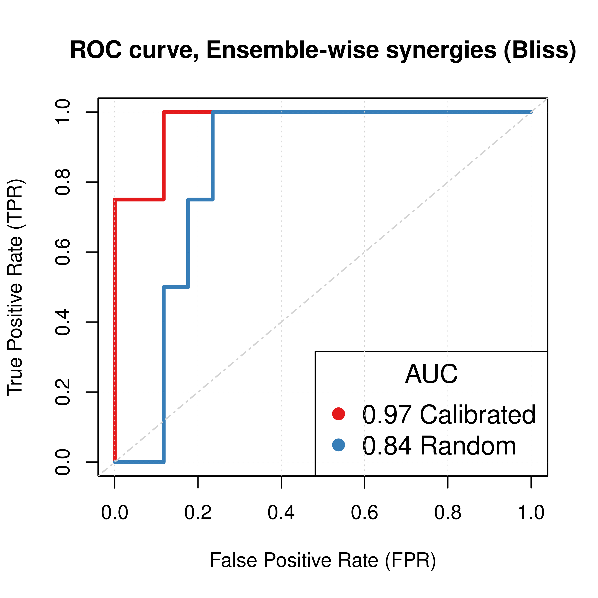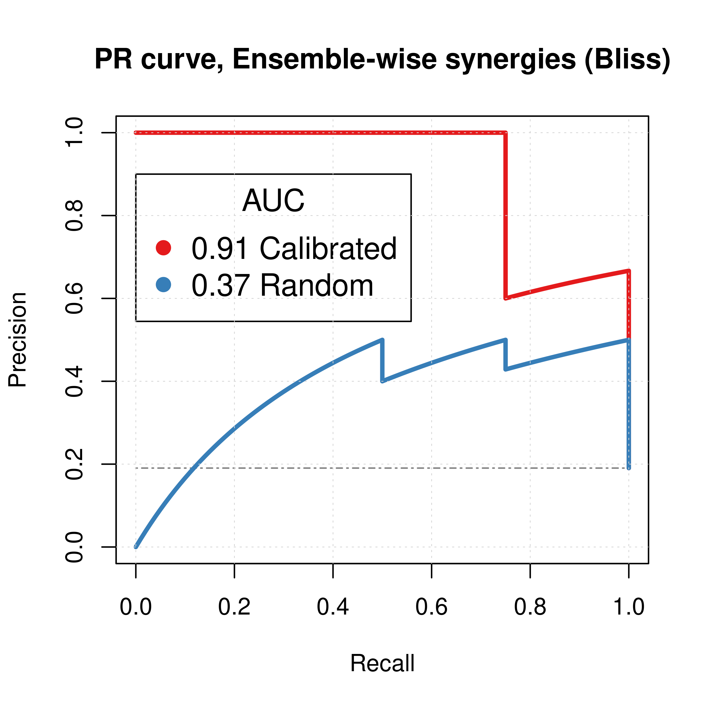
<p class="caption">(\#fig:best-roc-pr-cascade1)ROC and PR curves for Random and Best Combined Predictor (CASCADE 1.0, Bliss synergy method)</p>
</div>

If we add the predictions of the non-normalized calibrated data to the above Figures, we have:

```r
plot(x = res_comb_pred$roc_stats$FPR, y = res_comb_pred$roc_stats$TPR,
  type = 'l', lwd = 3, col = my_palette[1], main = 'ROC curve, Ensemble-wise synergies (Bliss)',
  xlab = 'False Positive Rate (FPR)', ylab = 'True Positive Rate (TPR)')
lines(x = res_prolif_ew$roc_stats$FPR, y = res_prolif_ew$roc_stats$TPR, 
  lwd = 3, col = my_palette[2])
lines(x = res_ss_ew$roc_stats$FPR, y = res_ss_ew$roc_stats$TPR, 
  lwd = 3, col = my_palette[3])
legend('bottomright', title = 'AUC', col = my_palette[c(3,1,2)], pch = 19,
  legend = c(paste(round(res_ss_ew$AUC, digits = 2), "Calibrated (non-normalized)"), 
    paste(round(res_comb_pred$AUC, digits = 2), "Calibrated"), 
    paste(round(res_prolif_ew$AUC, digits = 2), "Random")), cex = 1)
grid(lwd = 0.5)
abline(a = 0, b = 1, col = 'lightgrey', lty = 'dotdash', lwd = 1.2)

res_comb_pred_pr = pr.curve(scores.class0 = pred_ew_bliss %>% pull(combined_score) %>% (function(x) {-x}), 
  weights.class0 = pred_ew_bliss %>% pull(observed), curve = TRUE, rand.compute = TRUE)
plot(res_comb_pred_pr, main = 'PR curve, Ensemble-wise synergies (Bliss)', 
  auc.main = FALSE, color = my_palette[1], rand.plot = TRUE)
plot(pr_prolif_ew_bliss, add = TRUE, color = my_palette[2])
plot(pr_ss_ew_bliss, add = TRUE, color = my_palette[3])
legend(x = 0, y = 0.9, title = 'AUC', col = my_palette[c(3,1,2)], pch = 19, cex = 0.9,
  legend = c(paste(round(pr_ss_ew_bliss$auc.davis.goadrich, digits = 2), "Calibrated (non-normalized)"),
    paste(round(res_comb_pred_pr$auc.davis.goadrich, digits = 2), "Calibrated"),
    paste(round(pr_prolif_ew_bliss$auc.davis.goadrich, digits = 2), "Random")))
grid(lwd = 0.5)
```

<div class="figure" style="text-align: center">
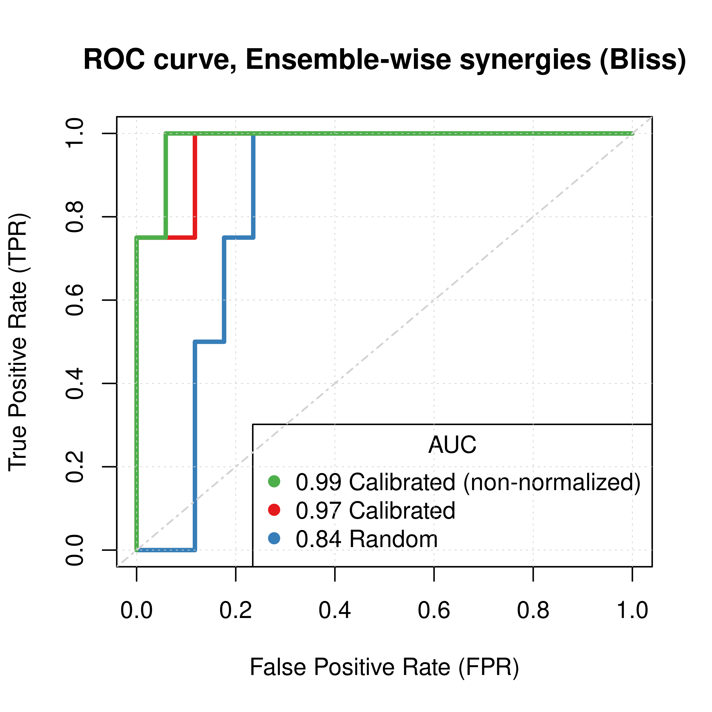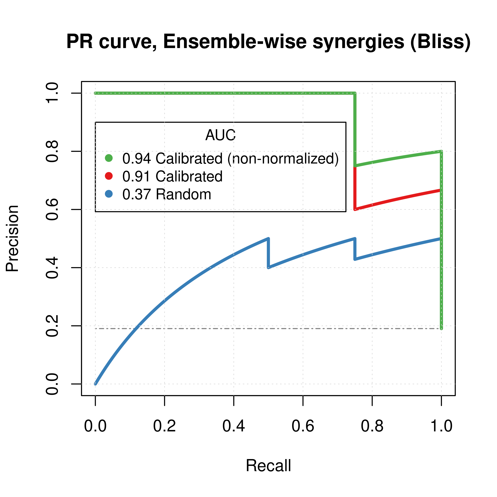
<p class="caption">(\#fig:best-roc-pr-cascade1-2)ROC and PR curves for Random, Calibrated and Best Combined Predictor (CASCADE 1.0, Bliss synergy method)</p>
</div>

## Correlation {-}

We test for correlation between all the synergy predictor results shown in the previous curves.
This means *ensemble-wise* vs *model-wise*, *random proliferative* models vs *calibrated* models and *HSA* vs *Bliss* synergy assessment.
*P-values* are represented at 3 significant levels: $0.05, 0.01, 0.001$ (\*, \*\*, \*\*\*) and the correlation coefficient is calculated using Kendall's *tau* statistic.


```r
synergy_scores = bind_cols(
  pred_ew_hsa %>% select(ss_score, prolif_score) %>% rename(cal_ew_hsa = ss_score, random_ew_hsa = prolif_score),
  pred_ew_bliss %>% select(ss_score, prolif_score) %>% rename(cal_ew_bliss = ss_score, random_ew_bliss = prolif_score),
  pred_mw_hsa %>% select(synergy_prob_ss, synergy_prob_prolif) %>% 
    rename(cal_mw_hsa = synergy_prob_ss, random_mw_hsa = synergy_prob_prolif),
  pred_mw_bliss %>% select(synergy_prob_ss, synergy_prob_prolif) %>% 
    rename(cal_mw_bliss = synergy_prob_ss, random_mw_bliss = synergy_prob_prolif)
  )

M = cor(synergy_scores, method = "kendall")
res = cor.mtest(synergy_scores, method = "kendall")
corrplot(corr = M, type = "upper", p.mat = res$p, sig.level = c(.001, .01, .05), 
  pch.cex = 1, pch.col = "white", insig = "label_sig", tl.col = "black", tl.srt = 45)
```

<div class="figure" style="text-align: center">

<p class="caption">(\#fig:cor-plot-cascade1)Correlation Plot for CASCADE 1.0 Results</p>
</div>

:::{.green-box}
- **Model-wise** don't correlate a lot with **ensemble-wise** results (*topright* part of the correlation plot).
- **HSA and Bliss results correlate**, higher for the model-wise (*bottomright*) than the ensemble-wise results (*topleft*).
- **Calibrated** results also show some correlation with the **random** results
:::

## Fitness Evolution {-}

We did a test run of `Gitsbe` with $1000$ simulations, fitting to steady state (generating thus **calibrated models**).
The only difference between the following results and the ones above is the total number of simulations specified in the configuration and that the option `bootstrap_mutations_factor` was set to $1$ (to avoid reaching good fitness models in the earlier generations).

Firstly, we show the fitness evolution of the first $20$ simulations.
Each data point is the average fitness in that generation out of $20$ models.
Note that some simulations end because the target fitness is reached by some of the models ($0.99$).


```r
read_summary_file = function(file_name) {
  lines = readr::read_lines(file = file_name, skip = 5, skip_empty_rows = TRUE)
  
  data_list = list()
  index = 1
  
  gen_fit_list = list()
  gen_index = 1
  for (line_index in 1:length(lines)) {
    line = lines[line_index]
    if (stringr::str_detect(string = line, pattern = "Simulation")) {
      data_list[[index]] = dplyr::bind_cols(gen_fit_list)
      index = index + 1
      
      gen_fit_list = list()
      gen_index = 1
    } else { # read fitness values
      gen_fit_list[[gen_index]] = tibble::as_tibble_col(as.numeric(unlist(strsplit(line, split = '\t'))), column_name = paste0(gen_index))
      gen_index = gen_index + 1
    }
  }
  
  # add the last simulation's values
  data_list[[index]] = dplyr::bind_cols(gen_fit_list)
  
  return(data_list)
}

fitness_summary_file = "results/link-only/cascade_1.0_ss_1000sim_fixpoints_hsa_summary.txt"

# `fit_res` is a list of tibbles
# Each tibble has the fitness results of a simulation
# Rows represent the models and columns are the generations
fit_res = read_summary_file(file_name = fitness_summary_file)

first_sim_data = colMeans(fit_res[[1]])
plot(1:length(first_sim_data), y = first_sim_data, ylim = c(0,1), 
  xlim = c(0,20), type = 'l', lwd = 1.5, 
  main = 'Fitness Evolution across Generations', xlab = 'Generations',
  ylab = 'Average Fitness', col = usefun:::colors.100[1])
index = 2
for (fit_data in fit_res) {
  if (index > 20) break
  #if (ncol(fit_data) != 20) next
  mean_fit_per_gen = colMeans(fit_data)
  lines(x = 1:length(mean_fit_per_gen), y = mean_fit_per_gen, lwd = 1.5,
    col = usefun:::colors.100[index])
  index = index + 1
}
grid(lwd = 0.5)
```

<div class="figure" style="text-align: center">

<p class="caption">(\#fig:fit-evolution)Fitness Evolution (20 simulations, CASCADE 1.0)</p>
</div>

Next, we plot the **average fitness + standard deviation** per generation across all $1000$ simulations:

```r
# `avg_fit` is a tibble with rows the number of simulations and 
# columns the generations. Each value in a (sim,gen) cell is the average 
# fitness of models in that particular (sim,gen) combination
avg_fit = do.call(dplyr::bind_rows, sapply(fit_res, colMeans))
avg_fit_long = avg_fit %>% pivot_longer(cols = everything()) %>% mutate(name = as.integer(name))

ggline(data = avg_fit_long, x = "name", y = "value", color = my_palette[2],
  add = "mean_sd", add.params = list(color = "black"), ylim = c(0, 1),
  main = "Fitness Evolution across Generations", 
  xlab = "Generations", ylab = "Fitness") + 
  theme(plot.title = element_text(hjust = 0.5)) + grids()
```

<div class="figure" style="text-align: center">

<p class="caption">(\#fig:fit-evolution-2)Fitness Evolution (1000 simulations, CASCADE 1.0)</p>
</div>

```r
# DIY way:
# df = avg_fit_long %>% group_by(name) %>%
#   summarise(median = median(value, na.rm = TRUE),
#     mean = mean(value, na.rm = TRUE),
#     sd = sd(value, na.rm = TRUE))
# 
# ggplot(data = df, aes(x=name, y=mean)) +
#   ggtitle("Fitness Evolution across Generations") +
#   xlab("Generations") + ylab("Fitness") +
#   geom_errorbar(aes(ymin=mean-sd, ymax=mean+sd), width=.2) +
#   geom_line(color='steelblue') +
#   geom_point(color='steelblue') +
#   theme_pubr() + theme(plot.title = element_text(hjust = 0.5)) +
#   grids()
```

:::{.green-box}
- The average fitness stabilizes after $\approx 10-15$ generations but also the standard deviation: new models are still being created through the crossover genetic algorithm phase to explore various model parameterization while keeping the fitness score relatively high.
- The *S*-shaped (sigmoid) curve is in agreement with Holland's schema theorem [@holland1992adaptation].
:::

## Fitness vs Ensemble Performance {-#fit-vs-ens-perf-cascade1}

:::{.blue-box}
We check for correlation between the **calibrated models fitness to the AGS steady state** and their **ensemble performance** subject to normalization to the random model predictions.

The **main idea** here is that we generate different training data samples, in which the boolean steady state nodes have their values flipped (so they are only partially correct) and we fit models to these ($50$ simulations => $150$ models per training data, $205$ training data samples in total).
These calibrated model ensembles can then be tested for their prediction performance.
Then we use the ensemble-wise *random proliferative* model predictions ($50$ simulations) to normalize ($\beta=-1$) against the calibrated model predictions and compute the **AUC ROC and AUC PR for each model ensemble**.
:::

:::{.note}
Check how to generate the appropriate data, run the simulations and tidy up the results in the section [Fitness vs Performance Methods].
:::

Load the already-stored result:

```r
res = readRDS(file = "data/res_fit_aucs_cascade1.rds")
```

We check if our data is normally distributed using the *Shapiro-Wilk* normality test:

```r
shapiro.test(x = res$roc_auc)
```

```

	Shapiro-Wilk normality test

data:  res$roc_auc
W = 0.95822, p-value = 9.995e-06
```

```r
shapiro.test(x = res$pr_auc)
```

```

	Shapiro-Wilk normality test

data:  res$pr_auc
W = 0.86074, p-value = 9.719e-13
```

```r
shapiro.test(x = res$avg_fit)
```

```

	Shapiro-Wilk normality test

data:  res$avg_fit
W = 0.87328, p-value = 4.518e-12
```

We observe from the low *p-values* that the **data is not normally distributed**.
Thus, we are going to use a non-parametric correlation metric, namely the **Kendall rank-based** test (and it's respective coefficient, $\tau$), to check for correlation between the ensemble model performance (ROC-AUC, PR-AUC) and the fitness to the AGS steady state:

```r
ggscatter(data = res, x = "avg_fit", y = "roc_auc",
  xlab = "Average Fitness per Model Ensemble",
  title = "Fitness to AGS Steady State vs Performance (ROC)",
  ylab = "ROC AUC", add = "reg.line", conf.int = TRUE,
  add.params = list(color = "blue", fill = "lightgray"),
  cor.coef = TRUE, cor.coeff.args = list(method = "kendall", label.y.npc = "top", size = 6, cor.coef.name = "tau")) +
  theme(plot.title = element_text(hjust = 0.5))
```

<div class="figure" style="text-align: center">
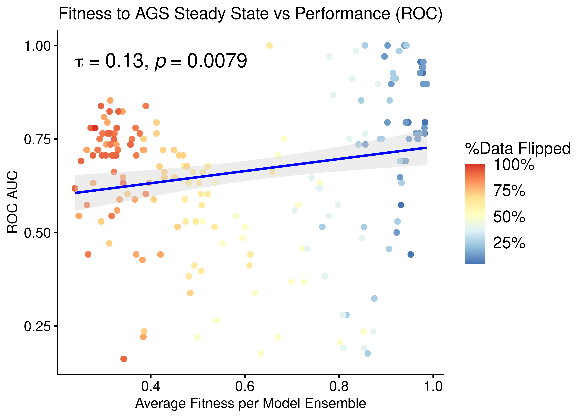
<p class="caption">(\#fig:fit-vs-perf-roc-cascade1)Fitness to AGS Steady State vs ROC-AUC Performance (CASCADE 1.0, Bliss synergy method, Ensemble-wise normalized results)</p>
</div>


```r
ggscatter(data = res, x = "avg_fit", y = "pr_auc",
  xlab = "Average Fitness per Model Ensemble",
  title = "Fitness to AGS Steady State vs Performance (Precision-Recall)",
  add.params = list(color = "blue", fill = "lightgray"),
  ylab = "PR AUC", add = "reg.line", conf.int = TRUE,
  cor.coef = TRUE, cor.coeff.args = list(method = "kendall", size = 6, cor.coef.name = "tau")) +
  theme(plot.title = element_text(hjust = 0.5))
```

<div class="figure" style="text-align: center">
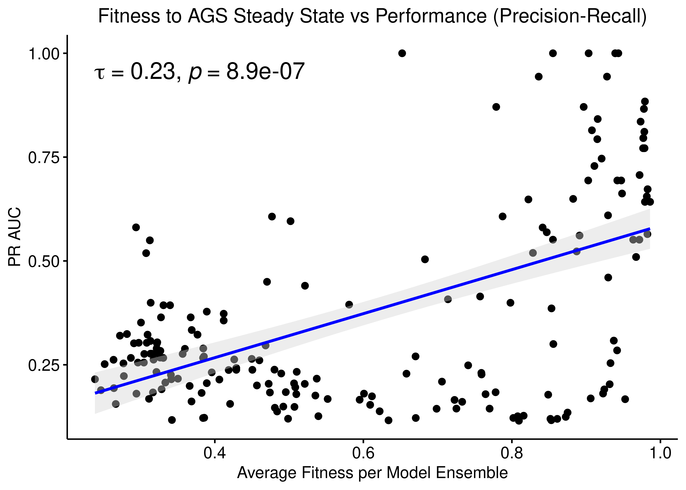
<p class="caption">(\#fig:fit-vs-perf-pr-cascade1)Fitness to AGS Steady State vs PR-AUC Performance (CASCADE 1.0, Bliss synergy method, Ensemble-wise normalized results)</p>
</div>

:::{.green-box}
- We observe that there exists **some correlation between the normalized ensemble model performance vs the models fitness to the training steady state data**.
- The performance as measured by the ROC AUC is less sensitive to changes in the training data but there is better correlation with regards to the PR AUC, which is a more informative measure for our imbalanced dataset [@Saito2015].
:::

## Scrambled Topologies Investigation {-#scrambled-topo-inv-cascade1}

:::{.note}
We create several *scrambled* topologies from the CASCADE 1.0 one, in order to assess the tolerance of the curated network topology to random edge changes with regards to model ensemble performance.

We introduce $4$ **types of topology scrambling** that are performed in a **varying number of edges**.
The **more edges are changed**, the **more scrambled/randomized** is the resulting topology.
The $4$ types of scrambling are:

- Randomly permutating the source nodes of the edges (**source**)
- Randomly permutating the target nodes of the edges (**target**)
- Randomly changing the interaction effect from inhibition to activation and vice-versa (**Sign Inversion**)
- Combining all the above (**all**)

Note that each type of scrambling produces a topology with the same input and output degree distribution as the original one and as such, the scale-free property of the CASCADE 1.0 topology remains unchanged in the scrambled topologies.

For each different type of scrambling, we make $10$ random topologies for each expected similarity score between the randomized and the curated topology, ranging from $0$ similarity to $0.98$ with a total of $22$ *steps*, thus $10\times22=220$ random topologies per different type of scrambling.
See more details on how to generate these topologies in the script [gen_scrambled_topologies_cascade1.R](https://github.com/druglogics/ags-paper/blob/main/scripts/gen_scrambled_topologies_cascade1.R).

To get the drug combination predictions for each scrambled topology, we executed the `druglogics-synergy` module with the default configuration ($50$ simulations per topology, for both *calibrated* to steady state and *random* proliferative models, using the *Bliss* synergy assessment method in `Drabme`) - see more info on the [run_druglogics_synergy_scrambled_topo_cascade1.sh](https://github.com/druglogics/ags-paper/blob/main/scripts/run_druglogics_synergy_scrambled_topo_cascade1.sh) script.

We calculate the normalized predictor performance ($calibrated - random$) for each topology-specific simulation and tidy up the result data in [get_syn_res_scrambled_topo_cascade1.R](https://github.com/druglogics/ags-paper/blob/main/scripts/get_syn_res_scrambled_topo_cascade1.R).
:::

Next, we load the data results and add the ROC and PR AUC results of the combined predictor (termed **Calibrated**) for the curated CASCADE 1.0 topology (see [above](#best-roc-and-prc)).
Note that the topology scrambling type is set to **none** for the results that used the original/curated CASCADE 1.0 topology.

```r
scrambled_topo_res = readRDS(file = 'data/scrambled_topo_res_cascade1.rds')

# the un-scrambled topology results have a similarity score equal to 1, 'none'
# scrambling whatsoever as `scramble_type`, and the ROC and PR AUC values have been previously
# calculated and shown in the figures above but we re-do them here anyway :)
res_comb_roc = PRROC::roc.curve(scores.class0 = pred_ew_bliss %>% pull(combined_score) %>% (function(x) {-x}), 
  weights.class0 = pred_ew_bliss %>% pull(observed))
res_comb_pr  = PRROC::pr.curve(scores.class0 = pred_ew_bliss %>% pull(combined_score) %>% (function(x) {-x}), 
  weights.class0 = pred_ew_bliss %>% pull(observed))
scrambled_topo_res = dplyr::bind_rows(scrambled_topo_res, 
  tibble::tibble(sim = 1, scramble_type = 'none', roc_auc = res_comb_roc$auc, 
    pr_auc = res_comb_pr$auc.davis.goadrich))
```

Interestingly, there were some scrambled topologies which didn't produce not even $1$ boolean model with a stable state when using the genetic algorithm of `Gitsbe` (so no predictions could be made for these topologies):

```r
ordered_types = c('none', 'source', 'target', 'sign', 'all')

scrambled_topo_res %>% 
  mutate(scramble_type = 
      replace(x = scramble_type, list = scramble_type == 'effect', values = 'sign')) %>%
  group_by(scramble_type) %>% 
  summarise(percent = sum(is.na(roc_auc))/n(), .groups = 'drop') %>%
  mutate(scramble_type = factor(scramble_type, levels = ordered_types)) %>%
  ggplot(aes(x = scramble_type, y = percent, fill = scramble_type)) +
    geom_col() +
    geom_text(aes(label = scales::percent(percent, accuracy = 1)), vjust = -0.5, size = 8) +
    scale_y_continuous(labels = scales::percent, limits = c(0,0.3)) +
    scale_fill_brewer(palette = "Set1") +
    guides(fill = guide_legend(title = latex2exp::TeX("Scramble Type"))) +
    labs(x = "", title = "Topologies with zero-stable-state boolean models", y = "") +
    theme_classic(base_size = 14) +
    theme(axis.text.x = element_text(size = 18))
```

<div class="figure" style="text-align: center">
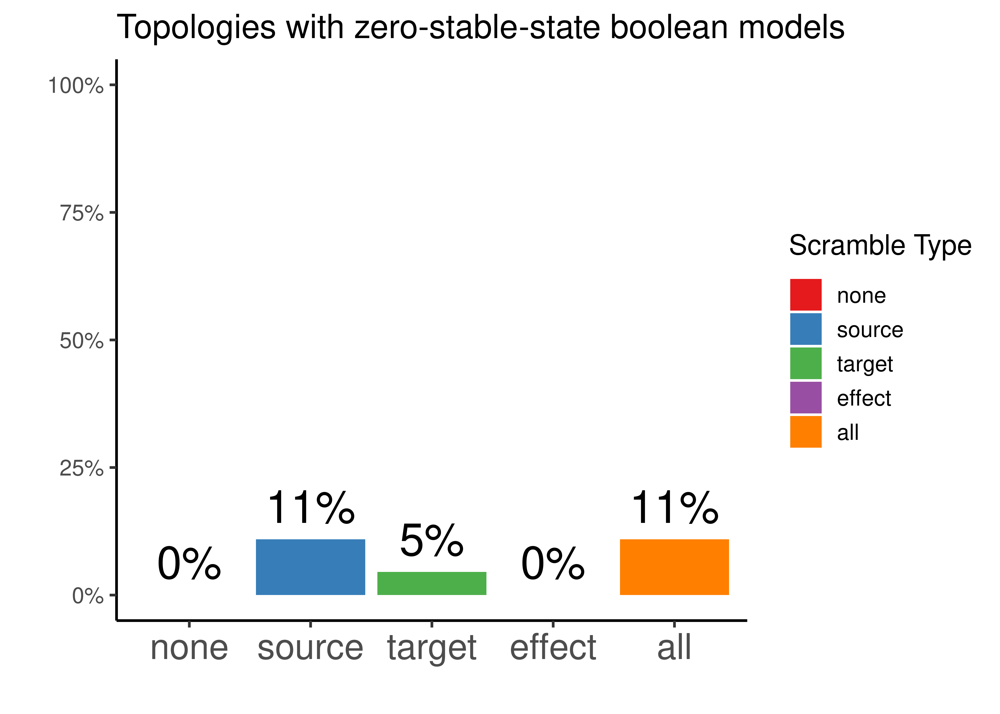
<p class="caption">(\#fig:zero-ss-topologies-fig)Percentage of topologies that did not have any boolean model with a stable state after simulations with Gitsbe ended. Every possible topology scrambling type is represented.</p>
</div>

:::{.green-box}
So potentially tweaking the **source nodes** of each edge in the curated topology, resulted in $11\%$ of the produced topologies to have a network configuration that wouldn't allow the existence of attractor stability in the explored link-operator parameterization space of the `Gitsbe` algorithm.
Tweaking the **target nodes** results in less topologies having this property ($5\%$).

Lastly, tweaking the **effect** (activation vs inhibition), we always get topologies that can be translated to boolean models with a stable state attractor.
:::

### Source Scrambling {-}

In the next figures, the red dot/point is the result from using the original/unscrambled/curated CASCADE 1.0 topology:


```r
ggpubr::ggscatter(data = scrambled_topo_res %>% 
    filter(scramble_type == 'source' | scramble_type == 'none', !is.na(roc_auc)), 
  x = "sim", y = "roc_auc", color = "scramble_type", palette = c('red', 'black'),
  xlab = "Similarity Score",
  title = "Source node Scrambling vs Performance (ROC)",
  ylab = "ROC AUC") +
  #, add = "reg.line", conf.int = TRUE,
  #add.params = list(color = "blue", fill = "lightgray"),
  #cor.coef = TRUE, cor.coeff.args = list(method = "kendall", label.y.npc = "top", size = 6, cor.coef.name = "tau") +
  ylim(c(0,1)) +
  geom_text(x = 0.95, y = 1, label = "CASCADE 1.0") +
  theme(plot.title = element_text(hjust = 0.5), legend.position = 'none')

ggpubr::ggscatter(data = scrambled_topo_res %>% 
    filter(scramble_type == 'source' | scramble_type == 'none', !is.na(pr_auc)), 
  x = "sim", y = "pr_auc", color = "scramble_type", palette = c('red', 'black'),
  xlab = "Similarity Score",
  title = "Source node Scrambling vs Performance (Precision-Recall)",
  ylab = "PR AUC") +
  #add = "reg.line", conf.int = TRUE,
  #add.params = list(color = "blue", fill = "lightgray"),
  #cor.coef = TRUE, cor.coeff.args = list(method = "kendall", label.y.npc = "top", size = 6, cor.coef.name = "tau")) +
  ylim(c(0,1)) +
  geom_text(x = 0.9, y = 0.91, label = "CASCADE 1.0") +
  theme(plot.title = element_text(hjust = 0.5), legend.position = 'none')
```

<div class="figure" style="text-align: center">
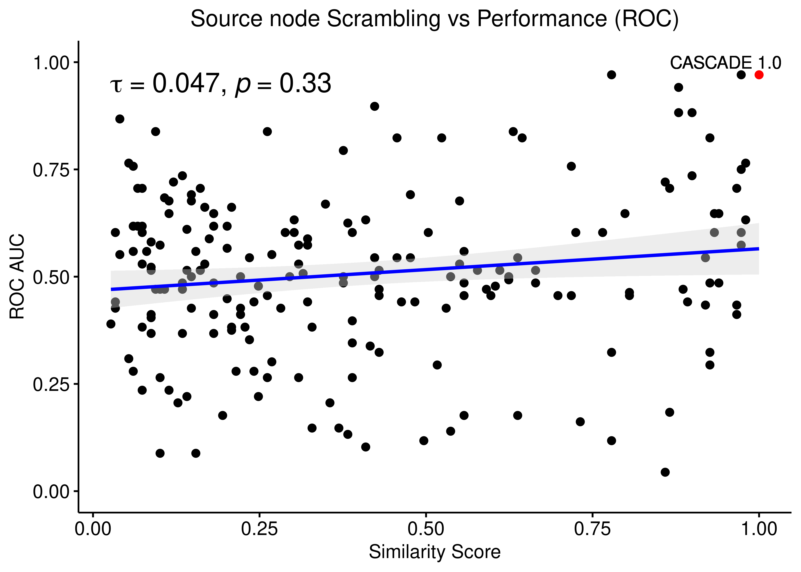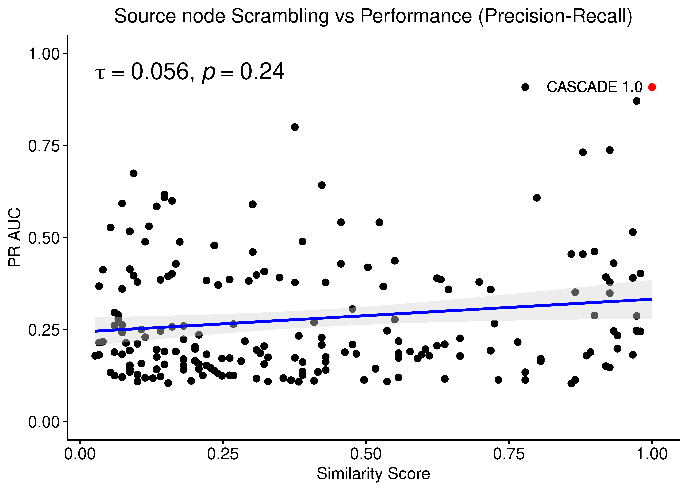
<p class="caption">(\#fig:src-scrambling-figs)Source node scrambling vs Performance (ROC and PR AUC)</p>
</div>

### Target Scrambling {-}


```r
ggpubr::ggscatter(data = scrambled_topo_res %>% 
    filter(scramble_type == 'target' | scramble_type == 'none', !is.na(roc_auc)), 
  x = "sim", y = "roc_auc", color = "scramble_type", palette = c('red', 'black'),
  xlab = "Similarity Score",
  title = "Target node Scrambling vs Performance (ROC)",
  ylab = "ROC AUC") +
  ylim(c(0,1)) +
  geom_text(x = 0.95, y = 1, label = "CASCADE 1.0") +
  theme(plot.title = element_text(hjust = 0.5), legend.position = 'none')

ggpubr::ggscatter(data = scrambled_topo_res %>% 
    filter(scramble_type == 'target' | scramble_type == 'none', !is.na(pr_auc)), 
  x = "sim", y = "pr_auc", color = "scramble_type", palette = c('red', 'black'),
  xlab = "Similarity Score",
  title = "Target node Scrambling vs Performance (Precision-Recall)",
  ylab = "PR AUC") +
  ylim(c(0,1)) +
  geom_text(x = 0.9, y = 0.91, label = "CASCADE 1.0") +
  theme(plot.title = element_text(hjust = 0.5), legend.position = 'none')
```

<div class="figure" style="text-align: center">
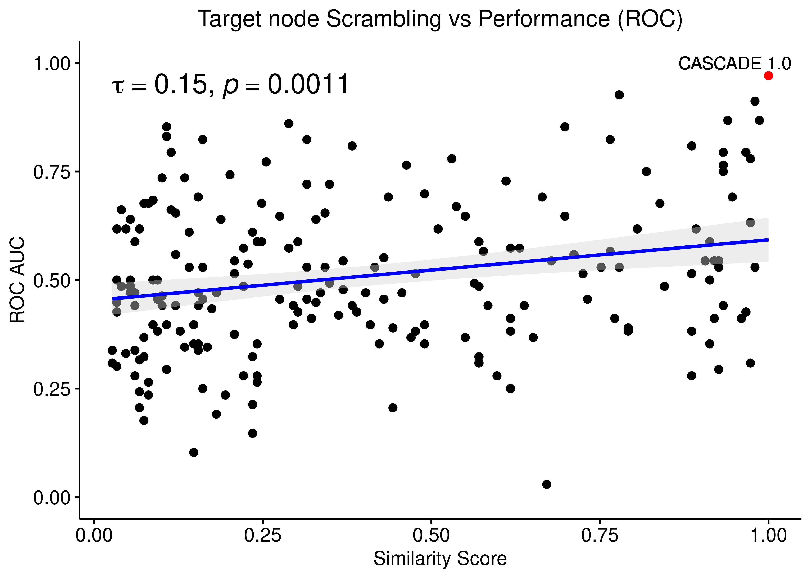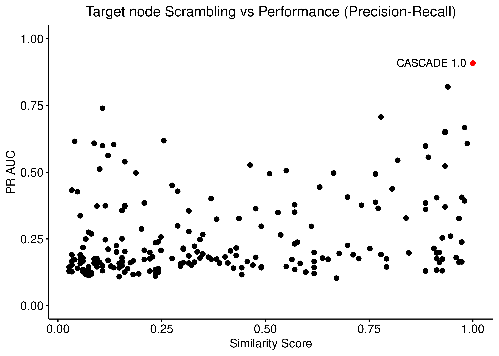
<p class="caption">(\#fig:trg-scrambling-figs)Target node scrambling vs Performance (ROC and PR AUC)</p>
</div>

### Sign Inversion {-}


```r
ggpubr::ggscatter(data = scrambled_topo_res %>% 
    filter(scramble_type == 'effect' | scramble_type == 'none', !is.na(roc_auc)), 
  x = "sim", y = "roc_auc", color = "scramble_type", palette = c('black', 'red'),
  xlab = "Similarity Score",
  title = "Sign Inversion vs Performance (ROC)",
  ylab = "ROC AUC") +
  ylim(c(0,1)) +
  geom_text(x = 0.9, y = 0.98, label = "CASCADE 1.0") +
  theme(plot.title = element_text(hjust = 0.5), legend.position = 'none')

ggpubr::ggscatter(data = scrambled_topo_res %>% 
    filter(scramble_type == 'effect' | scramble_type == 'none', !is.na(pr_auc)), 
  x = "sim", y = "pr_auc", color = "scramble_type", palette = c('black', 'red'),
  xlab = "Similarity Score",
  title = "Sign Inversion vs Performance (Precision-Recall)",
  ylab = "PR AUC") +
  ylim(c(0,1)) +
  geom_text(x = 0.9, y = 0.91, label = "CASCADE 1.0") +
  theme(plot.title = element_text(hjust = 0.5), legend.position = 'none')
```

<div class="figure" style="text-align: center">
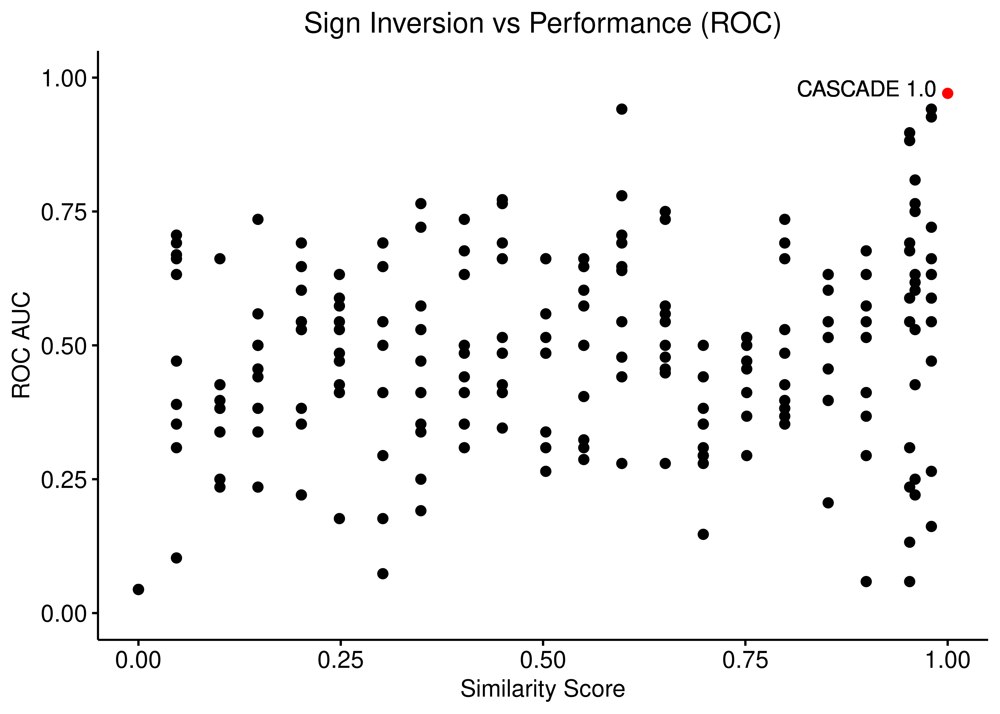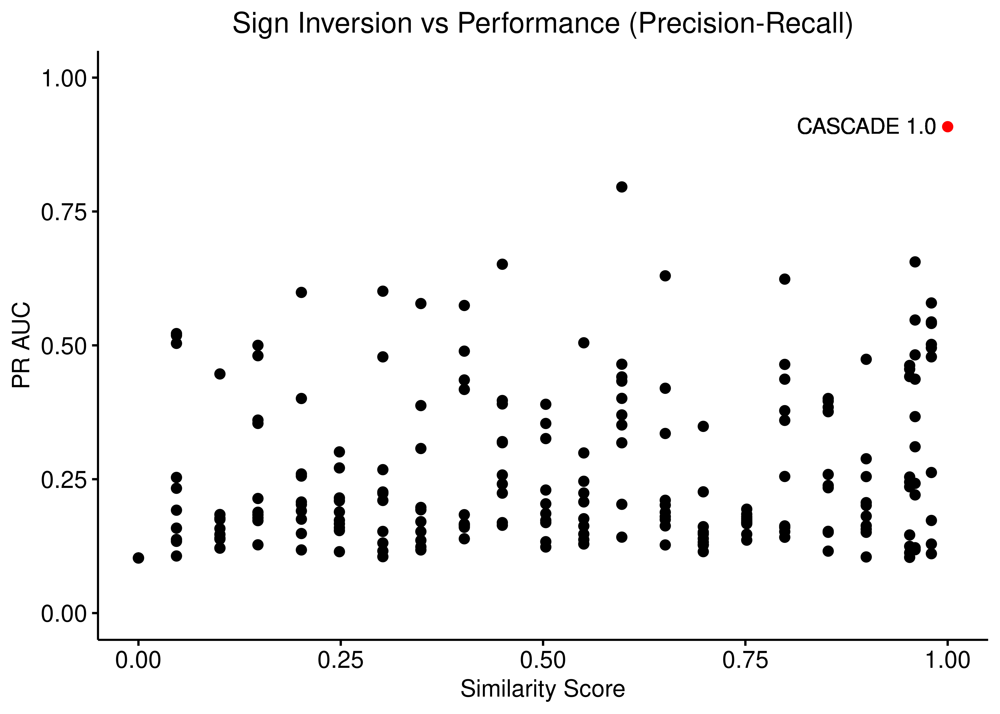
<p class="caption">(\#fig:sign-inv-figs)Sign Inversion vs Performance (ROC and PR AUC)</p>
</div>

### Source, Target Scrambling and Sign Inversion {-}


```r
ggpubr::ggscatter(data = scrambled_topo_res %>% 
    filter(scramble_type == 'all' | scramble_type == 'none', !is.na(roc_auc)), 
  x = "sim", y = "roc_auc", color = "scramble_type", palette = c('black', 'red'),
  xlab = "Similarity Score", 
  title = "All types of Scrambling vs Performance (ROC)",
  ylab = "ROC AUC") +
  ylim(c(0,1)) +
  geom_text(x = 0.95, y = 1, label = "CASCADE 1.0") +
  geom_hline(yintercept = 0.5, linetype = 'dashed', color = "red") +
  geom_text(aes(x = 0.92, y = 0.45, label = "Random (AUC = 0.5)"), color = '#377EB8') + 
  theme(plot.title = element_text(hjust = 0.5), legend.position = 'none')

ggpubr::ggscatter(data = scrambled_topo_res %>% 
    filter(scramble_type == 'all' | scramble_type == 'none', !is.na(pr_auc)), 
  x = "sim", y = "pr_auc", color = "scramble_type", palette = c('black', 'red'),
  xlab = "Similarity Score",
  title = "All types of Scrambling vs Performance (Precision-Recall)",
  ylab = "PR AUC") +
  ylim(c(0,1)) +
  geom_text(x = 0.9, y = 0.91, label = "CASCADE 1.0") +
  geom_hline(yintercept = sum(observed)/length(observed), linetype = 'dashed', color = "red") +
  geom_text(aes(x = 0.83, y = 0.08, label = "Random (AUC = 0.2)"), color = '#377EB8') + 
  theme(plot.title = element_text(hjust = 0.5), legend.position = 'none')
```

<div class="figure" style="text-align: center">
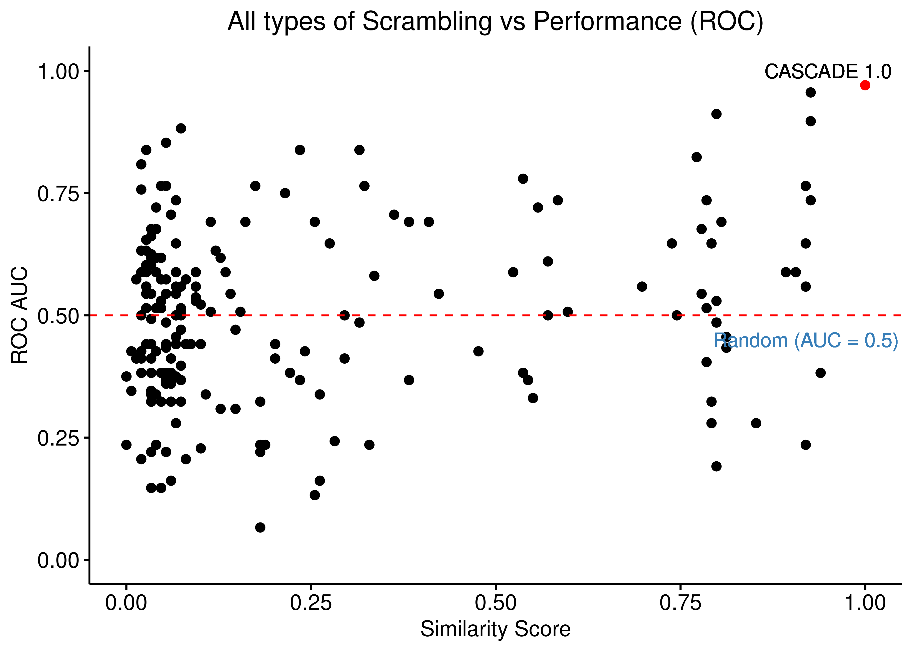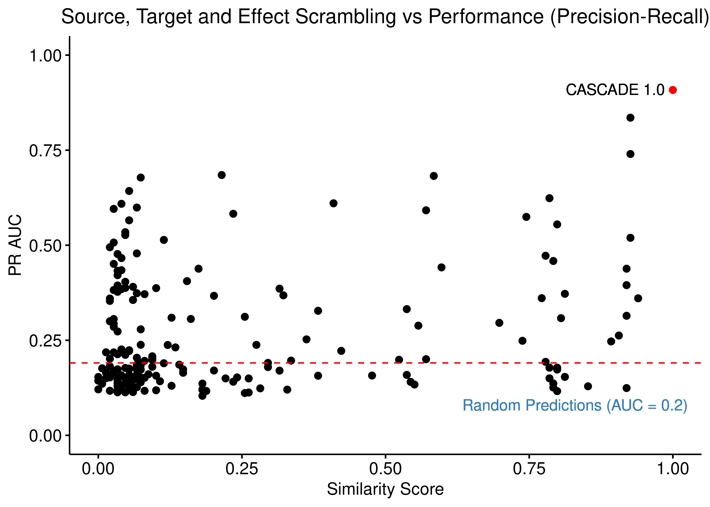
<p class="caption">(\#fig:all-scrambling-figs)Source, Target node scrambling and Sign Inversion vs Performance (ROC and PR AUC)</p>
</div>

### Bootstrap Calibrated Models + Boxplots {-#boot-ss-cascade1-curated}

:::{.blue-box}
Since almost **all scrambled results** (no matter the type of scrambling) **are worse than the results we got when using the curated/unscrambled CASCADE 1.0 topology**, we proceed to further generate bootstrap model predictions derived from the curated topology to assess if the results we had found weren't artifacts and/or outliers.

We generate a large pool of `gitsbe` models ($1000$ simulations => $3000$ models) and draw randomly a total of $50$ batches of $50$ models each and assess ROC and PR AUC performance for each one of these normalized to the random model predictions (see [above](#best-roc-and-prc)).
All these bootstrapped models will be part of one category called **Curated**.
The rest of the scrambled topology data (that we presented in scatter plots) will be split to multiple groups based on their similarity score (percentage of common edges with curated topology) and we will visualize the different groups with boxplots.

See more details on how to reproduce these simulation results [here](#boot-ss-cascade1-curated-reproduce).
:::

Load the bootstrap results and tidy up the data:

```r
# add the bootstrapped results of the curated topology to the scrambled results
scrambled_topo_res = readRDS(file = 'data/scrambled_topo_res_cascade1.rds')
boot_cascade1_res = readRDS(file = 'data/boot_cascade1_res.rds')

scrambled_topo_res = dplyr::bind_rows(scrambled_topo_res, boot_cascade1_res)

# group by similarity score
scrambled_topo_res = 
  scrambled_topo_res %>% mutate(grp = factor(x = 
    case_when(sim >= 0 & sim < 0.25 ~ '0 - 0.25', 
      sim >= 0.25 & sim < 0.5 ~ '0.25 - 0.5', 
      sim >= 0.5 & sim < 0.75 ~ '0.5 - 0.75', 
      sim >= 0.75 & sim < 0.85 ~ '0.75 - 0.85',
      sim >= 0.85 & sim < 0.95 ~ '0.85 - 0.95',
      sim >= 0.95 & sim < 1 ~ '0.95 - 1',
      sim == 1 ~ 'Curated'), 
  levels = c('0 - 0.25', '0.25 - 0.5', '0.5 - 0.75', 
    '0.75 - 0.85', '0.85 - 0.95','0.95 - 1', 'Curated')))
```


```r
# ROC results
scrambled_topo_res %>%
  filter(scramble_type == 'source' | scramble_type == 'none', !is.na(roc_auc)) %>%
  ggplot(aes(x = grp, y = roc_auc, fill = grp)) +
  geom_boxplot(show.legend = FALSE) +
  scale_fill_brewer(palette = 'Set1') +
  geom_jitter(shape = 20, position = position_jitter(0.2), show.legend = FALSE) +
  ylim(c(0,1)) +
  labs(x = 'Similarity Score to CASCADE 1.0 Topology', y = 'ROC AUC', 
    title = "Source Scrambling vs Performance (ROC)") +
  theme_classic(base_size = 14) +
  geom_hline(yintercept = 0.5, linetype = 'dashed', color = "red") +
  geom_text(aes(x = 6.7, y = 0.45, label = "Random (AUC = 0.5)")) + 
  theme(plot.title = element_text(hjust = 0.5))

# PR results
scrambled_topo_res %>% 
  filter(scramble_type == 'source' | scramble_type == 'none', !is.na(pr_auc)) %>%
  ggplot(aes(x = grp, y = pr_auc, fill = grp)) + 
  geom_boxplot(show.legend = FALSE) + 
  scale_fill_brewer(palette = 'Set1') +
  geom_jitter(shape = 20, position = position_jitter(0.2), show.legend = FALSE) +
  ylim(c(0,1)) +
  labs(x = 'Similarity Score to CASCADE 1.0 Topology', y = 'PR AUC', 
    title = "Source Scrambling vs Performance (Precision-Recall)") +
  theme_classic(base_size = 14) +
  geom_hline(yintercept = sum(observed)/length(observed), linetype = 'dashed', color = "red") +
  geom_text(aes(x = 6.7, y = 0.15, label = "Random (AUC = 0.2)")) + 
  theme(plot.title = element_text(hjust = 0.5))
```

<div class="figure" style="text-align: center">
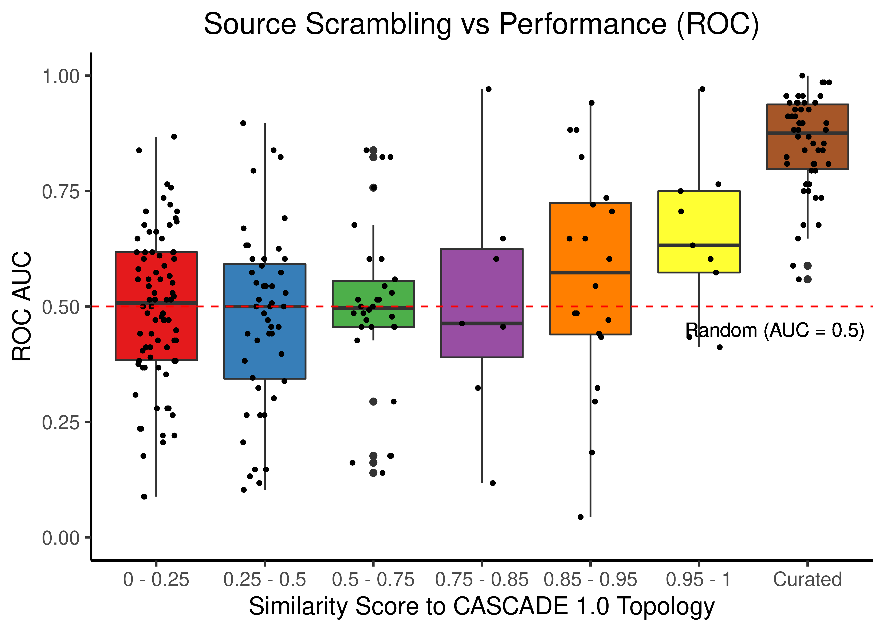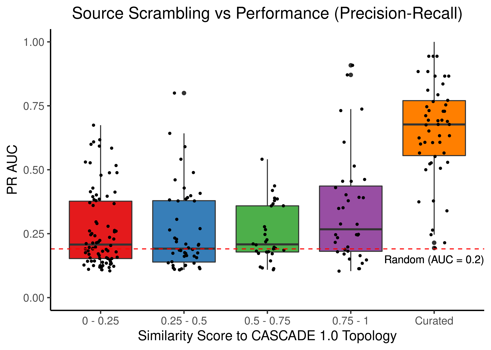
<p class="caption">(\#fig:src-scrambling-figs-2)Source node scrambling topologies + curated CASCADE 1.0 topology bootstrapped results (ROC and PR AUC)</p>
</div>


```r
# ROC results
scrambled_topo_res %>%
  filter(scramble_type == 'target' | scramble_type == 'none', !is.na(roc_auc)) %>%
  ggplot(aes(x = grp, y = roc_auc, fill = grp)) +
  geom_boxplot(show.legend = FALSE) +
  scale_fill_brewer(palette = 'Set1') +
  geom_jitter(shape = 20, position = position_jitter(0.2), show.legend = FALSE) +
  ylim(c(0,1)) +
  labs(x = 'Similarity Score to CASCADE 1.0 Topology', y = 'ROC AUC', 
    title = "Target Scrambling vs Performance (ROC)") +
  theme_classic(base_size = 14) +
  geom_hline(yintercept = 0.5, linetype = 'dashed', color = "red") +
  geom_text(aes(x = 6.7, y = 0.45, label = "Random (AUC = 0.5)")) + 
  theme(plot.title = element_text(hjust = 0.5))

# PR results
scrambled_topo_res %>% 
  filter(scramble_type == 'target' | scramble_type == 'none', !is.na(pr_auc)) %>%
  ggplot(aes(x = grp, y = pr_auc, fill = grp)) + 
  geom_boxplot(show.legend = FALSE) + 
  scale_fill_brewer(palette = 'Set1') +
  geom_jitter(shape = 20, position = position_jitter(0.2), show.legend = FALSE) +
  ylim(c(0,1)) +
  labs(x = 'Similarity Score to CASCADE 1.0 Topology', y = 'PR AUC', 
    title = "Target Scrambling vs Performance (Precision-Recall)") +
  theme_classic(base_size = 14) +
  geom_hline(yintercept = sum(observed)/length(observed), linetype = 'dashed', color = "red") +
  geom_text(aes(x = 6.7, y = 0.13, label = "Random (AUC = 0.2)")) + 
  theme(plot.title = element_text(hjust = 0.5))
```

<div class="figure" style="text-align: center">
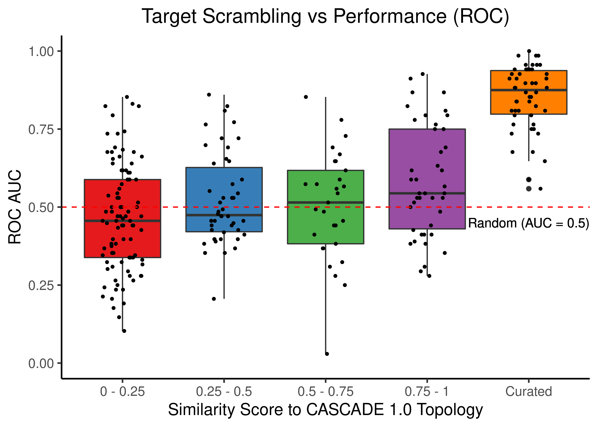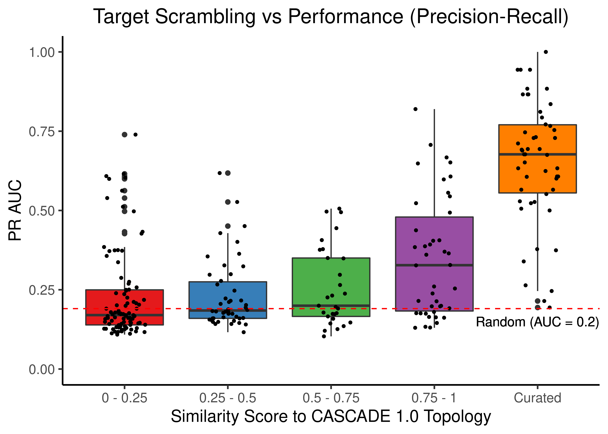
<p class="caption">(\#fig:trg-scrambling-figs-2)Target node scrambling topologies + curated CASCADE 1.0 topology bootstrapped results (ROC and PR AUC)</p>
</div>


```r
# ROC results
scrambled_topo_res %>%
  filter(scramble_type == 'effect' | scramble_type == 'none', !is.na(roc_auc)) %>%
  ggplot(aes(x = grp, y = roc_auc, fill = grp)) +
  geom_boxplot(show.legend = FALSE) +
  scale_fill_brewer(palette = 'Set1') +
  geom_jitter(shape = 20, position = position_jitter(0.2), show.legend = FALSE) +
  ylim(c(0,1)) +
  labs(x = 'Similarity Score to CASCADE 1.0 Topology', y = 'ROC AUC', 
    title = "Sign Inversion vs Performance (ROC)") +
  theme_classic(base_size = 14) +
  geom_hline(yintercept = 0.5, linetype = 'dashed', color = "red") +
  geom_text(aes(x = 6.7, y = 0.45, label = "Random (AUC = 0.5)")) + 
  theme(plot.title = element_text(hjust = 0.5))

# PR results
scrambled_topo_res %>% 
  filter(scramble_type == 'effect' | scramble_type == 'none', !is.na(pr_auc)) %>%
  ggplot(aes(x = grp, y = pr_auc, fill = grp)) + 
  geom_boxplot(show.legend = FALSE) + 
  scale_fill_brewer(palette = 'Set1') +
  geom_jitter(shape = 20, position = position_jitter(0.2), show.legend = FALSE) +
  ylim(c(0,1)) +
  labs(x = 'Similarity Score to CASCADE 1.0 Topology', y = 'PR AUC', 
    title = "Sign Inversion vs Performance (Precision-Recall)") +
  theme_classic(base_size = 14) +
  geom_hline(yintercept = sum(observed)/length(observed), linetype = 'dashed', color = "red") +
  geom_text(aes(x = 6.9, y = 0.15, label = "Random (AUC = 0.2)"), size = 3) + 
  theme(plot.title = element_text(hjust = 0.5))
```

<div class="figure" style="text-align: center">
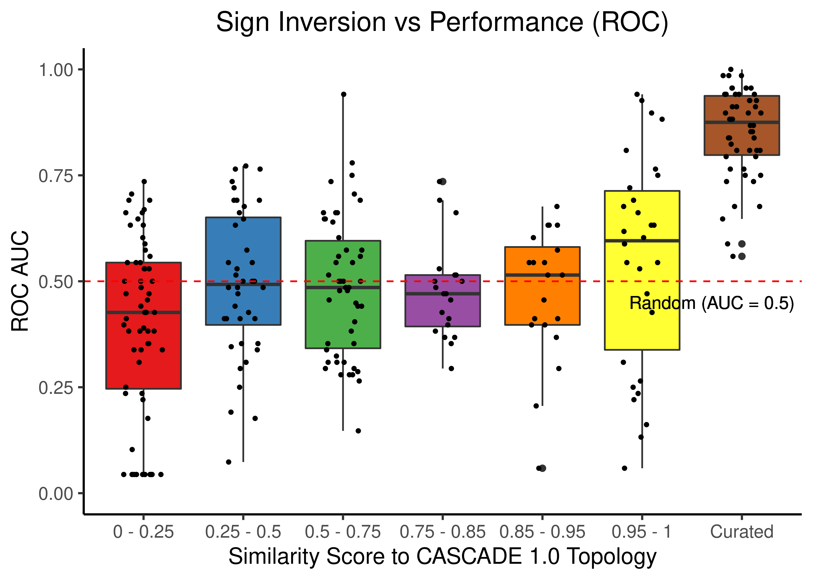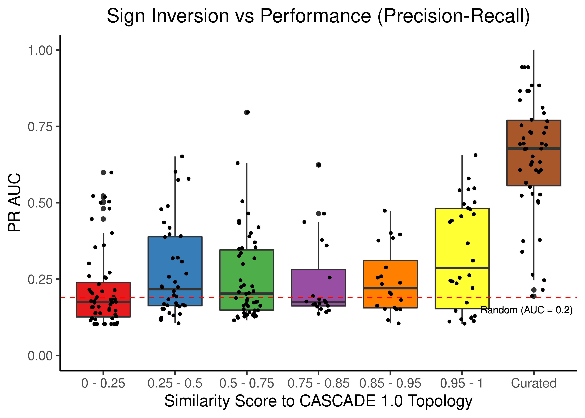
<p class="caption">(\#fig:sign-inv-scrambling-figs-2)Sign Inverted topologies + curated CASCADE 1.0 topology bootstrapped results (ROC and PR AUC)</p>
</div>


```r
# no data points in the (0.95-1) class
set1_cols = RColorBrewer::brewer.pal(n = 7, name = 'Set1')[c(1:5,7)]

# ROC results
scrambled_topo_res %>%
  filter(scramble_type == 'all' | scramble_type == 'none', !is.na(roc_auc)) %>%
  ggplot(aes(x = grp, y = roc_auc, fill = grp)) +
  geom_boxplot(show.legend = FALSE) +
  scale_fill_manual(values = set1_cols) +
  geom_jitter(shape = 20, position = position_jitter(0.2), show.legend = FALSE) +
  ylim(c(0,1)) +
  labs(x = 'Similarity Score to CASCADE 1.0 Topology', y = 'ROC AUC', 
    title = "All types of Scrambling vs Performance (ROC)") +
  theme_classic(base_size = 14) +
  geom_hline(yintercept = 0.5, linetype = 'dashed', color = "red") +
  geom_text(aes(x = 5.8, y = 0.45, label = "Random (AUC = 0.5)")) + 
  theme(plot.title = element_text(hjust = 0.5))

# PR results
scrambled_topo_res %>% 
  filter(scramble_type == 'all' | scramble_type == 'none', !is.na(pr_auc)) %>%
  ggplot(aes(x = grp, y = pr_auc, fill = grp)) + 
  geom_boxplot(show.legend = FALSE) + 
  scale_fill_manual(values = set1_cols) +
  geom_jitter(shape = 20, position = position_jitter(0.2), show.legend = FALSE) +
  ylim(c(0,1)) +
  labs(x = 'Similarity Score to CASCADE 1.0 Topology', y = 'PR AUC', 
    title = "All types of Scrambling vs Performance (Precision-Recall)") +
  theme_classic(base_size = 14) +
  geom_hline(yintercept = sum(observed)/length(observed), linetype = 'dashed', color = "red") +
  geom_text(aes(x = 5.8, y = 0.15, label = "Random (AUC = 0.2)")) + 
  theme(plot.title = element_text(hjust = 0.5))
```

<div class="figure" style="text-align: center">
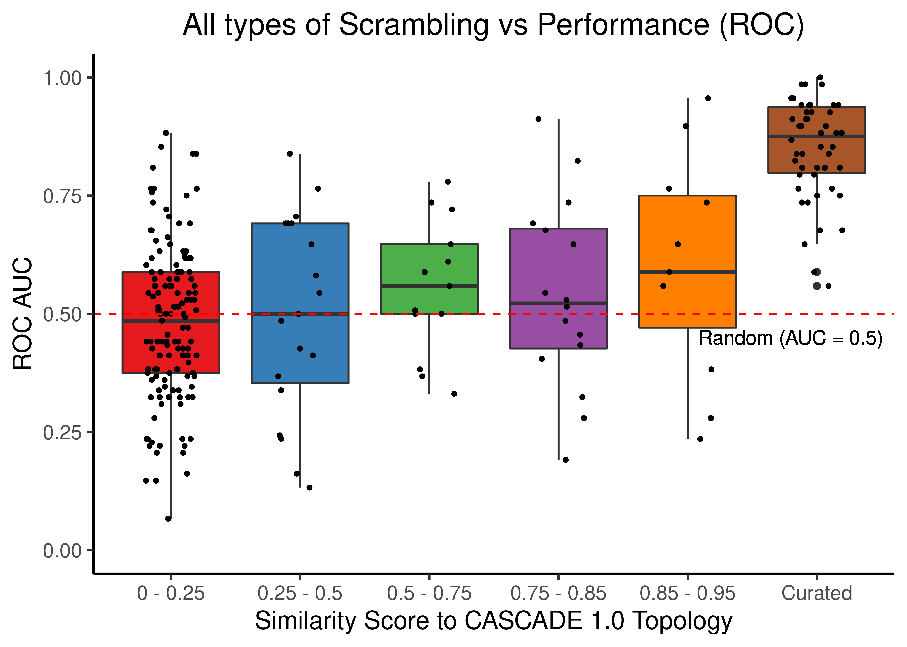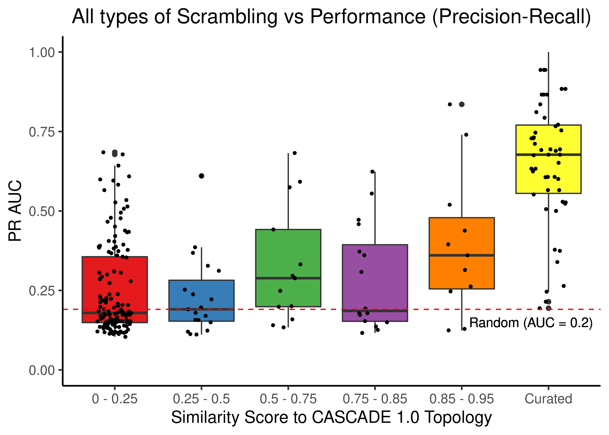
<p class="caption">(\#fig:all-scrambling-figs-2)Source, Target node scrambling and sign inverted topologies + CASCADE 1.0 topology bootstrapped results (ROC and PR AUC)</p>
</div>

:::{.green-box}
We observe that even **a small perturbation/violation/scrambling** of the curated topology (of any type) produces results close to random prediction that are significantly lower than the prediction results when using the curated CASCADE 1.0 topology.
:::

# CASCADE 2.0 Analysis (Link Operator Mutations) {-}

:::{.blue-box}
Performance of automatically parameterized models against SINTEF dataset [@Flobak2019]
:::

## HSA results {-}

:::{.note}
- *HSA* refers to the synergy method used in `Drabme` to assess the synergies from the `gitsbe` models
- We test performance using ROC and PR AUC for both the *ensemble-wise* and *model-wise* synergies from `Drabme`
- **Calibrated** models: fitted to steady state ($50,100,150,200$ simulations)
- **Random** models: fitted to [proliferation profile](https://druglogics.github.io/druglogics-doc/training-data.html#unperturbed-condition---globaloutput-response) ($150$ simulations)
- `Gitsbe` models have mutations on **link operator** only
:::

Load results:


```r
# 'ss' => calibrated models, 'prolif' => random models
# 'ew' => ensemble-wise, 'mw' => model-wise

## HSA results
ss_hsa_ensemblewise_50sim_file = paste0("results/link-only/cascade_2.0_ss_50sim_fixpoints_hsa_ensemblewise_synergies.tab")
ss_hsa_modelwise_50sim_file = paste0("results/link-only/cascade_2.0_ss_50sim_fixpoints_hsa_modelwise_synergies.tab")
ss_hsa_ensemblewise_100sim_file = paste0("results/link-only/cascade_2.0_ss_100sim_fixpoints_hsa_ensemblewise_synergies.tab")
ss_hsa_modelwise_100sim_file = paste0("results/link-only/cascade_2.0_ss_100sim_fixpoints_hsa_modelwise_synergies.tab")
ss_hsa_ensemblewise_150sim_file = paste0("results/link-only/cascade_2.0_ss_150sim_fixpoints_hsa_ensemblewise_synergies.tab")
ss_hsa_modelwise_150sim_file = paste0("results/link-only/cascade_2.0_ss_150sim_fixpoints_hsa_modelwise_synergies.tab")
ss_hsa_ensemblewise_200sim_file = paste0("results/link-only/cascade_2.0_ss_200sim_fixpoints_hsa_ensemblewise_synergies.tab")
ss_hsa_modelwise_200sim_file = paste0("results/link-only/cascade_2.0_ss_200sim_fixpoints_hsa_modelwise_synergies.tab")
prolif_hsa_ensemblewise_file = paste0("results/link-only/cascade_2.0_rand_150sim_fixpoints_hsa_ensemblewise_synergies.tab")
prolif_hsa_modelwise_file = paste0("results/link-only/cascade_2.0_rand_150sim_fixpoints_hsa_modelwise_synergies.tab")

ss_hsa_ensemblewise_synergies_50sim = emba::get_synergy_scores(ss_hsa_ensemblewise_50sim_file)
ss_hsa_modelwise_synergies_50sim = emba::get_synergy_scores(ss_hsa_modelwise_50sim_file, file_type = "modelwise")
ss_hsa_ensemblewise_synergies_100sim = emba::get_synergy_scores(ss_hsa_ensemblewise_100sim_file)
ss_hsa_modelwise_synergies_100sim = emba::get_synergy_scores(ss_hsa_modelwise_100sim_file, file_type = "modelwise")
ss_hsa_ensemblewise_synergies_150sim = emba::get_synergy_scores(ss_hsa_ensemblewise_150sim_file)
ss_hsa_modelwise_synergies_150sim = emba::get_synergy_scores(ss_hsa_modelwise_150sim_file, file_type = "modelwise")
ss_hsa_ensemblewise_synergies_200sim = emba::get_synergy_scores(ss_hsa_ensemblewise_200sim_file)
ss_hsa_modelwise_synergies_200sim = emba::get_synergy_scores(ss_hsa_modelwise_200sim_file, file_type = "modelwise")
prolif_hsa_ensemblewise_synergies_150sim = emba::get_synergy_scores(prolif_hsa_ensemblewise_file)
prolif_hsa_modelwise_synergies_150sim = emba::get_synergy_scores(prolif_hsa_modelwise_file, file_type = "modelwise")

# calculate probability of synergy in the modelwise results
ss_hsa_modelwise_synergies_50sim = ss_hsa_modelwise_synergies_50sim %>% 
  mutate(synergy_prob_ss = synergies/(synergies + `non-synergies`))
ss_hsa_modelwise_synergies_100sim = ss_hsa_modelwise_synergies_100sim %>% 
  mutate(synergy_prob_ss = synergies/(synergies + `non-synergies`))
ss_hsa_modelwise_synergies_150sim = ss_hsa_modelwise_synergies_150sim %>% 
  mutate(synergy_prob_ss = synergies/(synergies + `non-synergies`))
ss_hsa_modelwise_synergies_200sim = ss_hsa_modelwise_synergies_200sim %>% 
  mutate(synergy_prob_ss = synergies/(synergies + `non-synergies`))
prolif_hsa_modelwise_synergies_150sim = prolif_hsa_modelwise_synergies_150sim %>%
  mutate(synergy_prob_prolif = synergies/(synergies + `non-synergies`))

observed_synergies_file = 'data/observed_synergies_cascade_2.0'
observed_synergies = emba::get_observed_synergies(observed_synergies_file)
# 1 (positive/observed synergy) or 0 (negative/not observed) for all tested drug combinations
observed = sapply(prolif_hsa_modelwise_synergies_150sim$perturbation %in% observed_synergies, as.integer)

# 'ew' => ensemble-wise, 'mw' => model-wise
pred_ew_hsa = bind_cols(
  ss_hsa_ensemblewise_synergies_50sim %>% select(score) %>% rename(ss_score_50sim = score),
  ss_hsa_ensemblewise_synergies_100sim %>% select(score) %>% rename(ss_score_100sim = score),
  ss_hsa_ensemblewise_synergies_150sim %>% select(score) %>% rename(ss_score_150sim = score),
  ss_hsa_ensemblewise_synergies_200sim %>% select(score) %>% rename(ss_score_200sim = score),
  prolif_hsa_ensemblewise_synergies_150sim %>% select(score) %>% rename(prolif_score_150sim = score),
  as_tibble_col(observed, column_name = "observed"))

pred_mw_hsa = bind_cols(
  ss_hsa_modelwise_synergies_50sim %>% select(perturbation, synergy_prob_ss) %>% rename(synergy_prob_ss_50sim = synergy_prob_ss),
  ss_hsa_modelwise_synergies_100sim %>% select(synergy_prob_ss) %>% rename(synergy_prob_ss_100sim = synergy_prob_ss),
  ss_hsa_modelwise_synergies_150sim %>% select(synergy_prob_ss) %>% rename(synergy_prob_ss_150sim = synergy_prob_ss),
  ss_hsa_modelwise_synergies_200sim %>% select(synergy_prob_ss) %>% rename(synergy_prob_ss_200sim = synergy_prob_ss),
  prolif_hsa_modelwise_synergies_150sim %>% select(synergy_prob_prolif) %>% rename(synergy_prob_prolif_150sim = synergy_prob_prolif),
  as_tibble_col(observed, column_name = "observed"))
```

### ROC curves {-}


```r
res_ss_ew_50sim = get_roc_stats(df = pred_ew_hsa, pred_col = "ss_score_50sim", label_col = "observed")
res_ss_ew_100sim = get_roc_stats(df = pred_ew_hsa, pred_col = "ss_score_100sim", label_col = "observed")
res_ss_ew_150sim = get_roc_stats(df = pred_ew_hsa, pred_col = "ss_score_150sim", label_col = "observed")
res_ss_ew_200sim = get_roc_stats(df = pred_ew_hsa, pred_col = "ss_score_200sim", label_col = "observed")
res_prolif_ew_150sim = get_roc_stats(df = pred_ew_hsa, pred_col = "prolif_score_150sim", label_col = "observed")

res_ss_mw_50sim = get_roc_stats(df = pred_mw_hsa, pred_col = "synergy_prob_ss_50sim", label_col = "observed", direction = ">")
res_ss_mw_100sim = get_roc_stats(df = pred_mw_hsa, pred_col = "synergy_prob_ss_100sim", label_col = "observed", direction = ">")
res_ss_mw_150sim = get_roc_stats(df = pred_mw_hsa, pred_col = "synergy_prob_ss_150sim", label_col = "observed", direction = ">")
res_ss_mw_200sim = get_roc_stats(df = pred_mw_hsa, pred_col = "synergy_prob_ss_200sim", label_col = "observed", direction = ">")
res_prolif_mw_150sim = get_roc_stats(df = pred_mw_hsa, pred_col = "synergy_prob_prolif_150sim", label_col = "observed", direction = ">")

# Plot ROCs
plot(x = res_ss_ew_50sim$roc_stats$FPR, y = res_ss_ew_50sim$roc_stats$TPR,
  type = 'l', lwd = 3, col = my_palette[1], main = 'ROC curve, Ensemble-wise synergies (HSA)',
  xlab = 'False Positive Rate (FPR)', ylab = 'True Positive Rate (TPR)')
lines(x = res_ss_ew_100sim$roc_stats$FPR, y = res_ss_ew_100sim$roc_stats$TPR, 
  lwd = 3, col = my_palette[2])
lines(x = res_ss_ew_150sim$roc_stats$FPR, y = res_ss_ew_150sim$roc_stats$TPR, 
  lwd = 3, col = my_palette[3])
lines(x = res_ss_ew_200sim$roc_stats$FPR, y = res_ss_ew_200sim$roc_stats$TPR, 
  lwd = 3, col = my_palette[4])
lines(x = res_prolif_ew_150sim$roc_stats$FPR, y = res_prolif_ew_150sim$roc_stats$TPR, 
  lwd = 3, col = my_palette[5])
legend('bottomright', title = 'AUC', col = my_palette[1:5], pch = 19,
  legend = c(paste(round(res_ss_ew_50sim$AUC, digits = 3), "Calibrated (50 sim)"),
    paste(round(res_ss_ew_100sim$AUC, digits = 3), "Calibrated (100 sim)"),
    paste(round(res_ss_ew_150sim$AUC, digits = 3), "Calibrated (150 sim)"),
    paste(round(res_ss_ew_200sim$AUC, digits = 3), "Calibrated (200 sim)"),
    paste(round(res_prolif_ew_150sim$AUC, digits = 3), "Random (150 sim)")))
grid(lwd = 0.5)
abline(a = 0, b = 1, col = 'lightgrey', lty = 'dotdash', lwd = 1.2)

plot(x = res_ss_mw_50sim$roc_stats$FPR, y = res_ss_mw_50sim$roc_stats$TPR,
  type = 'l', lwd = 3, col = my_palette[1], main = 'ROC curve, Model-wise synergies (HSA)',
  xlab = 'False Positive Rate (FPR)', ylab = 'True Positive Rate (TPR)')
lines(x = res_ss_mw_100sim$roc_stats$FPR, y = res_ss_mw_100sim$roc_stats$TPR, 
  lwd = 3, col = my_palette[2])
lines(x = res_ss_mw_150sim$roc_stats$FPR, y = res_ss_mw_150sim$roc_stats$TPR, 
  lwd = 3, col = my_palette[3])
lines(x = res_ss_mw_200sim$roc_stats$FPR, y = res_ss_mw_200sim$roc_stats$TPR, 
  lwd = 3, col = my_palette[4])
lines(x = res_prolif_mw_150sim$roc_stats$FPR, y = res_prolif_mw_150sim$roc_stats$TPR, 
  lwd = 3, col = my_palette[5])
legend('bottomright', title = 'AUC', col = my_palette[1:5], pch = 19,
  legend = c(paste(round(res_ss_mw_50sim$AUC, digits = 3), "Calibrated (50 sim)"),
    paste(round(res_ss_mw_100sim$AUC, digits = 3), "Calibrated (100 sim)"),
    paste(round(res_ss_mw_150sim$AUC, digits = 3), "Calibrated (150 sim)"),
    paste(round(res_ss_mw_200sim$AUC, digits = 3), "Calibrated (200 sim)"),
    paste(round(res_prolif_mw_150sim$AUC, digits = 3), "Random (150 sim)")))
grid(lwd = 0.5)
abline(a = 0, b = 1, col = 'lightgrey', lty = 'dotdash', lwd = 1.2)
```

<div class="figure" style="text-align: center">

<p class="caption">(\#fig:roc-hsa-cascade2)ROC curves (CASCADE 2.0, HSA synergy method)</p>
</div>

### PR curves {-}


```r
pr_ss_ew_hsa_50sim = pr.curve(scores.class0 = pred_ew_hsa %>% pull(ss_score_50sim) %>% (function(x) {-x}), 
  weights.class0 = pred_ew_hsa %>% pull(observed), curve = TRUE, rand.compute = TRUE)
pr_ss_ew_hsa_100sim = pr.curve(scores.class0 = pred_ew_hsa %>% pull(ss_score_100sim) %>% (function(x) {-x}), 
  weights.class0 = pred_ew_hsa %>% pull(observed), curve = TRUE)
pr_ss_ew_hsa_150sim = pr.curve(scores.class0 = pred_ew_hsa %>% pull(ss_score_150sim) %>% (function(x) {-x}), 
  weights.class0 = pred_ew_hsa %>% pull(observed), curve = TRUE)
pr_ss_ew_hsa_200sim = pr.curve(scores.class0 = pred_ew_hsa %>% pull(ss_score_200sim) %>% (function(x) {-x}), 
  weights.class0 = pred_ew_hsa %>% pull(observed), curve = TRUE)
pr_prolif_ew_hsa_150sim = pr.curve(scores.class0 = pred_ew_hsa %>% pull(prolif_score_150sim) %>% (function(x) {-x}), 
  weights.class0 = pred_ew_hsa %>% pull(observed), curve = TRUE)

pr_ss_mw_hsa_50sim = pr.curve(scores.class0 = pred_mw_hsa %>% pull(synergy_prob_ss_50sim), 
  weights.class0 = pred_mw_hsa %>% pull(observed), curve = TRUE, rand.compute = TRUE)
pr_ss_mw_hsa_100sim = pr.curve(scores.class0 = pred_mw_hsa %>% pull(synergy_prob_ss_100sim), 
  weights.class0 = pred_mw_hsa %>% pull(observed), curve = TRUE)
pr_ss_mw_hsa_150sim = pr.curve(scores.class0 = pred_mw_hsa %>% pull(synergy_prob_ss_150sim), 
  weights.class0 = pred_mw_hsa %>% pull(observed), curve = TRUE)
pr_ss_mw_hsa_200sim = pr.curve(scores.class0 = pred_mw_hsa %>% pull(synergy_prob_ss_200sim), 
  weights.class0 = pred_mw_hsa %>% pull(observed), curve = TRUE)
pr_prolif_mw_hsa_150sim = pr.curve(scores.class0 = pred_mw_hsa %>% pull(synergy_prob_prolif_150sim), 
  weights.class0 = pred_mw_hsa %>% pull(observed), curve = TRUE)

plot(pr_ss_ew_hsa_50sim, main = 'PR curve, Ensemble-wise synergies (HSA)', 
  auc.main = FALSE, color = my_palette[1], rand.plot = TRUE)
plot(pr_ss_ew_hsa_100sim, add = TRUE, color = my_palette[2])
plot(pr_ss_ew_hsa_150sim, add = TRUE, color = my_palette[3])
plot(pr_ss_ew_hsa_200sim, add = TRUE, color = my_palette[4])
plot(pr_prolif_ew_hsa_150sim, add = TRUE, color = my_palette[5])
legend('topright', title = 'AUC', col = my_palette[1:5], pch = 19,
  legend = c(paste(round(pr_ss_ew_hsa_50sim$auc.davis.goadrich, digits = 3), "Calibrated (50 sim)"),
    paste(round(pr_ss_ew_hsa_100sim$auc.davis.goadrich, digits = 3), "Calibrated (100 sim)"),
    paste(round(pr_ss_ew_hsa_150sim$auc.davis.goadrich, digits = 3), "Calibrated (150 sim)"),
    paste(round(pr_ss_ew_hsa_200sim$auc.davis.goadrich, digits = 3), "Calibrated (200 sim)"),
    paste(round(pr_prolif_ew_hsa_150sim$auc.davis.goadrich, digits = 3), "Random (150 sim)")))
grid(lwd = 0.5)

plot(pr_ss_mw_hsa_50sim, main = 'PR curve, Model-wise synergies (HSA)',
  auc.main = FALSE, color = my_palette[1], rand.plot = TRUE)
plot(pr_ss_mw_hsa_100sim, add = TRUE, color = my_palette[2])
plot(pr_ss_mw_hsa_150sim, add = TRUE, color = my_palette[3])
plot(pr_ss_mw_hsa_200sim, add = TRUE, color = my_palette[4])
plot(pr_prolif_mw_hsa_150sim, add = TRUE, color = my_palette[5])
legend('topright', title = 'AUC', col = my_palette[1:5], pch = 19,
  legend = c(paste(round(pr_ss_mw_hsa_50sim$auc.davis.goadrich, digits = 3), "Calibrated (50 sim)"),
    paste(round(pr_ss_mw_hsa_100sim$auc.davis.goadrich, digits = 3), "Calibrated (100 sim)"),
    paste(round(pr_ss_mw_hsa_150sim$auc.davis.goadrich, digits = 3), "Calibrated (150 sim)"),
    paste(round(pr_ss_mw_hsa_200sim$auc.davis.goadrich, digits = 3), "Calibrated (200 sim)"),
    paste(round(pr_prolif_mw_hsa_150sim$auc.davis.goadrich, digits = 3), "Random (200 sim)")))
grid(lwd = 0.5)
```

<div class="figure" style="text-align: center">

<p class="caption">(\#fig:pr-hsa-cascade2)PR curves (CASCADE 2.0, HSA synergy method)</p>
</div>

:::{.green-box}
- To minimize the resulting performance variance, $150$ seems to be a good number of `Gitsbe` simulations to run for the CASCADE 2.0 network.
- The PR curves show that the **performance of each individual predictor is poor** compared to the baseline.
Someone looking at the ROC curves only, might reach a different conclusion.
- *Random* models perform almost equally well to *calibrated* models.
- The *model-wise* approach produces slightly better ROC results than the *ensemble-wise* approach
:::

### AUC sensitivity {-}

Investigate same thing as described in [here](#auc-sensitivity).
This is very crucial since the PR performance is poor for the individual predictors, but a combined predictor might be able to counter this.
We will combine the synergy scores from the *random proliferative* simulations with the results from the *calibrated* Gitsbe simulations (using the results from the $150$ simulation runs).


```r
# Ensemble-wise
betas = seq(from = -7.5, to = 7.5, by = 0.1)

prolif_roc = sapply(betas, function(beta) {
  pred_ew_hsa = pred_ew_hsa %>% mutate(combined_score = ss_score_150sim + beta * prolif_score_150sim)
  res = roc.curve(scores.class0 = pred_ew_hsa %>% pull(combined_score) %>% (function(x) {-x}), 
    weights.class0 = pred_ew_hsa %>% pull(observed))
  auc_value = res$auc
})

prolif_pr = sapply(betas, function(beta) {
  pred_ew_hsa = pred_ew_hsa %>% mutate(combined_score = ss_score_150sim + beta * prolif_score_150sim)
  res = pr.curve(scores.class0 = pred_ew_hsa %>% pull(combined_score) %>% (function(x) {-x}), 
    weights.class0 = pred_ew_hsa %>% pull(observed))
  auc_value = res$auc.davis.goadrich
})

df_ew = as_tibble(cbind(betas, prolif_roc, prolif_pr))
df_ew = df_ew %>% tidyr::pivot_longer(-betas, names_to = "type", values_to = "AUC")

ggline(data = df_ew, x = "betas", y = "AUC", numeric.x.axis = TRUE, color = "type",
  plot_type = "l", xlab = TeX("$\\beta$"), ylab = "AUC (Area Under Curve)", 
  legend = "none", facet.by = "type", palette = my_palette,
  panel.labs = list(type = c("Precision-Recall", "ROC")),
  title = TeX("AUC sensitivity to $\\beta$ parameter (HSA, CASCADE 2.0)")) + 
  theme(plot.title = element_text(hjust = 0.5)) +
  geom_vline(xintercept = 0) +
  geom_vline(xintercept = -1, color = "black", size = 0.3, linetype = "dashed") + 
  geom_text(aes(x=-1.5, label="β = -1", y=0.25), colour="black", angle=90) +
  grids()
```

<div class="figure" style="text-align: center">

<p class="caption">(\#fig:auc-sen-ew-hsa-cascade2)AUC sensitivity (CASCADE 2.0, HSA synergy method, Ensemble-wise results)</p>
</div>


```r
# Model-wise
weights = seq(from = 0, to = 1, by = 0.05)

prolif_roc_mw = sapply(weights, function(w) {
  pred_mw_hsa = pred_mw_hsa %>%
    mutate(weighted_prob = (1 - w) * pred_mw_hsa$synergy_prob_ss_150sim + w * pred_mw_hsa$synergy_prob_prolif_150sim)
  res = roc.curve(scores.class0 = pred_mw_hsa %>% pull(weighted_prob),
    weights.class0 = pred_mw_hsa %>% pull(observed))
  auc_value = res$auc
})

prolif_pr_mw = sapply(weights, function(w) {
  pred_mw_hsa = pred_mw_hsa %>% 
    mutate(weighted_prob = (1 - w) * pred_mw_hsa$synergy_prob_ss_150sim + w * pred_mw_hsa$synergy_prob_prolif_150sim)
  res = pr.curve(scores.class0 = pred_mw_hsa %>% pull(weighted_prob), 
    weights.class0 = pred_mw_hsa %>% pull(observed))
  auc_value = res$auc.davis.goadrich
})

df_mw = as_tibble(cbind(weights, prolif_roc_mw, prolif_pr_mw))
df_mw = df_mw %>% tidyr::pivot_longer(-weights, names_to = "type", values_to = "AUC")

ggline(data = df_mw, x = "weights", y = "AUC", numeric.x.axis = TRUE, color = "type",
  plot_type = "l", xlab = TeX("weight $w$"), ylab = "AUC (Area Under Curve)", 
  legend = "none", facet.by = "type", palette = my_palette,
  panel.labs = list(type = c("Precision-Recall", "ROC")), title.position = "center",
  title = TeX("AUC sensitivity to weighted average score (HSA, CASCADE 2.0)")) + 
  theme(plot.title = element_text(hjust = 0.5)) +
  grids()
```

<div class="figure" style="text-align: center">

<p class="caption">(\#fig:auc-sen-mw-hsa-cascade2)AUC sensitivity (CASCADE 2.0, HSA synergy method, Model-wise results)</p>
</div>

:::{.green-box}
- No added benefit when using the *model-wise* approach.
- The proliferative models seem to add a small contribution to the calibrated models performance (right panel ensemble-wise results => ROC-AUC increases, PR-AUC is insignificantly changed nonetheless).
- The $\beta_{best}$ that maximizes the ROC and PR AUC for the **combination of random and calibrated models** and is equal to $\beta_{best}=-0.3$.
For $\beta=-1$ we do not observe performance improvement in this case.
:::

### Logistic Regression Analysis {-}

We tried fitting a model using logistic regression as a different approach to combine/augment the results from calibrated simulations with the random proliferative ones (for the HSA-assessed ensemble-wise results where there was a minimal benefit).


```r
model = glm(formula = observed ~ ss_score_150sim + prolif_score_150sim - 1, data = pred_ew_hsa, family = binomial())
model_tidy = broom::tidy(model)
coef1 = model_tidy %>% filter(term == "ss_score_150sim") %>% pull(estimate)
coef2 = model_tidy %>% filter(term == "prolif_score_150sim") %>% pull(estimate)
pred_ew_hsa = pred_ew_hsa %>% mutate(glm = coef1 * ss_score_150sim + coef2 * prolif_score_150sim)
res_roc = get_roc_stats(df = pred_ew_hsa, pred_col = "glm", label_col = "observed")
res_pr = pr.curve(scores.class0 = pred_ew_hsa %>% pull(glm) %>% (function(x) {-x}), weights.class0 = pred_ew_hsa %>% pull(observed))
```

The model with the coefficients is as follows (note that adding an intercept makes ROC AUC result considerably worse):

```r
extract_eq(model, use_coefs = TRUE)
```

$$
\log\left[ \frac { P( \operatorname{observed} = \operatorname{1} ) }{ 1 - P( \operatorname{observed} = \operatorname{1} ) } \right] = -10.63(\operatorname{ss\_score\_150sim}) + 42.92(\operatorname{prolif\_score\_150sim}) + \epsilon
$$

:::{.orange-box}
The ROC AUC produced with a logistic regression model is lower than the calibrated models (with $150$ Gitsbe simulations): **0.5782313** (PR-AUC is also lower: **0.0527052**).
:::

### Regularized Logistic Regression Analysis {-}

Because the coefficient values found from the above approach are large, we try a regularized logistic regression approach using the `glmnet` R package [@R-glmnet].
We cross validate the $\lambda$ parameter and try with different $\alpha \in [0,1]$ ($\alpha=0$ means Ridge regression, $\alpha=1$ means LASSO, in between means Elastic net) while either minimizing the missclassification error (`type.measure="class"`) or maximizing the ROC-AUC (`type.measure = "auc"`).
For each respective $\alpha$ we choose the $\lambda_{min}$ as the one the minimizes the average CV error.
The intercept was again excluded as it resulted in worse AUC performance.


```r
x = pred_ew_hsa %>% select(ss_score_150sim, prolif_score_150sim) %>% as.matrix()
y = pred_ew_hsa %>% pull(observed)

data_list = list()
index = 1
for (i in 0:10) { # from Ridge to LASSO
  a = i/10
  for (measure in c("auc", "class")) {
    set.seed(42) # for reproducibility
    cvfit = cv.glmnet(x, y, family = "binomial", type.measure = measure, intercept = FALSE, alpha = a)
    coef_mat = coef(cvfit, s = "lambda.min")
    pred_ew_hsa = pred_ew_hsa %>% mutate(glm_reg = coef_mat[1] + coef_mat[2] * ss_score_150sim + coef_mat[3] * prolif_score_150sim)
    res_roc = get_roc_stats(df = pred_ew_hsa, pred_col = "glm_reg", label_col = "observed")
    pr_roc = pr.curve(scores.class0 = pred_ew_hsa %>% pull(glm_reg) %>% (function(x) {-x}), 
      weights.class0 = pred_ew_hsa %>% pull(observed))
    data_list[[index]] = as_tibble_row(list(alpha = a, measure = measure, ROC_AUC = res_roc$AUC, PR_AUC = pr_roc$auc.davis.goadrich))
    index = index + 1
  }
}

data = bind_rows(data_list)

# List the best two results
data %>% arrange(desc(ROC_AUC)) %>% slice(1:4) %>% kable()
```


| alpha|measure |   ROC_AUC|    PR_AUC|
|-----:|:-------|---------:|---------:|
|   0.0|auc     | 0.6802721| 0.0623343|
|   0.0|class   | 0.6802721| 0.0623343|
|   0.1|auc     | 0.5770975| 0.0527103|
|   0.2|auc     | 0.5770975| 0.0527103|

:::{.orange-box}
The best ROC AUC produced with a regularized logistic regression model is also lower than the one using calibrated models alone (with $150$ Gitsbe simulations).

Note that we get warnings when using `glmnet` because of the small number of observations for the positive class (observed synergies).
Resulting coefficients vary, but tend to be either all too small or **larger on the random proliferative model predictor**.
:::

### MAMSE ROC Analysis {-}

Using the `MAMSE` R package [@R-MAMSE] we try another method to combine the predictor values from the calibrated and the random proliferative models.
The resulting ROC curve gets a little bit distorted and AUC is not statistically better from the reference sample population (i.e. the calibrated `Gitsbe` models with $150$ simulations):


```r
# healthy => non-synergy, diseased => synergy
healthy = list()
healthy[[1]] = pred_ew_hsa %>% filter(observed == 0) %>% pull(ss_score_150sim)
healthy[[2]] = pred_ew_hsa %>% filter(observed == 0) %>% pull(prolif_score_150sim)

diseased = list()
diseased[[1]] = pred_ew_hsa %>% filter(observed == 1) %>% pull(ss_score_150sim)
diseased[[2]] = pred_ew_hsa %>% filter(observed == 1) %>% pull(prolif_score_150sim)

plot(roc(healthy = healthy, diseased = diseased, smalldiseased=TRUE, AUC=TRUE,
  wh=NULL, wd=NULL, FPR=NULL, method="np"))
```

<div class="figure" style="text-align: center">

<p class="caption">(\#fig:MAMSE-test)Combined Ensemble-wise Classifier using MAMSE ROC (CASCADE 2.0, HSA)</p>
</div>

## Bliss results {-}

:::{.note}
- *Bliss* refers to the synergy method used in `Drabme` to assess the synergies from the `gitsbe` models
- We test performance using ROC and PR AUC for both the *ensemble-wise* and *model-wise* synergies from `Drabme`
- **Calibrated** models: fitted to steady state ($50,100,150,200$ simulations)
- **Random** models: fitted to [proliferation profile](https://druglogics.github.io/druglogics-doc/training-data.html#unperturbed-condition---globaloutput-response) ($150$ simulations)
- `Gitsbe` models have mutations on **link operator** only
:::

Load results:

```r
# 'ss' => calibrated models, 'prolif' => random proliferative models

## Bliss results
ss_bliss_ensemblewise_50sim_file = paste0("results/link-only/cascade_2.0_ss_50sim_fixpoints_bliss_ensemblewise_synergies.tab")
ss_bliss_modelwise_50sim_file = paste0("results/link-only/cascade_2.0_ss_50sim_fixpoints_bliss_modelwise_synergies.tab")
ss_bliss_ensemblewise_100sim_file = paste0("results/link-only/cascade_2.0_ss_100sim_fixpoints_bliss_ensemblewise_synergies.tab")
ss_bliss_modelwise_100sim_file = paste0("results/link-only/cascade_2.0_ss_100sim_fixpoints_bliss_modelwise_synergies.tab")
ss_bliss_ensemblewise_150sim_file = paste0("results/link-only/cascade_2.0_ss_150sim_fixpoints_bliss_ensemblewise_synergies.tab")
ss_bliss_modelwise_150sim_file = paste0("results/link-only/cascade_2.0_ss_150sim_fixpoints_bliss_modelwise_synergies.tab")
ss_bliss_ensemblewise_200sim_file = paste0("results/link-only/cascade_2.0_ss_200sim_fixpoints_bliss_ensemblewise_synergies.tab")
ss_bliss_modelwise_200sim_file = paste0("results/link-only/cascade_2.0_ss_200sim_fixpoints_bliss_modelwise_synergies.tab")
prolif_bliss_ensemblewise_150sim_file = paste0("results/link-only/cascade_2.0_rand_150sim_fixpoints_bliss_ensemblewise_synergies.tab")
prolif_bliss_modelwise_150sim_file = paste0("results/link-only/cascade_2.0_rand_150sim_fixpoints_bliss_modelwise_synergies.tab")

ss_bliss_ensemblewise_synergies_50sim = emba::get_synergy_scores(ss_bliss_ensemblewise_50sim_file)
ss_bliss_modelwise_synergies_50sim = emba::get_synergy_scores(ss_bliss_modelwise_50sim_file, file_type = "modelwise")
ss_bliss_ensemblewise_synergies_100sim = emba::get_synergy_scores(ss_bliss_ensemblewise_100sim_file)
ss_bliss_modelwise_synergies_100sim = emba::get_synergy_scores(ss_bliss_modelwise_100sim_file, file_type = "modelwise")
ss_bliss_ensemblewise_synergies_150sim = emba::get_synergy_scores(ss_bliss_ensemblewise_150sim_file)
ss_bliss_modelwise_synergies_150sim = emba::get_synergy_scores(ss_bliss_modelwise_150sim_file, file_type = "modelwise")
ss_bliss_ensemblewise_synergies_200sim = emba::get_synergy_scores(ss_bliss_ensemblewise_200sim_file)
ss_bliss_modelwise_synergies_200sim = emba::get_synergy_scores(ss_bliss_modelwise_200sim_file, file_type = "modelwise")
prolif_bliss_ensemblewise_synergies_150sim = emba::get_synergy_scores(prolif_bliss_ensemblewise_150sim_file)
prolif_bliss_modelwise_synergies_150sim = emba::get_synergy_scores(prolif_bliss_modelwise_150sim_file, file_type = "modelwise")

# calculate probability of synergy in the modelwise results
ss_bliss_modelwise_synergies_50sim = ss_bliss_modelwise_synergies_50sim %>% 
  mutate(synergy_prob_ss = synergies/(synergies + `non-synergies`))
ss_bliss_modelwise_synergies_100sim = ss_bliss_modelwise_synergies_100sim %>% 
  mutate(synergy_prob_ss = synergies/(synergies + `non-synergies`))
ss_bliss_modelwise_synergies_150sim = ss_bliss_modelwise_synergies_150sim %>% 
  mutate(synergy_prob_ss = synergies/(synergies + `non-synergies`))
ss_bliss_modelwise_synergies_200sim = ss_bliss_modelwise_synergies_200sim %>% 
  mutate(synergy_prob_ss = synergies/(synergies + `non-synergies`))
prolif_bliss_modelwise_synergies_150sim = prolif_bliss_modelwise_synergies_150sim %>%
  mutate(synergy_prob_prolif = synergies/(synergies + `non-synergies`))

# tidy data
pred_ew_bliss = bind_cols(
  ss_bliss_ensemblewise_synergies_50sim %>% select(perturbation, score) %>% rename(ss_score_50sim = score),
  ss_bliss_ensemblewise_synergies_100sim %>% select(score) %>% rename(ss_score_100sim = score),
  ss_bliss_ensemblewise_synergies_150sim %>% select(score) %>% rename(ss_score_150sim = score),
  ss_bliss_ensemblewise_synergies_200sim %>% select(score) %>% rename(ss_score_200sim = score),
  prolif_bliss_ensemblewise_synergies_150sim %>% select(score) %>% rename(prolif_score_150sim = score),
  as_tibble_col(observed, column_name = "observed"))

pred_mw_bliss = bind_cols(
  ss_bliss_modelwise_synergies_50sim %>% select(perturbation, synergy_prob_ss) %>% rename(synergy_prob_ss_50sim = synergy_prob_ss),
  ss_bliss_modelwise_synergies_100sim %>% select(synergy_prob_ss) %>% rename(synergy_prob_ss_100sim = synergy_prob_ss),
  ss_bliss_modelwise_synergies_150sim %>% select(synergy_prob_ss) %>% rename(synergy_prob_ss_150sim = synergy_prob_ss),
  ss_bliss_modelwise_synergies_200sim %>% select(synergy_prob_ss) %>% rename(synergy_prob_ss_200sim = synergy_prob_ss),
  prolif_bliss_modelwise_synergies_150sim %>% select(synergy_prob_prolif) %>% rename(synergy_prob_prolif_150sim = synergy_prob_prolif),
  as_tibble_col(observed, column_name = "observed"))
```

### ROC curves {-}


```r
# 'ew' => ensemble-wise, 'mw' => model-wise
res_ss_ew_50sim = get_roc_stats(df = pred_ew_bliss, pred_col = "ss_score_50sim", label_col = "observed")
res_ss_ew_100sim = get_roc_stats(df = pred_ew_bliss, pred_col = "ss_score_100sim", label_col = "observed")
res_ss_ew_150sim = get_roc_stats(df = pred_ew_bliss, pred_col = "ss_score_150sim", label_col = "observed")
res_ss_ew_200sim = get_roc_stats(df = pred_ew_bliss, pred_col = "ss_score_200sim", label_col = "observed")
res_prolif_ew_150sim = get_roc_stats(df = pred_ew_bliss, pred_col = "prolif_score_150sim", label_col = "observed")

res_ss_mw_50sim = get_roc_stats(df = pred_mw_bliss, pred_col = "synergy_prob_ss_50sim", label_col = "observed", direction = ">")
res_ss_mw_100sim = get_roc_stats(df = pred_mw_bliss, pred_col = "synergy_prob_ss_100sim", label_col = "observed", direction = ">")
res_ss_mw_150sim = get_roc_stats(df = pred_mw_bliss, pred_col = "synergy_prob_ss_150sim", label_col = "observed", direction = ">")
res_ss_mw_200sim = get_roc_stats(df = pred_mw_bliss, pred_col = "synergy_prob_ss_200sim", label_col = "observed", direction = ">")
res_prolif_mw_150sim = get_roc_stats(df = pred_mw_bliss, pred_col = "synergy_prob_prolif_150sim", label_col = "observed", direction = ">")

# Plot ROCs
plot(x = res_ss_ew_50sim$roc_stats$FPR, y = res_ss_ew_50sim$roc_stats$TPR,
  type = 'l', lwd = 3, col = my_palette[1], main = 'ROC curve, Ensemble-wise synergies (Bliss)',
  xlab = 'False Positive Rate (FPR)', ylab = 'True Positive Rate (TPR)')
lines(x = res_ss_ew_100sim$roc_stats$FPR, y = res_ss_ew_100sim$roc_stats$TPR,
  lwd = 3, col = my_palette[2])
lines(x = res_ss_ew_150sim$roc_stats$FPR, y = res_ss_ew_150sim$roc_stats$TPR,
  lwd = 3, col = my_palette[3])
lines(x = res_ss_ew_200sim$roc_stats$FPR, y = res_ss_ew_200sim$roc_stats$TPR,
  lwd = 3, col = my_palette[4])
lines(x = res_prolif_ew_150sim$roc_stats$FPR, y = res_prolif_ew_150sim$roc_stats$TPR,
  lwd = 3, col = my_palette[5])
legend('topleft', title = 'AUC', col = my_palette[1:5], pch = 19,
  legend = c(paste(round(res_ss_ew_50sim$AUC, digits = 2), "Calibrated (50 sim)"),
    paste(round(res_ss_ew_100sim$AUC, digits = 2), "Calibrated (100 sim)"),
    paste(round(res_ss_ew_150sim$AUC, digits = 2), "Calibrated (150 sim)"),
    paste(round(res_ss_ew_200sim$AUC, digits = 2), "Calibrated (200 sim)"),
    paste(round(res_prolif_ew_150sim$AUC, digits = 2), "Random (150 sim)")))
grid(lwd = 0.5)
abline(a = 0, b = 1, col = 'lightgrey', lty = 'dotdash', lwd = 1.2)

plot(x = res_ss_mw_50sim$roc_stats$FPR, y = res_ss_mw_50sim$roc_stats$TPR,
  type = 'l', lwd = 3, col = my_palette[1], main = 'ROC curve, Model-wise synergies (Bliss)',
  xlab = 'False Positive Rate (FPR)', ylab = 'True Positive Rate (TPR)')
lines(x = res_ss_mw_100sim$roc_stats$FPR, y = res_ss_mw_100sim$roc_stats$TPR,
  lwd = 3, col = my_palette[2])
lines(x = res_ss_mw_150sim$roc_stats$FPR, y = res_ss_mw_150sim$roc_stats$TPR,
  lwd = 3, col = my_palette[3])
lines(x = res_ss_mw_200sim$roc_stats$FPR, y = res_ss_mw_200sim$roc_stats$TPR,
  lwd = 3, col = my_palette[4])
lines(x = res_prolif_mw_150sim$roc_stats$FPR, y = res_prolif_mw_150sim$roc_stats$TPR,
  lwd = 3, col = my_palette[5])
legend('bottomright', title = 'AUC', col = my_palette[1:5], pch = 19, cex = 0.9,
  legend = c(paste(round(res_ss_mw_50sim$AUC, digits = 2), "Calibrated (50 sim)"),
    paste(round(res_ss_mw_100sim$AUC, digits = 2), "Calibrated (100 sim)"),
    paste(round(res_ss_mw_150sim$AUC, digits = 2), "Calibrated (150 sim)"),
    paste(round(res_ss_mw_200sim$AUC, digits = 2), "Calibrated (200 sim)"),
    paste(round(res_prolif_mw_150sim$AUC, digits = 2), "Random (150 sim)")))
grid(lwd = 0.5)
abline(a = 0, b = 1, col = 'lightgrey', lty = 'dotdash', lwd = 1.2)
```

<div class="figure" style="text-align: center">

<p class="caption">(\#fig:roc-bliss-cascade2)ROC curves (CASCADE 2.0, Bliss synergy method)</p>
</div>

### PR curves {-}


```r
pr_ss_ew_bliss_50sim = pr.curve(scores.class0 = pred_ew_bliss %>% pull(ss_score_50sim) %>% (function(x) {-x}), 
  weights.class0 = pred_ew_bliss %>% pull(observed), curve = TRUE, rand.compute = TRUE)
pr_ss_ew_bliss_100sim = pr.curve(scores.class0 = pred_ew_bliss %>% pull(ss_score_100sim) %>% (function(x) {-x}), 
  weights.class0 = pred_ew_bliss %>% pull(observed), curve = TRUE)
pr_ss_ew_bliss_150sim = pr.curve(scores.class0 = pred_ew_bliss %>% pull(ss_score_150sim) %>% (function(x) {-x}), 
  weights.class0 = pred_ew_bliss %>% pull(observed), curve = TRUE)
pr_ss_ew_bliss_200sim = pr.curve(scores.class0 = pred_ew_bliss %>% pull(ss_score_200sim) %>% (function(x) {-x}), 
  weights.class0 = pred_ew_bliss %>% pull(observed), curve = TRUE)
pr_prolif_ew_bliss_150sim = pr.curve(scores.class0 = pred_ew_bliss %>% pull(prolif_score_150sim) %>% (function(x) {-x}), 
  weights.class0 = pred_ew_bliss %>% pull(observed), curve = TRUE)

pr_ss_mw_bliss_50sim = pr.curve(scores.class0 = pred_mw_bliss %>% pull(synergy_prob_ss_50sim), 
  weights.class0 = pred_mw_bliss %>% pull(observed), curve = TRUE, rand.compute = TRUE)
pr_ss_mw_bliss_100sim = pr.curve(scores.class0 = pred_mw_bliss %>% pull(synergy_prob_ss_100sim), 
  weights.class0 = pred_mw_bliss %>% pull(observed), curve = TRUE)
pr_ss_mw_bliss_150sim = pr.curve(scores.class0 = pred_mw_bliss %>% pull(synergy_prob_ss_150sim), 
  weights.class0 = pred_mw_bliss %>% pull(observed), curve = TRUE)
pr_ss_mw_bliss_200sim = pr.curve(scores.class0 = pred_mw_bliss %>% pull(synergy_prob_ss_200sim), 
  weights.class0 = pred_mw_bliss %>% pull(observed), curve = TRUE)
pr_prolif_mw_bliss_150sim = pr.curve(scores.class0 = pred_mw_bliss %>% pull(synergy_prob_prolif_150sim), 
  weights.class0 = pred_mw_bliss %>% pull(observed), curve = TRUE)

plot(pr_ss_ew_bliss_50sim, main = 'PR curve, Ensemble-wise synergies (Bliss)',
  auc.main = FALSE, color = my_palette[1], rand.plot = TRUE)
plot(pr_ss_ew_bliss_100sim, add = TRUE, color = my_palette[2])
plot(pr_ss_ew_bliss_150sim, add = TRUE, color = my_palette[3])
plot(pr_ss_ew_bliss_200sim, add = TRUE, color = my_palette[4])
plot(pr_prolif_ew_bliss_150sim, add = TRUE, color = my_palette[5])
legend('topright', title = 'AUC', col = my_palette[1:6], pch = 19,
  legend = c(paste(round(pr_ss_ew_bliss_50sim$auc.davis.goadrich, digits = 3), "Calibrated (50 sim)"),
    paste(round(pr_ss_ew_bliss_100sim$auc.davis.goadrich, digits = 3), "Calibrated (100 sim)"),
    paste(round(pr_ss_ew_bliss_150sim$auc.davis.goadrich, digits = 3), "Calibrated (150 sim)"),
    paste(round(pr_ss_ew_bliss_200sim$auc.davis.goadrich, digits = 3), "Calibrated (200 sim)"),
    paste(round(pr_prolif_ew_bliss_150sim$auc.davis.goadrich, digits = 3), "Random (150 sim)")))
grid(lwd = 0.5)

plot(pr_ss_mw_bliss_50sim, main = 'PR curve, Model-wise synergies (Bliss)', 
  auc.main = FALSE, color = my_palette[1], rand.plot = TRUE)
plot(pr_ss_mw_bliss_100sim, add = TRUE, color = my_palette[2])
plot(pr_ss_mw_bliss_150sim, add = TRUE, color = my_palette[3])
plot(pr_ss_mw_bliss_200sim, add = TRUE, color = my_palette[4])
plot(pr_prolif_mw_bliss_150sim, add = TRUE, color = my_palette[5])
legend('topright', title = 'AUC', col = my_palette[1:5], pch = 19,
  legend = c(paste(round(pr_ss_mw_bliss_50sim$auc.davis.goadrich, digits = 3), "Calibrated (50 sim)"),
    paste(round(pr_ss_mw_bliss_100sim$auc.davis.goadrich, digits = 3), "Calibrated (100 sim)"),
    paste(round(pr_ss_mw_bliss_150sim$auc.davis.goadrich, digits = 3), "Calibrated (150 sim)"),
    paste(round(pr_ss_mw_bliss_200sim$auc.davis.goadrich, digits = 3), "Calibrated (200 sim)"),
    paste(round(pr_prolif_mw_bliss_150sim$auc.davis.goadrich, digits = 3), "Random (150 sim)")))
grid(lwd = 0.5)
```

<div class="figure" style="text-align: center">

<p class="caption">(\#fig:pr-bliss-cascade2)PR curves (CASCADE 2.0, Bliss synergy method)</p>
</div>

:::{.green-box}
- To minimize the resulting performance variance, $150$ seems to be a good number of `Gitsbe` simulations to run for the CASCADE 2.0 network.
- Individual predictor **model-wise** results (when looking at the ROC curves) show good performance.
- Individual predictor **ensemble-wise** results show that *random* and *calibrated* models have poor performance.
- The PR curves show that the **performance of all individual predictors is poor** compared to the baseline.
:::

### Bootstrap Random Model AUC {-}

:::{.blue-box}
In the previous ROC and PR curves we found a **very low ensemble-wise random (proliferative) model performance**, indicated by the low numbers of ROC and PR AUC.
We want to assess the **statistical significance of this result**, by bootstrapping many model samples from a pool of random models and evaluating the performance of these ensembles.
:::

:::{.note}
For more details on how to generate the bootstrapped model ensembles and tidy up the result data, see section [Random Model Bootstrap].
:::

As we can see below, the random model performance if indeed very close to the median of the bootstrapped AUCs:

```r
rand_res = readRDS(file = "data/bootstrap_rand_res.rds")

ggboxplot(data = rand_res, y = "roc_auc", title = "Bootstrap Random Models (ROC)",
  xlab = "", ylab = "ROC AUC", fill = "gray") +
  theme(plot.title = element_text(hjust = 0.5)) +
  rremove("x.text") + 
  rremove("x.ticks")

ggboxplot(data = rand_res, y = "pr_auc", title = "Bootstrap Random Models (Precision-Recall)", 
  xlab = "", ylab = "PR AUC", fill = "gray") +
  theme(plot.title = element_text(hjust = 0.5)) +
  rremove("x.text") + 
  rremove("x.ticks")
```

<div class="figure" style="text-align: center">
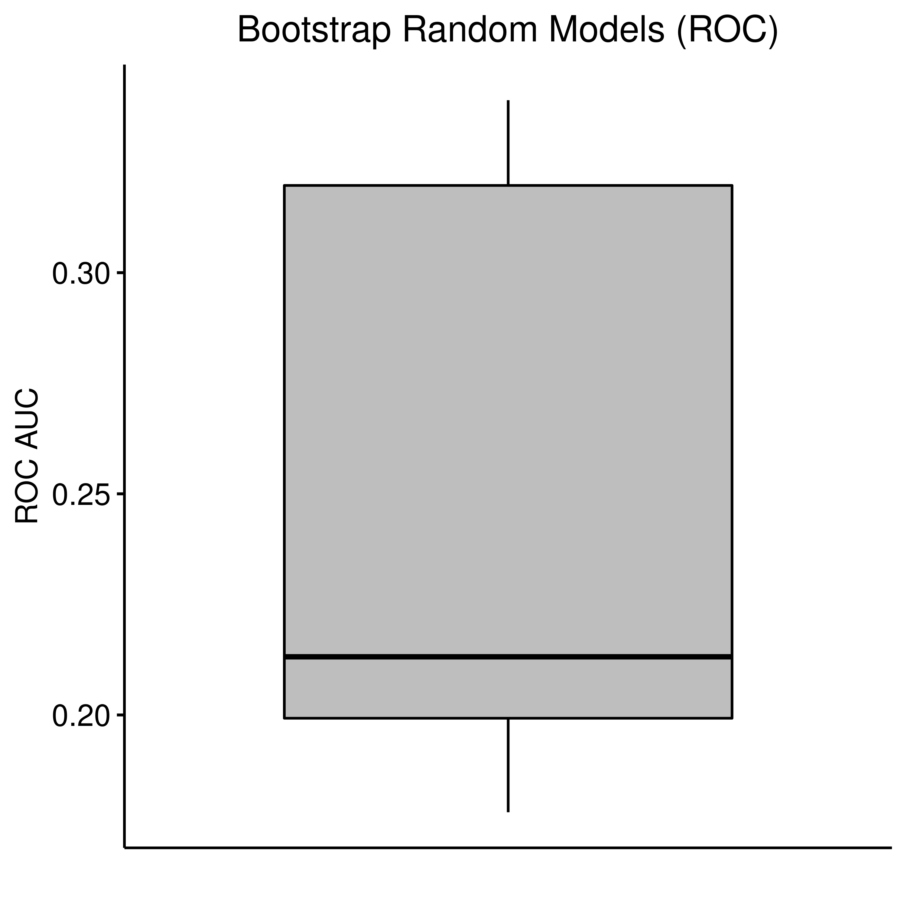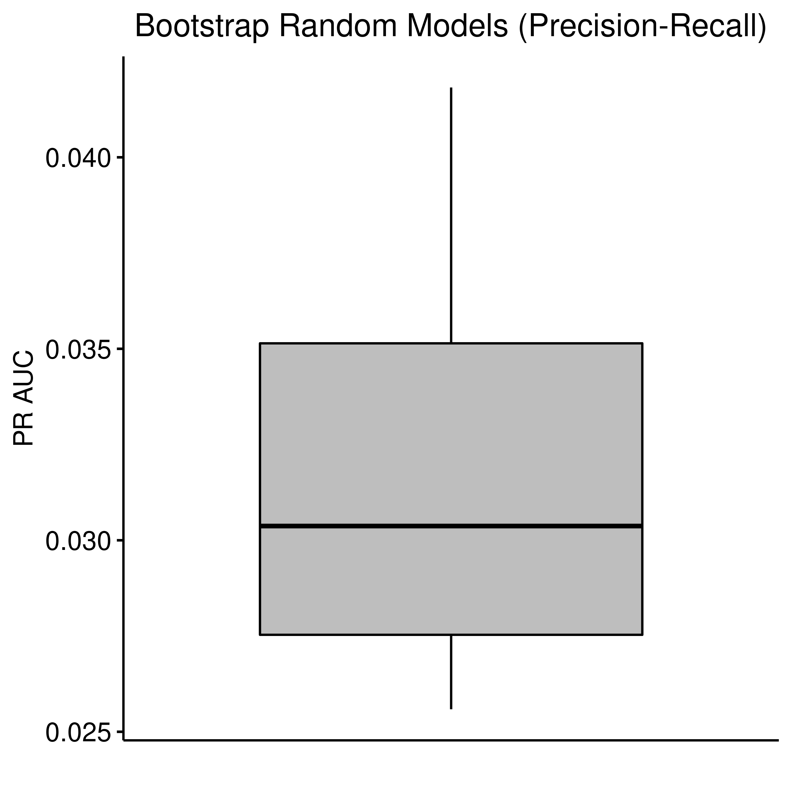
<p class="caption">(\#fig:random-bootstrap-auc)Random Model Bootstrap: ROC and PR AUCs (CASCADE 2.0, Bliss synergy method)</p>
</div>

### AUC sensitivity {-}

Investigate same thing as described in [here](#auc-sensitivity).
This is very crucial since the PR performance is poor for the individual predictors and the ensemble-wise predictors were really bad in terms of AUC-ROC, but a combined predictor might be able to counter this.
We will combine the synergy scores from the *random proliferative* simulations with the results from the *calibrated* Gitsbe simulations (number of simulations: $150$).


```r
# Ensemble-wise
betas = seq(from = -5, to = 5, by = 0.1)

prolif_roc = sapply(betas, function(beta) {
  pred_ew_bliss = pred_ew_bliss %>% mutate(combined_score = ss_score_50sim + beta * prolif_score_150sim)
  res = roc.curve(scores.class0 = pred_ew_bliss %>% pull(combined_score) %>% (function(x) {-x}), 
    weights.class0 = pred_ew_bliss %>% pull(observed))
  auc_value = res$auc
})

prolif_pr = sapply(betas, function(beta) {
  pred_ew_bliss = pred_ew_bliss %>% mutate(combined_score = ss_score_50sim + beta * prolif_score_150sim)
  res = pr.curve(scores.class0 = pred_ew_bliss %>% pull(combined_score) %>% (function(x) {-x}), 
    weights.class0 = pred_ew_bliss %>% pull(observed))
  auc_value = res$auc.davis.goadrich
})

df_ew = as_tibble(cbind(betas, prolif_roc, prolif_pr))
df_ew = df_ew %>% tidyr::pivot_longer(-betas, names_to = "type", values_to = "AUC")

ggline(data = df_ew, x = "betas", y = "AUC", numeric.x.axis = TRUE, color = "type",
  plot_type = "l", xlab = TeX("$\\beta$"), ylab = "AUC (Area Under Curve)", 
  legend = "none", facet.by = "type", palette = my_palette, ylim = c(0,0.85),
  panel.labs = list(type = c("Precision-Recall", "ROC")),
  title = TeX("AUC sensitivity to $\\beta$ parameter")) + 
  theme(plot.title = element_text(hjust = 0.5)) +
  geom_vline(xintercept = 0) +
  geom_vline(xintercept = -1.6, color = "black", size = 0.3, linetype = "dashed") + 
  geom_vline(xintercept = -1, color = "black", size = 0.3, linetype = "dashed") + 
  geom_text(aes(x=-2, y=0.4, label="β = -1.6"), angle=90, colour="black") + 
  geom_text(aes(x=-0.75, y=0.38, label="β = -1"), angle=90, colour="black") +
  grids()
```

<div class="figure" style="text-align: center">

<p class="caption">(\#fig:auc-sen-ew-bliss-cascade2)AUC sensitivity (CASCADE 2.0, Bliss synergy method, Ensemble-wise results)</p>
</div>


```r
# Model-wise
weights = seq(from = 0, to = 1, by = 0.05)

prolif_roc_mw = sapply(weights, function(w) {
  pred_mw_bliss = pred_mw_bliss %>%
    mutate(weighted_prob = (1 - w) * pred_mw_bliss$synergy_prob_ss_150sim + w * pred_mw_bliss$synergy_prob_prolif_150sim)
  res = roc.curve(scores.class0 = pred_mw_bliss %>% pull(weighted_prob),
    weights.class0 = pred_mw_bliss %>% pull(observed))
  auc_value = res$auc
})

prolif_pr_mw = sapply(weights, function(w) {
  pred_mw_bliss = pred_mw_bliss %>% 
    mutate(weighted_prob = (1 - w) * pred_mw_bliss$synergy_prob_ss_150sim + w * pred_mw_bliss$synergy_prob_prolif_150sim)
  res = pr.curve(scores.class0 = pred_mw_bliss %>% pull(weighted_prob), 
    weights.class0 = pred_mw_bliss %>% pull(observed))
  auc_value = res$auc.davis.goadrich
})

df_mw = as_tibble(cbind(weights, prolif_roc_mw, prolif_pr_mw))
df_mw = df_mw %>% tidyr::pivot_longer(-weights, names_to = "type", values_to = "AUC")

ggline(data = df_mw, x = "weights", y = "AUC", numeric.x.axis = TRUE, color = "type",
  plot_type = "l", xlab = TeX("weight $w$"), ylab = "AUC (Area Under Curve)", 
  legend = "none", facet.by = "type", palette = my_palette,
  panel.labs = list(type = c("Precision-Recall", "ROC")), title.position = "center",
  title = TeX("AUC sensitivity to weighted average score (Bliss, CASCADE 2.0)")) + 
  theme(plot.title = element_text(hjust = 0.5)) +
  grids()
```

<div class="figure" style="text-align: center">

<p class="caption">(\#fig:auc-sen-mw-bliss-cascade2)AUC sensitivity (CASCADE 2.0, Bliss synergy method, Model-wise results)</p>
</div>

:::{.green-box}
- No added benefit when using the *model-wise* approach.
- The **random proliferative** models can be used to normalize against the predictions of the calibrated models and thus bring significant contribution to the calibrated models performance (both ROC-AUC and PR-AUC are increased).
- The $\beta_{best}$ that maximizes the ROC and PR AUC for the **combination of proliferative and calibrated models** and is equal to $\beta_{best}=-1.6$.
For $\beta=-1$ we still see **significant performance improvement**.
:::

## Best ROC and PRC {-}

For the **Bliss ensemble-wise results** we demonstrated above that a value of $\beta_{best}=-1.6$ can result in significant performance gain of the combined predictor ($calibrated + \beta \times random$) using the results from the $150$ simulation runs (the results for $\beta=-1$ were still better than the single predictors).
Here, we present the ROC and PR curves for the **calibrated (normalized to random model)** predictions compared to the **random proliferative** model results.

:::{.note}
Only for the next twp Figures, **Calibrated** stands for the combined predictor results, i.e. $calibrated + \beta \times random, \beta=-1$.
:::


```r
best_beta1 = -1.6
best_beta2 = -1
pred_ew_bliss = pred_ew_bliss %>% 
  mutate(best_score1 = ss_score_150sim + best_beta1 * prolif_score_150sim,
         best_score2 = ss_score_150sim + best_beta2 * prolif_score_150sim)
roc_best_res1 = get_roc_stats(df = pred_ew_bliss, pred_col = "best_score1", label_col = "observed")
roc_best_res2 = get_roc_stats(df = pred_ew_bliss, pred_col = "best_score2", label_col = "observed")
pr_best_res1 = pr.curve(scores.class0 = pred_ew_bliss %>% pull(best_score1) %>% (function(x) {-x}), 
    weights.class0 = pred_ew_bliss %>% pull(observed), curve = TRUE, rand.compute = TRUE)
pr_best_res2 = pr.curve(scores.class0 = pred_ew_bliss %>% pull(best_score2) %>% (function(x) {-x}), 
    weights.class0 = pred_ew_bliss %>% pull(observed), curve = TRUE, rand.compute = TRUE)

# Plot best ROCs
plot(x = roc_best_res2$roc_stats$FPR, y = roc_best_res2$roc_stats$TPR,
  type = 'l', lwd = 3, col = my_palette[1], 
  main = ('ROC curve, Ensemble-wise synergies (Bliss)'),
  xlab = 'False Positive Rate (FPR)', ylab = 'True Positive Rate (TPR)')
lines(x = res_prolif_ew_150sim$roc_stats$FPR, y = res_prolif_ew_150sim$roc_stats$TPR,
  lwd = 3, col = my_palette[2])
#lines(x = roc_best_res1$roc_stats$FPR, y = roc_best_res1$roc_stats$TPR,
#  lwd = 2, col = my_palette[3])
legend('topleft', title = 'AUC', col = my_palette[1:4], pch = 19, cex = 1.3,
  legend = c(paste(round(roc_best_res2$AUC, digits = 2), 'Calibrated'),
             paste(round(res_prolif_ew_150sim$AUC, digits = 2), 'Random')))
grid(lwd = 0.5)
abline(a = 0, b = 1, col = 'lightgrey', lty = 'dotdash', lwd = 1.2)

# Plot best PRCs
plot(pr_best_res2, main = 'PR curve, Ensemble-wise synergies (Bliss)',
  auc.main = FALSE, color = my_palette[1], rand.plot = TRUE, lwd = 3)
plot(pr_prolif_ew_bliss_150sim, add = TRUE, color = my_palette[2], lwd = 3)
#plot(pr_best_res1, add = TRUE, color = my_palette[3], lwd = 2)
legend('topright', title = 'AUC', col = my_palette[1:2], pch = 19, cex = 1.5,
  legend = c(paste(round(pr_best_res2$auc.davis.goadrich, digits = 2), 'Calibrated'),
    paste(round(pr_prolif_ew_bliss_150sim$auc.davis.goadrich, digits = 2), 'Random')))
grid(lwd = 0.5)
```

<div class="figure" style="text-align: center">

<p class="caption">(\#fig:best-beta-cascade2-link)ROC and PR curves for Random and Combined Predictor (CASCADE 2.0, Link Operator Mutations)</p>
</div>

:::{#comb-pred-best-link-dt}
The **ROC ensemble-wise statistics data** for the combined predictor ($\beta=-1$, the **Calibrated** in the above plot) are as follows:
:::

```r
DT::datatable(data = roc_best_res2$roc_stats, options = 
  list(pageLength = 5, lengthMenu = c(5, 20, 40), searching = FALSE)) %>% 
  formatRound(c(1,6,7,8,9), digits = 3)
```

<div class="figure" style="text-align: center">
<!--html_preserve--><div id="htmlwidget-f888dc62471906a988fd" style="width:100%;height:auto;" class="datatables html-widget"></div>
<script type="application/json" data-for="htmlwidget-f888dc62471906a988fd">{"x":{"filter":"none","data":[["1","2","3","4","5","6","7","8","9","10","11","12","13","14","15","16","17","18","19","20","21","22","23","24","25","26","27","28","29","30","31","32","33","34","35","36","37","38","39","40","41","42","43","44","45","46","47","48","49","50","51","52","53","54","55","56","57","58","59","60","61","62","63","64","65","66","67","68","69","70","71","72","73","74","75","76","77","78","79","80","81","82","83","84","85","86","87","88","89","90","91","92","93","94","95","96","97","98","99","100","101","102","103","104","105","106","107","108","109","110","111","112","113","114","115","116","117","118","119","120","121","122","123","124","125","126","127","128","129","130","131","132","133","134","135","136","137","138","139","140","141","142","143"],[null,-0.068949991876718,-0.0573031929504698,-0.0540320767370723,-0.051161731775937,-0.0347096709542208,-0.0332826901960117,-0.0220874729210377,-0.0201082156790868,-0.0134643543774613,-0.0101431322571641,-0.00860748858315574,-0.0075618655771299,-0.00415141869931979,-0.00400096306519326,-0.0038075359059021,-0.00362531682911071,-0.00329735449735458,-0.00283726591760314,-0.00279259378405194,-0.00273434621282587,-0.00247443067546405,-0.00237036125700618,-0.00231684624510442,-0.00227655414885009,-0.00205055877629323,-0.00180129647875638,-0.00178605534742848,-0.00154453965762003,-0.00147155039211921,-0.00132773502991035,-0.000909251675353606,-0.000813809069922788,-0.000409079763060483,-0.000233663777620574,-0.000224419721937874,0.000322659201496767,0.00049737981892517,0.000509280253633948,0.000610652683703972,0.000684252551219178,0.000700469338476117,0.000775150371138844,0.000788598691261799,0.000851485719279621,0.000873154623154626,0.000888714889385911,0.000915761322786812,0.000919753086419672,0.000923379624856446,0.000927412446459996,0.000929157175398543,0.000977926756132508,0.00101358024691334,0.00101498490178908,0.00104171767820338,0.00105125023069919,0.00105237326066354,0.00105275223205803,0.00105493172694193,0.00105981384201359,0.00107019705622191,0.00107161678641987,0.00108202380351408,0.00108470047092268,0.00109232507258827,0.00109476651006324,0.00110070079464664,0.00110134117524863,0.0011038267288267,0.00110493827160496,0.00110503905265813,0.0011050620096178,0.0011061728395062,0.00110719716434504,0.00111122386276441,0.00111347772739823,0.00111377671935764,0.00111491424310217,0.00111534391534385,0.00111855319739207,0.00111919993468601,0.00115056818181836,0.0011696677209786,0.00117121450931812,0.00117319319681775,0.00120087145447623,0.00121318500509326,0.00123574289107464,0.00128698255637016,0.00137608713498105,0.00137958866164756,0.00138311115269407,0.00138588682469309,0.00142550143730447,0.00147893580432135,0.00148550723471086,0.00150595224771111,0.00167770560041258,0.0017428335315145,0.00201836469627881,0.00203239079185924,0.00208293678427018,0.00219920328422152,0.00223700296987506,0.00234757241076877,0.00238117082550848,0.00239443582529397,0.00239568041939342,0.00245600821423941,0.00249263128919919,0.00252183096178815,0.00254612096512274,0.00284301135062126,0.00310911977919504,0.00314102041824649,0.0031769131174384,0.00325523730706068,0.00335892354845191,0.00335957801768794,0.00348962223768057,0.00349201075343786,0.00372757984075411,0.00376137168094148,0.0037994517442701,0.0040921159846633,0.00432318823859379,0.00841093456241571,0.00843512720733408,0.00949064476474837,0.00961879828198209,0.00977768200971718,0.0108274874294566,0.0110912847266457,0.0118469237065569,0.0142384471467639,0.0173547695010796,0.0238486865323302,0.0310127404318757,0.0351279174562775,0.0590061495821371,0.0690202769729064,0.0801928133788918],[0,0,0,0,0,1,2,3,3,3,3,3,3,3,3,4,4,4,4,4,4,4,4,4,4,4,4,4,4,4,4,4,4,4,4,4,4,4,4,4,4,4,4,4,4,4,4,4,4,4,4,4,4,4,4,4,4,4,4,4,4,4,4,4,4,4,4,4,4,4,4,4,4,4,4,4,4,4,4,4,4,4,4,4,4,4,4,4,4,4,4,4,4,4,4,4,4,4,4,4,4,4,4,4,4,4,4,4,4,4,4,4,4,4,4,4,4,4,4,5,5,5,5,5,6,6,6,6,6,6,6,6,6,6,6,6,6,6,6,6,6,6,6],[6,6,6,6,6,5,4,3,3,3,3,3,3,3,3,2,2,2,2,2,2,2,2,2,2,2,2,2,2,2,2,2,2,2,2,2,2,2,2,2,2,2,2,2,2,2,2,2,2,2,2,2,2,2,2,2,2,2,2,2,2,2,2,2,2,2,2,2,2,2,2,2,2,2,2,2,2,2,2,2,2,2,2,2,2,2,2,2,2,2,2,2,2,2,2,2,2,2,2,2,2,2,2,2,2,2,2,2,2,2,2,2,2,2,2,2,2,2,2,1,1,1,1,1,0,0,0,0,0,0,0,0,0,0,0,0,0,0,0,0,0,0,0],[147,146,145,144,143,143,143,143,142,141,140,139,138,137,136,136,135,134,133,132,131,130,129,128,127,126,125,124,123,122,121,120,119,118,117,116,115,114,113,112,111,110,109,108,107,106,105,103,101,100,99,98,96,95,94,93,91,90,89,88,87,86,85,84,83,82,81,80,79,78,77,75,73,71,70,69,67,66,64,62,60,59,58,57,56,55,54,53,52,51,50,49,48,47,46,45,44,43,42,41,40,39,38,37,36,35,34,33,32,31,30,29,28,27,26,25,24,23,22,22,21,20,19,18,18,17,16,15,14,13,12,11,10,9,8,7,6,5,4,3,2,1,0],[0,1,2,3,4,4,4,4,5,6,7,8,9,10,11,11,12,13,14,15,16,17,18,19,20,21,22,23,24,25,26,27,28,29,30,31,32,33,34,35,36,37,38,39,40,41,42,44,46,47,48,49,51,52,53,54,56,57,58,59,60,61,62,63,64,65,66,67,68,69,70,72,74,76,77,78,80,81,83,85,87,88,89,90,91,92,93,94,95,96,97,98,99,100,101,102,103,104,105,106,107,108,109,110,111,112,113,114,115,116,117,118,119,120,121,122,123,124,125,125,126,127,128,129,129,130,131,132,133,134,135,136,137,138,139,140,141,142,143,144,145,146,147],[0,0.00680272108843537,0.0136054421768707,0.0204081632653061,0.0272108843537415,0.0272108843537415,0.0272108843537415,0.0272108843537415,0.0340136054421769,0.0408163265306122,0.0476190476190476,0.054421768707483,0.0612244897959184,0.0680272108843537,0.0748299319727891,0.0748299319727891,0.0816326530612245,0.0884353741496599,0.0952380952380952,0.102040816326531,0.108843537414966,0.115646258503401,0.122448979591837,0.129251700680272,0.136054421768707,0.142857142857143,0.149659863945578,0.156462585034014,0.163265306122449,0.170068027210884,0.17687074829932,0.183673469387755,0.19047619047619,0.197278911564626,0.204081632653061,0.210884353741497,0.217687074829932,0.224489795918367,0.231292517006803,0.238095238095238,0.244897959183673,0.251700680272109,0.258503401360544,0.26530612244898,0.272108843537415,0.27891156462585,0.285714285714286,0.299319727891156,0.312925170068027,0.319727891156463,0.326530612244898,0.333333333333333,0.346938775510204,0.353741496598639,0.360544217687075,0.36734693877551,0.380952380952381,0.387755102040816,0.394557823129252,0.401360544217687,0.408163265306122,0.414965986394558,0.421768707482993,0.428571428571429,0.435374149659864,0.442176870748299,0.448979591836735,0.45578231292517,0.462585034013605,0.469387755102041,0.476190476190476,0.489795918367347,0.503401360544218,0.517006802721088,0.523809523809524,0.530612244897959,0.54421768707483,0.551020408163265,0.564625850340136,0.578231292517007,0.591836734693878,0.598639455782313,0.605442176870748,0.612244897959184,0.619047619047619,0.625850340136054,0.63265306122449,0.639455782312925,0.646258503401361,0.653061224489796,0.659863945578231,0.666666666666667,0.673469387755102,0.680272108843537,0.687074829931973,0.693877551020408,0.700680272108844,0.707482993197279,0.714285714285714,0.72108843537415,0.727891156462585,0.73469387755102,0.741496598639456,0.748299319727891,0.755102040816326,0.761904761904762,0.768707482993197,0.775510204081633,0.782312925170068,0.789115646258503,0.795918367346939,0.802721088435374,0.80952380952381,0.816326530612245,0.82312925170068,0.829931972789116,0.836734693877551,0.843537414965986,0.850340136054422,0.850340136054422,0.857142857142857,0.863945578231292,0.870748299319728,0.877551020408163,0.877551020408163,0.884353741496599,0.891156462585034,0.897959183673469,0.904761904761905,0.91156462585034,0.918367346938776,0.925170068027211,0.931972789115646,0.938775510204082,0.945578231292517,0.952380952380952,0.959183673469388,0.965986394557823,0.972789115646258,0.979591836734694,0.986394557823129,0.993197278911565,1],[0,0,0,0,0,0.166666666666667,0.333333333333333,0.5,0.5,0.5,0.5,0.5,0.5,0.5,0.5,0.666666666666667,0.666666666666667,0.666666666666667,0.666666666666667,0.666666666666667,0.666666666666667,0.666666666666667,0.666666666666667,0.666666666666667,0.666666666666667,0.666666666666667,0.666666666666667,0.666666666666667,0.666666666666667,0.666666666666667,0.666666666666667,0.666666666666667,0.666666666666667,0.666666666666667,0.666666666666667,0.666666666666667,0.666666666666667,0.666666666666667,0.666666666666667,0.666666666666667,0.666666666666667,0.666666666666667,0.666666666666667,0.666666666666667,0.666666666666667,0.666666666666667,0.666666666666667,0.666666666666667,0.666666666666667,0.666666666666667,0.666666666666667,0.666666666666667,0.666666666666667,0.666666666666667,0.666666666666667,0.666666666666667,0.666666666666667,0.666666666666667,0.666666666666667,0.666666666666667,0.666666666666667,0.666666666666667,0.666666666666667,0.666666666666667,0.666666666666667,0.666666666666667,0.666666666666667,0.666666666666667,0.666666666666667,0.666666666666667,0.666666666666667,0.666666666666667,0.666666666666667,0.666666666666667,0.666666666666667,0.666666666666667,0.666666666666667,0.666666666666667,0.666666666666667,0.666666666666667,0.666666666666667,0.666666666666667,0.666666666666667,0.666666666666667,0.666666666666667,0.666666666666667,0.666666666666667,0.666666666666667,0.666666666666667,0.666666666666667,0.666666666666667,0.666666666666667,0.666666666666667,0.666666666666667,0.666666666666667,0.666666666666667,0.666666666666667,0.666666666666667,0.666666666666667,0.666666666666667,0.666666666666667,0.666666666666667,0.666666666666667,0.666666666666667,0.666666666666667,0.666666666666667,0.666666666666667,0.666666666666667,0.666666666666667,0.666666666666667,0.666666666666667,0.666666666666667,0.666666666666667,0.666666666666667,0.666666666666667,0.666666666666667,0.666666666666667,0.666666666666667,0.666666666666667,0.833333333333333,0.833333333333333,0.833333333333333,0.833333333333333,0.833333333333333,1,1,1,1,1,1,1,1,1,1,1,1,1,1,1,1,1,1,1],[0,-0.00680272108843537,-0.0136054421768707,-0.0204081632653061,-0.0272108843537415,0.139455782312925,0.306122448979592,0.472789115646259,0.465986394557823,0.459183673469388,0.452380952380952,0.445578231292517,0.438775510204082,0.431972789115646,0.425170068027211,0.591836734693878,0.585034013605442,0.578231292517007,0.571428571428571,0.564625850340136,0.557823129251701,0.551020408163265,0.54421768707483,0.537414965986394,0.530612244897959,0.523809523809524,0.517006802721088,0.510204081632653,0.503401360544218,0.496598639455782,0.489795918367347,0.482993197278912,0.476190476190476,0.469387755102041,0.462585034013605,0.45578231292517,0.448979591836735,0.442176870748299,0.435374149659864,0.428571428571429,0.421768707482993,0.414965986394558,0.408163265306122,0.401360544217687,0.394557823129252,0.387755102040816,0.380952380952381,0.36734693877551,0.353741496598639,0.346938775510204,0.340136054421769,0.333333333333333,0.319727891156463,0.312925170068027,0.306122448979592,0.299319727891156,0.285714285714286,0.27891156462585,0.272108843537415,0.26530612244898,0.258503401360544,0.251700680272109,0.244897959183673,0.238095238095238,0.231292517006803,0.224489795918367,0.217687074829932,0.210884353741497,0.204081632653061,0.197278911564626,0.19047619047619,0.17687074829932,0.163265306122449,0.149659863945578,0.142857142857143,0.136054421768707,0.122448979591837,0.115646258503401,0.102040816326531,0.0884353741496599,0.0748299319727891,0.0680272108843537,0.0612244897959183,0.0544217687074829,0.0476190476190476,0.0408163265306122,0.0340136054421768,0.0272108843537414,0.020408163265306,0.0136054421768708,0.00680272108843538,0,-0.00680272108843538,-0.0136054421768708,-0.0204081632653061,-0.0272108843537415,-0.0340136054421769,-0.0408163265306123,-0.0476190476190477,-0.0544217687074831,-0.0612244897959184,-0.0680272108843538,-0.0748299319727892,-0.0816326530612246,-0.0884353741496599,-0.0952380952380952,-0.102040816326531,-0.108843537414966,-0.115646258503401,-0.122448979591837,-0.129251700680272,-0.136054421768708,-0.142857142857143,-0.149659863945578,-0.156462585034014,-0.163265306122449,-0.170068027210884,-0.17687074829932,-0.183673469387755,-0.0170068027210883,-0.0238095238095237,-0.0306122448979591,-0.0374149659863945,-0.0442176870748299,0.122448979591837,0.115646258503401,0.108843537414966,0.102040816326531,0.0952380952380952,0.0884353741496599,0.0816326530612245,0.0748299319727891,0.0680272108843537,0.0612244897959183,0.0544217687074829,0.0476190476190477,0.0408163265306123,0.0340136054421769,0.0272108843537415,0.0204081632653061,0.0136054421768708,0.00680272108843538,0],[1,1.00004627701421,1.00018510805683,1.00041649312786,1.00074043222731,0.695184876671757,0.445184876671757,0.250740432227313,0.251156925355176,0.251665972511454,0.252267573696145,0.252961728909251,0.253748438150771,0.254627701420704,0.255599518719052,0.116710629830163,0.117775001156925,0.118931926512101,0.120181405895692,0.121523439307696,0.122958026748114,0.124485168216947,0.126104863714193,0.127817113239854,0.129621916793928,0.131519274376417,0.13350918598732,0.135591651626637,0.137766671294368,0.140034244990513,0.142394372715072,0.144847054468046,0.147392290249433,0.150030080059235,0.15276042389745,0.15558332176408,0.158498773659124,0.161506779582581,0.164607339534453,0.167800453514739,0.171086121523439,0.174464343560554,0.177935119626082,0.181498449720024,0.185154333842381,0.188902771993151,0.192743764172336,0.200703410615947,0.209033273173215,0.21333703549447,0.217733351844139,0.222222222222222,0.231477625063631,0.236244157526956,0.241103244018696,0.24605488453885,0.256235827664399,0.261465130269795,0.266786986903605,0.272201397565829,0.277708362256467,0.28330788097552,0.288999953722986,0.294784580498866,0.300661761303161,0.306631496135869,0.312693784996992,0.318848627886529,0.32509602480448,0.331435975750845,0.337868480725624,0.351011152760424,0.364524040908881,0.378407145170994,0.385487528344671,0.392660465546763,0.407284002036189,0.414734601323523,0.429913461983433,0.445462538756999,0.461381831644222,0.469480309130455,0.477671340645102,0.485954926188162,0.494331065759637,0.502799759359526,0.511361006987829,0.520014808644546,0.528761164329678,0.537600074043223,0.546531537785182,0.555555555555556,0.564672127354343,0.573881253181545,0.58318293303716,0.59257716692119,0.602063954833634,0.611643296774492,0.621315192743764,0.63107964274145,0.640936646767551,0.650886204822065,0.660928316904993,0.671062983016336,0.681290203156092,0.691609977324263,0.702022305520848,0.712527187745847,0.72312462399926,0.733814614281087,0.744597158591328,0.755472256929983,0.766439909297052,0.777500115692536,0.788652876116433,0.799898190568745,0.81123605904947,0.82266648155861,0.834189458096164,0.75085612476283,0.762471655328798,0.77417973992318,0.785980378545976,0.797873571197186,0.770095793419408,0.782081540099033,0.794159840807071,0.806330695543524,0.81859410430839,0.830950067101671,0.843398583923365,0.855939654773474,0.868573279651997,0.881299458558934,0.894118191494285,0.90702947845805,0.920033319450229,0.933129714470822,0.94631866351983,0.959600166597251,0.972974223703087,0.986440834837336,1]],"container":"<table class=\"display\">\n  <thead>\n    <tr>\n      <th> <\/th>\n      <th>threshold<\/th>\n      <th>TP<\/th>\n      <th>FN<\/th>\n      <th>TN<\/th>\n      <th>FP<\/th>\n      <th>FPR<\/th>\n      <th>TPR<\/th>\n      <th>dist_from_chance<\/th>\n      <th>dist_from_0_1<\/th>\n    <\/tr>\n  <\/thead>\n<\/table>","options":{"pageLength":5,"lengthMenu":[5,20,40],"searching":false,"columnDefs":[{"targets":1,"render":"function(data, type, row, meta) {\n    return type !== 'display' ? data : DTWidget.formatRound(data, 3, 3, \",\", \".\");\n  }"},{"targets":6,"render":"function(data, type, row, meta) {\n    return type !== 'display' ? data : DTWidget.formatRound(data, 3, 3, \",\", \".\");\n  }"},{"targets":7,"render":"function(data, type, row, meta) {\n    return type !== 'display' ? data : DTWidget.formatRound(data, 3, 3, \",\", \".\");\n  }"},{"targets":8,"render":"function(data, type, row, meta) {\n    return type !== 'display' ? data : DTWidget.formatRound(data, 3, 3, \",\", \".\");\n  }"},{"targets":9,"render":"function(data, type, row, meta) {\n    return type !== 'display' ? data : DTWidget.formatRound(data, 3, 3, \",\", \".\");\n  }"},{"className":"dt-right","targets":[1,2,3,4,5,6,7,8,9]},{"orderable":false,"targets":0}],"order":[],"autoWidth":false,"orderClasses":false}},"evals":["options.columnDefs.0.render","options.columnDefs.1.render","options.columnDefs.2.render","options.columnDefs.3.render","options.columnDefs.4.render"],"jsHooks":[]}</script><!--/html_preserve-->
<p class="caption">(\#fig:comb-pred-best-link-dt)ROC data for Best Combined Predictor (CASCADE 2.0, Link Operator Mutations, Bliss synergy method)</p>
</div>

```r
# TP synergies at a specified threshold (0 below)
# pred_ew_bliss %>% 
#  select(perturbation, observed, best_score2) %>% 
#  filter(best_score2 < 0, observed == 1)

# investigate the average threshold as a synergy classification index
# thres = roc_best_res2$roc_stats %>% pull(threshold)
# thres = thres[is.finite(thres)] # remove Inf's
# roc_best_res2$roc_stats %>% 
#   filter(threshold < mean(thres)) %>% 
#   slice(n()) %>% kable()
```

If we add the predictions of the non-normalized calibrated data to the above Figures (again using the results from the $150$ simulations), we have:

```r
# best_beta2 = -1

# Plot best ROCs
plot(x = roc_best_res2$roc_stats$FPR, y = roc_best_res2$roc_stats$TPR,
  type = 'l', lwd = 3, col = my_palette[1], 
  main = ('ROC curve, Ensemble-wise synergies (Bliss)'),
  xlab = 'False Positive Rate (FPR)', ylab = 'True Positive Rate (TPR)')
lines(x = res_prolif_ew_150sim$roc_stats$FPR, y = res_prolif_ew_150sim$roc_stats$TPR,
  lwd = 3, col = my_palette[2])
lines(x = res_ss_ew_150sim$roc_stats$FPR, y = res_ss_ew_150sim$roc_stats$TPR,
  lwd = 3, col = my_palette[3])
legend('topleft', title = 'AUC', col = my_palette[c(3,1,2)], pch = 19, cex = 1,
  legend = c(paste(round(res_ss_ew_150sim$AUC, digits = 2), 'Calibrated (non-normalized)'),
             paste(round(roc_best_res2$AUC, digits = 2), 'Calibrated'),
             paste(round(res_prolif_ew_150sim$AUC, digits = 2), 'Random')))
grid(lwd = 0.5)
abline(a = 0, b = 1, col = 'lightgrey', lty = 'dotdash', lwd = 1.2)

# Plot best PRCs
plot(pr_best_res2, main = 'PR curve, Ensemble-wise synergies (Bliss)',
  auc.main = FALSE, color = my_palette[1], rand.plot = TRUE, lwd = 3)
plot(pr_prolif_ew_bliss_150sim, add = TRUE, color = my_palette[2], lwd = 3)
plot(pr_ss_ew_bliss_150sim, add = TRUE, color = my_palette[3], lwd = 2)
legend('topright', title = 'AUC', col = my_palette[c(3,1,2)], pch = 19, cex = 1,
  legend = c(paste(round(pr_ss_ew_bliss_150sim$auc.davis.goadrich, digits = 2), 'Calibrated (non-normalized)'),
             paste(round(pr_best_res2$auc.davis.goadrich, digits = 2), 'Calibrated'),
             paste(round(pr_prolif_ew_bliss_150sim$auc.davis.goadrich, digits = 2), 'Random')))
grid(lwd = 0.5)
```

<div class="figure" style="text-align: center">
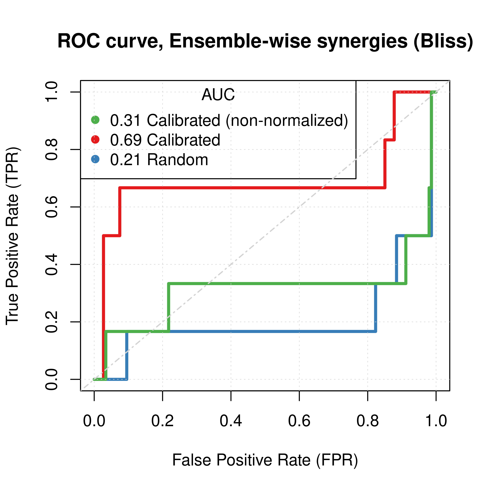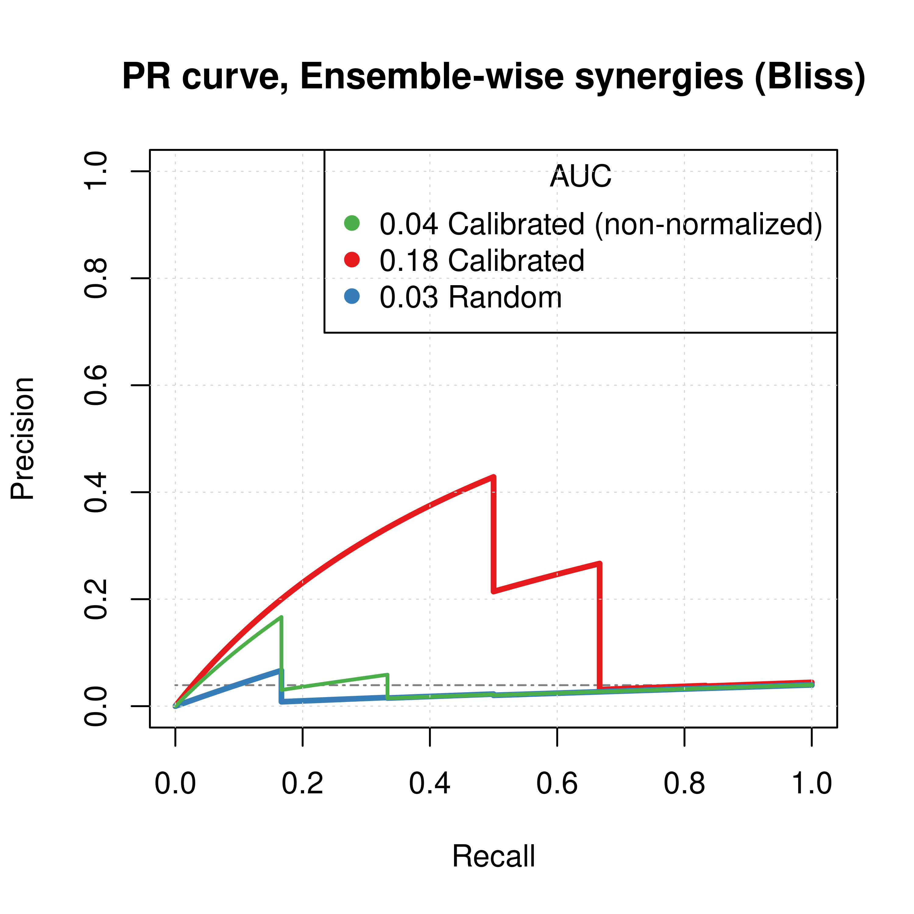
<p class="caption">(\#fig:best-beta-cascade2-link-2)ROC and PR curves for Random, Calibrated and Combined Predictor (CASCADE 2.0, Link Operator Mutations)</p>
</div>


## Correlation {-}

We test for correlation between some of the results shown in the ROC curves.
The results tested are the *ensemble-wise* vs *model-wise*, *random* models vs *calibrated* models and *HSA* vs *Bliss* synergy assessment (the calibrated and proliferative models are from the $150$ simulation results).
*P-values* are represented at 3 significant levels: $0.05, 0.01, 0.001$ (\*, \*\*, \*\*\*) and the correlation coefficient is calculated using Kendall's *tau* statistic.


```r
synergy_scores = bind_cols(
  pred_ew_hsa %>% select(ss_score_150sim, prolif_score_150sim) %>% rename(cal_ew_hsa = ss_score_150sim, random_ew_hsa = prolif_score_150sim),
  pred_ew_bliss %>% select(ss_score_150sim, prolif_score_150sim) %>% rename(cal_ew_bliss = ss_score_150sim, random_ew_bliss = prolif_score_150sim),
  pred_mw_hsa %>% select(synergy_prob_ss_150sim, synergy_prob_prolif_150sim) %>% 
    rename(cal_mw_hsa = synergy_prob_ss_150sim, random_mw_hsa = synergy_prob_prolif_150sim),
  pred_mw_bliss %>% select(synergy_prob_ss_150sim, synergy_prob_prolif_150sim) %>% 
    rename(cal_mw_bliss = synergy_prob_ss_150sim, random_mw_bliss = synergy_prob_prolif_150sim)
  )

M = cor(synergy_scores, method = "kendall")
res = cor.mtest(synergy_scores, method = "kendall")
corrplot(corr = M, type = "upper", p.mat = res$p, sig.level = c(.001, .01, .05), 
  pch.cex = 1, pch.col = "white", insig = "label_sig", tl.col = "black", tl.srt = 45)
```

<div class="figure" style="text-align: center">

<p class="caption">(\#fig:cor-plot-cascade2)Correlation Plot for CASCADE 2.0 Results</p>
</div>

:::{.green-box}
- **Bliss ensemble-wise** results don't correlate at all with the **model-wise** results (*topright* part of the correlation plot).
The **HSA ensemble-wise** results do so (at some degree).
- Between the **ensemble-wise** results there is no strong correlation (*topleft*) while between the **model-wise** (*bottomright*) there is strong correlation.
:::

## Fitness Evolution {-}

Results are from the run with $200$ Gitsbe simulations, fitting to steady state (**calibrated models**).


```r
fitness_summary_file = "results/link-only/cascade_2.0_ss_200sim_fixpoints_hsa_summary.txt"
fit_res = read_summary_file(file_name = fitness_summary_file)

# rows = simulations, columns = generations
# value in (sim,gen) cell = average fitness of models in that particular (sim,gen) combination
avg_fit_link = do.call(dplyr::bind_rows, sapply(fit_res, colMeans))
colnames(avg_fit_link) = 1:ncol(avg_fit_link)

avg_fit_long_link = avg_fit_link %>% pivot_longer(cols = everything()) %>% mutate(name = as.integer(name))

ggline(data = avg_fit_long_link, x = "name", y = "value", color = my_palette[2],
  add = "mean_sd", add.params = list(color = "black"), 
  main = "Fitness Evolution across Generations", 
  xlab = "Generations", ylab = "Fitness") + 
  theme(plot.title = element_text(hjust = 0.5)) + grids()
```

<div class="figure" style="text-align: center">

<p class="caption">(\#fig:fit-evolution-3)Fitness Evolution (200 simulations, link operator mutations, CASCADE 2.0)</p>
</div>


## Fitness vs Ensemble Performance {-#fit-vs-ens-perf-lo}

:::{.blue-box}
We check for correlation between the **calibrated models fitness to the AGS steady state** and their **ensemble performance** subject to normalization to the random model predictions.

The **main idea** here is that we generate different training data samples, in which the boolean steady state nodes have their values flipped (so they are only partially correct) and we fit models to these ($20$ simulations => $60$ models per training data, $205$ training data samples in total).
These calibrated model ensembles can then be tested for their prediction performance.
Then we use the ensemble-wise *random proliferative* model predictions ($150$ simulations) to normalize ($\beta=-1$) against the calibrated model predictions and compute the **AUC ROC and AUC PR for each model ensemble**.
:::

:::{.note}
Check how to generate the appropriate data, run the simulations and tidy up the results in the section [Fitness vs Performance Methods].
:::

Load the already-stored result:

```r
res = readRDS(file = "data/res_fit_aucs.rds")
```

We check if our data is normally distributed using the *Shapiro-Wilk* normality test:

```r
shapiro.test(x = res$roc_auc)
```

```

	Shapiro-Wilk normality test

data:  res$roc_auc
W = 0.92436, p-value = 8.883e-09
```

```r
shapiro.test(x = res$pr_auc)
```

```

	Shapiro-Wilk normality test

data:  res$pr_auc
W = 0.94464, p-value = 4.475e-07
```

```r
shapiro.test(x = res$avg_fit)
```

```

	Shapiro-Wilk normality test

data:  res$avg_fit
W = 0.89506, p-value = 8.472e-11
```

We observe from the low *p-values* that the **data is not normally distributed**.
Thus, we are going to use a non-parametric correlation metric, namely the **Kendall rank-based** test (and it's respective coefficient, $\tau$), to check for correlation between the ensemble model performance (ROC-AUC, PR-AUC) and the fitness to the AGS steady state:

```r
ggscatter(data = res, x = "avg_fit", y = "roc_auc",
  xlab = "Average Fitness per Model Ensemble",
  title = "Fitness to AGS Steady State vs Performance (ROC)",
  ylab = "ROC AUC", add = "reg.line", conf.int = TRUE,
  add.params = list(color = "blue", fill = "lightgray"),
  cor.coef = TRUE, cor.coeff.args = list(method = "kendall", label.y.npc = "bottom", size = 6, cor.coef.name = "tau")) +
  theme(plot.title = element_text(hjust = 0.5))
```

<div class="figure" style="text-align: center">

<p class="caption">(\#fig:fit-vs-perf-roc)Fitness to AGS Steady State vs ROC-AUC Performance (CASCADE 2.0, Bliss synergy method, Ensemble-wise normalized results)</p>
</div>


```r
ggscatter(data = res, x = "avg_fit", y = "pr_auc",
  xlab = "Average Fitness per Model Ensemble",
  title = "Fitness to AGS Steady State vs Performance (Precision-Recall)",
  add.params = list(color = "blue", fill = "lightgray"),
  ylab = "PR AUC", add = "reg.line", conf.int = TRUE,
  cor.coef = TRUE, cor.coeff.args = list(method = "kendall", size = 6, cor.coef.name = "tau")) +
  theme(plot.title = element_text(hjust = 0.5))
```

<div class="figure" style="text-align: center">

<p class="caption">(\#fig:fit-vs-perf-pr)Fitness to AGS Steady State vs PR-AUC Performance (CASCADE 2.0, Bliss synergy method, Ensemble-wise normalized results)</p>
</div>

:::{.green-box}
- We observe that there exists **some correlation between the normalized ensemble model performance vs the models fitness to the training steady state data**.
- The performance as measured by the ROC AUC is less sensitive to changes in the training data but there is better correlation with regards to the PR AUC, which is a more informative measure for our imbalanced dataset [@Saito2015].
:::

## Scrambled Topologies Investigation {-#scrambled-topo-inv-cascade2}

:::{.note}
We create several *scrambled* topologies from the CASCADE 2.0 one, in order to assess the tolerance of the curated network topology to random edge changes with regards to model ensemble performance using link-operator mutations.
For more details see the [same investigation](#scrambled-topo-inv-cascade1) done for CASCADE 1.0.

For each of the $4$ different types of scrambling, we make $10$ random topologies for each expected similarity score between the randomized and the curated topology, ranging from $0$ to $0.99$ similarity with a total of $23$ *steps*, thus $10\times23=230$ random topologies per different type of scrambling.
See more details on how to generate these topologies in the script [gen_scrambled_topologies_cascade2.R](https://github.com/druglogics/ags-paper/blob/main/scripts/gen_scrambled_topologies_cascade2.R).

To get the drug combination predictions for each scrambled topology, we executed the `druglogics-synergy` module with the default configuration ($50$ simulations per topology, for both *calibrated* to steady state and *random* proliferative models, using the *Bliss* synergy assessment method in `Drabme`).
Note that because of the CASCADE 2.0 network size and the amount of simulations for this analysis, we had to switch to the **faster BNReduction attractor tool** for the calculation of fixpoints [@Veliz-Cuba2014].
See discussion [here](https://druglogics.github.io/druglogics-doc/gitsbe-config.html#attractor-tool) for limitations of the use of the `bnet_reduction_reduced` attractor tool option in our configuration file and to execute the simulations with the scrambled topologies use the [run_druglogics_synergy_scrambled_topo_cascade2.sh](https://github.com/druglogics/ags-paper/blob/main/scripts/run_druglogics_synergy_scrambled_topo_cascade2.sh) script.

We calculate the normalized predictor performance ($calibrated - random$) for each topology-specific simulation and tidy up the result data in [get_syn_res_scrambled_topo_cascade2.R](https://github.com/druglogics/ags-paper/blob/main/scripts/get_syn_res_scrambled_topo_cascade2.R).
:::

Next, we load the scrambled topologies simulation results and also add the ROC and PR AUC results of the link-operator bootstrapped model analysis (see section [below](#boot-comp-param)).
The results are split to multiple groups, based on their similarity score (percentage of common edges with the curated CASCADE 2.0 topology).

Note that the topology scrambling type is set to **none** for the bootstrap results that used the original/curated CASCADE 2.0 topology.

```r
# results from the scrambled topology simulations
scrambled_topo_res = readRDS(file = 'data/scrambled_topo_res_cascade2.rds')

# results from bootstrap parameterization analysis
boot_res = readRDS(file = "data/res_param_boot_aucs.rds")

# the un-scrambled topology results have a similarity score equal to 1, 
# and 'none' scrambling whatsoever as `scramble_type`
lo_boot_res = boot_res %>%
  tibble::add_column(sim = 1, scramble_type = 'none', .before = 1) %>%
  filter(param == 'link-only') %>% # keep only the link-operator results
  select(-one_of("param")) # remove unwanted column

scrambled_topo_res = dplyr::bind_rows(scrambled_topo_res, lo_boot_res)

# group results by similarity score
scrambled_topo_res = 
  scrambled_topo_res %>% mutate(grp = factor(x = 
    case_when(sim >= 0 & sim < 0.25 ~ '0 - 0.25', 
      sim >= 0.25 & sim < 0.5 ~ '0.25 - 0.5', 
      sim >= 0.5 & sim < 0.75 ~ '0.5 - 0.75', 
      sim >= 0.75 & sim < 0.85 ~ '0.75 - 0.85',
      sim >= 0.85 & sim < 0.95 ~ '0.85 - 0.95',
      sim >= 0.95 & sim < 1 ~ '0.95 - 1',
      sim == 1 ~ 'Curated'), 
  levels = c('0 - 0.25', '0.25 - 0.5', '0.5 - 0.75', 
    '0.75 - 0.85', '0.85 - 0.95','0.95 - 1', 'Curated')))
```

Interestingly, there were some scrambled topologies which didn't produce not even $1$ boolean model with a stable state when using the genetic algorithm of `Gitsbe` (so no predictions could be made for these topologies):

```r
ordered_types = c('none', 'source', 'target', 'sign', 'all')

scrambled_topo_res %>% 
  mutate(scramble_type = 
      replace(x = scramble_type, list = scramble_type == 'effect', values = 'sign')) %>%
  group_by(scramble_type) %>% 
  summarise(percent = sum(is.na(roc_auc))/n(), .groups = 'drop') %>%
  mutate(scramble_type = factor(scramble_type, levels = ordered_types)) %>%
  ggplot(aes(x = scramble_type, y = percent, fill = scramble_type)) +
    geom_col() +
    geom_text(aes(label = scales::percent(percent, accuracy = 1)), vjust = -0.5, size = 8) +
    scale_y_continuous(labels = scales::percent, limits = c(0,0.3)) +
    scale_fill_brewer(palette = "Set1") +
    guides(fill = guide_legend(title = latex2exp::TeX("Scramble Type"))) +
    labs(x = "", title = "Topologies with zero-stable-state boolean models", y = "") +
    theme_classic(base_size = 14) +
    theme(axis.text.x = element_text(size = 18))
```

<div class="figure" style="text-align: center">
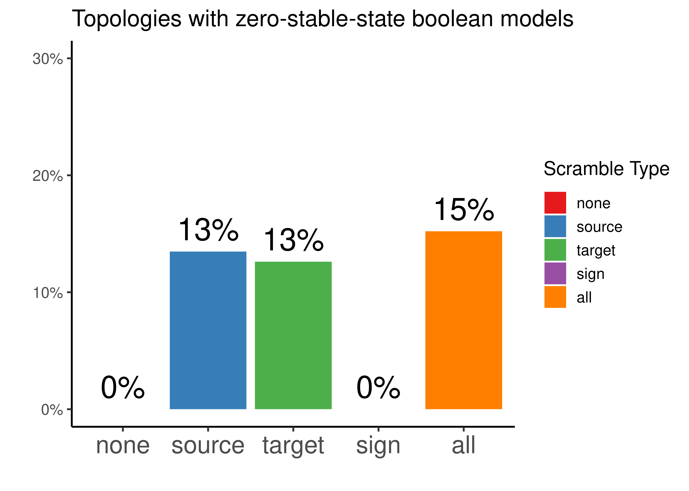
<p class="caption">(\#fig:zero-ss-topologies-fig-cascade2)Percentage of topologies that did not have any boolean model with a stable state after simulations with Gitsbe ended (CASCADE 2.0 topology). Every possible topology scrambling type is represented.</p>
</div>

:::{.green-box}
So potentially tweaking either the **source or the target nodes** of each edge in the curated topology, resulted in $13\%$ of the produced topologies to have a network configuration that wouldn't allow the existence of attractor stability in the explored link-operator parameterization space of the `Gitsbe` algorithm.

Same as with the CASCADE 1.0 results, tweaking the **effect** (activation vs inhibition), we always get topologies that can be translated to boolean models with a stable state attractor. 
Tweaking both source node, target node and interaction sign, results in the highest number of topologies with boolean models that lack stable behavior.
:::

### Source Scrambling {-}


```r
# ROC results
scrambled_topo_res %>%
  filter(scramble_type == 'source' | scramble_type == 'none', !is.na(roc_auc)) %>%
  ggplot(aes(x = grp, y = roc_auc, fill = grp)) +
  geom_boxplot(show.legend = FALSE) +
  scale_fill_brewer(palette = 'Set1') +
  geom_jitter(shape = 20, position = position_jitter(0.2), show.legend = FALSE) +
  ylim(c(0,1)) +
  labs(x = 'Similarity Score to CASCADE 2.0 Topology', y = 'ROC AUC', 
    title = "Source Scrambling vs Performance (ROC)") +
  theme_classic(base_size = 14) +
  geom_hline(yintercept = 0.5, linetype = 'dashed', color = "red") +
  geom_text(aes(x = 6.7, y = 0.45, label = "Random (AUC = 0.5)")) + 
  theme(plot.title = element_text(hjust = 0.5))

# PR results
scrambled_topo_res %>% 
  filter(scramble_type == 'source' | scramble_type == 'none', !is.na(pr_auc)) %>%
  ggplot(aes(x = grp, y = pr_auc, fill = grp)) + 
  geom_boxplot(show.legend = FALSE) + 
  scale_fill_brewer(palette = 'Set1') +
  geom_jitter(shape = 20, position = position_jitter(0.2), show.legend = FALSE) +
  ylim(c(0,0.6)) +
  labs(x = 'Similarity Score to CASCADE 2.0 Topology', y = 'PR AUC', 
    title = "Source Scrambling vs Performance (Precision-Recall)") +
  theme_classic(base_size = 14) +
  geom_hline(yintercept = sum(observed)/length(observed), linetype = 'dashed', color = "red") +
  geom_text(aes(x = 6.7, y = 0.01, label = "Random (AUC = 0.04)")) + 
  theme(plot.title = element_text(hjust = 0.5))
```

<div class="figure" style="text-align: center">
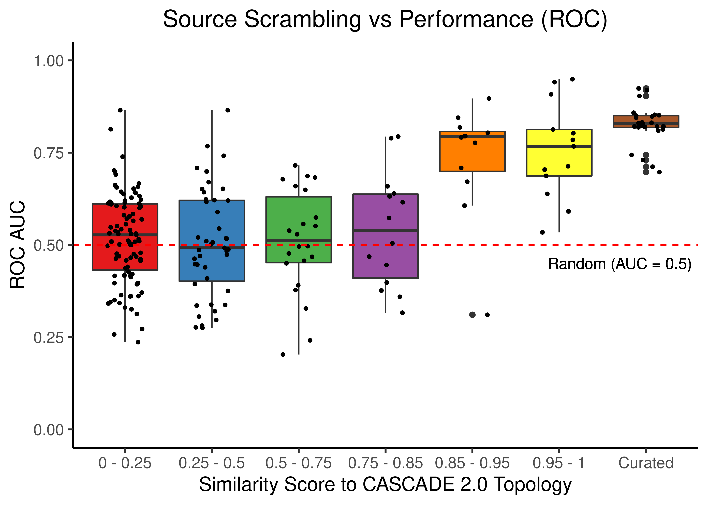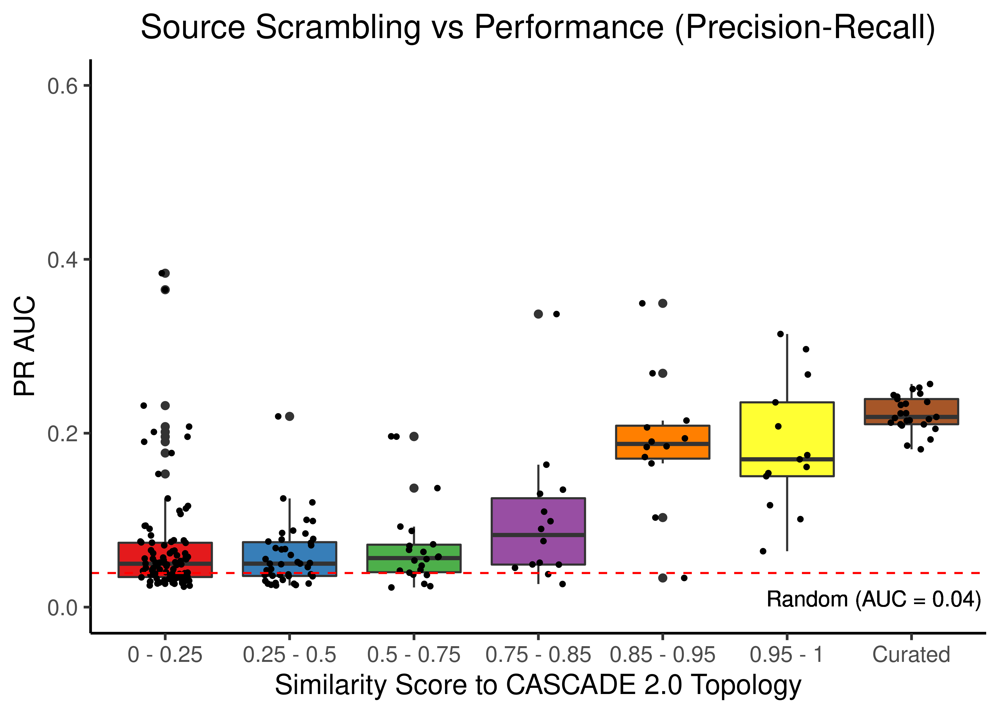
<p class="caption">(\#fig:src-scrambling-figs-2-cascade2)Source node scrambling topologies + curated CASCADE 2.0 topology bootstrapped results (ROC and PR AUC)</p>
</div>

### Target Scrambling {-}


```r
# ROC results
scrambled_topo_res %>%
  filter(scramble_type == 'target' | scramble_type == 'none', !is.na(roc_auc)) %>%
  ggplot(aes(x = grp, y = roc_auc, fill = grp)) +
  geom_boxplot(show.legend = FALSE) +
  scale_fill_brewer(palette = 'Set1') +
  geom_jitter(shape = 20, position = position_jitter(0.2), show.legend = FALSE) +
  ylim(c(0,1)) +
  labs(x = 'Similarity Score to CASCADE 2.0 Topology', y = 'ROC AUC', 
    title = "Target Scrambling vs Performance (ROC)") +
  theme_classic(base_size = 14) +
  geom_hline(yintercept = 0.5, linetype = 'dashed', color = "red") +
  geom_text(aes(x = 6.7, y = 0.45, label = "Random (AUC = 0.5)")) + 
  theme(plot.title = element_text(hjust = 0.5))

# PR results
scrambled_topo_res %>% 
  filter(scramble_type == 'target' | scramble_type == 'none', !is.na(pr_auc)) %>%
  ggplot(aes(x = grp, y = pr_auc, fill = grp)) + 
  geom_boxplot(show.legend = FALSE) + 
  scale_fill_brewer(palette = 'Set1') +
  geom_jitter(shape = 20, position = position_jitter(0.2), show.legend = FALSE) +
  ylim(c(0,0.6)) +
  labs(x = 'Similarity Score to CASCADE 2.0 Topology', y = 'PR AUC', 
    title = "Target Scrambling vs Performance (Precision-Recall)") +
  theme_classic(base_size = 14) +
  geom_hline(yintercept = sum(observed)/length(observed), linetype = 'dashed', color = "red") +
  geom_text(aes(x = 6.7, y = 0.01, label = "Random (AUC = 0.04)")) + 
  theme(plot.title = element_text(hjust = 0.5))
```

<div class="figure" style="text-align: center">
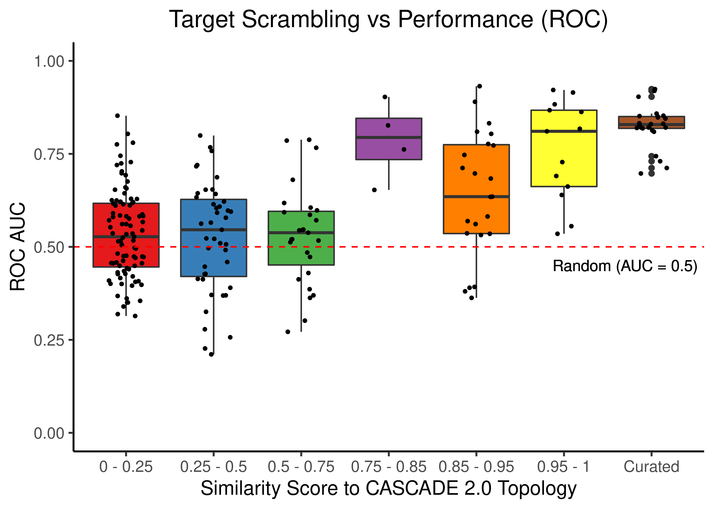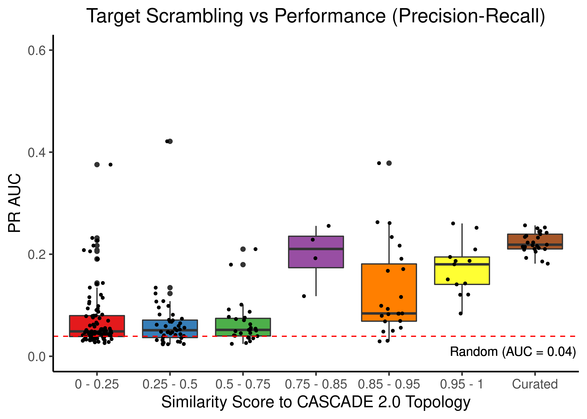
<p class="caption">(\#fig:trg-scrambling-figs-2-cascade2)Target node scrambling topologies + curated CASCADE 2.0 topology bootstrapped results (ROC and PR AUC)</p>
</div>

### Sign Inversion {-}


```r
# ROC results
scrambled_topo_res %>%
  filter(scramble_type == 'effect' | scramble_type == 'none', !is.na(roc_auc)) %>%
  ggplot(aes(x = grp, y = roc_auc, fill = grp)) +
  geom_boxplot(show.legend = FALSE) +
  scale_fill_brewer(palette = 'Set1') +
  geom_jitter(shape = 20, position = position_jitter(0.2), show.legend = FALSE) +
  ylim(c(0,1)) +
  labs(x = 'Similarity Score to CASCADE 2.0 Topology', y = 'ROC AUC', 
    title = "Sign Inversion vs Performance (ROC)") +
  theme_classic(base_size = 14) +
  geom_hline(yintercept = 0.5, linetype = 'dashed', color = "red") +
  geom_text(aes(x = 6.7, y = 0.45, label = "Random (AUC = 0.5)")) + 
  theme(plot.title = element_text(hjust = 0.5))

# PR results
scrambled_topo_res %>% 
  filter(scramble_type == 'effect' | scramble_type == 'none', !is.na(pr_auc)) %>%
  ggplot(aes(x = grp, y = pr_auc, fill = grp)) + 
  geom_boxplot(show.legend = FALSE) + 
  scale_fill_brewer(palette = 'Set1') +
  geom_jitter(shape = 20, position = position_jitter(0.2), show.legend = FALSE) +
  ylim(c(0,0.6)) +
  labs(x = 'Similarity Score to CASCADE 2.0 Topology', y = 'PR AUC', 
    title = "Sign Inversion vs Performance (Precision-Recall)") +
  theme_classic(base_size = 14) +
  geom_hline(yintercept = sum(observed)/length(observed), linetype = 'dashed', color = "red") +
  geom_text(aes(x = 6.5, y = 0.01, label = "Random (AUC = 0.04)")) +
  theme(plot.title = element_text(hjust = 0.5))
```

<div class="figure" style="text-align: center">
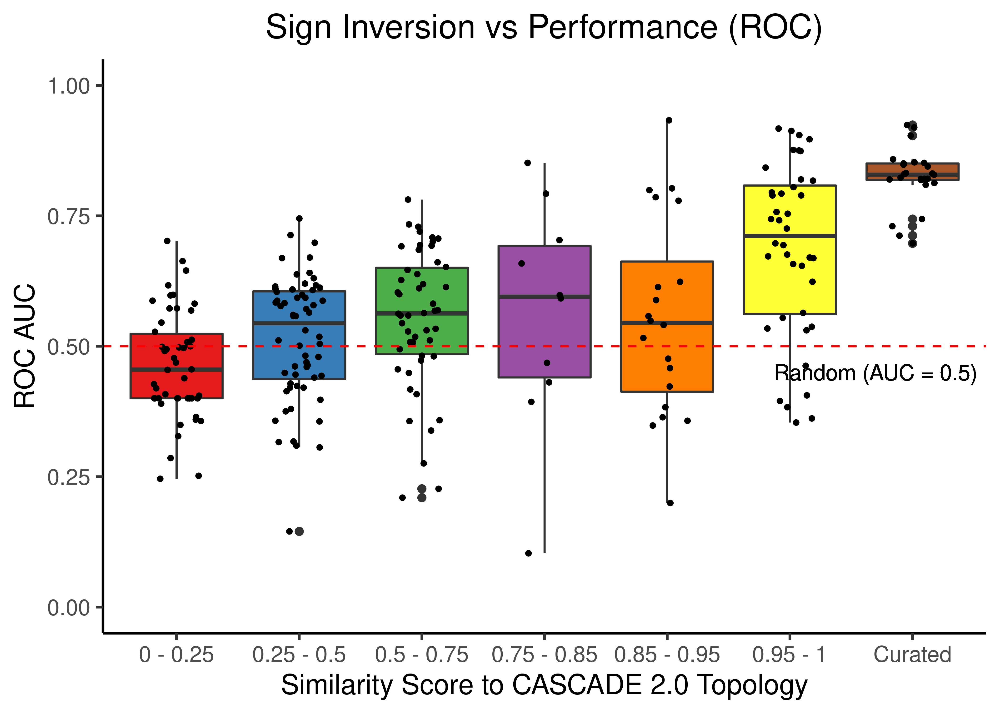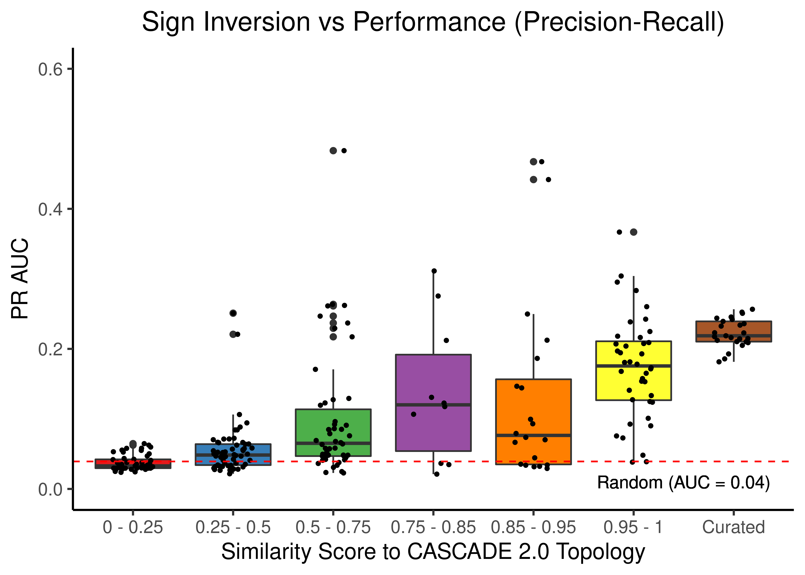
<p class="caption">(\#fig:sign-inv-scrambling-figs-2-cascade2)Sign Inverted topologies + curated CASCADE 2.0 topology bootstrapped results (ROC and PR AUC)</p>
</div>

### Source, Target Scrambling and Sign Inversion {-}


```r
# ROC results
scrambled_topo_res %>%
  filter(scramble_type == 'all' | scramble_type == 'none', !is.na(roc_auc)) %>%
  ggplot(aes(x = grp, y = roc_auc, fill = grp)) +
  geom_boxplot(show.legend = FALSE) +
  scale_fill_brewer(palette = 'Set1') +
  geom_jitter(shape = 20, position = position_jitter(0.2), show.legend = FALSE) +
  ylim(c(0,1)) +
  labs(x = 'Similarity Score to CASCADE 2.0 Topology', y = 'ROC AUC', 
    title = "All types of Scrambling vs Performance (ROC)") +
  theme_classic(base_size = 14) +
  geom_hline(yintercept = 0.5, linetype = 'dashed', color = "red") +
  geom_text(aes(x = 6.5, y = 0.45, label = "Random (AUC = 0.5)")) +
  theme(plot.title = element_text(hjust = 0.5))

# PR results
scrambled_topo_res %>% 
  filter(scramble_type == 'all' | scramble_type == 'none', !is.na(pr_auc)) %>%
  ggplot(aes(x = grp, y = pr_auc, fill = grp)) + 
  geom_boxplot(show.legend = FALSE) + 
  scale_fill_brewer(palette = 'Set1') +
  geom_jitter(shape = 20, position = position_jitter(0.2), show.legend = FALSE) +
  ylim(c(0,0.6)) +
  labs(x = 'Similarity Score to CASCADE 2.0 Topology', y = 'PR AUC', 
    title = "All types of Scrambling vs Performance (Precision-Recall)") +
  theme_classic(base_size = 14) +
  geom_hline(yintercept = sum(observed)/length(observed), linetype = 'dashed', color = "red") +
  geom_text(aes(x = 6.5, y = 0.01, label = "Random (AUC = 0.04)")) +
  theme(plot.title = element_text(hjust = 0.5))
```

<div class="figure" style="text-align: center">
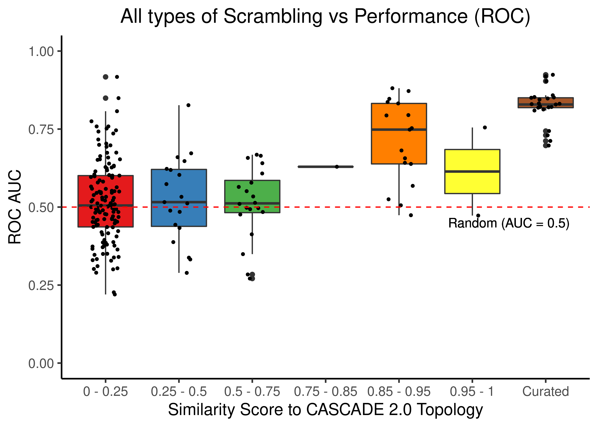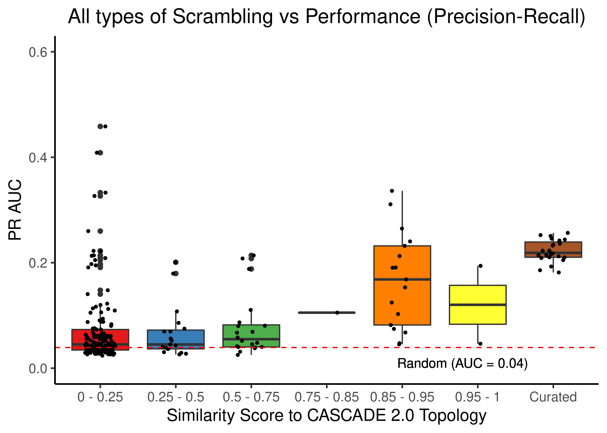
<p class="caption">(\#fig:all-scrambling-figs-2-cascade2)Source, Target node scrambling and sign inverted topologies + CASCADE 2.0 topology bootstrapped results (ROC and PR AUC)</p>
</div>

:::{.green-box}
We observe that even **a small perturbation/violation/scrambling** of the curated topology (of any type) produces results close to random prediction that are significantly lower than the prediction results when using the curated CASCADE 2.0 topology.

Note that even with **completely scrambled topologies** we get high ROC and PR AUC values (this is true for all types of scrambling expect the sign inversion), but these topologies (and the boolean ensemble model performance resulted from them) represent statistical outliers (they are more like the exception and not the rule so to speak).
:::

# CASCADE 2.0 Analysis (Topology Mutations) {-}

Load the results:

```r
# 'ss' => calibrated models, 'rand' => proliferative models (so not random but kind of!)
# 'ew' => ensemble-wise, 'mw' => modelwise

## HSA results ss
topo_ss_hsa_ew_50sim_file = paste0("results/topology-only/cascade_2.0_ss_50sim_fixpoints_hsa_ensemblewise_synergies.tab")
topo_ss_hsa_mw_50sim_file = paste0("results/topology-only/cascade_2.0_ss_50sim_fixpoints_hsa_modelwise_synergies.tab")
topo_ss_hsa_ew_150sim_file = paste0("results/topology-only/cascade_2.0_ss_150sim_fixpoints_hsa_ensemblewise_synergies.tab")
topo_ss_hsa_mw_150sim_file = paste0("results/topology-only/cascade_2.0_ss_150sim_fixpoints_hsa_modelwise_synergies.tab")

topo_ss_hsa_ew_synergies_50sim = emba::get_synergy_scores(topo_ss_hsa_ew_50sim_file)
topo_ss_hsa_mw_synergies_50sim = emba::get_synergy_scores(topo_ss_hsa_mw_50sim_file, file_type = "modelwise")
topo_ss_hsa_ew_synergies_150sim = emba::get_synergy_scores(topo_ss_hsa_ew_150sim_file)
topo_ss_hsa_mw_synergies_150sim = emba::get_synergy_scores(topo_ss_hsa_mw_150sim_file, file_type = "modelwise")

## HSA results rand
topo_prolif_hsa_ew_50sim_file = paste0("results/topology-only/cascade_2.0_rand_50sim_fixpoints_hsa_ensemblewise_synergies.tab")
topo_prolif_hsa_mw_50sim_file = paste0("results/topology-only/cascade_2.0_rand_50sim_fixpoints_hsa_modelwise_synergies.tab")
topo_prolif_hsa_ew_150sim_file = paste0("results/topology-only/cascade_2.0_rand_150sim_fixpoints_hsa_ensemblewise_synergies.tab")
topo_prolif_hsa_mw_150sim_file = paste0("results/topology-only/cascade_2.0_rand_150sim_fixpoints_hsa_modelwise_synergies.tab")

topo_prolif_hsa_ew_synergies_50sim = emba::get_synergy_scores(topo_prolif_hsa_ew_50sim_file)
topo_prolif_hsa_mw_synergies_50sim = emba::get_synergy_scores(topo_prolif_hsa_mw_50sim_file, file_type = "modelwise")
topo_prolif_hsa_ew_synergies_150sim = emba::get_synergy_scores(topo_prolif_hsa_ew_150sim_file)
topo_prolif_hsa_mw_synergies_150sim = emba::get_synergy_scores(topo_prolif_hsa_mw_150sim_file, file_type = "modelwise")

## Bliss results ss
topo_ss_bliss_ew_50sim_file = paste0("results/topology-only/cascade_2.0_ss_50sim_fixpoints_bliss_ensemblewise_synergies.tab")
topo_ss_bliss_mw_50sim_file = paste0("results/topology-only/cascade_2.0_ss_50sim_fixpoints_bliss_modelwise_synergies.tab")
topo_ss_bliss_ew_150sim_file = paste0("results/topology-only/cascade_2.0_ss_150sim_fixpoints_bliss_ensemblewise_synergies.tab")
topo_ss_bliss_mw_150sim_file = paste0("results/topology-only/cascade_2.0_ss_150sim_fixpoints_bliss_modelwise_synergies.tab")

topo_ss_bliss_ew_synergies_50sim = emba::get_synergy_scores(topo_ss_bliss_ew_50sim_file)
topo_ss_bliss_mw_synergies_50sim = emba::get_synergy_scores(topo_ss_bliss_mw_50sim_file, file_type = "modelwise")
topo_ss_bliss_ew_synergies_150sim = emba::get_synergy_scores(topo_ss_bliss_ew_150sim_file)
topo_ss_bliss_mw_synergies_150sim = emba::get_synergy_scores(topo_ss_bliss_mw_150sim_file, file_type = "modelwise")

## Bliss results rand
topo_prolif_bliss_ew_50sim_file = paste0("results/topology-only/cascade_2.0_rand_50sim_fixpoints_bliss_ensemblewise_synergies.tab")
topo_prolif_bliss_mw_50sim_file = paste0("results/topology-only/cascade_2.0_rand_50sim_fixpoints_bliss_modelwise_synergies.tab")
topo_prolif_bliss_ew_150sim_file = paste0("results/topology-only/cascade_2.0_rand_150sim_fixpoints_bliss_ensemblewise_synergies.tab")
topo_prolif_bliss_mw_150sim_file = paste0("results/topology-only/cascade_2.0_rand_150sim_fixpoints_bliss_modelwise_synergies.tab")

topo_prolif_bliss_ew_synergies_50sim = emba::get_synergy_scores(topo_prolif_bliss_ew_50sim_file)
topo_prolif_bliss_mw_synergies_50sim = emba::get_synergy_scores(topo_prolif_bliss_mw_50sim_file, file_type = "modelwise")
topo_prolif_bliss_ew_synergies_150sim = emba::get_synergy_scores(topo_prolif_bliss_ew_150sim_file)
topo_prolif_bliss_mw_synergies_150sim = emba::get_synergy_scores(topo_prolif_bliss_mw_150sim_file, file_type = "modelwise")

# calculate probability of synergy in the modelwise results
topo_ss_hsa_mw_synergies_50sim = topo_ss_hsa_mw_synergies_50sim %>% 
  mutate(synergy_prob_ss = synergies/(synergies + `non-synergies`))
topo_ss_hsa_mw_synergies_150sim = topo_ss_hsa_mw_synergies_150sim %>%
  mutate(synergy_prob_ss = synergies/(synergies + `non-synergies`))
topo_prolif_hsa_mw_synergies_50sim = topo_prolif_hsa_mw_synergies_50sim %>%
  mutate(synergy_prob_ss = synergies/(synergies + `non-synergies`))
topo_prolif_hsa_mw_synergies_150sim = topo_prolif_hsa_mw_synergies_150sim %>%
  mutate(synergy_prob_ss = synergies/(synergies + `non-synergies`))
topo_ss_bliss_mw_synergies_50sim = topo_ss_bliss_mw_synergies_50sim %>%
  mutate(synergy_prob_ss = synergies/(synergies + `non-synergies`))
topo_ss_bliss_mw_synergies_150sim = topo_ss_bliss_mw_synergies_150sim %>%
  mutate(synergy_prob_ss = synergies/(synergies + `non-synergies`))
topo_prolif_bliss_mw_synergies_50sim = topo_prolif_bliss_mw_synergies_50sim %>%
  mutate(synergy_prob_ss = synergies/(synergies + `non-synergies`))
topo_prolif_bliss_mw_synergies_150sim = topo_prolif_bliss_mw_synergies_150sim %>%
  mutate(synergy_prob_ss = synergies/(synergies + `non-synergies`))

# Tidy the data
pred_topo_ew_hsa = bind_cols(
  topo_ss_hsa_ew_synergies_50sim %>% rename(ss_score_50sim = score),
  topo_ss_hsa_ew_synergies_150sim %>% select(score) %>% rename(ss_score_150sim = score),
  topo_prolif_hsa_ew_synergies_50sim %>% select(score) %>% rename(prolif_score_50sim = score),
  topo_prolif_hsa_ew_synergies_150sim %>% select(score) %>% rename(prolif_score_150sim = score),
  as_tibble_col(observed, column_name = "observed"))

pred_topo_mw_hsa = bind_cols(
  topo_ss_hsa_mw_synergies_50sim %>% select(perturbation, synergy_prob_ss) %>% rename(synergy_prob_ss_50sim = synergy_prob_ss),
  topo_ss_hsa_mw_synergies_150sim %>% select(synergy_prob_ss) %>% rename(synergy_prob_ss_150sim = synergy_prob_ss),
  topo_prolif_hsa_mw_synergies_50sim %>% select(synergy_prob_ss) %>% rename(synergy_prob_prolif_50sim = synergy_prob_ss),
  topo_prolif_hsa_mw_synergies_150sim %>% select(synergy_prob_ss) %>% rename(synergy_prob_prolif_150sim = synergy_prob_ss),
  as_tibble_col(observed, column_name = "observed"))

pred_topo_ew_bliss = bind_cols(
  topo_ss_bliss_ew_synergies_50sim %>% rename(ss_score_50sim = score),
  topo_ss_bliss_ew_synergies_150sim %>% select(score) %>% rename(ss_score_150sim = score),
  topo_prolif_bliss_ew_synergies_50sim %>% select(score) %>% rename(prolif_score_50sim = score),
  topo_prolif_bliss_ew_synergies_150sim %>% select(score) %>% rename(prolif_score_150sim = score),
  as_tibble_col(observed, column_name = "observed"))

pred_topo_mw_bliss = bind_cols(
  topo_ss_bliss_mw_synergies_50sim %>% select(perturbation, synergy_prob_ss) %>% rename(synergy_prob_ss_50sim = synergy_prob_ss),
  topo_ss_bliss_mw_synergies_150sim %>% select(synergy_prob_ss) %>% rename(synergy_prob_ss_150sim = synergy_prob_ss),
  topo_prolif_bliss_mw_synergies_50sim %>% select(synergy_prob_ss) %>% rename(synergy_prob_prolif_50sim = synergy_prob_ss),
  topo_prolif_bliss_mw_synergies_150sim %>% select(synergy_prob_ss) %>% rename(synergy_prob_prolif_150sim = synergy_prob_ss),
  as_tibble_col(observed, column_name = "observed"))
```

## HSA Results {-}

:::{.note}
- *HSA* refers to the synergy method used in `Drabme` to assess the synergies from the `gitsbe` models
- We test performance using ROC and PR AUC for both the *ensemble-wise* and *model-wise* synergies from `Drabme`
- **Calibrated** models: fitted to steady state ($50,150$ simulations)
- **Random** models: fitted to [proliferation profile](https://druglogics.github.io/druglogics-doc/training-data.html#unperturbed-condition---globaloutput-response) ($50,150$ simulations)
- `Gitsbe` models have **only topology mutations** ($50$ mutations as a bootstrap value, $10$ after models with stable states are found)
:::

### ROC curves {-}


```r
topo_res_ss_ew_50sim = get_roc_stats(df = pred_topo_ew_hsa, pred_col = "ss_score_50sim", label_col = "observed")
topo_res_ss_ew_150sim = get_roc_stats(df = pred_topo_ew_hsa, pred_col = "ss_score_150sim", label_col = "observed")
topo_res_prolif_ew_50sim = get_roc_stats(df = pred_topo_ew_hsa, pred_col = "prolif_score_50sim", label_col = "observed")
topo_res_prolif_ew_150sim = get_roc_stats(df = pred_topo_ew_hsa, pred_col = "prolif_score_150sim", label_col = "observed")

topo_res_ss_mw_50sim = get_roc_stats(df = pred_topo_mw_hsa, pred_col = "synergy_prob_ss_50sim", label_col = "observed", direction = ">")
topo_res_ss_mw_150sim = get_roc_stats(df = pred_topo_mw_hsa, pred_col = "synergy_prob_ss_150sim", label_col = "observed", direction = ">")
topo_res_prolif_mw_50sim = get_roc_stats(df = pred_topo_mw_hsa, pred_col = "synergy_prob_prolif_50sim", label_col = "observed", direction = ">")
topo_res_prolif_mw_150sim = get_roc_stats(df = pred_topo_mw_hsa, pred_col = "synergy_prob_prolif_150sim", label_col = "observed", direction = ">")

# Plot ROCs
plot(x = topo_res_ss_ew_50sim$roc_stats$FPR, y = topo_res_ss_ew_50sim$roc_stats$TPR,
  type = 'l', lwd = 3, col = my_palette[1], main = 'ROC curve, Ensemble-wise synergies (HSA)',
  xlab = 'False Positive Rate (FPR)', ylab = 'True Positive Rate (TPR)')
lines(x = topo_res_ss_ew_150sim$roc_stats$FPR, y = topo_res_ss_ew_150sim$roc_stats$TPR,
  lwd = 3, col = my_palette[2])
lines(x = topo_res_prolif_ew_50sim$roc_stats$FPR, y = topo_res_prolif_ew_50sim$roc_stats$TPR,
  lwd = 3, col = my_palette[3])
lines(x = topo_res_prolif_ew_150sim$roc_stats$FPR, y = topo_res_prolif_ew_150sim$roc_stats$TPR,
  lwd = 3, col = my_palette[4])
legend('bottomright', title = 'AUC', col = my_palette[1:4], pch = 19,
  legend = c(paste(round(topo_res_ss_ew_50sim$AUC, digits = 2), "Calibrated (50 sim)"),
    paste(round(topo_res_ss_ew_150sim$AUC, digits = 2), "Calibrated (150 sim)"),
    paste(round(topo_res_prolif_ew_50sim$AUC, digits = 2), "Random (50 sim)"),
    paste(round(topo_res_prolif_ew_150sim$AUC, digits = 2), "Random (150 sim)")))
grid(lwd = 0.5)
abline(a = 0, b = 1, col = 'lightgrey', lty = 'dotdash', lwd = 1.2)

plot(x = topo_res_ss_mw_50sim$roc_stats$FPR, y = topo_res_ss_mw_50sim$roc_stats$TPR,
  type = 'l', lwd = 3, col = my_palette[1], main = 'ROC curve, Model-wise synergies (HSA)',
  xlab = 'False Positive Rate (FPR)', ylab = 'True Positive Rate (TPR)')
lines(x = topo_res_ss_mw_150sim$roc_stats$FPR, y = topo_res_ss_mw_150sim$roc_stats$TPR,
  lwd = 3, col = my_palette[2])
lines(x = topo_res_prolif_mw_50sim$roc_stats$FPR, y = topo_res_prolif_mw_50sim$roc_stats$TPR,
  lwd = 3, col = my_palette[3])
lines(x = topo_res_prolif_mw_150sim$roc_stats$FPR, y = topo_res_prolif_mw_150sim$roc_stats$TPR,
  lwd = 3, col = my_palette[4])
legend('bottomright', title = 'AUC', col = my_palette[1:4], pch = 19,
  legend = c(paste(round(topo_res_ss_mw_50sim$AUC, digits = 2), "Calibrated (50 sim)"),
    paste(round(topo_res_ss_mw_150sim$AUC, digits = 2), "Calibrated (150 sim)"),
    paste(round(topo_res_prolif_mw_50sim$AUC, digits = 2), "Random (50 sim)"),
    paste(round(topo_res_prolif_mw_150sim$AUC, digits = 2), "Random (150 sim)")))
grid(lwd = 0.5)
abline(a = 0, b = 1, col = 'lightgrey', lty = 'dotdash', lwd = 1.2)
```

<div class="figure" style="text-align: center">

<p class="caption">(\#fig:roc-hsa-cascade2-topo)ROC curves (CASCADE 2.0, Topology Mutations, HSA synergy method)</p>
</div>

### PR curves {-}


```r
pr_topo_res_ss_ew_50sim = pr.curve(scores.class0 = pred_topo_ew_hsa %>% pull(ss_score_50sim) %>% (function(x) {-x}), 
  weights.class0 = pred_topo_ew_hsa %>% pull(observed), curve = TRUE, rand.compute = TRUE)
pr_topo_res_ss_ew_150sim = pr.curve(scores.class0 = pred_topo_ew_hsa %>% pull(ss_score_150sim) %>% (function(x) {-x}), 
  weights.class0 = pred_topo_ew_hsa %>% pull(observed), curve = TRUE)
pr_topo_res_prolif_ew_50sim = pr.curve(scores.class0 = pred_topo_ew_hsa %>% pull(prolif_score_50sim) %>% (function(x) {-x}), 
  weights.class0 = pred_topo_ew_hsa %>% pull(observed), curve = TRUE)
pr_topo_res_prolif_ew_150sim = pr.curve(scores.class0 = pred_topo_ew_hsa %>% pull(prolif_score_150sim) %>% (function(x) {-x}), 
  weights.class0 = pred_topo_ew_hsa %>% pull(observed), curve = TRUE)

pr_topo_res_ss_mw_50sim = pr.curve(scores.class0 = pred_topo_mw_hsa %>% pull(synergy_prob_ss_50sim),
  weights.class0 = pred_topo_mw_hsa %>% pull(observed), curve = TRUE, rand.compute = TRUE)
pr_topo_res_ss_mw_150sim = pr.curve(scores.class0 = pred_topo_mw_hsa %>% pull(synergy_prob_ss_150sim),
  weights.class0 = pred_topo_mw_hsa %>% pull(observed), curve = TRUE)
pr_topo_res_prolif_mw_50sim = pr.curve(scores.class0 = pred_topo_mw_hsa %>% pull(synergy_prob_prolif_50sim),
  weights.class0 = pred_topo_mw_hsa %>% pull(observed), curve = TRUE)
pr_topo_res_prolif_mw_150sim = pr.curve(scores.class0 = pred_topo_mw_hsa %>% pull(synergy_prob_prolif_150sim),
  weights.class0 = pred_topo_mw_hsa %>% pull(observed), curve = TRUE)

plot(pr_topo_res_ss_ew_50sim, main = 'PR curve, Ensemble-wise synergies (HSA)',
  auc.main = FALSE, color = my_palette[1], rand.plot = TRUE)
plot(pr_topo_res_ss_ew_150sim, add = TRUE, color = my_palette[2])
plot(pr_topo_res_prolif_ew_50sim, add = TRUE, color = my_palette[3])
plot(pr_topo_res_prolif_ew_150sim, add = TRUE, color = my_palette[4])
legend('topright', title = 'AUC', col = my_palette[1:4], pch = 19,
  legend = c(paste(round(pr_topo_res_ss_ew_50sim$auc.davis.goadrich, digits = 3), "Calibrated (50 sim)"),
    paste(round(pr_topo_res_ss_ew_150sim$auc.davis.goadrich, digits = 3), "Calibrated (150 sim)"),
    paste(round(pr_topo_res_prolif_ew_50sim$auc.davis.goadrich, digits = 3), "Random (50 sim)"),
    paste(round(pr_topo_res_prolif_ew_150sim$auc.davis.goadrich, digits = 3), "Random (150 sim)")))
grid(lwd = 0.5)

plot(pr_topo_res_ss_mw_50sim, main = 'PR curve, Model-wise synergies (HSA)',
  auc.main = FALSE, color = my_palette[1], rand.plot = TRUE)
plot(pr_topo_res_ss_mw_150sim, add = TRUE, color = my_palette[2])
plot(pr_topo_res_prolif_mw_50sim, add = TRUE, color = my_palette[3])
plot(pr_topo_res_prolif_mw_150sim, add = TRUE, color = my_palette[4])
legend('topright', title = 'AUC', col = my_palette[1:4], pch = 19,
  legend = c(paste(round(pr_topo_res_ss_mw_50sim$auc.davis.goadrich, digits = 3), "Calibrated (50 sim)"),
    paste(round(pr_topo_res_ss_mw_150sim$auc.davis.goadrich, digits = 3), "Calibrated (150 sim)"),
    paste(round(pr_topo_res_prolif_mw_50sim$auc.davis.goadrich, digits = 3), "Random (50 sim)"),
    paste(round(pr_topo_res_prolif_mw_150sim$auc.davis.goadrich, digits = 3), "Random (150 sim)")))
grid(lwd = 0.5)
```

<div class="figure" style="text-align: center">

<p class="caption">(\#fig:pr-hsa-cascade2-topo)PR curves (CASCADE 2.0, Topology Mutations, HSA synergy method)</p>
</div>

:::{.green-box}
- The PR curves show that the **performance of each individual predictor is poor** compared to the baseline.
Someone looking at the ROC curves only might reach a different conclusion.
- *Random proliferative* models perform slightly better than the *calibrated* ones.
- The *model-wise* approach produces slightly better ROC results than the *ensemble-wise* approach.
:::

### AUC sensitivity {-}

Investigate same thing as described in [here](#auc-sensitivity).
This is very crucial since the PR performance is poor for the individual predictors, but a combined predictor might be able to counter this.
We will combine the synergy scores from the *random proliferative* simulations with the results from the *calibrated* Gitsbe simulations (number of simulations: $150$).


```r
# Ensemble-wise
betas = seq(from = -5, to = 5, by = 0.1)

prolif_roc_topo = sapply(betas, function(beta) {
  pred_topo_ew_hsa = pred_topo_ew_hsa %>% mutate(combined_score = ss_score_150sim + beta * prolif_score_150sim)
  res = roc.curve(scores.class0 = pred_topo_ew_hsa %>% pull(combined_score) %>% (function(x) {-x}), 
    weights.class0 = pred_topo_ew_hsa %>% pull(observed))
  auc_value = res$auc
})

prolif_pr_topo = sapply(betas, function(beta) {
  pred_topo_ew_hsa = pred_topo_ew_hsa %>% mutate(combined_score = ss_score_150sim + beta * prolif_score_150sim)
  res = pr.curve(scores.class0 = pred_topo_ew_hsa %>% pull(combined_score) %>% (function(x) {-x}), 
    weights.class0 = pred_topo_ew_hsa %>% pull(observed))
  auc_value = res$auc.davis.goadrich
})

df_ew = as_tibble(cbind(betas, prolif_roc_topo, prolif_pr_topo))
df_ew = df_ew %>% tidyr::pivot_longer(-betas, names_to = "type", values_to = "AUC")

ggline(data = df_ew, x = "betas", y = "AUC", numeric.x.axis = TRUE, color = "type",
  plot_type = "l", xlab = TeX("$\\beta$"), ylab = "AUC (Area Under Curve)", 
  legend = "none", facet.by = "type", palette = my_palette, ylim = c(0,0.85),
  panel.labs = list(type = c("Precision-Recall", "ROC")),
  title = TeX("AUC sensitivity to $\\beta$ parameter")) + 
  theme(plot.title = element_text(hjust = 0.5)) +
  geom_vline(xintercept = 0) +
  geom_vline(xintercept = -1, color = "black", size = 0.3, linetype = "dashed") + 
  geom_text(aes(x=-1.5, label="β = -1", y=0.14), colour="black", angle=90) +
  grids()
```

<div class="figure" style="text-align: center">

<p class="caption">(\#fig:auc-sen-ew-hsa-cascade2-topo)AUC sensitivity (CASCADE 2.0, Topology Mutations, HSA synergy method, Ensemble-wise results)</p>
</div>

:::{.green-box}
- The proliferative models do not bring any significant change to the prediction performance of the calibrated models.
:::

## Bliss Results {-}

:::{.note}
- *Bliss* refers to the synergy method used in `Drabme` to assess the synergies from the `gitsbe` models
- We test performance using ROC and PR AUC for both the *ensemble-wise* and *model-wise* synergies from `Drabme`
- **Calibrated** models: fitted to steady state ($50,150$ simulations)
- **Random** models: fitted to [proliferation profile](https://druglogics.github.io/druglogics-doc/training-data.html#unperturbed-condition---globaloutput-response) ($50,150$ simulations)
- `Gitsbe` models have **only topology mutations** ($50$ mutations as a bootstrap value, $10$ after models with stable states are found)
:::

### ROC curves {-}


```r
topo_res_ss_ew_50sim = get_roc_stats(df = pred_topo_ew_bliss, pred_col = "ss_score_50sim", label_col = "observed")
topo_res_ss_ew_150sim = get_roc_stats(df = pred_topo_ew_bliss, pred_col = "ss_score_150sim", label_col = "observed")
topo_res_prolif_ew_50sim = get_roc_stats(df = pred_topo_ew_bliss, pred_col = "prolif_score_50sim", label_col = "observed")
topo_res_prolif_ew_150sim = get_roc_stats(df = pred_topo_ew_bliss, pred_col = "prolif_score_150sim", label_col = "observed")

topo_res_ss_mw_50sim = get_roc_stats(df = pred_topo_mw_bliss, pred_col = "synergy_prob_ss_50sim", label_col = "observed", direction = ">")
topo_res_ss_mw_150sim = get_roc_stats(df = pred_topo_mw_bliss, pred_col = "synergy_prob_ss_150sim", label_col = "observed", direction = ">")
topo_res_prolif_mw_50sim = get_roc_stats(df = pred_topo_mw_bliss, pred_col = "synergy_prob_prolif_50sim", label_col = "observed", direction = ">")
topo_res_prolif_mw_150sim = get_roc_stats(df = pred_topo_mw_bliss, pred_col = "synergy_prob_prolif_150sim", label_col = "observed", direction = ">")

# Plot ROCs
plot(x = topo_res_ss_ew_50sim$roc_stats$FPR, y = topo_res_ss_ew_50sim$roc_stats$TPR,
  type = 'l', lwd = 3, col = my_palette[1], main = 'ROC curve, Ensemble-wise synergies (Bliss)',
  xlab = 'False Positive Rate (FPR)', ylab = 'True Positive Rate (TPR)')
lines(x = topo_res_ss_ew_150sim$roc_stats$FPR, y = topo_res_ss_ew_150sim$roc_stats$TPR,
  lwd = 3, col = my_palette[2])
lines(x = topo_res_prolif_ew_50sim$roc_stats$FPR, y = topo_res_prolif_ew_50sim$roc_stats$TPR,
  lwd = 3, col = my_palette[3])
lines(x = topo_res_prolif_ew_150sim$roc_stats$FPR, y = topo_res_prolif_ew_150sim$roc_stats$TPR,
  lwd = 3, col = my_palette[4])
legend('bottomright', title = 'AUC', col = my_palette[1:4], pch = 19,
  legend = c(paste(round(topo_res_ss_ew_50sim$AUC, digits = 2), "Calibrated (50 sim)"),
    paste(round(topo_res_ss_ew_150sim$AUC, digits = 2), "Calibrated (150 sim)"),
    paste(round(topo_res_prolif_ew_50sim$AUC, digits = 2), "Random (50 sim)"),
    paste(round(topo_res_prolif_ew_150sim$AUC, digits = 2), "Random (150 sim)")))
grid(lwd = 0.5)
abline(a = 0, b = 1, col = 'lightgrey', lty = 'dotdash', lwd = 1.2)

plot(x = topo_res_ss_mw_50sim$roc_stats$FPR, y = topo_res_ss_mw_50sim$roc_stats$TPR,
  type = 'l', lwd = 3, col = my_palette[1], main = 'ROC curve, Model-wise synergies (Bliss)',
  xlab = 'False Positive Rate (FPR)', ylab = 'True Positive Rate (TPR)')
lines(x = topo_res_ss_mw_150sim$roc_stats$FPR, y = topo_res_ss_mw_150sim$roc_stats$TPR,
  lwd = 3, col = my_palette[2])
lines(x = topo_res_prolif_mw_50sim$roc_stats$FPR, y = topo_res_prolif_mw_50sim$roc_stats$TPR,
  lwd = 3, col = my_palette[3])
lines(x = topo_res_prolif_mw_150sim$roc_stats$FPR, y = topo_res_prolif_mw_150sim$roc_stats$TPR,
  lwd = 3, col = my_palette[4])
legend('bottomright', title = 'AUC', col = my_palette[1:4], pch = 19,
  legend = c(paste(round(topo_res_ss_mw_50sim$AUC, digits = 2), "Calibrated (50 sim)"),
    paste(round(topo_res_ss_mw_150sim$AUC, digits = 2), "Calibrated (150 sim)"),
    paste(round(topo_res_prolif_mw_50sim$AUC, digits = 2), "Random (50 sim)"),
    paste(round(topo_res_prolif_mw_150sim$AUC, digits = 2), "Random (150 sim)")))
grid(lwd = 0.5)
abline(a = 0, b = 1, col = 'lightgrey', lty = 'dotdash', lwd = 1.2)
```

<div class="figure" style="text-align: center">

<p class="caption">(\#fig:roc-bliss-cascade2-topo)ROC curves (CASCADE 2.0, Topology Mutations, Bliss synergy method)</p>
</div>

### PR curves {-}


```r
pr_topo_res_ss_ew_50sim = pr.curve(scores.class0 = pred_topo_ew_bliss %>% pull(ss_score_50sim) %>% (function(x) {-x}), 
  weights.class0 = pred_topo_ew_bliss %>% pull(observed), curve = TRUE, rand.compute = TRUE)
pr_topo_res_ss_ew_150sim = pr.curve(scores.class0 = pred_topo_ew_bliss %>% pull(ss_score_150sim) %>% (function(x) {-x}), 
  weights.class0 = pred_topo_ew_bliss %>% pull(observed), curve = TRUE)
pr_topo_res_prolif_ew_50sim = pr.curve(scores.class0 = pred_topo_ew_bliss %>% pull(prolif_score_50sim) %>% (function(x) {-x}), 
  weights.class0 = pred_topo_ew_bliss %>% pull(observed), curve = TRUE)
pr_topo_res_prolif_ew_150sim = pr.curve(scores.class0 = pred_topo_ew_bliss %>% pull(prolif_score_150sim) %>% (function(x) {-x}), 
  weights.class0 = pred_topo_ew_bliss %>% pull(observed), curve = TRUE)

pr_topo_res_ss_mw_50sim = pr.curve(scores.class0 = pred_topo_mw_bliss %>% pull(synergy_prob_ss_50sim),
  weights.class0 = pred_topo_mw_bliss %>% pull(observed), curve = TRUE, rand.compute = TRUE)
pr_topo_res_ss_mw_150sim = pr.curve(scores.class0 = pred_topo_mw_bliss %>% pull(synergy_prob_ss_150sim),
  weights.class0 = pred_topo_mw_bliss %>% pull(observed), curve = TRUE)
pr_topo_res_prolif_mw_50sim = pr.curve(scores.class0 = pred_topo_mw_bliss %>% pull(synergy_prob_prolif_50sim),
  weights.class0 = pred_topo_mw_bliss %>% pull(observed), curve = TRUE)
pr_topo_res_prolif_mw_150sim = pr.curve(scores.class0 = pred_topo_mw_bliss %>% pull(synergy_prob_prolif_150sim),
  weights.class0 = pred_topo_mw_bliss %>% pull(observed), curve = TRUE)

plot(pr_topo_res_ss_ew_50sim, main = 'PR curve, Ensemble-wise synergies (Bliss)',
  auc.main = FALSE, color = my_palette[1], rand.plot = TRUE)
plot(pr_topo_res_ss_ew_150sim, add = TRUE, color = my_palette[2])
plot(pr_topo_res_prolif_ew_50sim, add = TRUE, color = my_palette[3])
plot(pr_topo_res_prolif_ew_150sim, add = TRUE, color = my_palette[4])
legend('topright', title = 'AUC', col = my_palette[1:4], pch = 19,
  legend = c(paste(round(pr_topo_res_ss_ew_50sim$auc.davis.goadrich, digits = 3), "Calibrated (50 sim)"),
    paste(round(pr_topo_res_ss_ew_150sim$auc.davis.goadrich, digits = 3), "Calibrated (150 sim)"),
    paste(round(pr_topo_res_prolif_ew_50sim$auc.davis.goadrich, digits = 3), "Random (50 sim)"),
    paste(round(pr_topo_res_prolif_ew_150sim$auc.davis.goadrich, digits = 3), "Random (150 sim)")))
grid(lwd = 0.5)

plot(pr_topo_res_ss_mw_50sim, main = 'PR curve, Model-wise synergies (Bliss)',
  auc.main = FALSE, color = my_palette[1], rand.plot = TRUE)
plot(pr_topo_res_ss_mw_150sim, add = TRUE, color = my_palette[2])
plot(pr_topo_res_prolif_mw_50sim, add = TRUE, color = my_palette[3])
plot(pr_topo_res_prolif_mw_150sim, add = TRUE, color = my_palette[4])
legend('topright', title = 'AUC', col = my_palette[1:4], pch = 19,
  legend = c(paste(round(pr_topo_res_ss_mw_50sim$auc.davis.goadrich, digits = 3), "Calibrated (50 sim)"),
    paste(round(pr_topo_res_ss_mw_150sim$auc.davis.goadrich, digits = 3), "Calibrated (150 sim)"),
    paste(round(pr_topo_res_prolif_mw_50sim$auc.davis.goadrich, digits = 3), "Random (50 sim)"),
    paste(round(pr_topo_res_prolif_mw_150sim$auc.davis.goadrich, digits = 3), "Random (150 sim)")))
grid(lwd = 0.5)
```

<div class="figure" style="text-align: center">

<p class="caption">(\#fig:pr-bliss-cascade2-topo)PR curves (CASCADE 2.0, Topology Mutations, Bliss synergy method)</p>
</div>

:::{.green-box}
- The PR curves show that the **performance of all individual predictors is poor** compared to the baseline.
- *Random proliferative* models perform slightly better than the *calibrated* ones.
- The *model-wise* approach produces slightly better ROC and PR results than the *ensemble-wise* approach
:::

### AUC sensitivity {-}

Investigate same thing as described in [here](#auc-sensitivity).
This is very crucial since the PR performance is poor for the individual predictors, but a combined predictor might be able to counter this.
We will combine the synergy scores from the *random proliferative* simulations with the results from the *calibrated* Gitsbe simulations (number of simulations: $150$).


```r
# Ensemble-wise
betas = seq(from = -5, to = 5, by = 0.1)

prolif_roc = sapply(betas, function(beta) {
  pred_topo_ew_bliss = pred_topo_ew_bliss %>% mutate(combined_score = ss_score_150sim + beta * prolif_score_150sim)
  res = roc.curve(scores.class0 = pred_topo_ew_bliss %>% pull(combined_score) %>% (function(x) {-x}), 
    weights.class0 = pred_topo_ew_bliss %>% pull(observed))
  auc_value = res$auc
})

prolif_pr = sapply(betas, function(beta) {
  pred_topo_ew_bliss = pred_topo_ew_bliss %>% mutate(combined_score = ss_score_150sim + beta * prolif_score_150sim)
  res = pr.curve(scores.class0 = pred_topo_ew_bliss %>% pull(combined_score) %>% (function(x) {-x}), 
    weights.class0 = pred_topo_ew_bliss %>% pull(observed))
  auc_value = res$auc.davis.goadrich
})

df_ew = as_tibble(cbind(betas, prolif_roc, prolif_pr))
df_ew = df_ew %>% tidyr::pivot_longer(-betas, names_to = "type", values_to = "AUC")

ggline(data = df_ew, x = "betas", y = "AUC", numeric.x.axis = TRUE, color = "type",
  plot_type = "l", xlab = TeX("$\\beta$"), ylab = "AUC (Area Under Curve)", 
  legend = "none", facet.by = "type", palette = my_palette, ylim = c(0,0.85),
  panel.labs = list(type = c("Precision-Recall", "ROC")),
  title = TeX("AUC sensitivity to $\\beta$ parameter")) + 
  theme(plot.title = element_text(hjust = 0.5)) +
  geom_vline(xintercept = 0) +
  geom_vline(xintercept = -1, color = "black", size = 0.3, linetype = "dashed") + 
  geom_text(aes(x=-1.5, label="β = -1", y=0.15), colour="black", angle = 90) + 
  grids()
```

<div class="figure" style="text-align: center">

<p class="caption">(\#fig:auc-sen-ew-bliss-cascade2-topo)AUC sensitivity (CASCADE 2.0, Topology Mutations, Bliss synergy method, Ensemble-wise results)</p>
</div>

:::{.green-box}
- The proliferative models can be used to normalize against the predictions of the calibrated models and thus bring significant contribution to the calibrated models performance (both ROC-AUC and PR-AUC are increased).
- The $\beta_{best}$ values of the **combined calibrated and random proliferative model predictor** that maximize the ROC-AUC and PR-AUC respectively are $\beta_{best}^{\text{ROC-AUC}}=-0.8$ and $\beta_{best}^{\text{PR-AUC}}=-1$
:::

## Best ROC and PRC {-}

For the **Bliss ensemble-wise results** we demonstrated above that a value of $\beta_{best}=-1$ can result in significant performance gain of the combined predictor ($calibrated + \beta \times random$).
So, the best ROC and PR curves we can get with our simulations when using models with topology mutations are:


```r
best_beta = -1
pred_topo_ew_bliss = pred_topo_ew_bliss %>% mutate(best_score = ss_score_150sim + best_beta * prolif_score_150sim)

roc_best_res = get_roc_stats(df = pred_topo_ew_bliss, pred_col = "best_score", label_col = "observed")
pr_best_res = pr.curve(scores.class0 = pred_topo_ew_bliss %>% pull(best_score) %>% (function(x) {-x}), 
    weights.class0 = pred_topo_ew_bliss %>% pull(observed), curve = TRUE, rand.compute = TRUE)

# Plot best ROC
plot(x = roc_best_res$roc_stats$FPR, y = roc_best_res$roc_stats$TPR,
  type = 'l', lwd = 3, col = my_palette[1], main = TeX('ROC curve (Ensemble-wise), $calibrated + \\beta \\times random$'),
  xlab = 'False Positive Rate (FPR)', ylab = 'True Positive Rate (TPR)')
legend('bottomright', title = TeX('AUC ($\\beta$ = -1)'), col = my_palette[1], pch = 19,
  legend = paste(round(roc_best_res$AUC, digits = 2), 'Bliss (150 sim)'), cex = 1.5)
grid(lwd = 0.5)
abline(a = 0, b = 1, col = 'lightgrey', lty = 'dotdash', lwd = 1.2)

# Plot best PRC
plot(pr_best_res, main = TeX('PR curve (Ensemble-wise), $calibrated + \\beta \\times random$'),
  auc.main = FALSE, color = my_palette[2], rand.plot = TRUE)
legend('topright', title = TeX('AUC ($\\beta$ = -1)'), col = my_palette[2], pch = 19,
  legend = paste(round(pr_best_res$auc.davis.goadrich, digits = 2), 'Bliss (150 sim)'), cex = 1.5)
grid(lwd = 0.5)
```

<div class="figure" style="text-align: center">

<p class="caption">(\#fig:best-beta-cascade2-topo)ROC and PR curve for best beta (CASCADE 2.0, Topology Mutations)</p>
</div>

## Fitness vs Ensemble Performance {-#fit-vs-ens-perf-topo}

:::{.blue-box}
We check for correlation between the **calibrated models fitness to the AGS steady state** and their **ensemble performance** subject to normalization to the random model predictions.

The **main idea** here is that we generate different training data samples, in which the boolean steady state nodes have their values flipped (so they are only partially correct) and we fit models to these ($50$ simulations => $150$ topology-mutated models per training data, $205$ training data samples in total).
These calibrated model ensembles can then be tested for their prediction performance.
Then we use the ensemble-wise *random proliferative* model predictions ($50$ simulations) to normalize ($\beta=-1$) against the calibrated model predictions and compute the **AUC ROC and AUC PR for each model ensemble**.
:::

:::{.note}
Check how to generate the appropriate data, run the simulations and tidy up the results in the section [Fitness vs Performance Methods].
:::

Load the already-stored result:

```r
res = readRDS(file = "data/res_fit_aucs_topo.rds")
```

We check if our data is normally distributed using the *Shapiro-Wilk* normality test:

```r
shapiro.test(x = res$roc_auc)
```

```

	Shapiro-Wilk normality test

data:  res$roc_auc
W = 0.98463, p-value = 0.02488
```

```r
shapiro.test(x = res$pr_auc)
```

```

	Shapiro-Wilk normality test

data:  res$pr_auc
W = 0.92214, p-value = 6.025e-09
```

```r
shapiro.test(x = res$avg_fit)
```

```

	Shapiro-Wilk normality test

data:  res$avg_fit
W = 0.88305, p-value = 1.609e-11
```

We observe from the low *p-values* that the **data is not normally distributed**.
Thus, we are going to use a non-parametric correlation metric, namely the **Kendall rank-based** test (and it's respective coefficient, $\tau$), to check for correlation between the ensemble model performance (ROC-AUC, PR-AUC) and the fitness to the AGS steady state:

```r
ggscatter(data = res, x = "avg_fit", y = "roc_auc",
  xlab = "Average Fitness per Model Ensemble",
  title = "Fitness to AGS Steady State vs Performance (ROC)",
  ylab = "ROC AUC", add = "reg.line", conf.int = TRUE,
  add.params = list(color = "blue", fill = "lightgray"),
  cor.coef = TRUE, cor.coeff.args = list(method = "kendall", size = 6, cor.coef.name = "tau")) +
  theme(plot.title = element_text(hjust = 0.5))
```

<div class="figure" style="text-align: center">
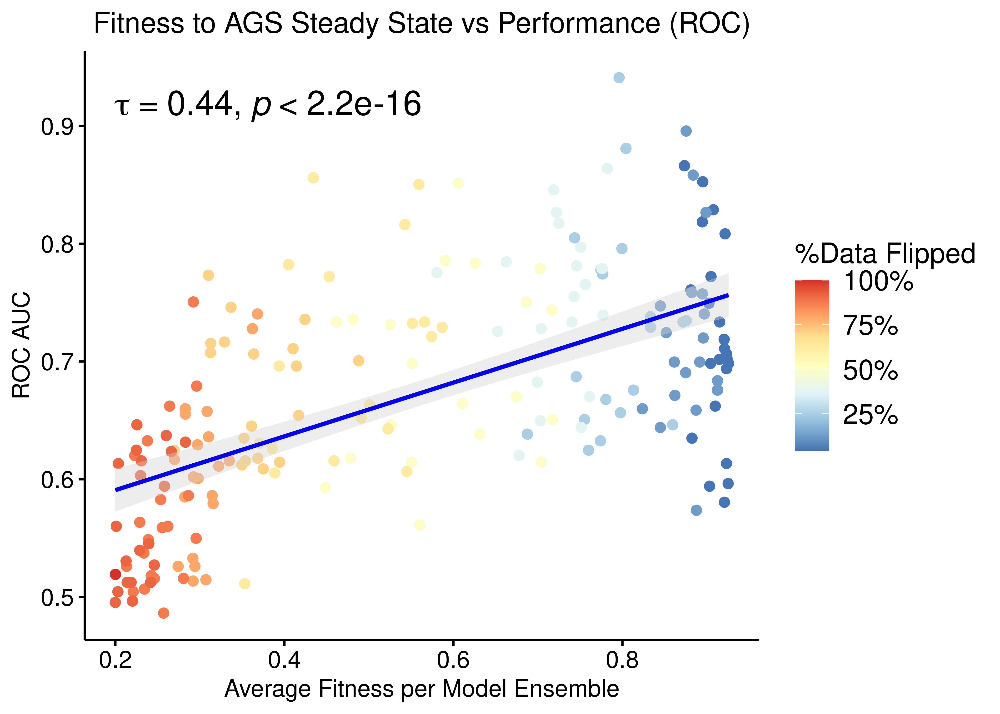
<p class="caption">(\#fig:fit-vs-perf-roc-topo)Fitness to AGS Steady State vs ROC-AUC Performance (CASCADE 2.0, Topology mutations, Bliss synergy method, Ensemble-wise normalized results)</p>
</div>


```r
ggscatter(data = res, x = "avg_fit", y = "pr_auc",
  xlab = "Average Fitness per Model Ensemble",
  title = "Fitness to AGS Steady State vs Performance (Precision-Recall)",
  add.params = list(color = "blue", fill = "lightgray"),
  ylab = "PR AUC", add = "reg.line", conf.int = TRUE,
  cor.coef = TRUE, cor.coeff.args = list(method = "kendall", size = 6, cor.coef.name = "tau")) +
  theme(plot.title = element_text(hjust = 0.5))
```

<div class="figure" style="text-align: center">
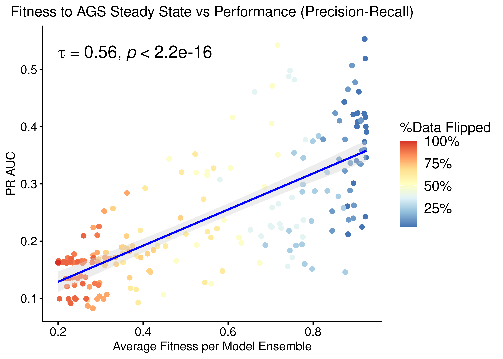
<p class="caption">(\#fig:fit-vs-perf-pr-topo)Fitness to AGS Steady State vs PR-AUC Performance (CASCADE 2.0, Topology Mutations, Bliss synergy method, Ensemble-wise normalized results)</p>
</div>

:::{.green-box}
- We observe that there exists **some correlation between the normalized ensemble model performance vs the models fitness to the training steady state data**.
- Correlation results are *better* than when applying link-operator mutations to the models.
The topology mutations offer a larger variation in performance in terms of both ROC and PR AUC, given the limited set of provided steady state nodes for calibration of the models (24 out of 144 in total for the AGS cell line).
- The performance as measured by the ROC AUC is less sensitive to changes in the training data but there is better correlation with regards to the PR AUC, which is a more informative measure for our imbalanced dataset [@Saito2015].
:::

# CASCADE 2.0 Analysis (Topology and Link Operator Mutations) {-}


```r
# 'ss' => calibrated models, 'rand' => proliferative models (so not random but kind of!)
# 'ew' => ensemble-wise, 'mw' => modelwise

## HSA results ss
topolink_ss_hsa_ew_50sim_file = paste0("results/topo-and-link/cascade_2.0_ss_50sim_fixpoints_hsa_ensemblewise_synergies.tab")
topolink_ss_hsa_mw_50sim_file = paste0("results/topo-and-link/cascade_2.0_ss_50sim_fixpoints_hsa_modelwise_synergies.tab")
topolink_ss_hsa_ew_150sim_file = paste0("results/topo-and-link/cascade_2.0_ss_150sim_fixpoints_hsa_ensemblewise_synergies.tab")
topolink_ss_hsa_mw_150sim_file = paste0("results/topo-and-link/cascade_2.0_ss_150sim_fixpoints_hsa_modelwise_synergies.tab")

topolink_ss_hsa_ew_synergies_50sim = emba::get_synergy_scores(topolink_ss_hsa_ew_50sim_file)
topolink_ss_hsa_mw_synergies_50sim = emba::get_synergy_scores(topolink_ss_hsa_mw_50sim_file, file_type = "modelwise")
topolink_ss_hsa_ew_synergies_150sim = emba::get_synergy_scores(topolink_ss_hsa_ew_150sim_file)
topolink_ss_hsa_mw_synergies_150sim = emba::get_synergy_scores(topolink_ss_hsa_mw_150sim_file, file_type = "modelwise")

## HSA results rand
topolink_prolif_hsa_ew_50sim_file = paste0("results/topo-and-link/cascade_2.0_rand_50sim_fixpoints_hsa_ensemblewise_synergies.tab")
topolink_prolif_hsa_mw_50sim_file = paste0("results/topo-and-link/cascade_2.0_rand_50sim_fixpoints_hsa_modelwise_synergies.tab")
topolink_prolif_hsa_ew_150sim_file = paste0("results/topo-and-link/cascade_2.0_rand_150sim_fixpoints_hsa_ensemblewise_synergies.tab")
topolink_prolif_hsa_mw_150sim_file = paste0("results/topo-and-link/cascade_2.0_rand_150sim_fixpoints_hsa_modelwise_synergies.tab")

topolink_prolif_hsa_ew_synergies_50sim = emba::get_synergy_scores(topolink_prolif_hsa_ew_50sim_file)
topolink_prolif_hsa_mw_synergies_50sim = emba::get_synergy_scores(topolink_prolif_hsa_mw_50sim_file, file_type = "modelwise")
topolink_prolif_hsa_ew_synergies_150sim = emba::get_synergy_scores(topolink_prolif_hsa_ew_150sim_file)
topolink_prolif_hsa_mw_synergies_150sim = emba::get_synergy_scores(topolink_prolif_hsa_mw_150sim_file, file_type = "modelwise")

## Bliss results ss
topolink_ss_bliss_ew_50sim_file = paste0("results/topo-and-link/cascade_2.0_ss_50sim_fixpoints_bliss_ensemblewise_synergies.tab")
topolink_ss_bliss_mw_50sim_file = paste0("results/topo-and-link/cascade_2.0_ss_50sim_fixpoints_bliss_modelwise_synergies.tab")
topolink_ss_bliss_ew_150sim_file = paste0("results/topo-and-link/cascade_2.0_ss_150sim_fixpoints_bliss_ensemblewise_synergies.tab")
topolink_ss_bliss_mw_150sim_file = paste0("results/topo-and-link/cascade_2.0_ss_150sim_fixpoints_bliss_modelwise_synergies.tab")

topolink_ss_bliss_ew_synergies_50sim = emba::get_synergy_scores(topolink_ss_bliss_ew_50sim_file)
topolink_ss_bliss_mw_synergies_50sim = emba::get_synergy_scores(topolink_ss_bliss_mw_50sim_file, file_type = "modelwise")
topolink_ss_bliss_ew_synergies_150sim = emba::get_synergy_scores(topolink_ss_bliss_ew_150sim_file)
topolink_ss_bliss_mw_synergies_150sim = emba::get_synergy_scores(topolink_ss_bliss_mw_150sim_file, file_type = "modelwise")

## Bliss results rand
topolink_prolif_bliss_ew_50sim_file = paste0("results/topo-and-link/cascade_2.0_rand_50sim_fixpoints_bliss_ensemblewise_synergies.tab")
topolink_prolif_bliss_mw_50sim_file = paste0("results/topo-and-link/cascade_2.0_rand_50sim_fixpoints_bliss_modelwise_synergies.tab")
topolink_prolif_bliss_ew_150sim_file = paste0("results/topo-and-link/cascade_2.0_rand_150sim_fixpoints_bliss_ensemblewise_synergies.tab")
topolink_prolif_bliss_mw_150sim_file = paste0("results/topo-and-link/cascade_2.0_rand_150sim_fixpoints_bliss_modelwise_synergies.tab")

topolink_prolif_bliss_ew_synergies_50sim = emba::get_synergy_scores(topolink_prolif_bliss_ew_50sim_file)
topolink_prolif_bliss_mw_synergies_50sim = emba::get_synergy_scores(topolink_prolif_bliss_mw_50sim_file, file_type = "modelwise")
topolink_prolif_bliss_ew_synergies_150sim = emba::get_synergy_scores(topolink_prolif_bliss_ew_150sim_file)
topolink_prolif_bliss_mw_synergies_150sim = emba::get_synergy_scores(topolink_prolif_bliss_mw_150sim_file, file_type = "modelwise")

# calculate probability of synergy in the modelwise results
topolink_ss_hsa_mw_synergies_50sim = topolink_ss_hsa_mw_synergies_50sim %>% 
  mutate(synergy_prob_ss = synergies/(synergies + `non-synergies`))
topolink_ss_hsa_mw_synergies_150sim = topolink_ss_hsa_mw_synergies_150sim %>%
  mutate(synergy_prob_ss = synergies/(synergies + `non-synergies`))
topolink_prolif_hsa_mw_synergies_50sim = topolink_prolif_hsa_mw_synergies_50sim %>%
  mutate(synergy_prob_ss = synergies/(synergies + `non-synergies`))
topolink_prolif_hsa_mw_synergies_150sim = topolink_prolif_hsa_mw_synergies_150sim %>%
  mutate(synergy_prob_ss = synergies/(synergies + `non-synergies`))
topolink_ss_bliss_mw_synergies_50sim = topolink_ss_bliss_mw_synergies_50sim %>%
  mutate(synergy_prob_ss = synergies/(synergies + `non-synergies`))
topolink_ss_bliss_mw_synergies_150sim = topolink_ss_bliss_mw_synergies_150sim %>%
  mutate(synergy_prob_ss = synergies/(synergies + `non-synergies`))
topolink_prolif_bliss_mw_synergies_50sim = topolink_prolif_bliss_mw_synergies_50sim %>%
  mutate(synergy_prob_ss = synergies/(synergies + `non-synergies`))
topolink_prolif_bliss_mw_synergies_150sim = topolink_prolif_bliss_mw_synergies_150sim %>%
  mutate(synergy_prob_ss = synergies/(synergies + `non-synergies`))

# Tidy the data
pred_topolink_ew_hsa = bind_cols(
  topolink_ss_hsa_ew_synergies_50sim %>% rename(ss_score_50sim = score),
  topolink_ss_hsa_ew_synergies_150sim %>% select(score) %>% rename(ss_score_150sim = score),
  topolink_prolif_hsa_ew_synergies_50sim %>% select(score) %>% rename(prolif_score_50sim = score),
  topolink_prolif_hsa_ew_synergies_150sim %>% select(score) %>% rename(prolif_score_150sim = score),
  as_tibble_col(observed, column_name = "observed"))

pred_topolink_mw_hsa = bind_cols(
  topolink_ss_hsa_mw_synergies_50sim %>% select(perturbation, synergy_prob_ss) %>% rename(synergy_prob_ss_50sim = synergy_prob_ss),
  topolink_ss_hsa_mw_synergies_150sim %>% select(synergy_prob_ss) %>% rename(synergy_prob_ss_150sim = synergy_prob_ss),
  topolink_prolif_hsa_mw_synergies_50sim %>% select(synergy_prob_ss) %>% rename(synergy_prob_prolif_50sim = synergy_prob_ss),
  topolink_prolif_hsa_mw_synergies_150sim %>% select(synergy_prob_ss) %>% rename(synergy_prob_prolif_150sim = synergy_prob_ss),
  as_tibble_col(observed, column_name = "observed"))

pred_topolink_ew_bliss = bind_cols(
  topolink_ss_bliss_ew_synergies_50sim %>% rename(ss_score_50sim = score),
  topolink_ss_bliss_ew_synergies_150sim %>% select(score) %>% rename(ss_score_150sim = score),
  topolink_prolif_bliss_ew_synergies_50sim %>% select(score) %>% rename(prolif_score_50sim = score),
  topolink_prolif_bliss_ew_synergies_150sim %>% select(score) %>% rename(prolif_score_150sim = score),
  as_tibble_col(observed, column_name = "observed"))

pred_topolink_mw_bliss = bind_cols(
  topolink_ss_bliss_mw_synergies_50sim %>% select(perturbation, synergy_prob_ss) %>% rename(synergy_prob_ss_50sim = synergy_prob_ss),
  topolink_ss_bliss_mw_synergies_150sim %>% select(synergy_prob_ss) %>% rename(synergy_prob_ss_150sim = synergy_prob_ss),
  topolink_prolif_bliss_mw_synergies_50sim %>% select(synergy_prob_ss) %>% rename(synergy_prob_prolif_50sim = synergy_prob_ss),
  topolink_prolif_bliss_mw_synergies_150sim %>% select(synergy_prob_ss) %>% rename(synergy_prob_prolif_150sim = synergy_prob_ss),
  as_tibble_col(observed, column_name = "observed"))
```

## HSA Results {-}

:::{.note}
- *HSA* refers to the synergy method used in `Drabme` to assess the synergies from the `gitsbe` models
- We test performance using ROC and PR AUC for both the *ensemble-wise* and *model-wise* synergies from `Drabme`
- **Calibrated** models: fitted to steady state ($50,150$ simulations)
- **Random** models: fitted to [proliferation profile](https://druglogics.github.io/druglogics-doc/training-data.html#unperturbed-condition---globaloutput-response) ($50,150$ simulations)
- `Gitsbe` models have **both balance and topology mutations** ($3000,50$ mutations as a bootstrap value, $3$ and $10$ respectively after models with stable states are found)
:::

### ROC curves {-}


```r
topolink_res_ss_ew_50sim = get_roc_stats(df = pred_topolink_ew_hsa, pred_col = "ss_score_50sim", label_col = "observed")
topolink_res_ss_ew_150sim = get_roc_stats(df = pred_topolink_ew_hsa, pred_col = "ss_score_150sim", label_col = "observed")
topolink_res_prolif_ew_50sim = get_roc_stats(df = pred_topolink_ew_hsa, pred_col = "prolif_score_50sim", label_col = "observed")
topolink_res_prolif_ew_150sim = get_roc_stats(df = pred_topolink_ew_hsa, pred_col = "prolif_score_150sim", label_col = "observed")

topolink_res_ss_mw_50sim = get_roc_stats(df = pred_topolink_mw_hsa, pred_col = "synergy_prob_ss_50sim", label_col = "observed", direction = ">")
topolink_res_ss_mw_150sim = get_roc_stats(df = pred_topolink_mw_hsa, pred_col = "synergy_prob_ss_150sim", label_col = "observed", direction = ">")
topolink_res_prolif_mw_50sim = get_roc_stats(df = pred_topolink_mw_hsa, pred_col = "synergy_prob_prolif_50sim", label_col = "observed", direction = ">")
topolink_res_prolif_mw_150sim = get_roc_stats(df = pred_topolink_mw_hsa, pred_col = "synergy_prob_prolif_150sim", label_col = "observed", direction = ">")

# Plot ROCs
plot(x = topolink_res_ss_ew_50sim$roc_stats$FPR, y = topolink_res_ss_ew_50sim$roc_stats$TPR,
  type = 'l', lwd = 3, col = my_palette[1], main = 'ROC curve, Ensemble-wise synergies (HSA)',
  xlab = 'False Positive Rate (FPR)', ylab = 'True Positive Rate (TPR)')
lines(x = topolink_res_ss_ew_150sim$roc_stats$FPR, y = topolink_res_ss_ew_150sim$roc_stats$TPR,
  lwd = 3, col = my_palette[2])
lines(x = topolink_res_prolif_ew_50sim$roc_stats$FPR, y = topolink_res_prolif_ew_50sim$roc_stats$TPR,
  lwd = 3, col = my_palette[3])
lines(x = topolink_res_prolif_ew_150sim$roc_stats$FPR, y = topolink_res_prolif_ew_150sim$roc_stats$TPR,
  lwd = 3, col = my_palette[4])
legend('bottomright', title = 'AUC', col = my_palette[1:4], pch = 19,
  legend = c(paste(round(topolink_res_ss_ew_50sim$AUC, digits = 2), "Calibrated (50 sim)"),
    paste(round(topolink_res_ss_ew_150sim$AUC, digits = 2), "Calibrated (150 sim)"),
    paste(round(topolink_res_prolif_ew_50sim$AUC, digits = 2), "Random (50 sim)"),
    paste(round(topolink_res_prolif_ew_150sim$AUC, digits = 2), "Random (150 sim)")))
grid(lwd = 0.5)
abline(a = 0, b = 1, col = 'lightgrey', lty = 'dotdash', lwd = 1.2)

plot(x = topolink_res_ss_mw_50sim$roc_stats$FPR, y = topolink_res_ss_mw_50sim$roc_stats$TPR,
  type = 'l', lwd = 3, col = my_palette[1], main = 'ROC curve, Model-wise synergies (HSA)',
  xlab = 'False Positive Rate (FPR)', ylab = 'True Positive Rate (TPR)')
lines(x = topolink_res_ss_mw_150sim$roc_stats$FPR, y = topolink_res_ss_mw_150sim$roc_stats$TPR,
  lwd = 3, col = my_palette[2])
lines(x = topolink_res_prolif_mw_50sim$roc_stats$FPR, y = topolink_res_prolif_mw_50sim$roc_stats$TPR,
  lwd = 3, col = my_palette[3])
lines(x = topolink_res_prolif_mw_150sim$roc_stats$FPR, y = topolink_res_prolif_mw_150sim$roc_stats$TPR,
  lwd = 3, col = my_palette[4])
legend('bottomright', title = 'AUC', col = my_palette[1:4], pch = 19,
  legend = c(paste(round(topolink_res_ss_mw_50sim$AUC, digits = 2), "Calibrated (50 sim)"),
    paste(round(topolink_res_ss_mw_150sim$AUC, digits = 2), "Calibrated (150 sim)"),
    paste(round(topolink_res_prolif_mw_50sim$AUC, digits = 2), "Random (50 sim)"),
    paste(round(topolink_res_prolif_mw_150sim$AUC, digits = 2), "Random (150 sim)")))
grid(lwd = 0.5)
abline(a = 0, b = 1, col = 'lightgrey', lty = 'dotdash', lwd = 1.2)
```

<div class="figure" style="text-align: center">
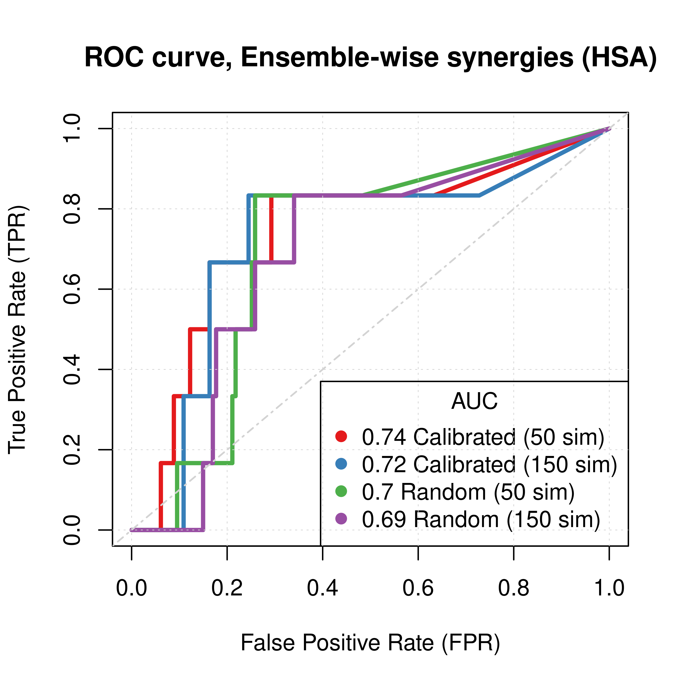
<p class="caption">(\#fig:roc-hsa-cascade2-topo-and-link)ROC curves (CASCADE 2.0, Link Operator and Topology Mutations, HSA synergy method)</p>
</div>

### PR curves {-}


```r
pr_topolink_res_ss_ew_50sim = pr.curve(scores.class0 = pred_topolink_ew_hsa %>% pull(ss_score_50sim) %>% (function(x) {-x}), 
  weights.class0 = pred_topolink_ew_hsa %>% pull(observed), curve = TRUE, rand.compute = TRUE)
pr_topolink_res_ss_ew_150sim = pr.curve(scores.class0 = pred_topolink_ew_hsa %>% pull(ss_score_150sim) %>% (function(x) {-x}), 
  weights.class0 = pred_topolink_ew_hsa %>% pull(observed), curve = TRUE)
pr_topolink_res_prolif_ew_50sim = pr.curve(scores.class0 = pred_topolink_ew_hsa %>% pull(prolif_score_50sim) %>% (function(x) {-x}), 
  weights.class0 = pred_topolink_ew_hsa %>% pull(observed), curve = TRUE)
pr_topolink_res_prolif_ew_150sim = pr.curve(scores.class0 = pred_topolink_ew_hsa %>% pull(prolif_score_150sim) %>% (function(x) {-x}), 
  weights.class0 = pred_topolink_ew_hsa %>% pull(observed), curve = TRUE)

pr_topolink_res_ss_mw_50sim = pr.curve(scores.class0 = pred_topolink_mw_hsa %>% pull(synergy_prob_ss_50sim),
  weights.class0 = pred_topolink_mw_hsa %>% pull(observed), curve = TRUE, rand.compute = TRUE)
pr_topolink_res_ss_mw_150sim = pr.curve(scores.class0 = pred_topolink_mw_hsa %>% pull(synergy_prob_ss_150sim),
  weights.class0 = pred_topolink_mw_hsa %>% pull(observed), curve = TRUE)
pr_topolink_res_prolif_mw_50sim = pr.curve(scores.class0 = pred_topolink_mw_hsa %>% pull(synergy_prob_prolif_50sim),
  weights.class0 = pred_topolink_mw_hsa %>% pull(observed), curve = TRUE)
pr_topolink_res_prolif_mw_150sim = pr.curve(scores.class0 = pred_topolink_mw_hsa %>% pull(synergy_prob_prolif_150sim),
  weights.class0 = pred_topolink_mw_hsa %>% pull(observed), curve = TRUE)

plot(pr_topolink_res_ss_ew_50sim, main = 'PR curve, Ensemble-wise synergies (HSA)',
  auc.main = FALSE, color = my_palette[1], rand.plot = TRUE)
plot(pr_topolink_res_ss_ew_150sim, add = TRUE, color = my_palette[2])
plot(pr_topolink_res_prolif_ew_50sim, add = TRUE, color = my_palette[3])
plot(pr_topolink_res_prolif_ew_150sim, add = TRUE, color = my_palette[4])
legend('topright', title = 'AUC', col = my_palette[1:4], pch = 19,
  legend = c(paste(round(pr_topolink_res_ss_ew_50sim$auc.davis.goadrich, digits = 3), "Calibrated (50 sim)"),
    paste(round(pr_topolink_res_ss_ew_150sim$auc.davis.goadrich, digits = 3), "Calibrated (150 sim)"),
    paste(round(pr_topolink_res_prolif_ew_50sim$auc.davis.goadrich, digits = 3), "Random (50 sim)"),
    paste(round(pr_topolink_res_prolif_ew_150sim$auc.davis.goadrich, digits = 3), "Random (150 sim)")))
grid(lwd = 0.5)

plot(pr_topolink_res_ss_mw_50sim, main = 'PR curve, Model-wise synergies (HSA)',
  auc.main = FALSE, color = my_palette[1], rand.plot = TRUE)
plot(pr_topolink_res_ss_mw_150sim, add = TRUE, color = my_palette[2])
plot(pr_topolink_res_prolif_mw_50sim, add = TRUE, color = my_palette[3])
plot(pr_topolink_res_prolif_mw_150sim, add = TRUE, color = my_palette[4])
legend('topright', title = 'AUC', col = my_palette[1:4], pch = 19,
  legend = c(paste(round(pr_topolink_res_ss_mw_50sim$auc.davis.goadrich, digits = 3), "Calibrated (50 sim)"),
    paste(round(pr_topolink_res_ss_mw_150sim$auc.davis.goadrich, digits = 3), "Calibrated (150 sim)"),
    paste(round(pr_topolink_res_prolif_mw_50sim$auc.davis.goadrich, digits = 3), "Random (50 sim)"),
    paste(round(pr_topolink_res_prolif_mw_150sim$auc.davis.goadrich, digits = 3), "Random (150 sim)")))
grid(lwd = 0.5)
```

<div class="figure" style="text-align: center">
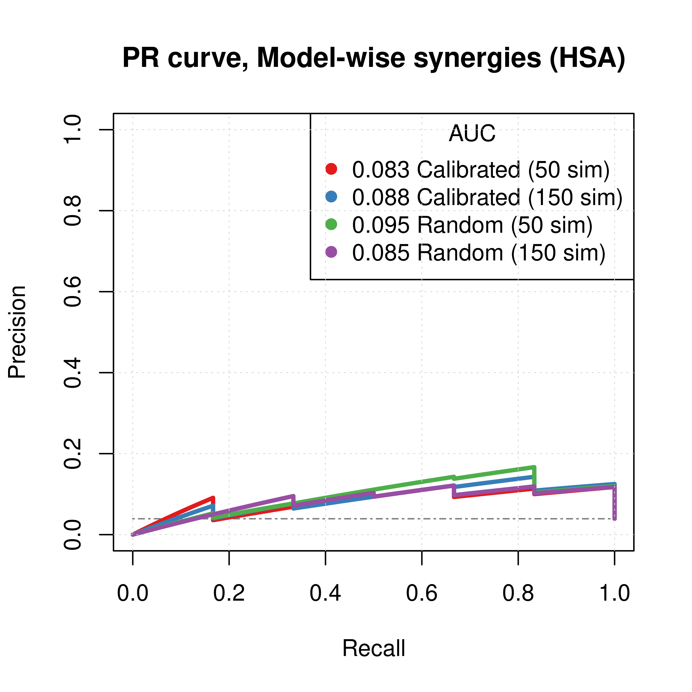
<p class="caption">(\#fig:pr-hsa-cascade2-topo-and-link)PR curves (CASCADE 2.0, Link Operator and Topology Mutations, HSA synergy method)</p>
</div>

:::{.green-box}
- The PR curves show that the **performance of each individual predictor is poor** compared to the baseline.
Someone looking at the ROC curves only might reach a different conclusion.
- The *model-wise* approach produces slightly better ROC results than the *ensemble-wise* approach.
:::

### AUC sensitivity {-}

Investigate same thing as described in [here](#auc-sensitivity).
This is very crucial since the PR performance is poor for the individual predictors, but a combined predictor might be able to counter this.
We will combine the synergy scores from the *random proliferative* simulations with the results from the *calibrated* Gitsbe simulations (number of simulations: $150$).


```r
# Ensemble-wise
betas = seq(from = -5, to = 5, by = 0.1)

prolif_roc_topo = sapply(betas, function(beta) {
  pred_topolink_ew_hsa = pred_topolink_ew_hsa %>% mutate(combined_score = ss_score_150sim + beta * prolif_score_150sim)
  res = roc.curve(scores.class0 = pred_topolink_ew_hsa %>% pull(combined_score) %>% (function(x) {-x}), 
    weights.class0 = pred_topolink_ew_hsa %>% pull(observed))
  auc_value = res$auc
})

prolif_pr_topo = sapply(betas, function(beta) {
  pred_topolink_ew_hsa = pred_topolink_ew_hsa %>% mutate(combined_score = ss_score_150sim + beta * prolif_score_150sim)
  res = pr.curve(scores.class0 = pred_topolink_ew_hsa %>% pull(combined_score) %>% (function(x) {-x}), 
    weights.class0 = pred_topolink_ew_hsa %>% pull(observed))
  auc_value = res$auc.davis.goadrich
})

df_ew = as_tibble(cbind(betas, prolif_roc_topo, prolif_pr_topo))
df_ew = df_ew %>% tidyr::pivot_longer(-betas, names_to = "type", values_to = "AUC")

ggline(data = df_ew, x = "betas", y = "AUC", numeric.x.axis = TRUE, color = "type",
  plot_type = "l", xlab = TeX("$\\beta$"), ylab = "AUC (Area Under Curve)", 
  legend = "none", facet.by = "type", palette = my_palette, ylim = c(0,0.85),
  panel.labs = list(type = c("Precision-Recall", "ROC")),
  title = TeX("AUC sensitivity to $\\beta$ parameter")) + 
  theme(plot.title = element_text(hjust = 0.5)) +
  geom_vline(xintercept = 0) +
  geom_vline(xintercept = -1, color = "black", size = 0.3, linetype = "dashed") + 
  geom_text(aes(x=-1.6, label="β = -1", y=0.33), colour="black", angle=90) +
  grids()
```

<div class="figure" style="text-align: center">

<p class="caption">(\#fig:auc-sen-ew-hsa-cascade2-topo-and-link)AUC sensitivity (CASCADE 2.0, Link Operator and Topology Mutations, HSA synergy method, Ensemble-wise results)</p>
</div>

:::{.green-box}
- The random proliferative models can be used to normalize against the predictions of the calibrated models and thus bring significant contribution to the calibrated models performance (PR-AUC shows much more sensitivity in that regard - it increases substantially more than the ROC-AUC).
- The $\beta_{best}$ value of the **combined calibrated and random proliferative model predictor** that maximizes both the ROC-AUC and PR-AUC is $\beta_{best}=-1$.
:::

## Bliss Results {-}

:::{.note}
- *Bliss* refers to the synergy method used in `Drabme` to assess the synergies from the `gitsbe` models
- We test performance using ROC and PR AUC for both the *ensemble-wise* and *model-wise* synergies from `Drabme`
- **Calibrated** models: fitted to steady state ($50,150$ simulations)
- **Random** models: fitted to [proliferation profile](https://druglogics.github.io/druglogics-doc/training-data.html#unperturbed-condition---globaloutput-response) ($50,150$ simulations)
- `Gitsbe` models have  **both balance and topology mutations** ($3000,50$ mutations as a bootstrap value, $3$ and $10$ respectively after models with stable states are found)
:::

### ROC curves {-}


```r
topolink_res_ss_ew_50sim = get_roc_stats(df = pred_topolink_ew_bliss, pred_col = "ss_score_50sim", label_col = "observed")
topolink_res_ss_ew_150sim = get_roc_stats(df = pred_topolink_ew_bliss, pred_col = "ss_score_150sim", label_col = "observed")
topolink_res_prolif_ew_50sim = get_roc_stats(df = pred_topolink_ew_bliss, pred_col = "prolif_score_50sim", label_col = "observed")
topolink_res_prolif_ew_150sim = get_roc_stats(df = pred_topolink_ew_bliss, pred_col = "prolif_score_150sim", label_col = "observed")

topolink_res_ss_mw_50sim = get_roc_stats(df = pred_topolink_mw_bliss, pred_col = "synergy_prob_ss_50sim", label_col = "observed", direction = ">")
topolink_res_ss_mw_150sim = get_roc_stats(df = pred_topolink_mw_bliss, pred_col = "synergy_prob_ss_150sim", label_col = "observed", direction = ">")
topolink_res_prolif_mw_50sim = get_roc_stats(df = pred_topolink_mw_bliss, pred_col = "synergy_prob_prolif_50sim", label_col = "observed", direction = ">")
topolink_res_prolif_mw_150sim = get_roc_stats(df = pred_topolink_mw_bliss, pred_col = "synergy_prob_prolif_150sim", label_col = "observed", direction = ">")

# Plot ROCs
plot(x = topolink_res_ss_ew_50sim$roc_stats$FPR, y = topolink_res_ss_ew_50sim$roc_stats$TPR,
  type = 'l', lwd = 3, col = my_palette[1], main = 'ROC curve, Ensemble-wise synergies (Bliss)',
  xlab = 'False Positive Rate (FPR)', ylab = 'True Positive Rate (TPR)')
lines(x = topolink_res_ss_ew_150sim$roc_stats$FPR, y = topolink_res_ss_ew_150sim$roc_stats$TPR,
  lwd = 3, col = my_palette[2])
lines(x = topolink_res_prolif_ew_50sim$roc_stats$FPR, y = topolink_res_prolif_ew_50sim$roc_stats$TPR,
  lwd = 3, col = my_palette[3])
lines(x = topolink_res_prolif_ew_150sim$roc_stats$FPR, y = topolink_res_prolif_ew_150sim$roc_stats$TPR,
  lwd = 3, col = my_palette[4])
legend('bottomright', title = 'AUC', col = my_palette[1:4], pch = 19,
  legend = c(paste(round(topolink_res_ss_ew_50sim$AUC, digits = 2), "Calibrated (50 sim)"),
    paste(round(topolink_res_ss_ew_150sim$AUC, digits = 2), "Calibrated (150 sim)"),
    paste(round(topolink_res_prolif_ew_50sim$AUC, digits = 2), "Random (50 sim)"),
    paste(round(topolink_res_prolif_ew_150sim$AUC, digits = 2), "Random (150 sim)")))
grid(lwd = 0.5)
abline(a = 0, b = 1, col = 'lightgrey', lty = 'dotdash', lwd = 1.2)

plot(x = topolink_res_ss_mw_50sim$roc_stats$FPR, y = topolink_res_ss_mw_50sim$roc_stats$TPR,
  type = 'l', lwd = 3, col = my_palette[1], main = 'ROC curve, Model-wise synergies (Bliss)',
  xlab = 'False Positive Rate (FPR)', ylab = 'True Positive Rate (TPR)')
lines(x = topolink_res_ss_mw_150sim$roc_stats$FPR, y = topolink_res_ss_mw_150sim$roc_stats$TPR,
  lwd = 3, col = my_palette[2])
lines(x = topolink_res_prolif_mw_50sim$roc_stats$FPR, y = topolink_res_prolif_mw_50sim$roc_stats$TPR,
  lwd = 3, col = my_palette[3])
lines(x = topolink_res_prolif_mw_150sim$roc_stats$FPR, y = topolink_res_prolif_mw_150sim$roc_stats$TPR,
  lwd = 3, col = my_palette[4])
legend('bottomright', title = 'AUC', col = my_palette[1:4], pch = 19,
  legend = c(paste(round(topolink_res_ss_mw_50sim$AUC, digits = 2), "Calibrated (50 sim)"),
    paste(round(topolink_res_ss_mw_150sim$AUC, digits = 2), "Calibrated (150 sim)"),
    paste(round(topolink_res_prolif_mw_50sim$AUC, digits = 2), "Random (50 sim)"),
    paste(round(topolink_res_prolif_mw_150sim$AUC, digits = 2), "Random (150 sim)")))
grid(lwd = 0.5)
abline(a = 0, b = 1, col = 'lightgrey', lty = 'dotdash', lwd = 1.2)
```

<div class="figure" style="text-align: center">
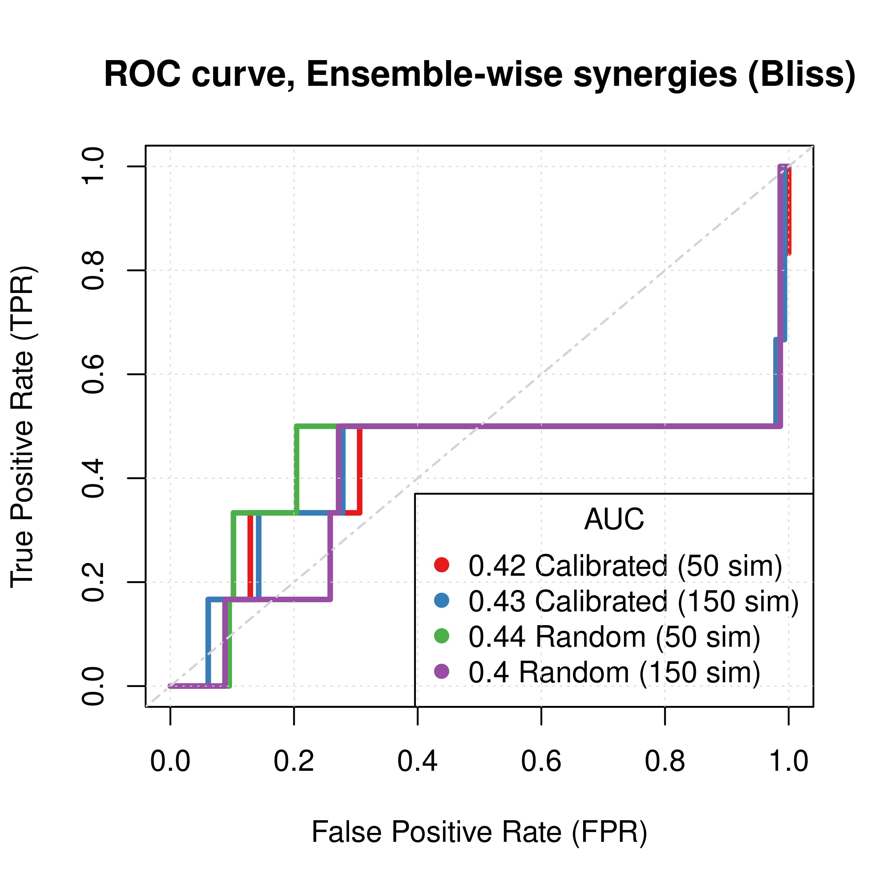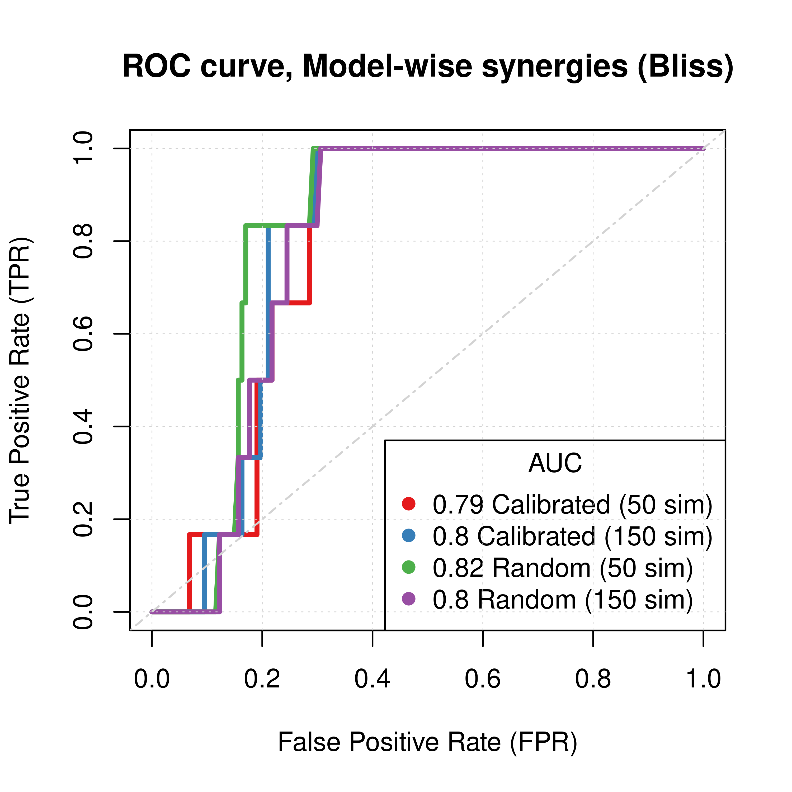
<p class="caption">(\#fig:roc-bliss-cascade2-topo-and-link)ROC curves (CASCADE 2.0, Link Operator and Topology Mutations, Bliss synergy method)</p>
</div>

### PR curves {-}


```r
pr_topolink_res_ss_ew_50sim = pr.curve(scores.class0 = pred_topolink_ew_bliss %>% pull(ss_score_50sim) %>% (function(x) {-x}), 
  weights.class0 = pred_topolink_ew_bliss %>% pull(observed), curve = TRUE, rand.compute = TRUE)
pr_topolink_res_ss_ew_150sim = pr.curve(scores.class0 = pred_topolink_ew_bliss %>% pull(ss_score_150sim) %>% (function(x) {-x}), 
  weights.class0 = pred_topolink_ew_bliss %>% pull(observed), curve = TRUE)
pr_topolink_res_prolif_ew_50sim = pr.curve(scores.class0 = pred_topolink_ew_bliss %>% pull(prolif_score_50sim) %>% (function(x) {-x}), 
  weights.class0 = pred_topolink_ew_bliss %>% pull(observed), curve = TRUE)
pr_topolink_res_prolif_ew_150sim = pr.curve(scores.class0 = pred_topolink_ew_bliss %>% pull(prolif_score_150sim) %>% (function(x) {-x}), 
  weights.class0 = pred_topolink_ew_bliss %>% pull(observed), curve = TRUE)

pr_topolink_res_ss_mw_50sim = pr.curve(scores.class0 = pred_topolink_mw_bliss %>% pull(synergy_prob_ss_50sim),
  weights.class0 = pred_topolink_mw_bliss %>% pull(observed), curve = TRUE, rand.compute = TRUE)
pr_topolink_res_ss_mw_150sim = pr.curve(scores.class0 = pred_topolink_mw_bliss %>% pull(synergy_prob_ss_150sim),
  weights.class0 = pred_topolink_mw_bliss %>% pull(observed), curve = TRUE)
pr_topolink_res_prolif_mw_50sim = pr.curve(scores.class0 = pred_topolink_mw_bliss %>% pull(synergy_prob_prolif_50sim),
  weights.class0 = pred_topolink_mw_bliss %>% pull(observed), curve = TRUE)
pr_topolink_res_prolif_mw_150sim = pr.curve(scores.class0 = pred_topolink_mw_bliss %>% pull(synergy_prob_prolif_150sim),
  weights.class0 = pred_topolink_mw_bliss %>% pull(observed), curve = TRUE)

plot(pr_topolink_res_ss_ew_50sim, main = 'PR curve, Ensemble-wise synergies (Bliss)',
  auc.main = FALSE, color = my_palette[1], rand.plot = TRUE)
plot(pr_topolink_res_ss_ew_150sim, add = TRUE, color = my_palette[2])
plot(pr_topolink_res_prolif_ew_50sim, add = TRUE, color = my_palette[3])
plot(pr_topolink_res_prolif_ew_150sim, add = TRUE, color = my_palette[4])
legend('topright', title = 'AUC', col = my_palette[1:4], pch = 19,
  legend = c(paste(round(pr_topolink_res_ss_ew_50sim$auc.davis.goadrich, digits = 3), "Calibrated (50 sim)"),
    paste(round(pr_topolink_res_ss_ew_150sim$auc.davis.goadrich, digits = 3), "Calibrated (150 sim)"),
    paste(round(pr_topolink_res_prolif_ew_50sim$auc.davis.goadrich, digits = 3), "Random (50 sim)"),
    paste(round(pr_topolink_res_prolif_ew_150sim$auc.davis.goadrich, digits = 3), "Random (150 sim)")))
grid(lwd = 0.5)

plot(pr_topolink_res_ss_mw_50sim, main = 'PR curve, Model-wise synergies (Bliss)',
  auc.main = FALSE, color = my_palette[1], rand.plot = TRUE)
plot(pr_topolink_res_ss_mw_150sim, add = TRUE, color = my_palette[2])
plot(pr_topolink_res_prolif_mw_50sim, add = TRUE, color = my_palette[3])
plot(pr_topolink_res_prolif_mw_150sim, add = TRUE, color = my_palette[4])
legend('topright', title = 'AUC', col = my_palette[1:4], pch = 19,
  legend = c(paste(round(pr_topolink_res_ss_mw_50sim$auc.davis.goadrich, digits = 3), "Calibrated (50 sim)"),
    paste(round(pr_topolink_res_ss_mw_150sim$auc.davis.goadrich, digits = 3), "Calibrated (150 sim)"),
    paste(round(pr_topolink_res_prolif_mw_50sim$auc.davis.goadrich, digits = 3), "Random (50 sim)"),
    paste(round(pr_topolink_res_prolif_mw_150sim$auc.davis.goadrich, digits = 3), "Random (150 sim)")))
grid(lwd = 0.5)
```

<div class="figure" style="text-align: center">

<p class="caption">(\#fig:pr-bliss-cascade2-topo-and-link)PR curves (CASCADE 2.0, Link Operator and Topology Mutations, Bliss synergy method)</p>
</div>

:::{.green-box}
- The PR curves show that the **performance of each individual predictor is poor** compared to the baseline.
- The *model-wise* approach produces better ROC and PR results than the *ensemble-wise* approach (performance in terms of AUC value is almost *doubled*)
:::

### AUC sensitivity {-}

Investigate same thing as described in [here](#auc-sensitivity).
This is very crucial since the PR performance is poor for the individual predictors, but a combined predictor might be able to counter this.
We will combine the synergy scores from the *random proliferative* simulations with the results from the *calibrated* Gitsbe simulations (number of simulations: $150$).


```r
# Ensemble-wise
betas = seq(from = -5, to = 5, by = 0.1)

prolif_roc = sapply(betas, function(beta) {
  pred_topolink_ew_bliss = pred_topolink_ew_bliss %>% mutate(combined_score = ss_score_150sim + beta * prolif_score_150sim)
  res = roc.curve(scores.class0 = pred_topolink_ew_bliss %>% pull(combined_score) %>% (function(x) {-x}), 
    weights.class0 = pred_topolink_ew_bliss %>% pull(observed))
  auc_value = res$auc
})

prolif_pr = sapply(betas, function(beta) {
  pred_topolink_ew_bliss = pred_topolink_ew_bliss %>% mutate(combined_score = ss_score_150sim + beta * prolif_score_150sim)
  res = pr.curve(scores.class0 = pred_topolink_ew_bliss %>% pull(combined_score) %>% (function(x) {-x}), 
    weights.class0 = pred_topolink_ew_bliss %>% pull(observed))
  auc_value = res$auc.davis.goadrich
})

df_ew = as_tibble(cbind(betas, prolif_roc, prolif_pr))
df_ew = df_ew %>% tidyr::pivot_longer(-betas, names_to = "type", values_to = "AUC")

ggline(data = df_ew, x = "betas", y = "AUC", numeric.x.axis = TRUE, color = "type",
  plot_type = "l", xlab = TeX("$\\beta$"), ylab = "AUC (Area Under Curve)", 
  legend = "none", facet.by = "type", palette = my_palette, ylim = c(0,0.85),
  panel.labs = list(type = c("Precision-Recall", "ROC")),
  title = TeX("AUC sensitivity to $\\beta$ parameter")) + 
  theme(plot.title = element_text(hjust = 0.5)) +
  geom_vline(xintercept = 0) +
  geom_vline(xintercept = -1, color = "black", size = 0.3, linetype = "dashed") + 
  geom_text(aes(x=-1.5, label="β = -1", y=0.35), colour="black", angle = 90) + 
  grids()
```

<div class="figure" style="text-align: center">

<p class="caption">(\#fig:auc-sen-ew-bliss-cascade2-topo-and-link)AUC sensitivity (CASCADE 2.0, Link Operator and Topology Mutations, Bliss synergy method, Ensemble-wise results)</p>
</div>

:::{.green-box}
- The random proliferative models can be used to normalize against the predictions of the calibrated models and thus bring significant contribution to the calibrated models performance (both ROC-AUC and PR-AUC are increased).
- The $\beta_{best}$ values of the **combined calibrated and random model predictor** that maximize the ROC-AUC and PR-AUC respectively are $\beta_{best}^{\text{ROC-AUC}}=-1.1$ and $\beta_{best}^{\text{PR-AUC}}=-1.3$.
For $\beta=-1$ we still see **significant performance improvement**.
:::

## Best ROC and PRC {-}

For both the Bliss and HSA ensemble-wise results we demonstrated above that a value of $\beta_{best}=-1$ can result in significant performance gain of the combined predictor ($calibrated + \beta \times random$).
So, the best ROC and PR curves we can get with our simulations when using models with both link operator (balance) and topology mutations are:


```r
best_beta = -1
pred_topolink_ew_hsa = pred_topolink_ew_hsa %>% mutate(best_score = ss_score_150sim + best_beta * prolif_score_150sim)
pred_topolink_ew_bliss = pred_topolink_ew_bliss %>% mutate(best_score = ss_score_150sim + best_beta * prolif_score_150sim)

roc_best_res_hsa = get_roc_stats(df = pred_topolink_ew_hsa, pred_col = "best_score", label_col = "observed")
roc_best_res_bliss = get_roc_stats(df = pred_topolink_ew_bliss, pred_col = "best_score", label_col = "observed")

pr_best_res_hsa = pr.curve(scores.class0 = pred_topolink_ew_hsa %>% pull(best_score) %>% (function(x) {-x}), 
    weights.class0 = pred_topolink_ew_hsa %>% pull(observed), curve = TRUE, rand.compute = TRUE)
pr_best_res_bliss = pr.curve(scores.class0 = pred_topolink_ew_bliss %>% pull(best_score) %>% (function(x) {-x}), 
    weights.class0 = pred_topolink_ew_bliss %>% pull(observed), curve = TRUE)

# Plot best ROCs
plot(x = roc_best_res_hsa$roc_stats$FPR, y = roc_best_res_hsa$roc_stats$TPR,
  type = 'l', lwd = 3, col = my_palette[1], main = TeX('ROC curve (Ensemble-wise), $calibrated + \\beta \\times random$'),
  xlab = 'False Positive Rate (FPR)', ylab = 'True Positive Rate (TPR)')
lines(x = roc_best_res_bliss$roc_stats$FPR, y = roc_best_res_bliss$roc_stats$TPR,
  lwd = 3, col = my_palette[2])
legend('bottomright', title = TeX('AUC ($\\beta$ = -1)'), 
  col = c(my_palette[1:2]), pch = 19, cex = 1.5,
  legend = c(paste(round(roc_best_res_hsa$AUC, digits = 2), 'HSA (150 sim)'), 
    paste(round(roc_best_res_bliss$AUC, digits = 2), 'Bliss (150 sim)')))
grid(lwd = 0.5)
abline(a = 0, b = 1, col = 'lightgrey', lty = 'dotdash', lwd = 1.2)

# Plot best PRCs
plot(pr_best_res_hsa, main = TeX('PR curve (Ensemble-wise), $calibrated + \\beta \\times random$'),
  auc.main = FALSE, color = my_palette[1], rand.plot = TRUE)
plot(pr_best_res_bliss, add = TRUE, color = my_palette[2])
legend('topright', title = TeX('AUC ($\\beta$ = -1)'), col = c(my_palette[1:2]), pch = 19, cex = 1.5,
  legend = c(paste(round(pr_best_res_hsa$auc.davis.goadrich, digits = 2), 'HSA (150 sim)'),
    paste(round(pr_best_res_bliss$auc.davis.goadrich, digits = 2), 'Bliss (150 sim)')))
grid(lwd = 0.5)
```

<div class="figure" style="text-align: center">

<p class="caption">(\#fig:best-beta-cascade2-topo-and-link)ROC and PR curve for best beta (CASCADE 2.0, Link Operator and Topology Mutations)</p>
</div>

# Parameterization vs Performance {-}

## Best ROC and PRC {-}

In this section we will compare the normalized combined predictors ($calibrated + \beta \times random, \beta=-1$) across all 3 model parameterizations/mutations we tested in this report for CASCADE 2.0: **link operator mutations, topology mutations and both**.
We use the normalization parameter $\beta=-1$ for all combined predictors, as it was observed throughout the report that it approximately maximizes the performance of all **Bliss-assessed, ensemble-wise** combined synergy predictors in terms of ROC and PR AUC.
The results are from the $150$ simulation runs ($450$ models).

:::{#beta-as-norm .note}
**Why call $\beta$ a *normalization* parameter?**

What matters for the calculation of the ROC and PR points is the *ranking* of the synergy scores.
Thus if we bring the predictor's synergy scores to the exponential space, a value of $-1$ for $\beta$ translates to a simple *fold-change normalization* technique:

$calibrated + \beta \times random \overset{\beta = -1}{=} calibrated - random \xrightarrow[\text{same ranking}]{e(x) \text{ monotonous}}$
$e^{(calibrated - random)}=e^{calibrated}/e^{random}$.
:::


```r
# Link operator mutations results (`best_score2` has the results for β = -1, `best_score1` for β = -1.6)
roc_link_res = get_roc_stats(df = pred_ew_bliss, pred_col = "best_score2", label_col = "observed")
pr_link_res = pr.curve(scores.class0 = pred_ew_bliss %>% pull(best_score2) %>% (function(x) {-x}), 
    weights.class0 = pred_ew_bliss %>% pull(observed), curve = TRUE, rand.compute = TRUE)

# Topology mutations results
roc_topo_res = get_roc_stats(df = pred_topo_ew_bliss, pred_col = "best_score", label_col = "observed")
pr_topo_res = pr.curve(scores.class0 = pred_topo_ew_bliss %>% pull(best_score) %>% (function(x) {-x}), 
    weights.class0 = pred_topo_ew_bliss %>% pull(observed), curve = TRUE)

# Both Link Operator and Topology mutations results
roc_topolink_res = get_roc_stats(df = pred_topolink_ew_bliss, pred_col = "best_score", label_col = "observed")
pr_topolink_res = pr.curve(scores.class0 = pred_topolink_ew_bliss %>% pull(best_score) %>% (function(x) {-x}), 
    weights.class0 = pred_topolink_ew_bliss %>% pull(observed), curve = TRUE)

# Plot best ROCs
plot(x = roc_link_res$roc_stats$FPR, y = roc_link_res$roc_stats$TPR,
  type = 'l', lwd = 3, col = my_palette[1], main = TeX('ROC curves (Ensemble-wise), $calibrated + \\beta \\times random$'),
  xlab = 'False Positive Rate (FPR)', ylab = 'True Positive Rate (TPR)')
lines(x = roc_topo_res$roc_stats$FPR, y = roc_topo_res$roc_stats$TPR,
  lwd = 2, col = my_palette[2])
lines(x = roc_topolink_res$roc_stats$FPR, y = roc_topolink_res$roc_stats$TPR,
  lwd = 2.3, col = my_palette[3])
legend('bottomright', title = TeX('AUC ($\\beta$ = -1): Mutations'),
  col = c(my_palette[1:3]), pch = 19, cex = 1.5,
  legend = c(paste(round(roc_link_res$AUC, digits = 2), 'Link Operator'),
    paste(round(roc_topo_res$AUC, digits = 2), 'Topology'), 
    paste(round(roc_topolink_res$AUC, digits = 2), 'Both')))
grid(lwd = 0.5)
abline(a = 0, b = 1, col = 'lightgrey', lty = 'dotdash', lwd = 1.2)

# Plot best PRCs
plot(pr_link_res, main = TeX('PR curves (Ensemble-wise), $calibrated + \\beta \\times random$'),
  auc.main = FALSE, color = my_palette[1], rand.plot = TRUE, lwd = 3)
plot(pr_topo_res, add = TRUE, color = my_palette[2], lwd = 2)
plot(pr_topolink_res, add = TRUE, color = my_palette[3], lwd = 2.3)
legend('topright', title = TeX('AUC ($\\beta$ = -1): Mutations'),
  col = c(my_palette[1:3]), pch = 19, cex = 1.3,
  legend = c(paste(round(pr_link_res$auc.davis.goadrich, digits = 2), 'Link Operator'),
    paste(round(pr_topo_res$auc.davis.goadrich, digits = 2), 'Topology'),
    paste(round(pr_topolink_res$auc.davis.goadrich, digits = 2), '  Both')))
grid(lwd = 0.5)
```

<div class="figure" style="text-align: center">

<p class="caption">(\#fig:param-comp)Comparing ROC and PR curves for combined predictors across 3 parameterization schemes (CASCADE 2.0, Bliss synergy method, Ensemble-wise results)</p>
</div>

:::{.green-box}
We observe that if we had used the results for the **link operator only** combined predictor with $\beta_{best}=-1.6$ as was demonstrated [here](#auc-sensitivity-3), we would have an AUC-ROC of $0.85$ and AUC-PR of $0.27$, which are pretty close to the results we see above for $\beta=-1$, using both link and topology mutations.

Overall, this suggests that to parameterize our boolean models using **topology mutations** can **increase the performance of our proposed synergy prediction approach** much more than using either link operator (balance) mutations alone or combined with topology parameterization.

Note that the difference in terms of ROC AUC is not significant compared to the difference of PR AUC scores and since the dataset we test our models on is fairly imbalanced, we base our conclusion on the information from the PR plots [@Saito2015].
:::

## Bootstrap Simulations {-#boot-comp-param}

:::{.blue-box}
Now we would like to statistically verify the previous conclusion (that **topology is superior** to the other two parameterization schemes and produces better predictive models for our dataset) and so we will run a *bootstrap* analysis.

Simply put, we generate **3 large pools** of calibrated to steady state models  ($4500$ models each). 
Each pool corresponds to the **3 parameterization schemes** (i.e. it has models with either topology mutations only, link-operator mutations only, or models with both mutations).
Then, we take several model samples from each pool ($25$ samples, each sample containing $300$ models) and run the drug response simulations for these calibrated model ensembles to get their predictions.
Normalizing each calibrated simulation prediction output to the corresponding **random (proliferative) model predictions** (using a $\beta=-1$ as above), results in different ROC and PR AUCs for each parameterization scheme and chosen bootstrapped sample.

See more details on reproducing the results on section [Parameterization Bootstrap].
:::

Load the already-stored result:

```r
res = readRDS(file = "data/res_param_boot_aucs.rds")
```

### Compare all 3 schemes {-}


```r
# define group comparisons for statistics
my_comparisons = list(c("link-only","topology-only"), c("link-only","topo-and-link"), 
  c("topology-only","topo-and-link"))

# ROC AUCs
ggboxplot(data = res, x = "param", y = "roc_auc", 
  fill = "param", add = "jitter", palette = "Set1", 
  xlab = "Parameterization", ylab = "ROC AUC",
  title = "Parameterization vs Performance (ROC)") +
  stat_compare_means(comparisons = my_comparisons, method = "wilcox.test", label = "p.format") +
  theme(plot.title = element_text(hjust = 0.5)) + 
  theme(legend.position = "none")
  
# PR AUCs
ggboxplot(data = res, x = "param", y = "pr_auc", 
  fill = "param", add = "jitter", palette = "Set1", 
  xlab = "Parameterization", ylab = "PR AUC",
  title = "Parameterization vs Performance (Precision-Recall)") +
  stat_compare_means(comparisons = my_comparisons, method = "wilcox.test", label = "p.format") +
  theme(plot.title = element_text(hjust = 0.5)) + 
  theme(legend.position = "none")
```

<div class="figure" style="text-align: center">
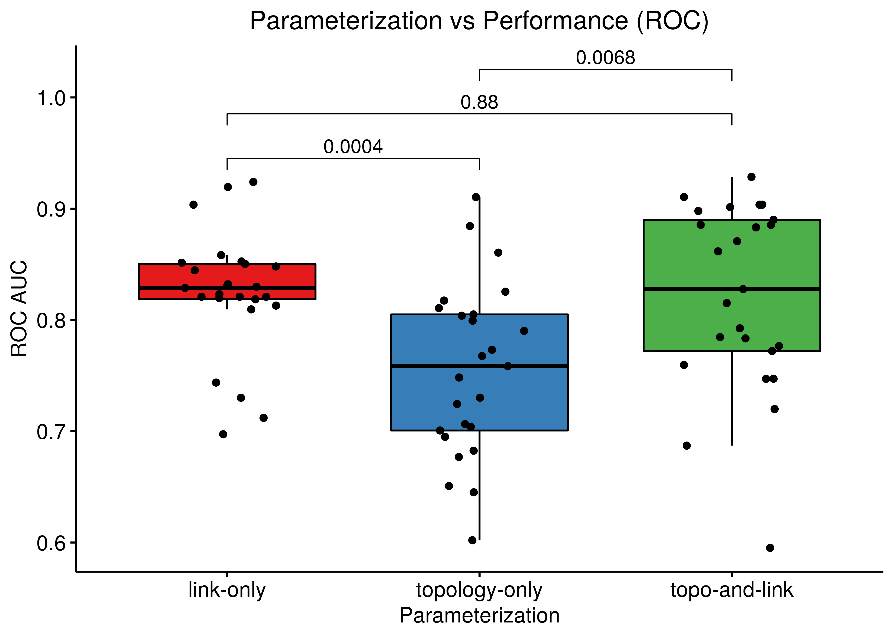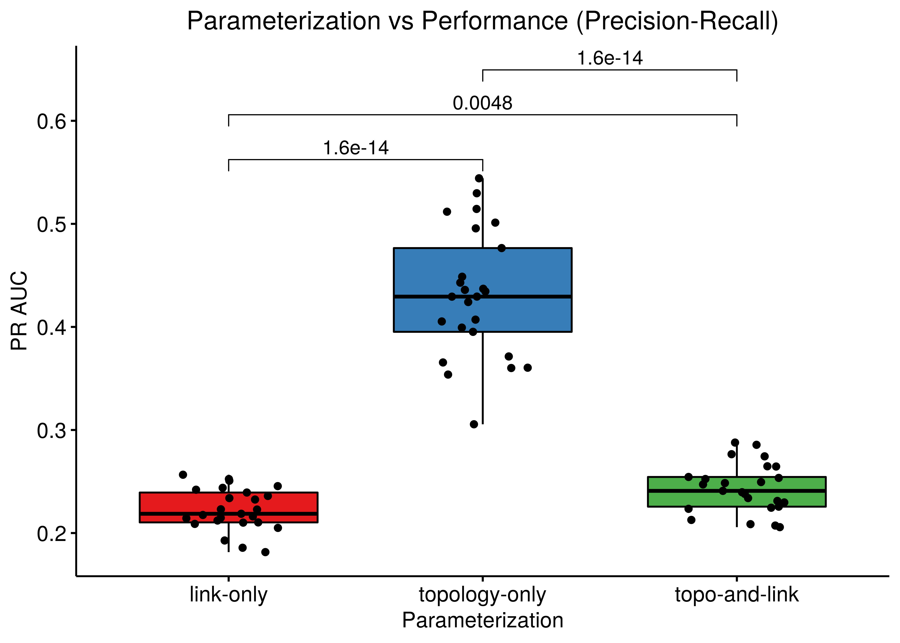
<p class="caption">(\#fig:param-comp-boot-fig)Comparing ROC and PR AUCs from bootstrapped calibrated model ensembles normalized to random model predictions across 3 parameterization schemes (CASCADE 2.0, Bliss synergy method, Ensemble-wise results)</p>
</div>

:::{.green-box}
The topology mutations generate the **best performing models in terms of PR AUC** with statistical significance compared to the other two groups of model ensembles using different parameterization.
In terms of ROC AUC performance we also note the **larger variance** of the topology mutated models.
:::

### Compare Topology vs Link-operator Parameterization {-}


```r
# load the data
res = readRDS(file = "data/res_param_boot_aucs.rds")

# filter data
res = res %>% 
  filter(param != "topo-and-link")

param_comp = list(c("link-only","topology-only"))

stat_test_roc = res %>% 
  rstatix::wilcox_test(formula = roc_auc ~ param, comparisons = param_comp) %>%
  rstatix::add_significance("p")

# ROC AUCs
ggboxplot(res, x = "param", y = "roc_auc", fill = "param", palette = "Set1",
  add = "jitter", xlab = "", ylab = "ROC AUC") +
  scale_x_discrete(breaks = c("link-only","topology-only"), 
    labels = c("Parameterization Mutations", "Topology Mutations")) +
  ggpubr::stat_pvalue_manual(stat_test_roc, label = "p = {p} ({p.signif})", y.position = c(1)) +
  ylim(c(0.2,1)) +
  theme_classic(base_size = 14) +
  theme(plot.title = element_text(hjust = 0.5), axis.text = element_text(size = 16)) + 
  geom_hline(yintercept = 0.5, linetype = 'dashed', color = "red") +
  geom_text(aes(x = 2.1, y = 0.45, label="Random Predictions (AUC = 0.5)", size = 5)) + 
  theme(legend.position = "none")

stat_test_pr = res %>% 
  rstatix::wilcox_test(formula = pr_auc ~ param, comparisons = param_comp) %>%
  rstatix::add_significance("p") %>%
  rstatix::add_y_position()

# PR AUCs
ggboxplot(res, x = "param", y = "pr_auc", fill = "param", palette = "Set1",
  add = "jitter", xlab = "", ylab = "Precision-Recall AUC") +
  scale_x_discrete(breaks = c("link-only","topology-only"), 
    labels = c("Parameterization Mutations", "Topology Mutations")) +
  ggpubr::stat_pvalue_manual(stat_test_pr, label = "p = {p} ({p.signif})") +
  theme_classic(base_size = 14) +
  theme(plot.title = element_text(hjust = 0.5), axis.text = element_text(size = 16)) + 
  geom_hline(yintercept = 6/153, linetype = 'dashed', color = "red") +
  geom_text(aes(x = 1.9, y = 0.08, label="Random Predictions (AUC = 0.04)"), size = 5) + 
  theme(legend.position = "none")
```

<div class="figure" style="text-align: center">
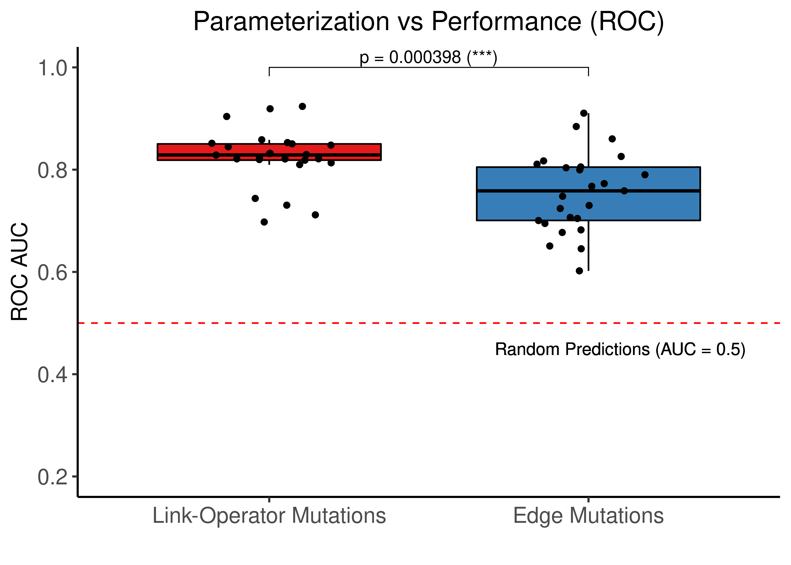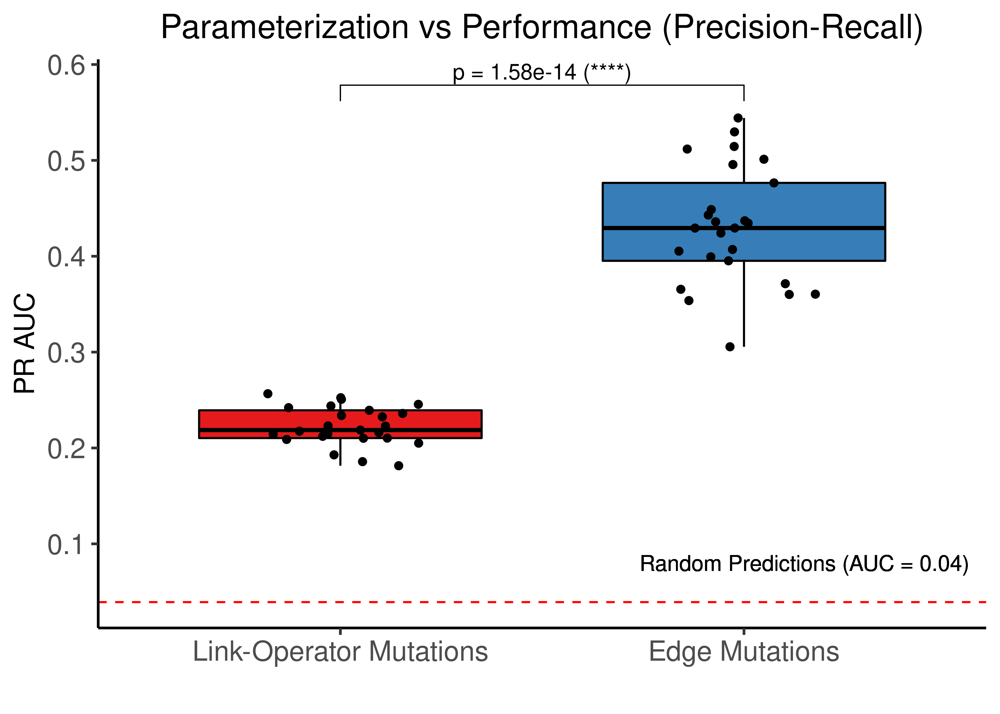
<p class="caption">(\#fig:param-comp-boot-fig-2)Comparing ROC and PR AUCs from bootstrapped calibrated model ensembles normalized to random model predictions - Topology vs Link-operator mutations (CASCADE 2.0, Bliss synergy method, Ensemble-wise results). We use the terminology "parameterization" to refer to the link operator mutations</p>
</div>


# Annotated Heatmaps {-}

:::{.blue-box}
In this section we will use the models from the bootstrap analysis [above](#boot-comp-param) and produce heatmaps of the models stable states and parameterization.
Specifically, we will use the two CASCADE 2.0 model pools created, that have either only **link-operator mutated** or only **topology-mutated** models.

For both pools, a stable state heatmap will be produced (columns are *nodes*).
For the first pool, the parameterization is presented with a **link-operator heatmap** (columns are *nodes*) and for the second pool as an **edge heatmap** (columns are *edges*).
:::

## Annotations {-}

### Pathways {-}

Every node in CASCADE 2.0 belongs to a specific pathway, as can be seen in **Fig. 1A** of [@Niederdorfer2020].
The pathway categorization is a result of a computational analysis performed by the author of that paper and provided as file [here](https://github.com/druglogics/ags-paper/blob/main/data/node_pathway_annotations_cascade2.csv).

We present the **node and edge distribution** across the pathways in CASCADE 2.0.
For the edge pathway annotation, either both ends/nodes of an edge belong to a specific pathway and we use that label or the nodes belong to different pathways and the edge is labeled as *Cross-talk*:


```r
knitr::include_graphics(path = 'img/node_path_dist.png')
knitr::include_graphics(path = 'img/edge_path_dist.png')
```

<div class="figure">

<p class="caption">(\#fig:node-edge-dist-path)Node and Edge Distribution across pathways in CASCADE 2.0</p>
</div>

:::{.green-box}
- $\approx50\%$ of the edges are labeled *Cross-talk*
- Pathways with more nodes have also more edges between these nodes
:::

### Training Data {-}

We annotate in the stable state heatmaps the states (*activation* or *inhibition*) of the nodes as they were in the AGS training data (annotation name is *Training* or *Calibration*).

### Connectivity {-}

We annotate each node's **in-degree or out-degree connectivity** for the node-oriented heatmaps, i.e. the number of its regulators (in-degree) or the number of nodes it connects to (out-degree).
For the edge-oriented heatmaps, we provide either the **in-degree of each edge's target** or the **out-degree of each edge's source**.

### Drug Target {-}

The CASCADE 2.0 model was used to test in-silico prediction performance of the drug combination dataset in [@Flobak2019]. 
The drug panel used for the simulations involved $18$ drugs (excluding the `SF` drug), each one having one to several drug targets in the CASCADE 2.0 network. 
We annotate this information on the combined stable states and parameterization heatmap, by specifying exactly which nodes are drug targets.
For the edge-oriented heatmaps, we specify either if an edge's target, source, both or none of them is a drug target.

### COSMIC Cancer Gene Census (CGC) {-}

We annotate some of the CASCADE 2.0 nodes either as **tumor suppressors (TSG), oncogenes or both**, based on the COSMIC Cancer Gene Census dataset, an expert-curated effort to describe genes driving human cancer [@Sondka2018].

We used the HGNC symbols of the CASCADE 2.0 nodes and via the HGNC REST API [@Braschi2019], we got the respective Ensemble IDs that helped us match the genes in the COSMIC dataset.
From the COSMIC genes that we got back, we did not restrict them to a particular cancer type, we discarded the *Tier 2* (lower quality) genes, as well the ones that were annotated with only the term *fusion* in their respective cancer role.
We kept cancer genes that were annotated as both TSGs and fusion or oncogenes and fusion genes and maintained only the TSG or oncogene annotation tag (discarding only the fusion tag).
Lastly note that for the CASCADE 2.0 nodes that represent families, complexes, etc. and they include a few COSMIC genes in their membership, we use a majority rule to decide which cancer role to assign to these nodes.

:::{.blue-box}
See the script [get_cosmic_data_annot.R](https://github.com/druglogics/ags-paper/blob/main/scripts/get_cosmic_data_annot.R) for more details.
:::

A total of $52$ CASCADE 2.0 nodes were annotated and in the following figure we can see that most of them were oncogenes, followed by TSGs and a few annotated as both categories:


```r
knitr::include_graphics(path = 'img/cosmic_cascade2_dist.png')
```

<div class="figure">
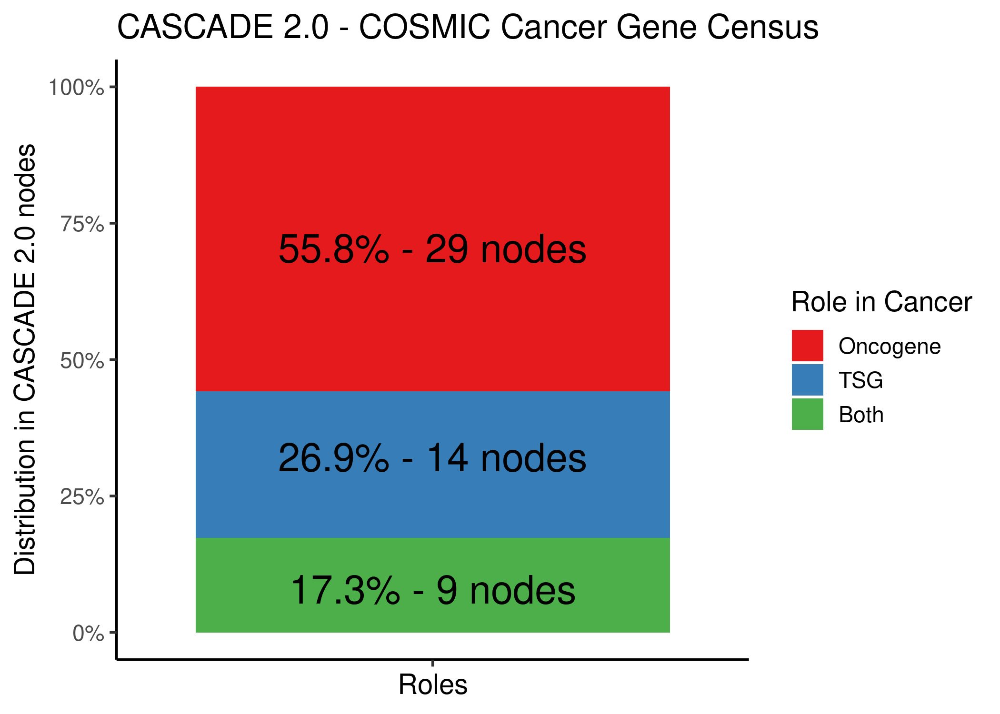
<p class="caption">(\#fig:cosmic-cascade2-dist)CASCADE 2.0 Nodes and their role in cancer as annotated by the COSMIC CGC dataset</p>
</div>

### Agreement (Parameterization vs Activity) {-}

For the link-operator CASCADE 2.0 nodes we calculate the **percent agreement** between **link-operator parameterization** (`AND-NOT` => $0$, `OR-NOT` => $1$) and **stable state activity** (Inhibited state => $0$, Active state => $1$).
The percent agreement is defined here as the number of matches (node has the link-operator `AND-NOT` (resp. `OR-NOT`) and it's stable state activity value is $0$ (resp. $1$)) divided by the total amount of models ($4500$).

Note that the models of the link-operator Gitsbe pool from the previous [bootstrap analysis](#bootstrap-simulations) that we will use for the heatmaps, had precicely $1$ stable state each, making thus the aforementioned comparison/calculation much easier.

## Link-Operator mutated models {-}

:::{.blue-box}
See script [lo_mutated_models_heatmaps.R](https://github.com/druglogics/ags-paper/blob/main/scripts/lo_mutated_models_heatmaps.R) for creating the heatmaps.
:::


```r
knitr::include_graphics(path = 'img/lo_ss_heat.png')
```

<div class="figure">
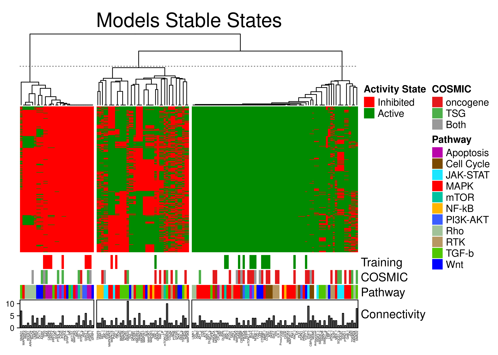
<p class="caption">(\#fig:lo-ss-heat-1)Stable state annotated heatmap for the link operator-mutated models. A total of 144 CASCADE 2.0 nodes have been grouped to 3 clusters with K-means. Training data, COSMIC, pathway and in-degree connectivity annotations are shown.</p>
</div>

:::{.green-box}
Calibrated models obey training data, i.e. stable states for nodes specified in training data, match the training data activity values
:::


```r
knitr::include_graphics(path = 'img/cosmic_state_cmp.png')
```

<div class="figure">
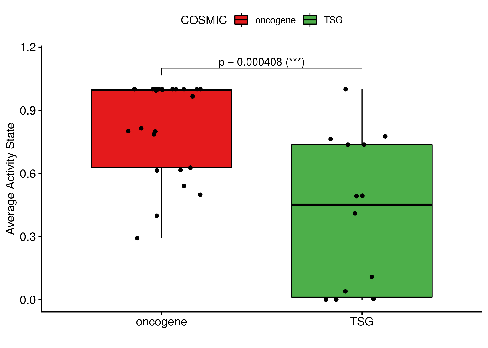
<p class="caption">(\#fig:cosmic-state-cmp)Comparing the average stable activity state between the TSG and the oncogene nodes. The Wilcoxon test is used to derive the p-value for the difference between the two groups.</p>
</div>

:::{.green-box}
Nodes that are annotated as oncogenes have **statistically higher average activity state** than the ones annotated as TSGs (also evident partially from the stable states heatmap).
The median values for the two groups in the boxplot are $0.997$ (oncogene) and $0.452$ (TSG) respectively.

The `RTPK_g` node is an outlier in our data: it is annotated as an oncogene and in all models it had a stable state of $0$.
:::


```r
knitr::include_graphics(path = 'img/lo_heat.png')
```

<div class="figure">

<p class="caption">(\#fig:lo-heat-2)Parameterization annotated heatmap for the link operator-mutated models. Only the CASCADE 2.0 nodes that have a link-operator in their respective boolean equation are shown. The 52 link-operator nodes have been grouped to 3 clusters with K-means. COSMIC, Pathway and in-degree connectivity annotations are shown.</p>
</div>


```r
knitr::include_graphics(path = 'img/lo_combined_heat.png')
```

<div class="figure">

<p class="caption">(\#fig:lo-heat-3)Combined stable states and parameterization heatmaps. Only the CASCADE 2.0 nodes that have a link-operator in their respective boolean equation are shown. The 52 link-operator nodes have been grouped to 3 clusters with K-means using the stable states matrix data. The link-operator data heatmap has the same row order as the stable states heatmap. Training data (Calibration), COSMIC, Pathway, Drug Target, in-degree, out-degree Connectivity and Percent Agreement annotations are shown. The stable states across the models for the JNK_f, ERK_f and MAPK14 nodes have been marked with rectangular black boxes.</p>
</div>

:::{.green-box}
**High degree of agreement** between link-operator parameterization and stable state activity.

Nodes of the second cluster (the most heterogeneous one) where the parameterization and stable state activity seem to be assigned randomly (i.e. in $\approx50\%$ of the total models a node is in an inhibited vs an active state, or has the `AND-NOT` vs the `OR-NOT` link-operator) we observe the high percent agreement scores.

In the third cluster, where the models nodes are mostly in an active state (obeying the training data), we observe that the **parameterization does not affect the stable state activity** and that these nodes have mostly low connectivity ($<5$ regulators).
:::

## Topology-mutated models {-}

:::{.blue-box}
See script [topo_mutated_models_heatmaps.R](https://github.com/druglogics/ags-paper/blob/main/scripts/topo_mutated_models_heatmaps.R) for creating the heatmaps.
:::


```r
knitr::include_graphics(path = 'img/topo_ss_heat.png')
```

<div class="figure">

<p class="caption">(\#fig:topo-ss-heat-1)Stable state annotated heatmap for the topology-mutated models. A total of 144 CASCADE 2.0 nodes have been grouped to 3 clusters with K-means. Training data, pathway and edge target in-degree connectivity annotations are shown.</p>
</div>

:::{.green-box}
Calibrated models obey training data, i.e. stable states for nodes specified in training data, match the training data activity values.
:::


```r
knitr::include_graphics(path = 'img/edge_heat.png')
```

<div class="figure">

<p class="caption">(\#fig:edge-heat-1)Edge annotated heatmap. All edges from the CASCADE 2.0 topology are included. A total of 367 edges have been grouped to 5 clusters with K-means. Pathway, Drug Target, edge target in-degree and edge source out-degree Connectivity annotations are shown.</p>
</div>

:::{.green-box}
Looking at the above figure from left to right we have $5$ clusters:

1. First cluster has all the edges whose target has a single regulator and these are not removed by the topology mutations in Gitsbe, to preserve the network connectivity.
2. Second cluster with edges that are **mostly present** in the topology-mutated models. 
These edges have two distinguished characteristics: they show high target connectivity ($\ge 5$ regulators) - meaning that they target mostly hub-nodes - and their source and target nodes belong mostly to different pathways (i.e. they are *Cross-talk* edges).
3. Third cluster with edges that have a **~50% percent chance to stay** in the topology-mutated models.
These edges belong to a variety of pathways and can have both low and high target in-degree connectivity.
4. Fourth cluster with edges that **will most likely be removed** in the topology-mutated models.
These edges belong to a variety of pathways and mostly have low target in-degree connectivity.
5. Fifth cluster with edges that are **mostly absent** in the topology-mutated models.
Some of them are high target-connectivity nodes and most of them belong to the *TGF-b* pathway.
:::

Now, we present a subset of columns (edges) of the above heatmap, chosen based on some user-defined thresholds to **include only the edges that are either mostly absent or present** in the models (so the second and last cluster).
We do not include the edges that are present in all models (cluster 1) since there were the ones whose target had **only $1$ regulator** and as such they couldn't be removed by the Gitsbe algorithm (we don't lose connectivity when using topology mutations).


```r
knitr::include_graphics(path = 'img/edge_heat_stable.png')
```

<div class="figure">

<p class="caption">(\#fig:edge-heat-2)Edge annotated heatmap. A subset of the total edges is included, the least heterogeneous across all the models (rows) based on some user-defined thresholds. Edges that were always present are removed (connectivity = 1). Edges have been grouped to 2 clusters with K-means. Pathway, Drug Target, edge target in-degree and edge source out-degree Connectivity annotations are shown.</p>
</div>

## ERK performance investigation {-#erk-perf-inv}

:::{.blue-box}
We investigate the role of the activity of the `ERK_f` node in the performance of boolean models with link operator mutations.
:::

In the middle cluster of the stable states heatmap (see Figure \@ref(fig:lo-ss-heat-1)) there were lot of nodes whose stable state activity was different for about half of the models.
For example, although `ERK_f` is defined in an active state in the training data, we also get models after training that have it inhibited in their corresponding stable state.
Since these boolean models essentially represent AGS proliferating cancer cells, it's remarkable that the literature curation results are also divided, i.e. around half of the publications support that activation of `ERK_f` and the other its inhibition (see Table S2 from [@Flobak2015]).
So, **do we have a way to distinguish which of the two scenarios** (`ERK` active vs inhibited) **better matches the observed biological reality**?

[Model-wise analyses](https://druglogics.github.io/gitsbe-model-analysis/cascade/cell-lines-2500/cascade_synergy_biomarkers.html#summary-of-results) provide evidence which suggests that the overexpression of `ERK_f` is a characteristic biomarker of the higher performance AGS models in terms of synergy prediction, i.e. models that have `ERK_f` active in their stable state can predict synergies that have been observed experimentally in the AGS cancer cells.

:::{.blue-box}
See methodology and how to reproduce the results [here](#erk-repro).
:::


```r
res = readRDS(file = "data/res_erk.rds")

set1_col = RColorBrewer::brewer.pal(9, 'Set1')

stat_test_roc = res %>% 
  rstatix::wilcox_test(formula = roc_auc ~ erk_state) %>%
  rstatix::add_significance("p")

# ROC AUCs
ggboxplot(res, x = "erk_state", y = "roc_auc", fill = "erk_state", 
  palette = c(set1_col[3], set1_col[1]),
  add = "jitter", xlab = "", ylab = "ROC AUC",
  title = "ERK_f Pools Performance Comparison (ROC)") +
  scale_x_discrete(breaks = c("active","inhibited"), labels = c("Active", "Inhibited")) +
  ggpubr::stat_pvalue_manual(stat_test_roc, label = "p = {p} ({p.signif})", y.position = c(1)) +
  ylim(c(0,1)) +
  theme(plot.title = element_text(hjust = 0.5), axis.text = element_text(size = 14)) + 
  geom_hline(yintercept = 0.5, linetype = 'dashed', color = "red") +
  geom_text(aes(x = 2.1, y = 0.55, label = "Random Predictions (AUC = 0.5)")) + 
  theme(legend.position = "none")

stat_test_pr = res %>% 
  rstatix::wilcox_test(formula = pr_auc ~ erk_state) %>%
  rstatix::add_significance("p") %>%
  rstatix::add_y_position()

# PR AUCs
ggboxplot(res, x = "erk_state", y = "pr_auc", fill = "erk_state", 
  palette = c(set1_col[3], set1_col[1]),
  add = "jitter", xlab = "", ylab = "PR AUC",
  title = "ERK_f Pools Performance Comparison (Precision-Recall)") +
  scale_x_discrete(breaks = c("active","inhibited"), labels = c("Active", "Inhibited")) +
  ggpubr::stat_pvalue_manual(stat_test_pr, label = "p = {p} ({p.signif})") +
  theme(plot.title = element_text(hjust = 0.5), axis.text = element_text(size = 14)) + 
  # 6 out 153 drug combos were synergistic
  geom_hline(yintercept = 6/153, linetype = 'dashed', color = "red") +
  geom_text(aes(x = 1.05, y = 0.06, label = "Random Predictions (AUC = 0.04)")) + 
  theme(legend.position = "none")
```

<div class="figure" style="text-align: center">
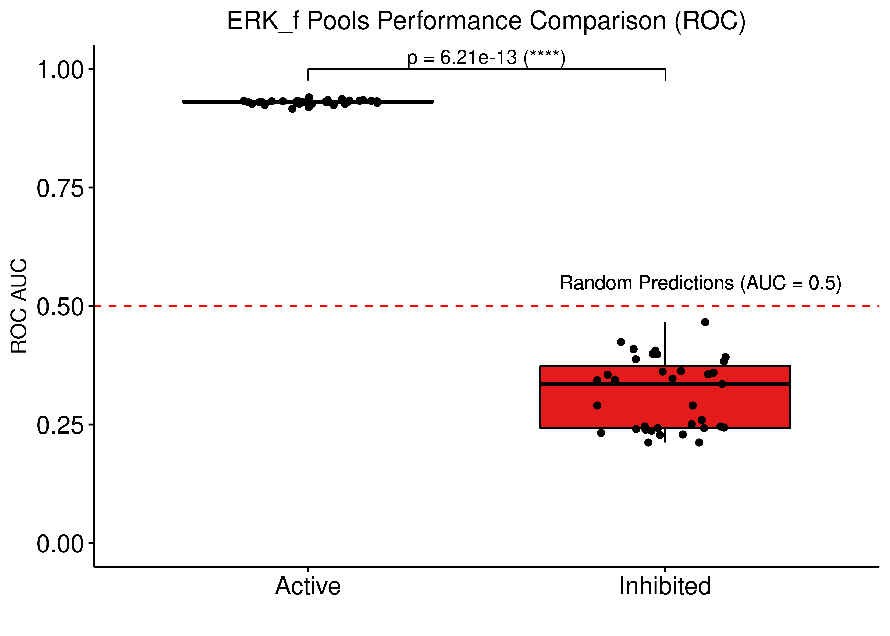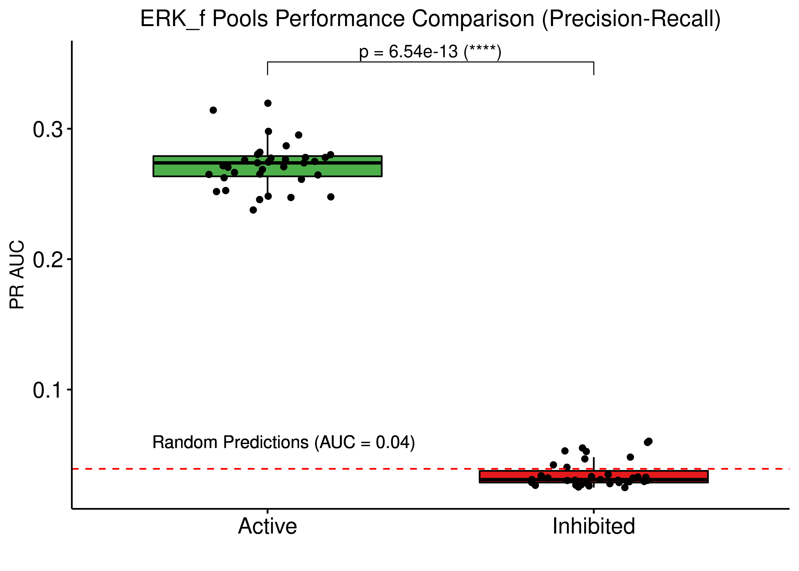
<p class="caption">(\#fig:erk-pool-cpm)Comparing drug prediction performance (ROC and PR AUCs) between bootstrapped calibrated model ensembles from two model pools. Results were normalized to random model predictions. The models had link operator mutations only. In one pool, each model had a single stable state with ERK_f active and on the other pool ERK_f was inhibited at the stable state (CASCADE 2.0, Bliss synergy method, Ensemble-wise results)</p>
</div>

:::{.green-box}
Significantly better performance of the bootstrapped ensembles with `ERK_f` active, suggesting that ERK should be considered active in AGS cells from a functional point of view.
:::

# Mouse Xenograft Results {-}

Figures for the paper from the mouse experiments.
Mice were injected with AGS tumors and split to $4$ groups:

- `Control` group (no drugs were administered) 
- Mice group which was administered a *TAK1* inhibitor (`5Z` drug)
- Mice group which was administered a *PI3K* inhibitor (`PI` drug)
- Mice group which was administered both `5Z` and `PI` drugs


```r
# read file with tumor volume data
tumor_data = readr::read_csv(file = 'data/tumor_vol_data.csv')
tumor_data_wide = tumor_data # keep the wide format for later

# reshape data
tumor_data = tumor_data %>% 
  tidyr::pivot_longer(cols = -c(drugs), names_to = 'day', values_to = 'vol') %>%
  mutate(day = as.integer(day)) %>%
  mutate(drugs = factor(x = drugs, levels = c("PI", "Control", "5Z", "5Z-PI")))
```


```r
pd = position_dodge(0.2)
days = tumor_data %>% distinct(day) %>% pull()

tumor_data %>%
  ggpubr::desc_statby(measure.var = 'vol', grps = c('day', 'drugs')) %>%
  ggplot(aes(x = day, y = mean, colour = drugs, group = drugs)) + 
    geom_errorbar(aes(ymin = mean - se, ymax = mean + se), color = 'black', 
      width = 1, position = pd) +
    geom_line(position = pd) +
    geom_point(position = pd) + 
    scale_x_continuous(labels = as.character(days), breaks = days) +
    scale_color_brewer(palette = 'Set1') + 
    labs(title = 'Average tumor volume with SEM', x = 'Days', 
      y = latex2exp::TeX('Tumor volume $\\left(mm^3\\right)$')) +
    ylim(c(0, NA)) + 
    theme_classic(base_size = 14) +
    theme(plot.title = element_text(hjust = 0.5), legend.title = element_blank())
```

<div class="figure" style="text-align: center">
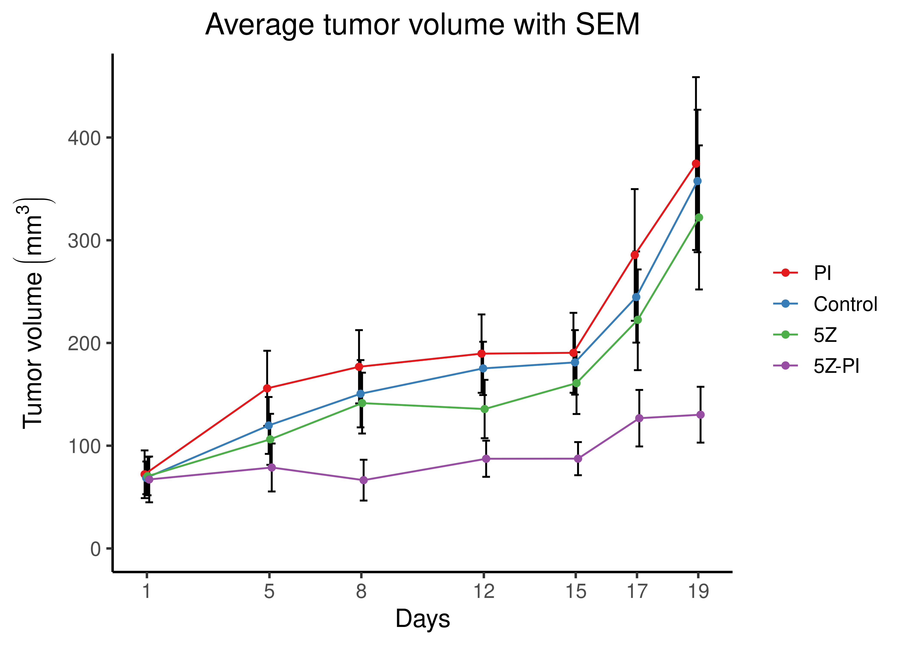
<p class="caption">(\#fig:mouse-xenograft-figure-1)Average tumor volume and standard error of the mean (SEM) for the four groups of mice, per measurement day after tumor injection (1st day)</p>
</div>
We use the Wilcoxon rank sum test to compare the tumor values between the different mice groups (adjusted p-values are calculated using Holm's method [@Holm1979; @Aickin1996]:

```r
tumor_wilcox_res = tumor_data %>% 
  rstatix::wilcox_test(formula = vol ~ drugs)%>% select(-`.y.`)

DT::datatable(data = tumor_wilcox_res, options = list(pageLength = 6)) %>%
  DT::formatStyle('p.adj', backgroundColor = 'lightgreen')
```

<!--html_preserve--><div id="htmlwidget-d2a34d502a66744b8e1f" style="width:100%;height:auto;" class="datatables html-widget"></div>
<script type="application/json" data-for="htmlwidget-d2a34d502a66744b8e1f">{"x":{"filter":"none","data":[["1","2","3","4","5","6"],["PI","PI","PI","Control","Control","5Z"],["Control","5Z","5Z-PI","5Z","5Z-PI","5Z-PI"],[49,49,49,49,49,56],[49,56,56,56,56,56],[1269,1581,2004.5,1513,2042,2119.5],[0.629,0.18,4.92e-05,0.367,1.71e-05,0.001],[0.734,0.54,0.000246,0.734,0.000103,0.005],["ns","ns","***","ns","***","**"]],"container":"<table class=\"display\">\n  <thead>\n    <tr>\n      <th> <\/th>\n      <th>group1<\/th>\n      <th>group2<\/th>\n      <th>n1<\/th>\n      <th>n2<\/th>\n      <th>statistic<\/th>\n      <th>p<\/th>\n      <th>p.adj<\/th>\n      <th>p.adj.signif<\/th>\n    <\/tr>\n  <\/thead>\n<\/table>","options":{"pageLength":6,"columnDefs":[{"className":"dt-right","targets":[3,4,5,6,7]},{"orderable":false,"targets":0}],"order":[],"autoWidth":false,"orderClasses":false,"lengthMenu":[6,10,25,50,100],"rowCallback":"function(row, data) {\nvar value=data[7]; $(this.api().cell(row, 7).node()).css({'background-color':'lightgreen'});\n}"}},"evals":["options.rowCallback"],"jsHooks":[]}</script><!--/html_preserve-->

We also demonstrate the mouse survival plots and compute a p-value using the *log-rank* non-parametric test, which shows that the survival curves are not identical.
We chose the median tumor value of the `PZ-PI` mice group on day $19$ as the threshold to define the status indicator ($0=\text{alive}, 1=\text{death}$) for each mouse measurement and compute the survival probabilities using the Kaplan-Meier method.

```r
# specify a tumor volume value, less than which, signifies that the tumor
# is "dead" or equivalently, that the mouse "survives"
tumor_thres = tumor_data %>%
  filter(day == 19, drugs == "5Z-PI") %>%
  summarise(med = median(vol)) %>%
  pull()

# for coloring
set1_col = RColorBrewer::brewer.pal(n = 4, name = 'Set1')

# 0 = alive, 1 = dead mouse!
td = tumor_data %>% mutate(status = ifelse(vol < tumor_thres, 0, 1))
fit = survival::survfit(survival::Surv(day, status) ~ drugs, data = td)
survminer::ggsurvplot(fit, palette = set1_col[c(2,1,3,4)],
  fun = "pct", xlab = "Days", ylab = "Event Probability (%)",
  pval = TRUE, pval.method = TRUE, surv.median.line = "hv",
  pval.size = 8, pval.coord = c(2,25),  pval.method.coord = c(2,15),
  #risk.table = TRUE,
  # confidence intervals don't look good because of small number of days
  #conf.int = TRUE, conf.int.style = "ribbon", conf.int.alpha = 0.5,
  break.x.by = 2,
  legend.labs = c("Control", "PI", "5Z", "5Z-PI"))
```

<div class="figure" style="text-align: center">
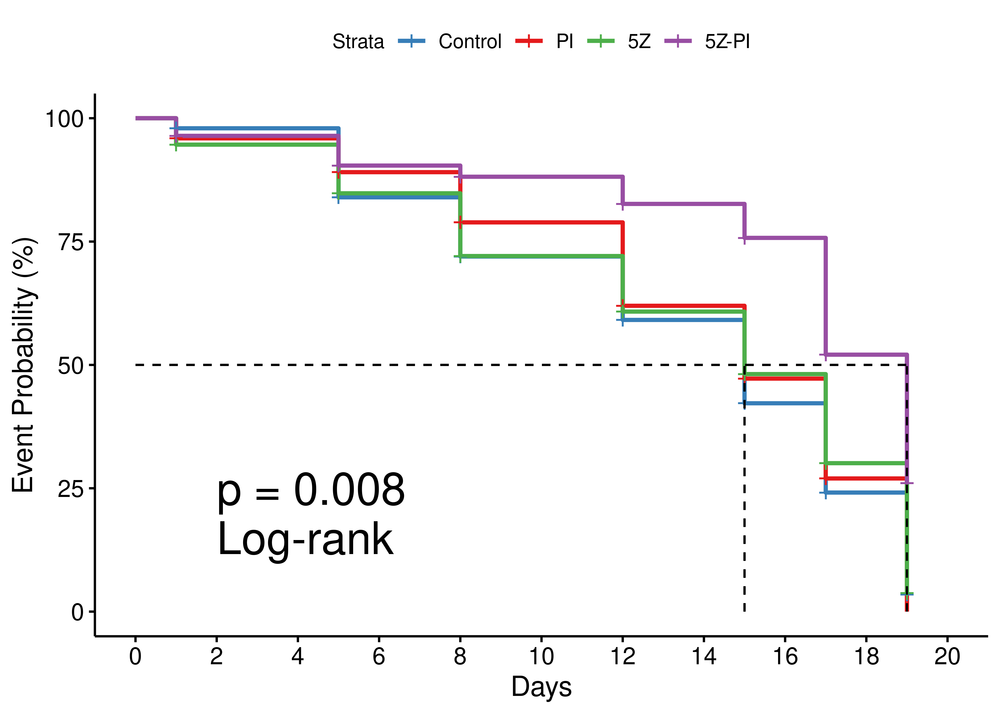
<p class="caption">(\#fig:survival-plot)Mouse survival plot (Kaplan-Meier)</p>
</div>

:::{.green-box}
Mice treated with the `PZ-PI` drug combo have a higher survival probability compared to the individual treatment or no treatment groups.
:::

We also compare the tumor differences between first and last day for every mouse in each respective group:

```r
tumor_diff = tumor_data_wide %>% 
  mutate(diff = `19` - `1`, rel_change = (`19`-`1`)/`1`) %>% 
  mutate(drugs = factor(x = drugs, levels = c("Control", "PI", "5Z", "5Z-PI"))) %>% 
  select(drugs, diff, rel_change)

# Compare single drug vs combo drug group
wilcox_res = tumor_diff %>% 
  rstatix::wilcox_test(formula = diff ~ drugs,
    comparisons = list(c('5Z-PI', 'Control'), c('5Z-PI', '5Z'), c('PI','5Z-PI'))) %>% 
  select(-`.y.`) %>%
  rstatix::add_xy_position()
# swap heights
y_pos = wilcox_res %>% pull(y.position)
wilcox_res$y.position = y_pos[c(3,1,2)]

set.seed(42)
tumor_diff %>%
  ggplot(aes(x = drugs, y = diff)) +
  geom_boxplot(aes(fill = drugs)) +
  geom_jitter(position = position_jitter(0.2)) +
  ggpubr::stat_pvalue_manual(wilcox_res, label = "p = {p.adj} ({p.adj.signif})") +
  scale_fill_manual(values = set1_col[c(2,1,3,4)]) +
  labs(title = 'Relative tumor size (Day 1 vs Day 19)', x = "",
    y = latex2exp::TeX('Difference in tumor volume $\\left(mm^3\\right)$')) +
  theme_classic(base_size = 14) +
    theme(plot.title = element_text(hjust = 0.5), legend.title = element_blank())
```

<div class="figure" style="text-align: center">
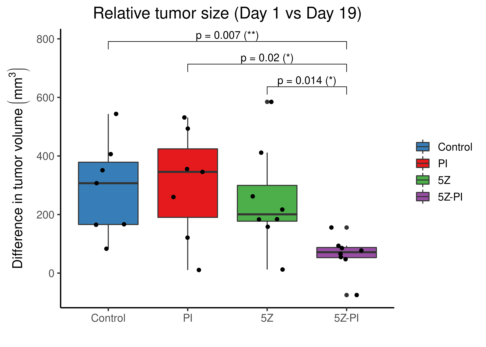
<p class="caption">(\#fig:mouse-xenograft-figure-2)Comparing tumor volumes from all mice between Days 1 and 19.</p>
</div>

We also include the table of the Wilcoxon test results between the compared groups:

```r
DT::datatable(data = wilcox_res %>% select(1:8), options = list(searching = FALSE)) %>%
  DT::formatStyle('p.adj', backgroundColor = 'lightgreen')
```

<!--html_preserve--><div id="htmlwidget-e96c0688a849169abb34" style="width:100%;height:auto;" class="datatables html-widget"></div>
<script type="application/json" data-for="htmlwidget-e96c0688a849169abb34">{"x":{"filter":"none","data":[["1","2","3"],["Control","5Z","PI"],["5Z-PI","5Z-PI","5Z-PI"],[7,8,7],[8,8,8],[53,57,48],[0.002,0.007,0.02],[0.007,0.014,0.02],["**","*","*"]],"container":"<table class=\"display\">\n  <thead>\n    <tr>\n      <th> <\/th>\n      <th>group1<\/th>\n      <th>group2<\/th>\n      <th>n1<\/th>\n      <th>n2<\/th>\n      <th>statistic<\/th>\n      <th>p<\/th>\n      <th>p.adj<\/th>\n      <th>p.adj.signif<\/th>\n    <\/tr>\n  <\/thead>\n<\/table>","options":{"searching":false,"columnDefs":[{"className":"dt-right","targets":[3,4,5,6,7]},{"orderable":false,"targets":0}],"order":[],"autoWidth":false,"orderClasses":false,"rowCallback":"function(row, data) {\nvar value=data[7]; $(this.api().cell(row, 7).node()).css({'background-color':'lightgreen'});\n}"}},"evals":["options.rowCallback"],"jsHooks":[]}</script><!--/html_preserve-->

# Reproduce Data & Simulation Results {-}

:::{.note #zenodo-doi-link}
We have stored all the simulations results in an open-access repository provided by Zenodo: [](https://doi.org/10.5281/zenodo.4430998)
:::

## ROC and PR curves, Fitness Evolution ^[The AUC sensitivity plots across the report are also included] {-#repro123}

- Install the [druglogics-synergy](https://github.com/druglogics/druglogics-synergy) module and use the version `1.2.0`: `git checkout v1.2.0` (or use directly the [released v1.2.0 package](https://github.com/druglogics/druglogics-synergy/packages))
- Run the script `run_druglogics_synergy.sh` in the above repo.

You can of course change several other parameters in the input files or the script itself (e.g. number of simulations to run - see [here](https://druglogics.github.io/druglogics-doc/gitsbe-config.html) for a complete list of configuration options).
To get the results for the **topology mutations** for CASCADE 2.0 you need to change the `ags_cascade_2.0/config` file option `topology_mutations: 10` and `balance_mutations: 0` (the default options are $0$ topology mutations and $3$ link-operator/balance mutations).
If you wish to get the results using **both kinds of mutation**, set both `topology_mutations` and `balance_mutations` options to a non-zero value ($10$ and $3$ were used in the simulations).

So, for example to get the simulation output directories for the [Cascade 1.0 Analysis] I just run the `run_druglogics_synergy.sh` script with the following options defined in the loops inside (no need to change any further configuration):

- `cascade_version`: `1.0` (which topology to use)
- `train`: `ss rand` (train to the AGS steady state or to a (random) proliferation phenotype))
- `sim_num`: `50` (number of simulations)
- `attr_tool`: `fixpoints` (attractor tool, common across all report)
- `synergy_method`: `hsa bliss` (synergy calculation method used by `drabme`)

Each subsequent `druglogics-synergy` execution results in an output directory and the files of interest (which are used to produce the ROC and PR curves in this report and the AUC sensitivity figures) are the `modelwise_synergies.tab` and the `ensemble_synergies.tab` respectively.
For the fitness evolution figures we used the `summary.txt` file of the corresponding simulations.

Specifically, the results described above are stored in the compressed Zenodo file **`sim_res.tar.gz`**.
When uncompressed, the `sim_res.tar.gz` file outputs 2 separate directories, one per different topology (*CASCADE 1.0* and *CASCADE 2.0*).
The directory with the *CASCADE 2.0* related results has 3 subsequent directories, corresponding to the different parameterization that was used in the simulations (link mutations, topology mutations or both).
Each further directory, **specifies on its name** the *training type*, *simulation number*, *attractor tool* and *synergy assessment method*.

## Fitness vs Performance Methods {-}

### Generate the training data samples {-}

Use the [gen_training_data.R](https://github.com/druglogics/ags-paper/blob/main/scripts/gen_training_data.R) script to **produce the training data samples**.
In this script we first choose $11$ numbers that represent the number of nodes that are going to be *flipped* in the AGS steady state.
These numbers range from $1$ (flip just one node) to $24$ (flip all nodes, i.e. create a complete *reversed* steady state).
Then, for each such number, we generate $20$ new partially correct steady states, each one having the same amount of randomly-chosen *flips* in the steady state (e.g. $20$ steady states where randomly-chosen sets of $3$ nodes have been flipped).
Thus, in total, $205$ training data sample files are produced ($205 = 9 \times 20 + 1 \times 24 + 1 \times 1$, where from the $11$ number of flips, the one flip happens for every node ($24$ different steady states) and flipping all the nodes generates the unique completely reversed steady state).

The training data files are stored in the Zenodo file **`training-data-files.tar.gz`**.

### Run model ensembles simulations {-}

To generate the calibrated model ensembles and perform the drug response analysis on them we use the script [run_druglogics_synergy_training.sh](https://github.com/druglogics/ags-paper/blob/main/scripts/run_druglogics_synergy_training.sh) from the [druglogics-synergy](https://github.com/druglogics/druglogics-synergy) repository root (version `1.2.0`: `git checkout v1.2.0`).
Note that the `training-data-files` directory must be placed inside the `druglogics-synergy` root directory before executing the aforementioned script.
The end result we get is the simulation results for each of the training data files (a different directory per training data file).

The following changes need to be applied to the CASCADE 1.0 or 2.0 configuration file (depends on the topology you are using, the files are either `druglogics-synergy/ags_cascade_1.0/config` or `druglogics-synergy/ags_cascade_2.0/config`) before executing the script (some are done automatically in the script):

- If **topology mutations are used**, disable the link-operator mutations (`balance_mutations: 0`) and use `topology_mutations: 10`.
- Change **the number of simulations** to $20$ (link-operator mutations) or $50$ (topology mutations) for CASCADE 2.0 and to $50$ for CASCADE 1.0 (default value, link-operator mutations).
- Change to *Bliss* synergy method (`synergy_method: bliss`) no matter the mutations used or topology.

The results of the CASCADE 2.0 link-operator mutated model simulations are stored in the Zenodo file **`fit-vs-performance-results-bliss.tar.gz`**, whereas for the CASCADE 2.0 topology mutated models, in the **`fit-vs-performance-results-bliss-topo.tar.gz`** file.
The results of the CASCADE 2.0 link-operator mutated model simulations are stored in the Zenodo file **`fit-vs-performance-results-bliss-cascade1.tar.gz`**.

To parse and tidy up the data from the simulations, use the scripts [fit_vs_perf_cascade2_lo.R](https://github.com/druglogics/ags-paper/blob/main/scripts/fit_vs_perf_cascade2_lo.R) (for the link-operator-based CASCADE 2.0 simulations), [fit_vs_perf_cascade2_topo.R](https://github.com/druglogics/ags-paper/blob/main/scripts/fit_vs_perf_cascade2_topo.R) (for the topology-mutation-based CASCADE 2.0 simulations) and [fit_vs_perf_cascade1_lo.R](https://github.com/druglogics/ags-paper/blob/main/scripts/fit_vs_perf_cascade1_lo.R) (for the link-operator-based CASCADE 1.0 simulations).

Also, we used the `run_druglogics_synergy.sh` script at the root of the `druglogics-synergy` (script configuration for CASCADE 2.0: `{2.0, prolif, 150, fixpoints, bliss}` and for CASCADE 1.0: `{1.0, prolif, 50, fixpoints, bliss}`) repo to get the ensemble results of the **random (proliferative) models** that we will use to normalize the calibrated model performance.
The result of this simulation is also part of the results described above (see section [above](#repro123), also considering the necessary changes applied for the topology mutation-based simulations for CASCADE 2.0) and it's available inside the file **`sim_res.tar.gz`** of the Zenodo dataset (also available in the results directory - see [Repo results structure]).

## Random Model Bootstrap {-}

- Install the [druglogics-synergy](https://github.com/druglogics/druglogics-synergy/packages) module and use the version `1.2.0`: `git checkout v1.2.0` (or use directly the [released v1.2.0 package](https://github.com/druglogics/druglogics-synergy/packages))
- Run the the script [run_gitsbe_random.sh](https://github.com/druglogics/ags-paper/blob/main/scripts/run_gitsbe_random.sh) inside the `ags_cascade_2.0` directory of the `druglogics-synergy` repository.
This creates a results directory which includes a `models` directory, with a total of $3000$ `gitsbe` models which we are going to use for the bootstrapping.
- Place the `models` directory inside the `ags_cascade_2.0` directory.
- Execute the [bootstrap_models_drabme.sh](https://github.com/druglogics/ags-paper/blob/main/scripts/bootstrap_models_drabme.sh) inside the `druglogics-synergy/ags_cascade_2.0` directory.
Change appropriately the `config` file to have `synergy_method: bliss`.
The bootstrap configuration consists of $20$ batches, each one consisting of a sample of $100$ randomly selected models from the model directory pool.
- Use the script [random_model_boot.R](https://github.com/druglogics/ags-paper/blob/main/scripts/random_model_boot.R) to tidy the data from the simulations.

The results of the simulations are stored in the **`random_model_bootstrap.tar.gz`** file of the Zenodo dataset.

## Parameterization Bootstrap {-}

- Install the [druglogics-synergy](https://github.com/druglogics/druglogics-synergy) module and use the version `1.2.0`: `git checkout v1.2.0` (or use directly the [released v1.2.0 package](https://github.com/druglogics/druglogics-synergy/packages))
- To generate the $3$ pools of calibrated models (fitting to the AGS steady state) subject to different normalization schemes, run the script [run_gitsbe_param.sh](https://github.com/druglogics/ags-paper/blob/main/scripts/run_gitsbe_param.sh) inside the `ags_cascade_2.0` directory of the `druglogics-synergy` repository root.
This will generate the directories:
  - `gitsbe_link_only_cascade_2.0_ss`
  - `gitsbe_topology_only_cascade_2.0_ss`
  - `gitsbe_topo_and_link_cascade_2.0_ss`, 
  each of which have a `models` directory (the model pool)
- Repeat for each different pool (`models` directory):
  - Place the `models` directory inside the `ags_cascade_2.0` directory of the `druglogics-synergy` repository root.
  - Use the [bootstrap_models_drabme.sh](https://github.com/druglogics/ags-paper/blob/main/scripts/bootstrap_models_drabme.sh) script, while changing the following configuration: `batches=25`, `batch_size=300` and the `project` variable name (input to `eu.druglogics.drabme.Launcher`) as one of the three:
    - `--project=link_only_cascade_2.0_ss_bliss_batch_${batch}`
    - `--project=topology_only_cascade_2.0_ss_bliss_batch_${batch}`
    - `--project=topo_and_link_cascade_2.0_ss_bliss_batch_${batch}`
  
  , depending on the parameterization scheme that was used in the previous step to produce the `models` pool.
  Also change appropriately the `config` file to have `synergy_method: bliss`.

The results of all these simulations are stored in the **`parameterization-comp.tar.gz`** Zenodo file.
Use the script [get_param_comp_boot_data.R](https://github.com/druglogics/ags-paper/blob/main/scripts/get_param_comp_boot_data.R) to tidy up the simulation data to a nice table format.

When uncompressed, the `parameterization-comp.tar.gz` file outputs 3 separate directories, one per parameterization scheme.
Each separate directory is structured so as to contain the `gitsbe` simulation results with the model pool inside (result of the script [run_gitsbe_param.sh](https://github.com/druglogics/ags-paper/blob/main/scripts/run_gitsbe_param.sh)), a `boot_res` directory (includes the results of the [bootstrap_models_drabme.sh](https://github.com/druglogics/ags-paper/blob/main/scripts/bootstrap_models_drabme.sh) script) and lastly the results of the **random proliferative model simulations** which can be reproduced following the guidelines [above](#repro123).

## ERK investigation {-#erk-repro}

We split the link operator model pool ($4500$ models, see [above](#parameterization-bootstrap)) to $2$ pools, one with a total of $2764$ models that have `ERK_f` active and one with a total of $1736$ models that have it inhibited in the corresponding stable states.
The two model pools are the two directories named `erk_active_pool` and `erk_inhibited_pool` respectively inside the Zenodo file `erk_perf_investigation.tar.gz`.

Then:

-  Install the [druglogics-synergy](https://github.com/druglogics/druglogics-synergy) module and use the version `1.2.0`: `git checkout v1.2.0` (or use directly the [released v1.2.0 package](https://github.com/druglogics/druglogics-synergy/packages))
- Run the script [bootstrap_models_drabme_erk_pools.sh](https://github.com/druglogics/ags-paper/blob/main/scripts/bootstrap_models_drabme_erk_pools.sh) inside the `ags_cascade_2.0` directory of the `druglogics-synergy` repository.
This will produce the drug combination prediction results for the bootstrapped ensembles of boolean models from each pool.
From each pool, we bootstrapped $35$ ensembles with $300$ models each and used the  `bliss` drabme synergy method to calculate the prediction results.
- Run the script [erk_perf_tidy_data.R](https://github.com/druglogics/ags-paper/blob/main/scripts/erk_perf_tidy_data.R) to calculate the ROC and PR AUC of every bootstrapped ensemble, subject to normalization against the random proliferative model predictions.

## CASCADE 1.0 Calibrated Models bootstrap {-#boot-ss-cascade1-curated-reproduce}

- Install the [druglogics-synergy](https://github.com/druglogics/druglogics-synergy) module and use the version `1.2.0`: `git checkout v1.2.0` (or use directly the [released v1.2.0 package](https://github.com/druglogics/druglogics-synergy/packages))
- Generate one large pool of calibrated models (fitting to the AGS steady state) by using the instructions [above](#repro123) => use the `run_druglogics_synergy.sh` script at the root of the `druglogics-synergy` repo with script config: `{1.0, ss, 1000, fixpoints, bliss}`
- Use the [bootstrap_models_drabme_cascade1.sh](https://github.com/druglogics/ags-paper/blob/main/scripts/bootstrap_models_drabme_cascade1.sh) script to run the bootstrapped model simulations.
- Use the [get_syn_res_boot_ss_cascade1.R](https://github.com/druglogics/ags-paper/blob/main/scripts/get_syn_res_boot_ss_cascade1.R) script to tidy up the bootstrap simulation data.

The results from the bootstrap simulations are stored in the **`ss_cascade1_model_bootstrap.tar.gz`** file of the Zenodo dataset.

## Repo results structure {-}

We have gathered all the necessary output files from the above simulations (mostly relating to ROC, PR curves and AUC sensitivity figures) to the directory [`results`](https://github.com/druglogics/ags-paper/tree/main/results) for ease of use in our report.
The `results` directory has 3 main sub-directories: 

1. [`link-only`](https://github.com/druglogics/ags-paper/tree/main/results/link-only): results from the link-operator mutated models only (used in the sections [Cascade 1.0 Analysis] and [CASCADE 2.0 Analysis (Link Operator Mutations)])
2. [`topology-only`](https://github.com/druglogics/ags-paper/tree/main/results/topology-only): results from the topology-mutated models only (used in the section [CASCADE 2.0 Analysis (Topology Mutations)])
3. [`topo-and-link`](https://github.com/druglogics/ags-paper/tree/main/results/topo-and-link): results where both mutations applied to the generated boolean models (used in section [CASCADE 2.0 Analysis (Topology and Link Operator Mutations)])

In addition, there is a [`data`](https://github.com/druglogics/ags-paper/tree/main/data) directory that includes the following:

- `observed_synergies_cascade_1.0`: the gold-standard synergies for the CASCADE 1.0 topology [@Flobak2015]
- `observed_synergies_cascade_2.0`: the gold-standard synergies for the CASCADE 2.0 topology [@Flobak2019]
- `steadystate`, `steadystate.rds`: the AGS training data for the calibrated models (file + compressed data) - see [lo_mutated_models_heatmaps.R](https://github.com/druglogics/ags-paper/blob/main/scripts/lo_mutated_models_heatmaps.R) script.
- `edge_mat.rds`, `topo_ss_df.rds`: heatmap data for the topology-mutation models - see [lo_mutated_models_heatmaps.R](https://github.com/druglogics/ags-paper/blob/main/scripts/lo_mutated_models_heatmaps.R) script.
- `lo_df.rds`, `lo_ss_df.rds`: heatmap data for the link-operator models - see [topo_mutated_models_heatmaps.R](https://github.com/druglogics/ags-paper/blob/main/scripts/topo_mutated_models_heatmaps.R) script.
- `node_pathway_annotations_cascade2.csv`, `node_path_tbl.rds`: node pathway annotation data for CASCADE 2.0 and compressed data table produced via the [node_path_annot_cascade2.R](https://github.com/druglogics/ags-paper/blob/main/scripts/node_path_annot_cascade2.R) script.
- `cosmic_cancer_gene_census_all_29102020.tsv`: Cancer Gene Census COSMIC data downloaded from https://cancer.sanger.ac.uk/census (for academic purposes)
- `cosmic_tbl.rds`: a compressed file with a `tibble` object having the CASCADE 2.0 nodes and their respective COSMIC cancer role annotation (see [get_cosmic_data_annot.R](https://github.com/druglogics/ags-paper/blob/main/scripts/get_cosmic_data_annot.R) script).
- `bootstrap_rand_res.rds`: a compressed file with a `tibble` object having the result data in a tidy format for the analysis related to the [Bootstrap Random Model AUC] section.
- `res_fit_aucs_cascade1.rds`: a compressed file with a `tibble` object having the result data in a tidy format for the analysis related to the [Fitness vs Ensemble Performance](#fit-vs-ens-perf-cascade1) section (CASCADE 1.0, link operator mutations).
- `res_fit_aucs.rds`: a compressed file with a `tibble` object having the result data in a tidy format for the analysis related to the [Fitness vs Ensemble Performance](#fit-vs-ens-perf-lo) section (CASCADE 2.0, link operator mutations).
- `res_fit_aucs_topo.rds`: a compressed file with a `tibble` object having the result data in a tidy format for the analysis related to the [Fitness vs Ensemble Performance](#fit-vs-ens-perf-topo) section (CASCADE 2.0, topology mutations).
- `res_param_boot_aucs.rds`: a compressed file with a `tibble` object having the result data in a tidy format for the analysis related to the [Bootstrap Simulations] section.
- `boot_cascade1_res.rds`: a compressed file with a `tibble` object having the result data from executing the script [get_syn_res_boot_ss_cascade1.R](https://github.com/druglogics/ags-paper/blob/main/scripts/get_syn_res_boot_ss_cascade1.R), related to the [scrambled topologies investigation](#boot-ss-cascade1-curated) in CASCADE 1.0.
- `scrambled_topo_res_cascade1.rds`: a compressed file with a `tibble` object having the result data from executing the script [get_syn_res_scrambled_topo_cascade1.R](https://github.com/druglogics/ags-paper/blob/main/scripts/get_syn_res_scrambled_topo_cascade1.R), related to the [scrambled topologies investigation](#scrambled-topo-inv-cascade1) in CASCADE 1.0.
- `scrambled_topo_res_cascade2.rds`: a compressed file with a `tibble` object having the result data from executing the script [get_syn_res_scrambled_topo_cascade2.R](https://github.com/druglogics/ags-paper/blob/main/scripts/get_syn_res_scrambled_topo_cascade2.R), related to the [scrambled topologies investigation](#scrambled-topo-inv-cascade2) in CASCADE 2.0.
- `res_erl.rds`: a compressed file with a `tibble` object having the result data from executing the script [erk_perf_tidy_data.R](https://github.com/druglogics/ags-paper/blob/main/scripts/erk_perf_tidy_data.R), related to the [ERK analysis](#erk-perf-inv) with the link operator mutated models in CASCADE 2.0.
- `tumor_vol_data.csv`: the data from the xenograft experiments relating to the `PI` and `5Z` inhibitors.

# R session info {-}


```r
xfun::session_info()
```

```
R version 3.6.3 (2020-02-29)
Platform: x86_64-pc-linux-gnu (64-bit)
Running under: Ubuntu 20.04.2 LTS

Locale:
  LC_CTYPE=en_US.UTF-8       LC_NUMERIC=C              
  LC_TIME=en_US.UTF-8        LC_COLLATE=en_US.UTF-8    
  LC_MONETARY=en_US.UTF-8    LC_MESSAGES=en_US.UTF-8   
  LC_PAPER=en_US.UTF-8       LC_NAME=C                 
  LC_ADDRESS=C               LC_TELEPHONE=C            
  LC_MEASUREMENT=en_US.UTF-8 LC_IDENTIFICATION=C       

Package version:
  abind_1.4-5              assertthat_0.2.1         backports_1.2.1         
  base64enc_0.1.3          BH_1.72.0.3              bitops_1.0.6            
  bookdown_0.21            boot_1.3.25              brio_1.1.0              
  broom_0.7.3              callr_3.5.1              car_3.0-10              
  carData_3.0-4            cellranger_1.1.0         circlize_0.4.11         
  Ckmeans.1d.dp_4.3.3      cli_2.2.0                clipr_0.7.1             
  clue_0.3-58              cluster_2.1.0            codetools_0.2-18        
  colorspace_2.0-0         compiler_3.6.3           ComplexHeatmap_2.2.0    
  conquer_1.0.2            corrplot_0.84            cowplot_1.1.0           
  cpp11_0.2.4              crayon_1.3.4             crosstalk_1.1.0.1       
  curl_4.3                 data.table_1.13.4        desc_1.2.0              
  diffobj_0.3.2            digest_0.6.27            dplyr_1.0.2             
  DT_0.16                  ellipsis_0.3.1           emba_0.1.8              
  equatiomatic_0.1.0       evaluate_0.14            exactRankTests_0.8.31   
  fansi_0.4.1              farver_2.0.3             forcats_0.5.0           
  foreach_1.5.1            foreign_0.8-75           gbRd_0.4-11             
  generics_0.1.0           GetoptLong_1.0.5         ggplot2_3.3.2           
  ggpubr_0.4.0             ggrepel_0.9.0            ggsci_2.9               
  ggsignif_0.6.0           ggtext_0.1.1             glmnet_4.0-2            
  GlobalOptions_0.1.2      glue_1.4.2               graphics_3.6.3          
  grDevices_3.6.3          grid_3.6.3               gridExtra_2.3           
  gridtext_0.1.4           gtable_0.3.0             haven_2.3.1             
  highr_0.8                hms_0.5.3                htmltools_0.5.0         
  htmlwidgets_1.5.3        igraph_1.2.6             isoband_0.2.3           
  iterators_1.0.13         jpeg_0.1.8.1             jsonlite_1.7.2          
  km.ci_0.5-2              KMsurv_0.1-5             knitr_1.30              
  labeling_0.4.2           later_1.1.0.1            latex2exp_0.4.0         
  lattice_0.20-41          lazyeval_0.2.2           lifecycle_0.2.0         
  lme4_1.1.26              magrittr_2.0.1           MAMSE_0.2-1             
  maptools_1.0.2           markdown_1.1             MASS_7.3.53             
  Matrix_1.2-18            MatrixModels_0.4.1       matrixStats_0.57.0      
  maxstat_0.7.25           methods_3.6.3            mgcv_1.8.33             
  mime_0.9                 minqa_1.2.4              munsell_0.5.0           
  mvtnorm_1.1.1            nlme_3.1.151             nloptr_1.2.2.2          
  nnet_7.3.14              openxlsx_4.2.3           parallel_3.6.3          
  pbkrtest_0.4.8.6         pillar_1.4.7             pkgbuild_1.2.0          
  pkgconfig_2.0.3          pkgload_1.1.0            png_0.1-7               
  polynom_1.4.0            praise_1.0.0             prettyunits_1.1.1       
  processx_3.4.5           progress_1.2.2           promises_1.1.1          
  PRROC_1.3.1              ps_1.5.0                 purrr_0.3.4             
  quantreg_5.75            R6_2.5.0                 rbibutils_2.0           
  RColorBrewer_1.1-2       Rcpp_1.0.5               RcppArmadillo_0.10.1.2.0
  RcppEigen_0.3.3.7.0      RCurl_1.98.1.3           Rdpack_2.1              
  readr_1.4.0              readxl_1.3.1             rematch_1.0.1           
  rematch2_2.1.2           rio_0.5.16               rje_1.10.16             
  rjson_0.2.20             rlang_0.4.9              rmarkdown_2.6           
  rprojroot_2.0.2          rstatix_0.6.0            rstudioapi_0.13         
  scales_1.1.1             shape_1.4.5              sp_1.4.4                
  SparseM_1.78             splines_3.6.3            statmod_1.4.35          
  stats_3.6.3              stringi_1.5.3            stringr_1.4.0           
  survival_3.2-7           survminer_0.4.9          survMisc_0.5.5          
  testthat_3.0.0           tibble_3.0.4             tidyr_1.1.2             
  tidyselect_1.1.0         tinytex_0.28             tools_3.6.3             
  usefun_0.4.8             utf8_1.1.4               utils_3.6.3             
  vctrs_0.3.5              viridisLite_0.3.0        visNetwork_2.0.9        
  waldo_0.2.3              withr_2.3.0              xfun_0.19               
  xml2_1.3.2               xtable_1.8-4             yaml_2.2.1              
  zip_2.1.1                zoo_1.8-9               
```

# References {-}
